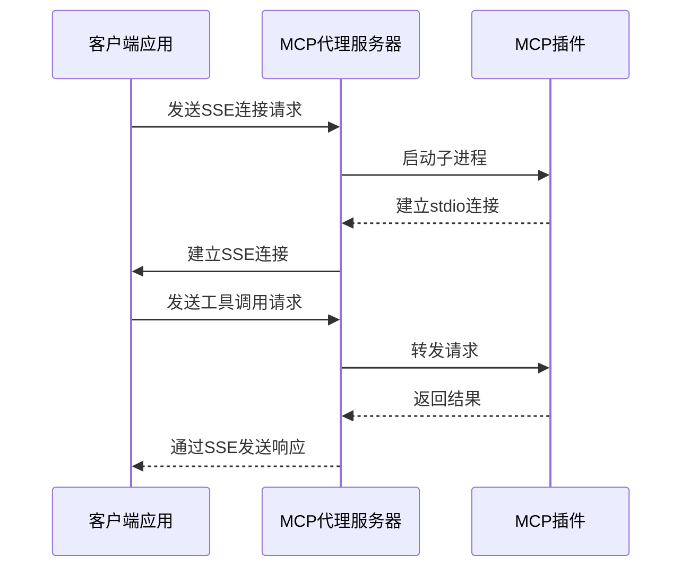
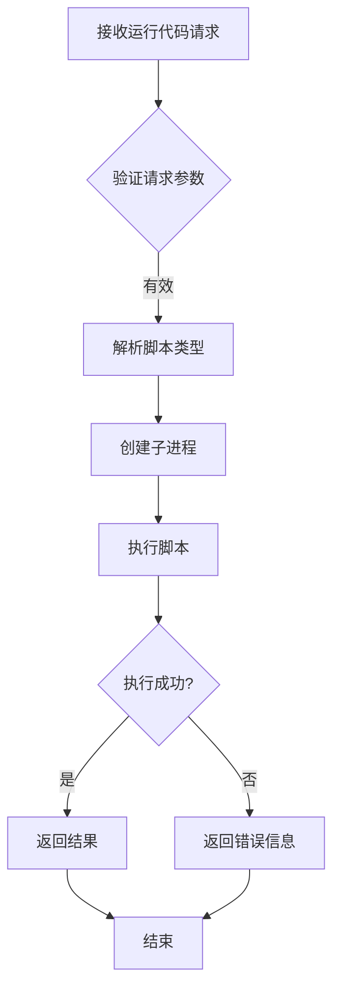
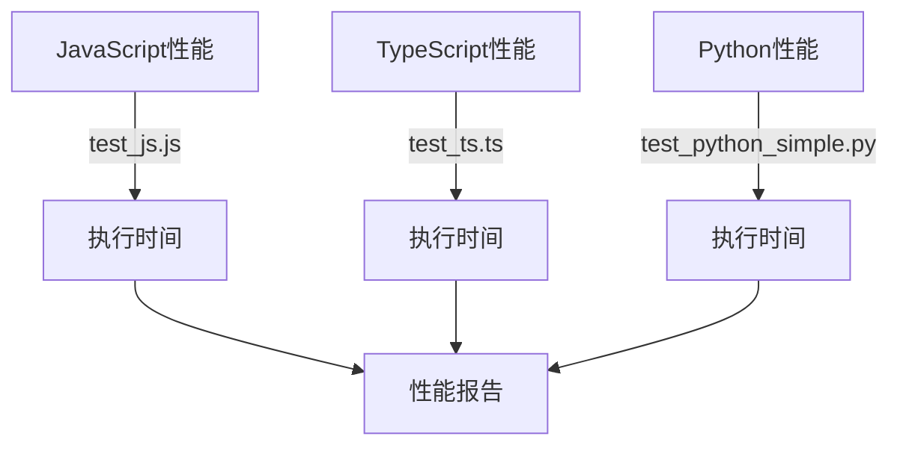
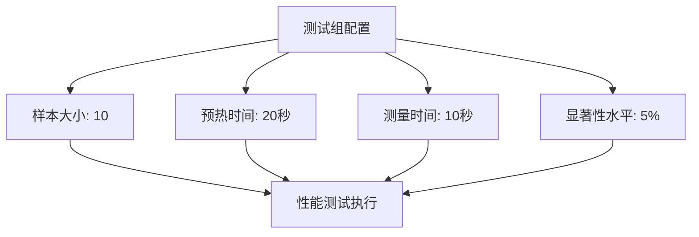

# 测试策略

<cite>
**本文档引用的文件**
- [mcp_check_status_handler.rs](file://mcp-proxy/src/server/handlers/mcp_check_status_handler.rs)
- [sse_server.rs](file://mcp-proxy/src/server/handlers/sse_server.rs)
- [sse_client.rs](file://mcp-proxy/src/client/sse_client.rs)
- [mcp_sse_test.rs](file://mcp-proxy/src/tests/mcp_sse_test.rs)
- [run_code_bench.rs](file://mcp-proxy/benches/run_code_bench.rs)
- [run_code_advanced_bench.rs](file://mcp-proxy/benches/run_code_advanced_bench.rs)
- [test_js.js](file://mcp-proxy/fixtures/test_js.js)
- [test_python.py](file://mcp-proxy/fixtures/test_python.py)
</cite>

## 目录
1. [引言](#引言)
2. [单元测试策略](#单元测试策略)
3. [集成测试策略](#集成测试策略)
4. [性能基准测试](#性能基准测试)
5. [测试数据管理](#测试数据管理)
6. [测试执行指南](#测试执行指南)
7. [结论](#结论)

## 引言
本文档旨在为mcp-proxy项目制定全面的测试策略，涵盖单元测试、集成测试和性能基准测试三个层面。通过系统化的测试方法，确保核心功能如MCP状态检查、路由更新、SSE通信和代码执行的正确性和稳定性。测试策略充分利用Rust语言特性，结合fixtures目录中的标准化测试数据和benches目录中的性能测试套件，建立可重复、可验证的测试体系。

## 单元测试策略

### 使用#[cfg(test)]模块进行单元测试
本项目采用Rust标准的单元测试框架，通过`#[cfg(test)]`条件编译属性在测试环境下启用测试代码。单元测试主要集中在验证核心业务逻辑的正确性，特别是MCP状态检查和路由更新等关键功能。

### MCP状态检查逻辑验证
MCP状态检查功能通过`check_mcp_status_handler`函数实现，该函数根据MCP ID检查服务状态，若服务不存在则根据配置异步启动。测试重点包括：
- 验证服务状态的三种响应：`READY`、`PENDING`和`ERROR`
- 确认错误状态下的资源清理机制
- 验证服务初始化过程中的异步启动逻辑

### 路由更新逻辑验证
路由更新功能涉及动态路由服务的管理，测试重点包括：
- 验证新路由的正确添加
- 确认路由删除操作的正确性
- 测试路由冲突处理机制

**Section sources**
- [mcp_check_status_handler.rs](file://mcp-proxy/src/server/handlers/mcp_check_status_handler.rs#L0-L186)

## 集成测试策略

### SSE通信端到端测试
集成测试通过模拟真实MCP插件行为，验证SSE通信的完整流程。测试框架利用fixtures目录中的测试脚本，构建真实的端到端测试场景。



**Diagram sources**
- [sse_server.rs](file://mcp-proxy/src/server/handlers/sse_server.rs#L0-L94)
- [sse_client.rs](file://mcp-proxy/src/client/sse_client.rs#L0-L72)

### 代码执行流程验证
通过测试脚本验证代码执行功能的正确性，确保不同语言的脚本能够被正确执行并返回预期结果。

#### JavaScript脚本测试
使用`test_js.js`脚本验证JavaScript代码执行：
- 测试基本语法执行
- 验证参数传递功能
- 检查模块导入能力

#### Python脚本测试
使用`test_python.py`脚本验证Python代码执行：
- 测试基本语法执行
- 验证复杂参数处理
- 检查日志输出功能



**Diagram sources**
- [sse_server.rs](file://mcp-proxy/src/server/handlers/sse_server.rs#L0-L49)
- [mcp_sse_test.rs](file://mcp-proxy/src/tests/mcp_sse_test.rs#L0-L359)

**Section sources**
- [mcp_sse_test.rs](file://mcp-proxy/src/tests/mcp_sse_test.rs#L0-L359)
- [test_js.js](file://mcp-proxy/fixtures/test_js.js#L0-L10)
- [test_python.py](file://mcp-proxy/fixtures/test_python.py#L0-L15)

## 性能基准测试

### 基准测试框架
项目使用Criterion.rs作为性能基准测试框架，通过`benches`目录中的测试文件评估关键路径的性能表现。基准测试重点关注`/api/run_code_with_log`端点的执行性能。

### 基本性能测试
`run_code_bench.rs`文件包含基本性能测试，评估三种语言（JavaScript、TypeScript、Python）简单脚本的执行性能：



**Diagram sources**
- [run_code_bench.rs](file://mcp-proxy/benches/run_code_bench.rs#L0-L90)

### 高级性能测试
`run_code_advanced_bench.rs`文件包含高级性能测试，评估多种场景下的性能表现：

#### 测试场景覆盖
- 基本执行：验证最简单脚本的执行性能
- 参数传递：测试简单和复杂参数的处理性能
- 模块导入：评估依赖导入对性能的影响
- 复杂逻辑：测试复杂业务逻辑的执行效率

#### 性能指标配置
测试配置了合理的采样参数以确保结果的准确性：
- 样本大小：10次
- 预热时间：20秒
- 测量时间：10秒
- 显著性水平：5%



**Diagram sources**
- [run_code_advanced_bench.rs](file://mcp-proxy/benches/run_code_advanced_bench.rs#L0-L195)

**Section sources**
- [run_code_bench.rs](file://mcp-proxy/benches/run_code_bench.rs#L0-L90)
- [run_code_advanced_bench.rs](file://mcp-proxy/benches/run_code_advanced_bench.rs#L0-L195)

## 测试数据管理

### fixtures目录结构
fixtures目录提供标准化的输入输出样本，确保测试的可重复性和稳定性。目录结构设计遵循以下原则：

- **脚本分类**：按语言类型组织测试脚本
- **场景覆盖**：包含基本、参数、复杂等不同复杂度的测试场景
- **命名规范**：采用`test_<语言>_<场景>.<扩展名>`的命名约定

### 测试脚本示例
#### JavaScript测试脚本
- `test_js.js`：基本JavaScript执行测试
- `test_js_params.js`：带参数的JavaScript执行测试
- `import_lodash_example.js`：模块导入测试

#### Python测试脚本
- `test_python_simple.py`：基本Python执行测试
- `test_python_params.py`：带参数的Python执行测试
- `test_python_logging.py`：日志功能测试

### 测试数据使用原则
- **可重复性**：所有测试使用相同的输入数据，确保结果可比较
- **代表性**：测试数据覆盖典型使用场景
- **可维护性**：测试数据易于更新和扩展

**Section sources**
- [test_js.js](file://mcp-proxy/fixtures/test_js.js#L0-L10)
- [test_python.py](file://mcp-proxy/fixtures/test_python.py#L0-L15)
- [test_ts.ts](file://mcp-proxy/fixtures/test_ts.ts#L0-L12)

## 测试执行指南

### 单元测试执行
使用标准Rust测试命令执行单元测试：
```bash
cargo test
```

### 集成测试执行
集成测试需要确保测试环境可用：
```bash
# 设置测试服务器地址
export MCP_TEST_SERVER="127.0.0.1:8020"
cargo test --test mcp_sse_test
```

### 性能基准测试执行
使用以下命令执行性能基准测试：

#### 基本性能测试
```bash
cargo bench --bench run_code_bench
```

#### 高级性能测试
```bash
# 运行所有高级测试
cargo bench --bench run_code_advanced_bench

# 运行特定测试场景
cargo bench --bench run_code_advanced_bench -- js_basic
```

#### 查看测试结果
测试结果保存在`target/criterion`目录，可通过浏览器查看详细报告：
```bash
open target/criterion/report/index.html
```

### 测试参数调整
根据机器性能调整测试参数：
```bash
# 减少样本数量
cargo bench --bench run_code_bench -- --sample-size 5

# 增加预热时间
cargo bench --bench run_code_bench -- --warm-up-time 30

# 增加测量时间
cargo bench --bench run_code_bench -- --measurement-time 15
```

## 结论
本测试策略为mcp-proxy项目建立了全面的测试体系，通过单元测试确保核心逻辑的正确性，通过集成测试验证端到端流程的完整性，通过性能基准测试评估系统性能。测试数据的标准化管理保证了测试的可重复性和稳定性。建议开发人员在提交代码前运行相关测试，确保代码质量和系统稳定性。