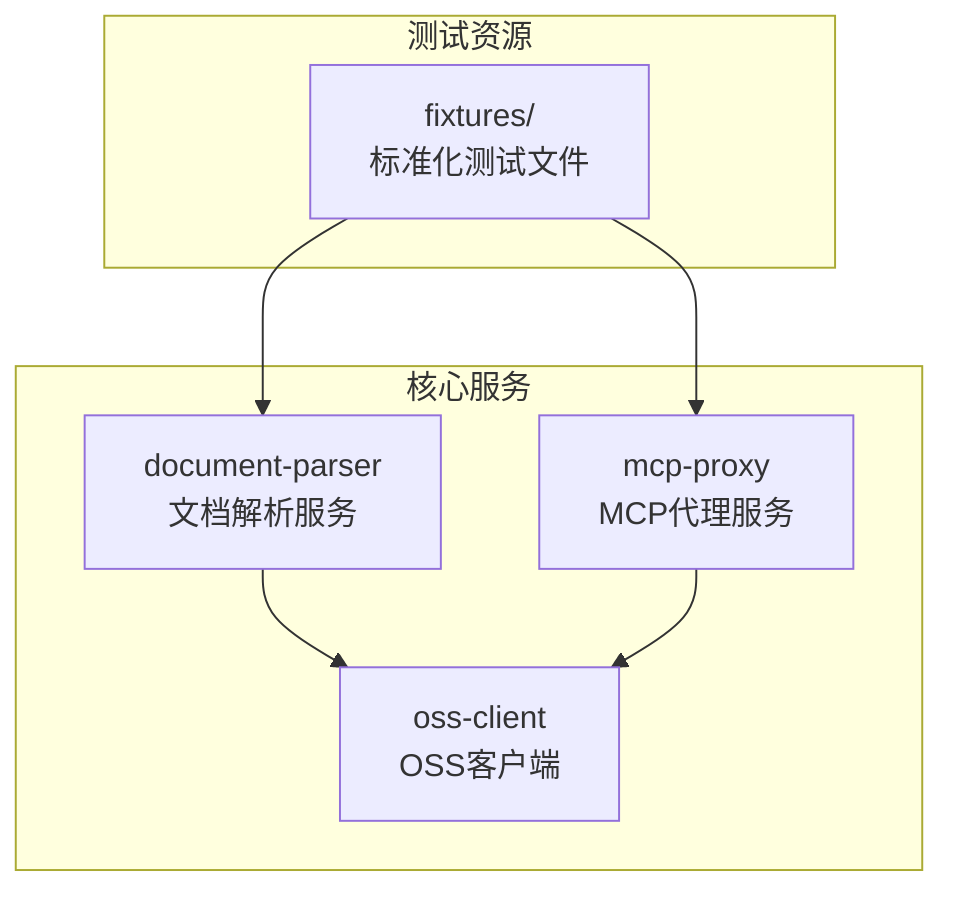
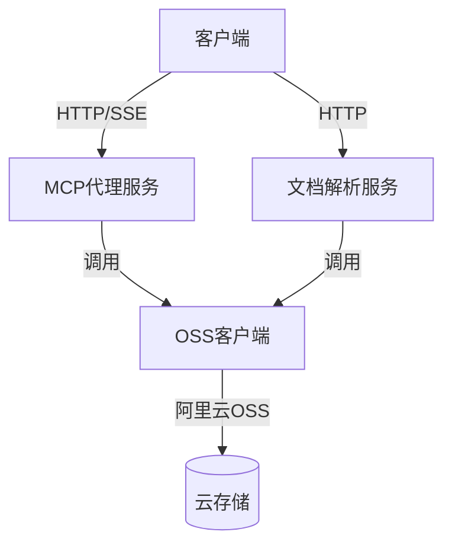
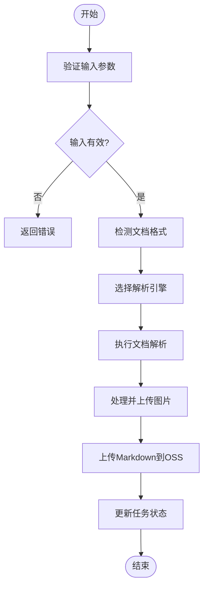
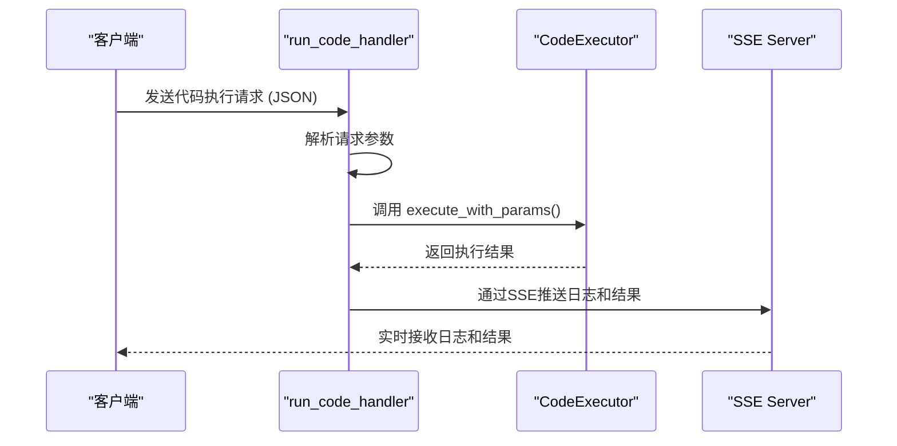
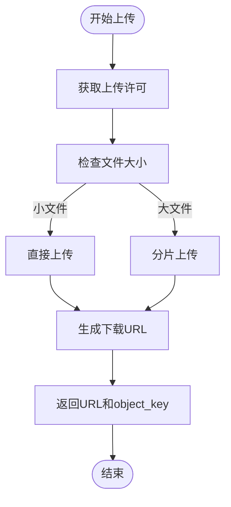
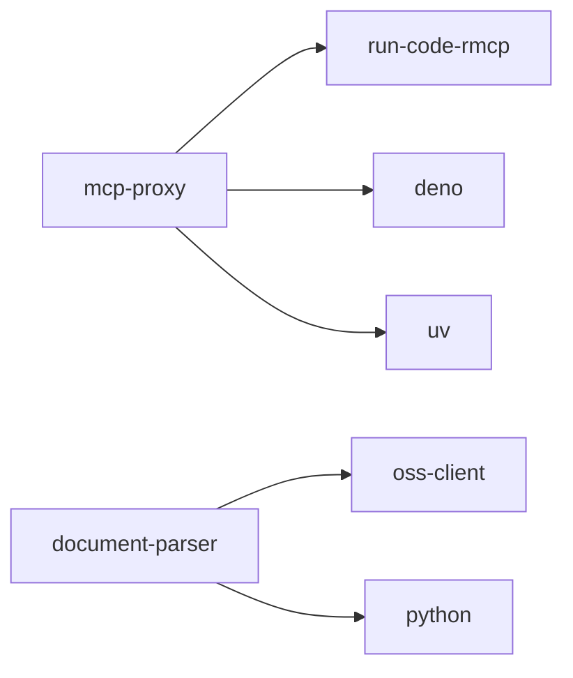

# 集成测试

<cite>
**本文档中引用的文件**   
- [run_code_handler.rs](file://mcp-proxy/src/server/handlers/run_code_handler.rs)
- [sse_server.rs](file://mcp-proxy/src/server/handlers/sse_server.rs)
- [document_service.rs](file://document-parser/src/services/document_service.rs)
- [oss_service.rs](file://document-parser/src/services/oss_service.rs)
- [cow_say_hello.js](file://mcp-proxy/fixtures/cow_say_hello.js)
- [test_js.js](file://mcp-proxy/fixtures/test_js.js)
- [test_python.py](file://mcp-proxy/fixtures/test_python.py)
- [upload_parse_test.md](file://document-parser/fixtures/upload_parse_test.md)
- [sample_markdown.md](file://document-parser/fixtures/sample_markdown.md)
</cite>

## 目录
1. [引言](#引言)
2. [项目结构](#项目结构)
3. [核心组件](#核心组件)
4. [架构概述](#架构概述)
5. [详细组件分析](#详细组件分析)
6. [依赖分析](#依赖分析)
7. [性能考虑](#性能考虑)
8. [故障排除指南](#故障排除指南)
9. [结论](#结论)

## 引言
本文档旨在为 `mcp-proxy` 项目提供全面的集成测试实施指南，重点覆盖文档解析服务与MCP代理服务的端到端测试流程。文档将指导开发者如何利用 `fixtures` 目录中的标准化测试文件，构建真实场景的测试用例，以验证从MCP插件注册、代码执行请求到SSE结果流的完整生命周期。同时，涵盖文档解析管道与OSS客户端的集成验证，确保文件上传、处理和存储流程的可靠性，并提供调试技巧和日志分析方法。

## 项目结构
`mcp-proxy` 项目由多个核心模块组成，每个模块负责特定的功能。主要模块包括 `document-parser`（文档解析服务）、`mcp-proxy`（MCP代理服务）和 `oss-client`（OSS客户端）。`fixtures` 目录包含用于测试的标准化文件，如JavaScript/Python脚本和Markdown文档，这些文件是构建集成测试用例的基础。

**Diagram sources**
- [document-parser](file://document-parser)
- [mcp-proxy](file://mcp-proxy)
- [oss-client](file://oss-client)

**Section sources**
- [document-parser](file://document-parser)
- [mcp-proxy](file://mcp-proxy)
- [oss-client](file://oss-client)

## 核心组件
核心组件包括文档解析服务、MCP代理服务和OSS客户端。文档解析服务负责将多种格式的文档转换为结构化Markdown，MCP代理服务通过SSE协议与客户端通信，执行远程代码，OSS客户端负责与阿里云对象存储进行交互。

**Section sources**
- [document_service.rs](file://document-parser/src/services/document_service.rs)
- [run_code_handler.rs](file://mcp-proxy/src/server/handlers/run_code_handler.rs)
- [oss_service.rs](file://document-parser/src/services/oss_service.rs)

## 架构概述
系统架构采用微服务设计，各服务通过清晰的接口进行通信。文档解析服务和MCP代理服务作为独立的服务运行，通过HTTP和SSE协议与客户端交互。OSS客户端作为共享库，被其他服务调用以实现文件的上传和下载。

**Diagram sources**
- [run_code_handler.rs](file://mcp-proxy/src/server/handlers/run_code_handler.rs)
- [document_service.rs](file://document-parser/src/services/document_service.rs)
- [oss_service.rs](file://document-parser/src/services/oss_service.rs)

## 详细组件分析

### 文档解析服务分析
文档解析服务是 `document-parser` 模块的核心，负责处理文档上传、格式检测、内容解析和结果存储。它通过 `DocumentService` 类协调 `DualEngineParser` 和 `OssService` 等组件，实现完整的文档处理流水线。

#### 文档解析流程

**Diagram sources**
- [document_service.rs](file://document-parser/src/services/document_service.rs#L126-L309)

**Section sources**
- [document_service.rs](file://document-parser/src/services/document_service.rs#L126-L309)

### MCP代理服务分析
MCP代理服务通过SSE协议提供远程代码执行能力。`run_code_handler` 处理代码执行请求，`sse_server` 负责建立和管理SSE连接。

#### 代码执行流程

**Diagram sources**
- [run_code_handler.rs](file://mcp-proxy/src/server/handlers/run_code_handler.rs#L0-L83)
- [sse_server.rs](file://mcp-proxy/src/server/handlers/sse_server.rs#L0-L94)

**Section sources**
- [run_code_handler.rs](file://mcp-proxy/src/server/handlers/run_code_handler.rs#L0-L83)
- [sse_server.rs](file://mcp-proxy/src/server/handlers/sse_server.rs#L0-L94)

### OSS客户端集成分析
OSS客户端负责与阿里云对象存储进行交互，支持文件的上传、下载和管理。`OssService` 类提供了 `upload_file` 和 `download_to_path` 等核心方法。

#### 文件上传流程

**Diagram sources**
- [oss_service.rs](file://document-parser/src/services/oss_service.rs#L0-L799)

**Section sources**
- [oss_service.rs](file://document-parser/src/services/oss_service.rs#L0-L799)

## 依赖分析
项目依赖关系清晰，各模块通过接口进行松耦合。`document-parser` 依赖 `oss-client` 进行文件存储，`mcp-proxy` 依赖 `run-code-rmcp` 库执行代码。

**Diagram sources**
- [Cargo.toml](file://mcp-proxy/Cargo.toml)
- [Cargo.toml](file://document-parser/Cargo.toml)

**Section sources**
- [Cargo.toml](file://mcp-proxy/Cargo.toml)
- [Cargo.toml](file://document-parser/Cargo.toml)

## 性能考虑
系统在设计时考虑了性能和可靠性。文档解析服务使用 `timeout` 机制防止任务长时间挂起，OSS客户端使用 `Semaphore` 限制并发上传数量，避免资源耗尽。

## 故障排除指南
当集成测试失败时，应首先检查日志输出。关键日志包括：
- `document_service.rs` 中的 "开始解析文档" 和 "文档解析成功"
- `run_code_handler.rs` 中的 "run_code_handler result"
- `oss_service.rs` 中的 "开始上传文件到OSS" 和 "OSS连接验证成功"

**Section sources**
- [document_service.rs](file://document-parser/src/services/document_service.rs)
- [run_code_handler.rs](file://mcp-proxy/src/server/handlers/run_code_handler.rs)
- [oss_service.rs](file://document-parser/src/services/oss_service.rs)

## 结论
本文档提供了 `mcp-proxy` 项目集成测试的全面指南。通过利用 `fixtures` 目录中的测试文件，开发者可以构建覆盖文档解析和MCP代码执行的端到端测试用例。理解各组件的交互流程和依赖关系，对于编写有效的测试和快速定位问题是至关重要的。