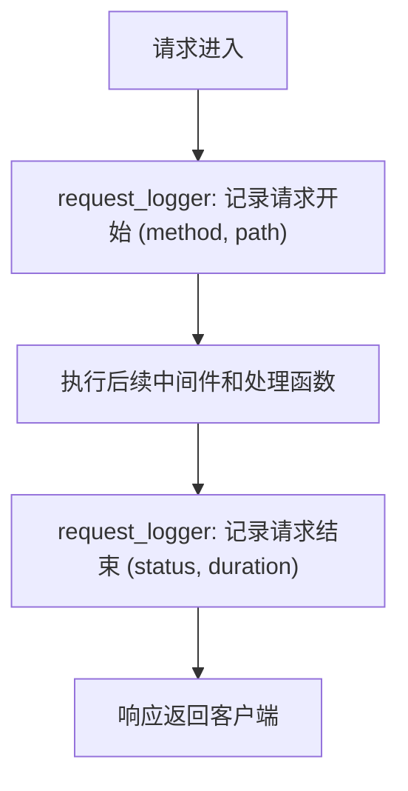
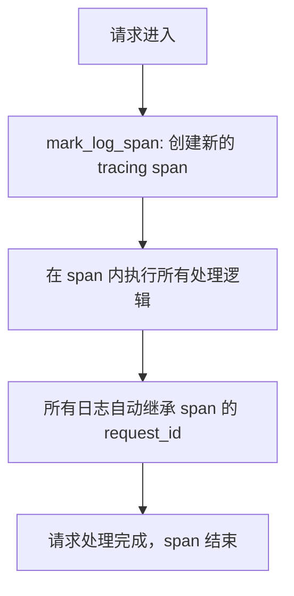
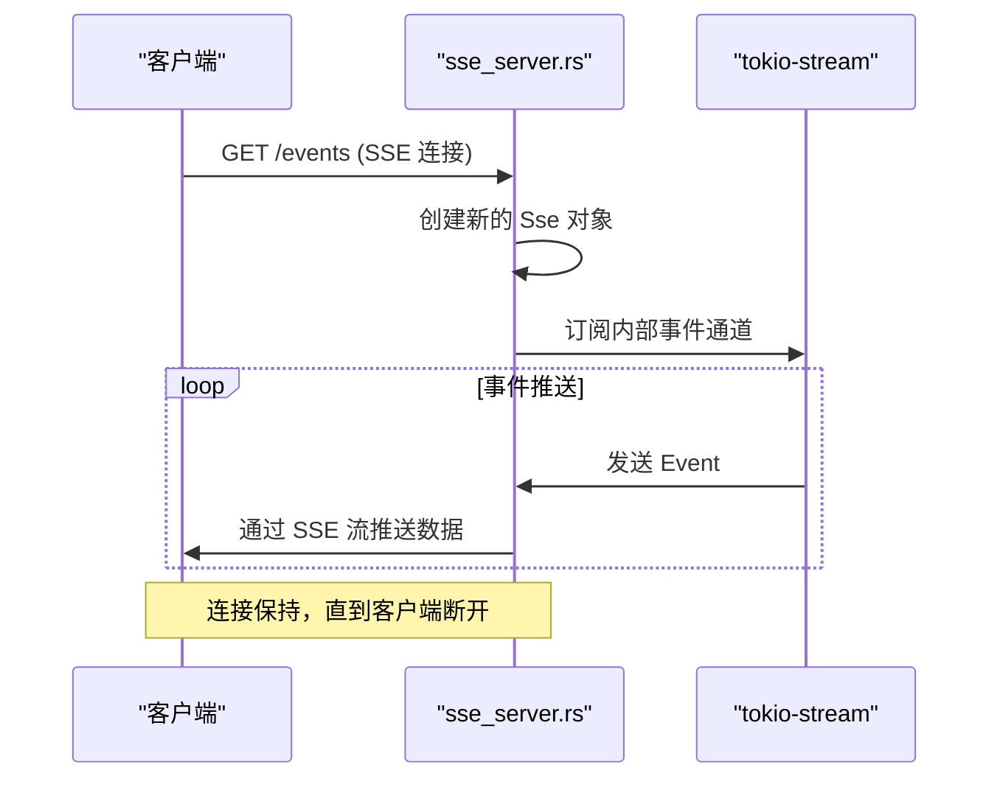

# 调试技巧

<cite>
**本文档引用文件**  
- [main.rs](file://mcp-proxy/src/main.rs)
- [config.rs](file://mcp-proxy/src/config.rs)
- [config.yml](file://mcp-proxy/config.yml)
- [request_logger.rs](file://mcp-proxy/src/server/middlewares/request_logger.rs)
- [mark_log_span.rs](file://mcp-proxy/src/server/middlewares/mark_log_span.rs)
- [sse_client.rs](file://mcp-proxy/src/client/sse_client.rs)
- [sse_server.rs](file://mcp-proxy/src/server/handlers/sse_server.rs)
- [mcp_start_task.rs](file://mcp-proxy/src/server/task/mcp_start_task.rs)
- [mcp_add_handler.rs](file://mcp-proxy/src/server/handlers/mcp_add_handler.rs)
- [mcp_check_status_handler.rs](file://mcp-proxy/src/server/handlers/mcp_check_status_handler.rs)
- [Cargo.toml](file://mcp-proxy/Cargo.toml)
- [mcp_error.rs](file://mcp-proxy/src/mcp_error.rs)
</cite>

## 目录
1. [简介](#简介)
2. [日志系统配置](#日志系统配置)
3. [中间件追踪请求生命周期](#中间件追踪请求生命周期)
4. [SSE通信调试](#sse通信调试)
5. [MCP插件启动问题诊断](#mcp插件启动问题诊断)
6. [动态路由失效排查](#动态路由失效排查)
7. [使用Rust Analyzer进行代码导航与调试](#使用rust-analyzer进行代码导航与调试)
8. [常见问题与日志模式分析](#常见问题与日志模式分析)
9. [结论](#结论)

## 简介
本文档旨在为开发者提供一套完整的调试技巧指南，帮助高效定位和解决在 `mcp-proxy` 项目中遇到的问题。重点涵盖日志系统配置、请求追踪、SSE通信、MCP插件管理、动态路由等核心模块的调试方法，并结合实际代码结构和日志输出模式进行深入分析。

## 日志系统配置

`mcp-proxy` 使用 `tracing` 和 `tracing-subscriber` 构建了强大的日志系统，支持通过环境变量 `RUST_LOG` 精细控制日志级别和模块输出。

### 启用详细日志
通过设置 `RUST_LOG` 环境变量，可以启用不同模块的详细日志输出。例如：
```bash
RUST_LOG=mcp_proxy=debug,axum=trace,tower_http=debug cargo run
```
此命令将启用 `mcp_proxy` 模块的 `debug` 级别日志，同时开启 `axum` 的 `trace` 级别和 `tower_http` 的 `debug` 级别日志，这对于追踪请求处理流程和中间件行为非常有用。

### 配置文件日志级别
项目根目录下的 `config.yml` 文件也定义了日志配置：
```yaml
log:
  level: debug
  path: logs
```
该配置指定了默认日志级别为 `debug`，并指定日志文件输出路径为 `logs` 目录。此配置与 `RUST_LOG` 环境变量共同作用，环境变量具有更高优先级。

**Section sources**
- [config.yml](file://mcp-proxy/config.yml#L5-L8)
- [Cargo.toml](file://mcp-proxy/Cargo.toml#L10-L11)
- [main.rs](file://mcp-proxy/src/main.rs#L15-L30)

## 中间件追踪请求生命周期

`mcp-proxy` 利用 Axum 中间件来追踪请求的完整生命周期和性能瓶颈。

### request_logger 中间件
`request_logger.rs` 实现了请求日志记录中间件，它会在请求开始和结束时记录关键信息，如请求方法、路径、响应状态码和处理耗时。



**Diagram sources**
- [request_logger.rs](file://mcp-proxy/src/server/middlewares/request_logger.rs#L10-L50)

### mark_log_span 中间件
`mark_log_span.rs` 使用 `tracing` 的 `span` 功能为每个请求创建一个独立的跟踪上下文（span）。这使得所有与该请求相关的日志条目都带有相同的 `request_id`，便于在大量日志中关联和追踪单个请求的完整执行路径。



**Diagram sources**
- [mark_log_span.rs](file://mcp-proxy/src/server/middlewares/mark_log_span.rs#L5-L25)

**Section sources**
- [request_logger.rs](file://mcp-proxy/src/server/middlewares/request_logger.rs#L1-L60)
- [mark_log_span.rs](file://mcp-proxy/src/server/middlewares/mark_log_span.rs#L1-L40)

## SSE通信调试

SSE (Server-Sent Events) 是 `mcp-proxy` 与客户端进行实时通信的关键机制。

### 服务端实现
`src/server/handlers/sse_server.rs` 负责处理 SSE 连接。它使用 `tokio-stream` 创建一个事件流，并通过 `axum` 的 `Sse` 响应类型将其发送给客户端。调试时应关注连接建立、事件推送和连接保持的逻辑。

### 客户端实现
`src/client/sse_client.rs` 提供了与 SSE 服务端交互的客户端功能。调试时可检查客户端的连接 URL、重连机制和事件解析逻辑。



**Diagram sources**
- [sse_server.rs](file://mcp-proxy/src/server/handlers/sse_server.rs#L20-L80)
- [sse_client.rs](file://mcp-proxy/src/client/sse_client.rs#L15-L60)

**Section sources**
- [sse_server.rs](file://mcp-proxy/src/server/handlers/sse_server.rs#L1-L100)
- [sse_client.rs](file://mcp-proxy/src/client/sse_client.rs#L1-L70)

## MCP插件启动问题诊断

MCP插件的启动由后台任务管理，主要逻辑位于 `src/server/task/mcp_start_task.rs`。

### 启动流程
1.  从配置文件或 API 请求中读取 MCP 插件配置。
2.  调用 `run_code_rmcp` 库来执行插件的启动命令（如 `uv run` 或 `deno run`）。
3.  监控插件进程的生命周期。

### 常见失败原因
- **命令执行失败**：检查 `run_code_rmcp` 的返回错误，可能由于命令不存在、权限不足或脚本语法错误。
- **端口冲突**：插件尝试绑定的端口已被占用。
- **环境变量缺失**：插件运行所需的环境变量未正确设置。

可通过在 `mcp_start_task.rs` 中增加 `debug!` 或 `error!` 日志来捕获和输出这些错误信息。

**Section sources**
- [mcp_start_task.rs](file://mcp-proxy/src/server/task/mcp_start_task.rs#L1-L50)
- [mcp_add_handler.rs](file://mcp-proxy/src/server/handlers/mcp_add_handler.rs#L30-L70)
- [run_code_rmcp](file://mcp-proxy/Cargo.toml#L25)

## 动态路由失效排查

动态路由由 `mcp_dynamic_router_service.rs` 和 `router_layer.rs` 管理。

### 路由注册
当添加新的 MCP 插件时，`mcp_add_handler.rs` 会调用路由服务，将插件的 basePath 映射到其后端地址。

### 失效原因
- **路由未正确注册**：检查 `mcp_add_handler` 是否成功执行了路由添加逻辑。
- **中间件顺序问题**：确保 `mcp_router_json` 和 `mcp_update_latest_layer` 等路由相关中间件在请求处理链中的顺序正确。
- **缓存问题**：如果使用了路由缓存，检查缓存是否及时更新。

使用 `request_logger` 的日志可以确认请求是否到达了预期的处理函数，从而判断是路由转发失败还是后端处理问题。

**Section sources**
- [mcp_add_handler.rs](file://mcp-proxy/src/server/handlers/mcp_add_handler.rs#L1-L100)
- [mcp_dynamic_router_service.rs](file://mcp-proxy/src/server/mcp_dynamic_router_service.rs#L1-L20)
- [router_layer.rs](file://mcp-proxy/src/server/router_layer.rs#L1-L15)

## 使用Rust Analyzer进行代码导航与调试

Rust Analyzer 是 Rust 开发的必备工具，可极大提升调试效率。

### 代码导航
- **跳转到定义**：在 `main.rs` 中点击 `App` 结构体，可快速跳转到其定义位置。
- **查找引用**：查找 `mcp_check_status_handler` 函数在哪些地方被调用，以理解其调用上下文。
- **类型推断**：将鼠标悬停在变量上，可即时查看其推断出的类型。

### 断点调试
虽然 Rust 的调试生态不如其他语言成熟，但结合 `gdb`/`lldb` 和 VS Code 的调试插件，可以在 `mcp_start_task.rs` 等关键文件中设置断点，逐步执行代码，检查变量状态。

**Section sources**
- [main.rs](file://mcp-proxy/src/main.rs#L1-L50)
- [mcp_check_status_handler.rs](file://mcp-proxy/src/server/handlers/mcp_check_status_handler.rs#L1-L30)

## 常见问题与日志模式分析

### MCP插件状态检查失败
- **日志模式**：在 `mcp_check_status_handler.rs` 中查找 `error!` 或 `warn!` 日志。
- **诊断**：检查目标插件服务是否已启动，网络是否可达。`reqwest` 客户端的错误日志会提供具体原因（如 `Connection refused`）。

### SSE连接频繁中断
- **日志模式**：在 `sse_server.rs` 和 `sse_client.rs` 中查找与连接关闭相关的 `debug!` 或 `info!` 日志。
- **诊断**：检查服务器或客户端是否有超时设置，网络连接是否稳定，服务器负载是否过高。

### 动态路由502错误
- **日志模式**：在 `proxy_handler.rs` 中查找 `error!` 日志，通常会包含 `Upstream service unavailable` 或 `Connection reset by peer`。
- **诊断**：确认后端 MCP 插件服务正在运行且监听正确的端口。检查防火墙设置。

**Section sources**
- [mcp_check_status_handler.rs](file://mcp-proxy/src/server/handlers/mcp_check_status_handler.rs#L1-L60)
- [proxy_handler.rs](file://mcp-proxy/src/proxy/proxy_handler.rs#L1-L40)
- [mcp_error.rs](file://mcp-proxy/src/mcp_error.rs#L1-L20)

## 结论
通过合理配置 `RUST_LOG` 环境变量和 `config.yml`，开发者可以获得详尽的运行时信息。利用 `request_logger` 和 `mark_log_span` 等中间件，可以清晰地追踪请求的生命周期和性能瓶颈。针对 SSE 通信、MCP 插件启动和动态路由等特定问题，结合关键文件的日志输出模式进行分析，能够快速定位故障根源。最后，善用 Rust Analyzer 进行代码导航，可以更深入地理解系统内部逻辑，从而高效地完成调试任务。