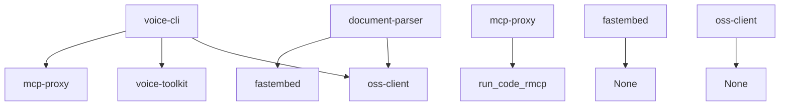

# 技术栈与依赖

<cite>
**本文档引用的文件**  
- [Cargo.toml](file://Cargo.toml)
- [document-parser/Cargo.toml](file://document-parser/Cargo.toml)
- [mcp-proxy/Cargo.toml](file://mcp-proxy/Cargo.toml)
- [voice-cli/Cargo.toml](file://voice-cli/Cargo.toml)
- [oss-client/Cargo.toml](file://oss-client/Cargo.toml)
- [Dockerfile](file://Dockerfile)
- [document-parser/config.yml](file://document-parser/config.yml)
- [voice-cli/config.yml](file://voice-cli/config.yml)
- [voice-cli/pyproject.toml](file://voice-cli/pyproject.toml)
- [voice-cli/tts_service.py](file://voice-cli/tts_service.py)
- [document-parser/src/lib.rs](file://document-parser/src/lib.rs)
- [mcp-proxy/src/lib.rs](file://mcp-proxy/src/lib.rs)
- [oss-client/src/lib.rs](file://oss-client/src/lib.rs)
</cite>

## 目录
1. [项目概述](#项目概述)
2. [Rust技术栈](#rust技术栈)
3. [核心依赖库](#核心依赖库)
4. [外部依赖](#外部依赖)
5. [系统环境要求](#系统环境要求)
6. [工具库与配置管理](#工具库与配置管理)
7. [组件依赖关系](#组件依赖关系)

## 项目概述

本项目是一个多组件的Rust应用程序，包含多个子项目，每个子项目都有特定的功能。项目使用Rust 2024版本进行开发，通过Cargo工作区管理多个包。主要组件包括：
- **document-parser**: 文档解析服务，支持多种格式文档转换为结构化Markdown
- **mcp-proxy**: MCP代理服务，处理代码执行和路由
- **voice-cli**: 语音转文字服务，基于Whisper模型
- **fastembed**: 嵌入式服务
- **oss-client**: 阿里云OSS客户端库

项目采用多阶段Docker构建策略，支持跨平台编译，确保在不同架构上都能正常运行。

**Section sources**
- [Cargo.toml](file://Cargo.toml#L1-L3)
- [Dockerfile](file://Dockerfile#L1-L79)

## Rust技术栈

### Rust版本要求
项目使用Rust 2024 edition进行开发，这是Rust语言的最新稳定版本。在Dockerfile中明确指定了使用`rust:1.85`作为基础镜像，确保了编译环境的一致性。

### 异步运行时
项目采用Tokio作为异步运行时，这是Rust生态系统中最流行的异步运行时之一。在各个子项目的Cargo.toml文件中都明确声明了对Tokio的依赖：

```toml
tokio = { version = "1.48", features = ["macros", "net", "rt", "rt-multi-thread"] }
```

Tokio提供了完整的异步I/O支持，包括TCP/UDP网络、文件系统操作、定时器等。项目使用了`rt-multi-thread`特性，启用多线程运行时，能够充分利用多核CPU的性能。

### Web框架
项目使用Axum作为Web框架，这是一个基于Tokio和Hyper的现代Rust Web框架。Axum提供了类型安全的路由、中间件支持、WebSocket集成等功能。在workspace的Cargo.toml中可以看到Axum的配置：

```toml
axum = { version = "0.8", features = [
    "http2",
    "query",
    "tracing",
    "ws",
    "multipart",
    "macros",
] }
```

Axum的选择基于其与Tokio的无缝集成、类型安全的API设计以及对现代Web功能的全面支持。

### 序列化库
项目使用Serde作为序列化库，这是Rust中最流行的序列化框架。Serde提供了高性能的JSON、YAML等格式的序列化和反序列化功能。在workspace的Cargo.toml中可以看到：

```toml
serde = { version = "1.0", features = ["derive"] }
serde_json = "1.0"
serde_yaml = "=0.9.33"
```

Serde的`derive`特性允许通过宏自动生成序列化代码，大大减少了样板代码的编写。

### 日志系统
项目采用Tracing作为日志和追踪框架，这是一个专门为异步Rust应用设计的现代日志系统。Tracing提供了结构化日志记录、分布式追踪和性能监控功能。相关依赖包括：

```toml
tracing = "0.1"
tracing-subscriber = { version = "0.3", features = ["env-filter"] }
tracing-appender = "=0.2.2"
tracing-opentelemetry = "0.32"
```

Tracing的优势在于其异步友好的设计，能够准确地追踪异步任务的执行流程，这对于调试复杂的异步应用至关重要。

**Section sources**
- [Cargo.toml](file://Cargo.toml#L24-L25)
- [Cargo.toml](file://Cargo.toml#L43-L50)
- [Cargo.toml](file://Cargo.toml#L68-L70)
- [Cargo.toml](file://Cargo.toml#L27-L31)
- [document-parser/Cargo.toml](file://document-parser/Cargo.toml#L8-L26)

## 核心依赖库

### Web框架与HTTP处理
项目使用Axum作为主要的Web框架，配合Tower和Tower-HTTP提供完整的HTTP服务功能。这些库的组合提供了：

- **Axum**: 类型安全的路由、请求处理、中间件支持
- **Tower**: 可组合的服务抽象，支持中间件链
- **Tower-HTTP**: 预构建的中间件，如CORS、压缩、限流等

在workspace的Cargo.toml中可以看到这些依赖的配置：

```toml
axum = { version = "0.8", features = [...] }
tower = { version = "0.5" }
tower-http = { version = "0.6", features = [
    "compression-full",
    "cors",
    "fs",
    "trace",
    "limit",
] }
```

这种技术选型的优势在于提供了高度模块化和可组合的架构，每个组件都可以独立使用或组合使用，满足不同场景的需求。

### 数据库与存储
项目使用多种存储方案来满足不同的需求：

- **Sled**: 嵌入式NoSQL数据库，用于document-parser的本地存储
- **SQLx**: 编译时检查的SQL查询库，用于voice-cli的任务持久化
- **Aliyun OSS SDK**: 阿里云对象存储服务，用于大文件存储

这些依赖在workspace的Cargo.toml中声明：

```toml
sled = "0.34"
sqlx = { version = "0.8", features = ["runtime-tokio-rustls", "sqlite", "chrono", "uuid"] }
aliyun-oss-rust-sdk = { version = "0.2", default-features = false, features = ["async"] }
```

### 缓存与性能优化
项目使用Moka作为内存缓存库，这是一个高性能的Rust缓存实现。在workspace的Cargo.toml中可以看到：

```toml
moka = { version = "0.12", features = ["future"] }
```

Moka提供了线程安全的缓存、TTL支持和多种淘汰策略，适用于需要高性能缓存的场景。

### 任务队列
项目使用Apalis作为异步任务队列，这是一个Rust编写的任务调度框架。在workspace的Cargo.toml中可以看到：

```toml
apalis = { version = "0.7", features = ["tracing", "limit"] }
apalis-sql = { version = "0.7", features = ["sqlite"] }
```

Apalis提供了任务调度、重试机制、持久化等功能，确保异步任务的可靠执行。

**Section sources**
- [Cargo.toml](file://Cargo.toml#L43-L57)
- [Cargo.toml](file://Cargo.toml#L91-L93)
- [Cargo.toml](file://Cargo.toml#L64-L65)
- [Cargo.toml](file://Cargo.toml#L90-L92)

## 外部依赖

### Python环境依赖（文档解析）
document-parser组件依赖Python环境来执行文档解析任务。在`document-parser/config.yml`中可以看到相关配置：

```yaml
mineru:
  backend: "pipeline"
  python_path: "./venv/bin/python"
markitdown:
  python_path: "./venv/bin/python"
```

这表明项目使用Python虚拟环境来管理Python依赖，确保环境的一致性。文档解析功能依赖于Python的MinerU和MarkItDown库，这些库提供了先进的文档解析能力。

### Whisper模型（语音处理）
voice-cli组件依赖Whisper模型进行语音转文字处理。在`voice-cli/config.yml`中可以看到相关配置：

```yaml
whisper:
  default_model: "large-v3"
  models_dir: "./models"
  auto_download: true
  supported_models:
    - "tiny"
    - "tiny.en"
    - "base"
    - "base.en"
    - "small"
    - "small.en"
    - "medium"
    - "medium.en"
    - "large-v1"
    - "large-v2"
    - "large-v3"
```

项目支持多种Whisper模型，从轻量级的tiny模型到高性能的large-v3模型，用户可以根据性能和精度需求选择合适的模型。`auto_download: true`配置表明系统会自动下载所需的模型文件。

### TTS服务依赖
voice-cli还集成了TTS（文本转语音）服务，通过Python脚本`tts_service.py`实现。在`voice-cli/pyproject.toml`中可以看到Python依赖：

```toml
[project]
requires-python = ">=3.10,<3.11"
dependencies = [
    "torch>=2.8",
    "torchaudio>=2.8",
    "numpy>=1.19.0,<2.0.0",
    "soundfile>=0.12",
    "huggingface-hub>=0.34.4",
]
```

这些依赖表明TTS服务基于PyTorch框架，使用深度学习模型进行语音合成。`tts_service.py`脚本中也显示了对`indextts`库的依赖，这是一个专门的TTS库。

### 音频处理依赖
项目使用Symphonia库进行音频格式检测和处理，在`voice-cli/Cargo.toml`中可以看到：

```toml
symphonia = { workspace = true, features = ["all"] }
```

此外，TTS服务还依赖FFmpeg进行音频格式转换：

```python
subprocess.run([
    'ffmpeg', '-y', '-i', temp_wav, 
    '-codec:a', 'libmp3lame', '-qscale:a', '2',
    output_path
])
```

这表明项目能够处理多种音频格式，并在需要时进行格式转换。

**Section sources**
- [document-parser/config.yml](file://document-parser/config.yml#L23-L48)
- [voice-cli/config.yml](file://voice-cli/config.yml#L13-L33)
- [voice-cli/pyproject.toml](file://voice-cli/pyproject.toml#L1-L12)
- [voice-cli/tts_service.py](file://voice-cli/tts_service.py#L20-L36)
- [voice-cli/Cargo.toml](file://voice-cli/Cargo.toml#L77-L83)

## 系统环境要求

### 基本要求
项目的基本环境要求如下：

- **操作系统**: Linux, macOS, Windows
- **Rust版本**: 1.85+
- **内存**: 最低2GB，推荐8GB+
- **存储**: 至少5GB（用于模型存储）
- **Python版本**: 3.10-3.11（用于文档解析和TTS服务）

在Dockerfile中可以看到构建环境的依赖：

```dockerfile
RUN apt-get update && apt-get install -y \
    pkg-config \
    libssl-dev \
    build-essential \
    libclang-dev \
    clang \
    cmake \
    make
```

这些依赖确保了项目能够在标准的Linux环境中成功编译。

### GPU加速要求
项目支持GPU加速，特别是在语音处理和文档解析场景中。在`voice-cli/Cargo.toml`中可以看到GPU相关特性：

```toml
[features]
default = []
cuda = ["voice-toolkit/cuda"]
metal = ["voice-toolkit/metal"]
vulkan = ["voice-toolkit/vulkan"]
```

这表明项目可以通过启用`cuda`、`metal`或`vulkan`特性来支持不同平台的GPU加速。在`document-parser/config.yml`中也提到了GPU显存配置：

```yaml
mineru:
  vram: 8  # 单进程最大GPU显存占用(GB)
```

对于GPU加速环境，建议配置：
- **NVIDIA GPU**: 支持CUDA 11.8+，显存8GB+
- **AMD GPU**: 支持Vulkan 1.3+
- **Apple Silicon**: M系列芯片，支持Metal

### 构建与运行环境
项目采用多阶段Docker构建策略，确保构建环境和运行环境的分离。Dockerfile中定义了三个阶段：

1. **builder**: 包含所有构建依赖的完整构建环境
2. **runtime**: 最小化的运行时环境，仅包含必要的二进制文件
3. **export**: 用于提取编译好的二进制文件

这种设计确保了最终镜像的最小化，同时保持了构建过程的可重复性。

**Section sources**
- [Dockerfile](file://Dockerfile#L5-L21)
- [voice-cli/Cargo.toml](file://voice-cli/Cargo.toml#L102-L107)
- [document-parser/config.yml](file://document-parser/config.yml#L34)
- [Dockerfile](file://Dockerfile#L66-L79)

## 工具库与配置管理

### 共享工具库
项目中的各个服务共享多个工具库，这些库提供了通用的功能：

- **oss-client**: 阿里云OSS客户端库，提供文件上传、下载、删除和预签名URL生成功能
- **voice-toolkit**: 语音处理工具库，提供STT（语音转文字）和音频处理功能
- **mcp-proxy**: MCP代理库，提供代码执行和协议检测功能

在`oss-client/src/lib.rs`中可以看到OSS客户端的接口定义：

```rust
#[async_trait::async_trait]
pub trait OssClientTrait: Send + Sync {
    fn get_config(&self) -> &OssConfig;
    fn generate_upload_url(&self, object_key: &str, expires_in: std::time::Duration, content_type: Option<&str>) -> Result<String>;
    async fn upload_file(&self, local_path: &str, object_key: &str) -> Result<String>;
    // ... 其他方法
}
```

这种设计模式确保了OSS操作的统一性和可测试性。

### 配置管理机制
项目采用分层的配置管理机制，结合YAML配置文件和环境变量：

- **YAML配置文件**: 提供默认配置和结构化配置
- **环境变量**: 允许在运行时覆盖敏感配置（如OSS密钥）
- **命令行参数**: 提供灵活的运行时配置

在`document-parser/config.yml`中可以看到环境变量的使用：

```yaml
storage:
  oss:
    access_key_id: "${OSS_ACCESS_KEY_ID}"
    access_key_secret: "${OSS_ACCESS_KEY_SECRET}"
```

这种配置管理机制的优势在于：
1. **安全性**: 敏感信息不硬编码在配置文件中
2. **灵活性**: 可以在不同环境中使用不同的配置
3. **可维护性**: 配置结构清晰，易于理解和修改

### 配置加载流程
配置加载流程如下：
1. 从`config.yml`加载默认配置
2. 从环境变量中读取覆盖值
3. 应用命令行参数的覆盖
4. 验证配置的有效性

这种流程确保了配置的可靠性和灵活性。

**Section sources**
- [oss-client/src/lib.rs](file://oss-client/src/lib.rs#L46-L143)
- [document-parser/config.yml](file://document-parser/config.yml#L63-L64)
- [voice-cli/config.yml](file://voice-cli/config.yml)

## 组件依赖关系

### 项目结构依赖
项目采用Cargo工作区管理多个包，`Cargo.toml`中定义了工作区成员：

```toml
[workspace]
members = ["document-parser", "fastembed", "mcp-proxy", "oss-client", "voice-cli"]
```

这种结构允许各个组件独立开发和测试，同时又能共享依赖和配置。

### 内部组件依赖
各个组件之间的依赖关系如下：



具体依赖关系：
- **voice-cli**: 依赖oss-client进行文件存储，依赖voice-toolkit进行语音处理，依赖mcp-proxy进行代码执行
- **document-parser**: 依赖oss-client进行文件存储，依赖fastembed进行嵌入式处理
- **mcp-proxy**: 依赖run_code_rmcp进行代码执行
- **fastembed**: 无外部依赖
- **oss-client**: 无业务逻辑依赖

### 依赖管理策略
项目采用工作区依赖管理策略，在workspace的Cargo.toml中定义共享依赖：

```toml
[workspace.dependencies]
mcp-proxy = { path = "mcp-proxy" }
oss-client = { path = "oss-client" }
tokio = { version = "1.48", features = ["macros", "net", "rt", "rt-multi-thread"] }
axum = { version = "0.8", features = [...] }
```

这种策略的优势：
1. **版本一致性**: 所有组件使用相同版本的依赖
2. **简化管理**: 依赖版本在一处定义，避免版本冲突
3. **构建优化**: Cargo可以更好地优化依赖解析和编译

### 运行时依赖
运行时依赖包括：
- **Python环境**: 用于文档解析和TTS服务
- **FFmpeg**: 用于音频格式转换
- **Whisper模型文件**: 语音转文字模型
- **MinerU/MarkItDown模型**: 文档解析模型

这些依赖在运行时通过配置文件和环境变量进行管理，确保了部署的灵活性。

**Diagram sources**
- [Cargo.toml](file://Cargo.toml#L2-L3)

**Section sources**
- [Cargo.toml](file://Cargo.toml#L2-L3)
- [voice-cli/Cargo.toml](file://voice-cli/Cargo.toml#L15-L18)
- [document-parser/Cargo.toml](file://document-parser/Cargo.toml#L39-L40)
- [mcp-proxy/Cargo.toml](file://mcp-proxy/Cargo.toml#L7-L10)