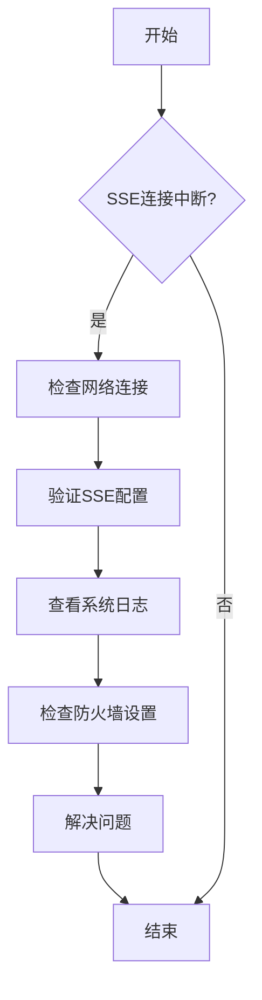
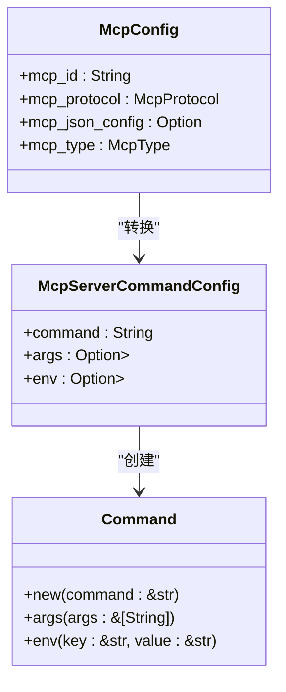
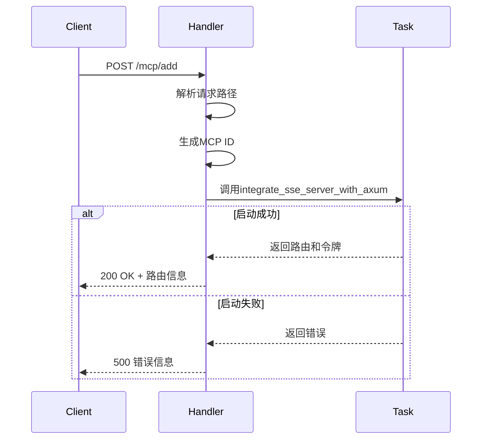
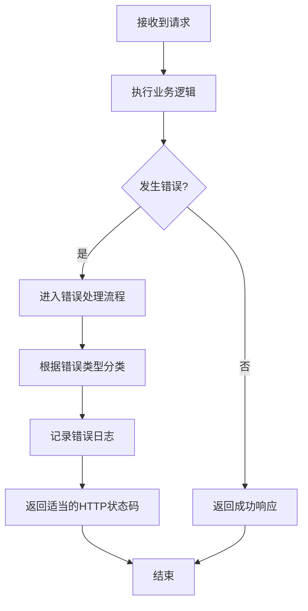

# MCP代理服务故障排除

<cite>
**本文档引用的文件**   
- [mcp_start_task.rs](file://mcp-proxy/src/server/task/mcp_start_task.rs)
- [error_handler.rs](file://document-parser/src/middleware/error_handler.rs)
- [request_logger.rs](file://mcp-proxy/src/server/middlewares/request_logger.rs)
- [mark_log_span.rs](file://mcp-proxy/src/server/middlewares/mark_log_span.rs)
- [mcp_add_handler.rs](file://mcp-proxy/src/server/handlers/mcp_add_handler.rs)
- [run_code_bench.rs](file://mcp-proxy/benches/run_code_bench.rs)
</cite>

## 目录
1. [引言](#引言)
2. [SSE连接中断问题排查](#sse连接中断问题排查)
3. [MCP插件启动失败分析](#mcp插件启动失败分析)
4. [动态路由注册异常处理](#动态路由注册异常处理)
5. [全局错误处理机制](#全局错误处理机制)
6. [日志追踪与请求链路定位](#日志追踪与请求链路定位)
7. [性能压测与间歇性故障复现](#性能压测与间歇性故障复现)
8. [结论](#结论)

## 引言
本文档旨在为MCP代理服务提供全面的故障排除指南，重点解决SSE连接中断、MCP插件启动失败、动态路由注册异常等常见问题。通过深入分析核心组件的实现机制，结合日志追踪和性能测试方法，帮助开发人员快速定位和解决系统运行中的各类故障。

## SSE连接中断问题排查

SSE（Server-Sent Events）连接中断是MCP代理服务中常见的通信问题。当客户端与服务器之间的SSE连接意外断开时，可能导致服务不可用或数据丢失。

### 可能原因分析
- 网络不稳定或连接超时
- 服务器资源不足导致连接被强制关闭
- 客户端或服务器端的配置错误
- 防火墙或安全策略限制

### 排查步骤
1. 检查网络连接稳定性
2. 验证服务器和客户端的SSE配置是否正确
3. 查看系统日志中是否有连接超时或资源不足的记录
4. 检查防火墙设置是否阻止了SSE通信端口



**Diagram sources**
- [sse_client.rs](file://mcp-proxy/src/client/sse_client.rs#L0-L38)
- [sse_server.rs](file://mcp-proxy/src/server/handlers/sse_server.rs#L0-L93)

**Section sources**
- [sse_client.rs](file://mcp-proxy/src/client/sse_client.rs#L0-L38)
- [sse_server.rs](file://mcp-proxy/src/server/handlers/sse_server.rs#L0-L93)

## MCP插件启动失败分析

MCP插件启动失败是代理服务中的关键问题，主要发生在`mcp_start_task.rs`文件中的进程启动过程中。

### 进程启动失败的可能原因

#### 可执行文件路径错误
当配置中的命令路径不正确时，系统无法找到对应的可执行文件。

```mermaid
flowchart TD
A[启动MCP服务] --> B{可执行文件路径正确?}
B --> |否| C[返回"Process spawn failed"错误]
B --> |是| D[继续启动流程]
```

#### 权限不足
执行用户可能没有足够的权限来运行指定的命令或访问相关资源。

#### 依赖缺失
所需的运行时环境或库文件未正确安装。

### 详细分析
在`mcp_start_task.rs`文件中，`mcp_start_task`函数负责根据配置启动MCP服务。该函数首先解析配置，然后创建子进程命令，最后启动服务。



**Diagram sources**
- [mcp_start_task.rs](file://mcp-proxy/src/server/task/mcp_start_task.rs#L0-L208)

**Section sources**
- [mcp_start_task.rs](file://mcp-proxy/src/server/task/mcp_start_task.rs#L0-L208)

## 动态路由注册异常处理

动态路由注册异常通常发生在`mcp_add_handler.rs`文件中，当服务添加失败时需要进行详细排查。

### 服务添加失败的排查步骤

#### 配置校验
确保传入的配置参数符合预期格式和要求。

#### 端口占用
检查目标端口是否已被其他进程占用。

#### 健康检查超时
验证服务的健康检查是否能在规定时间内完成。

### 实现分析
`add_route_handler`函数负责处理路由添加请求。该函数首先从URI中提取协议信息，然后生成MCP ID，最后尝试启动服务。



**Diagram sources**
- [mcp_add_handler.rs](file://mcp-proxy/src/server/handlers/mcp_add_handler.rs#L0-L89)

**Section sources**
- [mcp_add_handler.rs](file://mcp-proxy/src/server/handlers/mcp_add_handler.rs#L0-L89)

## 全局错误处理机制

`error_handler.rs`文件实现了全局错误处理机制，能够捕获并诊断各种关键错误。

### 错误类型处理
- Validation错误：输入验证失败
- File错误：文件操作相关错误
- Network/Timeout错误：网络连接或超时问题
- Parser错误：解析过程中的错误
- Database/Internal错误：数据库或内部系统错误
- OSS错误：对象存储服务错误

### 关键错误诊断
- 'Process spawn failed'：进程启动失败，通常与路径、权限或依赖有关
- 'SSE stream disconnected'：SSE流断开连接，可能由网络或配置问题引起



**Diagram sources**
- [error_handler.rs](file://document-parser/src/middleware/error_handler.rs#L0-L144)

**Section sources**
- [error_handler.rs](file://document-parser/src/middleware/error_handler.rs#L0-L144)

## 日志追踪与请求链路定位

有效的日志追踪是定位问题的关键。通过`request_logger.rs`和`mark_log_span.rs`两个组件，可以实现完整的请求链路追踪。

### 日志记录组件
- `request_logger.rs`：记录请求的基本信息，包括方法、路径、查询参数和请求头
- `mark_log_span.rs`：为每个请求创建追踪跨度，便于分布式追踪

### 请求链路追踪
1. 接收请求时记录基本信息
2. 为请求分配唯一ID
3. 在整个处理流程中传递追踪上下文
4. 记录响应状态码和处理时间


**Diagram sources**
- [request_logger.rs](file://mcp-proxy/src/server/middlewares/request_logger.rs#L0-L38)
- [mark_log_span.rs](file://mcp-proxy/src/server/middlewares/mark_log_span.rs#L0-L101)

**Section sources**
- [request_logger.rs](file://mcp-proxy/src/server/middlewares/request_logger.rs#L0-L38)
- [mark_log_span.rs](file://mcp-proxy/src/server/middlewares/mark_log_span.rs#L0-L101)

## 性能压测与间歇性故障复现

使用`run_code_bench.rs`进行性能压测是复现间歇性故障的有效方法。

### 压测配置
- 样本数量：10
- 预热时间：20秒
- 测量时间：10秒

### 支持的脚本类型
- JavaScript
- TypeScript
- Python

### 压测流程
1. 读取测试脚本文件
2. 创建运行代码请求
3. 执行基准测试
4. 收集性能数据


**Diagram sources**
- [run_code_bench.rs](file://mcp-proxy/benches/run_code_bench.rs#L0-L90)

**Section sources**
- [run_code_bench.rs](file://mcp-proxy/benches/run_code_bench.rs#L0-L90)

## 结论
本文档详细分析了MCP代理服务中的常见故障及其排查方法。通过理解核心组件的实现机制，结合有效的日志追踪和性能测试手段，可以快速定位和解决系统运行中的各类问题。建议在实际运维中建立完善的监控和告警机制，及时发现并处理潜在的故障风险。