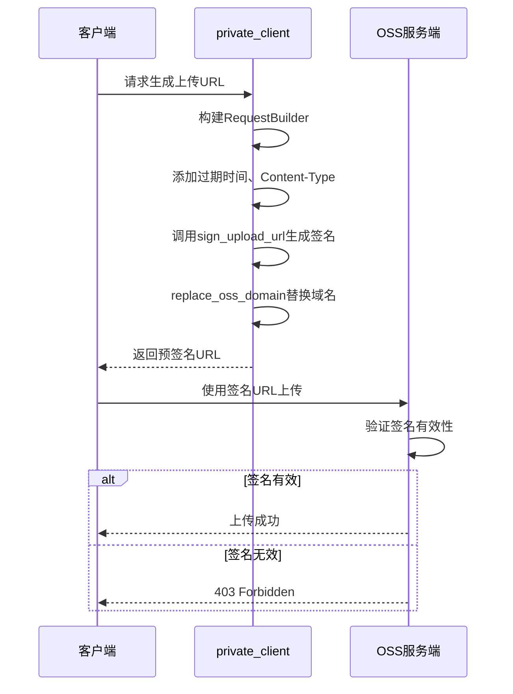
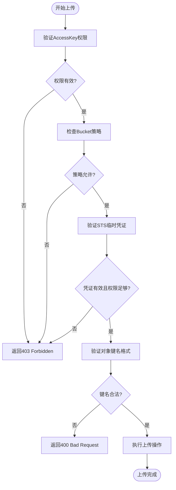
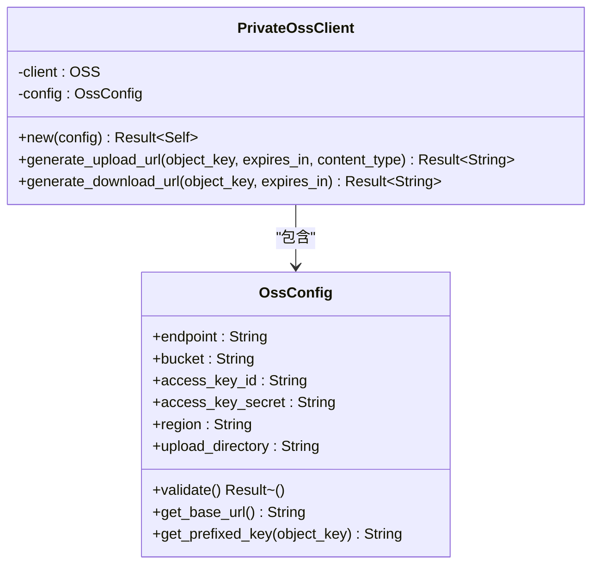
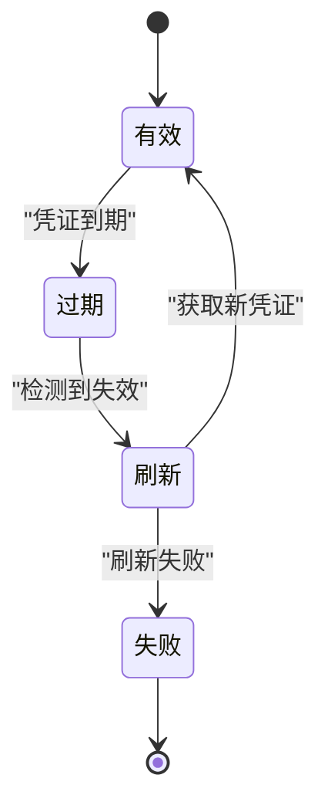
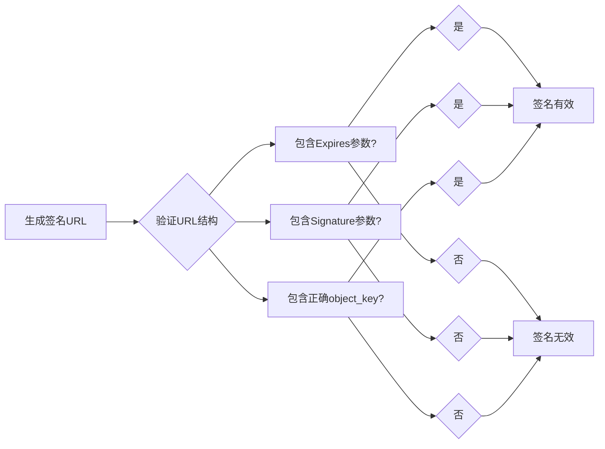
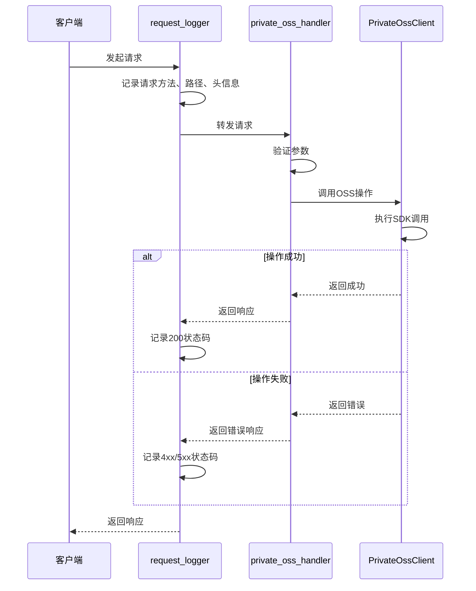
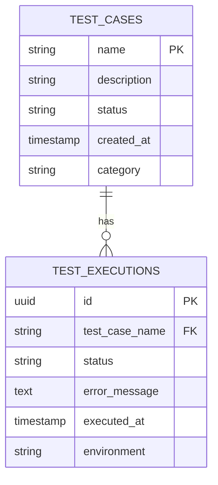

# OSS集成故障排除

<cite>
**本文档引用的文件**
- [private_client.rs](file://oss-client/src/private_client.rs)
- [private_oss_handler.rs](file://document-parser/src/handlers/private_oss_handler.rs)
- [integration_tests.rs](file://oss-client/tests/integration_tests.rs)
- [request_logger.rs](file://mcp-proxy/src/server/middlewares/request_logger.rs)
- [config.rs](file://oss-client/src/config.rs)
</cite>

## 目录
1. [简介](#简介)
2. [签名URL无效问题排查](#签名url无效问题排查)
3. [上传权限拒绝问题分析](#上传权限拒绝问题分析)
4. [跨区域访问失败解决方案](#跨区域访问失败解决方案)
5. [安全相关故障诊断](#安全相关故障诊断)
6. [请求头与签名算法验证](#请求头与签名算法验证)
7. [私有存储访问配置检查](#私有存储访问配置检查)
8. [OSS API调用链路追踪](#oss-api调用链路追踪)
9. [客户端行为验证](#客户端行为验证)

## 简介
本文档旨在解决OSS集成过程中常见的技术问题，重点分析签名URL生成、权限控制、跨区域访问等核心场景。通过深入分析`private_client.rs`中的签名逻辑、`private_oss_handler.rs`中的私有存储访问机制，结合集成测试和日志追踪手段，提供系统性的故障排除指南。

**Section sources**
- [private_client.rs](file://oss-client/src/private_client.rs#L1-L218)
- [private_oss_handler.rs](file://document-parser/src/handlers/private_oss_handler.rs#L1-L483)

## 签名URL无效问题排查

### 签名URL生成机制分析
OSS签名URL的生成依赖于AccessKey、请求参数和过期时间的组合加密。`PrivateOssClient`通过`generate_upload_url`和`generate_download_url`方法生成预签名URL，其中包含`Expires`和`Signature`参数。

当签名URL无效时，可能的原因包括：
- 签名算法与OSS服务端不匹配
- 请求时间戳偏差过大（默认允许15分钟偏差）
- URL编码格式错误
- 自定义域名替换导致签名失效

**Diagram sources**
- [private_client.rs](file://oss-client/src/private_client.rs#L100-L130)
- [private_oss_handler.rs](file://document-parser/src/handlers/private_oss_handler.rs#L200-L250)

### 签名URL有效期管理
预签名URL的有效期由`expires_in`参数控制，默认下载URL有效期为7天，上传URL为4小时。过期后URL将返回403错误。

**Section sources**
- [private_client.rs](file://oss-client/src/private_client.rs#L115-L130)

## 上传权限拒绝问题分析

### 权限拒绝常见原因
上传权限拒绝通常由以下因素导致：
- AccessKey不具备PutObject权限
- Bucket策略限制了特定IP或Referer的访问
- STS临时凭证权限不足
- 对象键名（object_key）包含非法字符或路径

### 权限验证流程

**Diagram sources**
- [private_client.rs](file://oss-client/src/private_client.rs#L132-L178)
- [private_oss_handler.rs](file://document-parser/src/handlers/private_oss_handler.rs#L50-L100)

**Section sources**
- [private_client.rs](file://oss-client/src/private_client.rs#L132-L178)

## 跨区域访问失败解决方案

### 区域配置检查
跨区域访问失败通常源于endpoint配置错误。OSS客户端通过`OssConfig`中的`endpoint`和`region`字段确定服务区域。

**Diagram sources**
- [config.rs](file://oss-client/src/config.rs#L1-L50)
- [private_client.rs](file://oss-client/src/private_client.rs#L10-L30)

### 跨区域访问故障排查清单
1. 确认`endpoint`配置与Bucket实际区域匹配
2. 检查网络是否允许访问目标区域的OSS服务
3. 验证DNS解析是否正确指向目标区域
4. 确认跨区域复制（Cross-Region Replication）策略配置正确

**Section sources**
- [config.rs](file://oss-client/src/config.rs#L1-L50)

## 安全相关故障诊断

### AccessKey泄露风险
AccessKey泄露可能导致未授权访问。系统通过以下机制降低风险：
- 强制配置验证，拒绝空密钥
- 建议使用STS临时凭证替代长期密钥
- 日志记录所有敏感操作

### Policy过期处理
签名策略的有效期由`RequestBuilder::with_expire`方法设置。过期后需重新生成签名URL。

### STS临时凭证失效
STS临时凭证具有较短的有效期（通常1小时），失效后需重新获取。客户端应实现自动刷新机制。

**Diagram sources**
- [private_client.rs](file://oss-client/src/private_client.rs#L100-L130)
- [integration_tests.rs](file://oss-client/tests/integration_tests.rs#L50-L80)

**Section sources**
- [private_client.rs](file://oss-client/src/private_client.rs#L100-L130)

## 请求头与签名算法验证

### 请求头正确性检查
根据"如何使用OSS签名URL上传文件.md"中的流程，关键请求头包括：
- `Content-Type`：必须与签名时指定的类型一致
- `x-oss-security-token`：使用STS时必需
- `Date`：时间戳偏差不能超过15分钟

### 签名算法验证
集成测试验证了签名URL的正确性：
- URL必须包含`Expires`或`x-oss-expires`参数
- 必须包含`Signature`或`x-oss-signature`参数
- 对象键名必须正确包含`edu/`前缀

**Diagram sources**
- [integration_tests.rs](file://oss-client/tests/integration_tests.rs#L150-L200)
- [private_client.rs](file://oss-client/src/private_client.rs#L100-L130)

**Section sources**
- [integration_tests.rs](file://oss-client/tests/integration_tests.rs#L150-L200)

## 私有存储访问配置检查

### 预签名URL有效期配置
- 上传URL默认有效期：4小时
- 下载URL可配置有效期，默认7天
- 可通过`expires_in`参数自定义

### IP白名单检查
系统未直接实现IP白名单，但可通过以下方式间接实现：
- 在应用层检查请求来源IP
- 配置OSS Bucket策略限制访问IP
- 使用CDN并配置IP访问控制

### Referer防盗链配置
Referer防盗链需在OSS控制台配置，系统提供以下支持：
- 记录完整请求头用于审计
- 可通过`request_logger`中间件监控异常访问

**Section sources**
- [private_oss_handler.rs](file://document-parser/src/handlers/private_oss_handler.rs#L200-L300)
- [request_logger.rs](file://mcp-proxy/src/server/middlewares/request_logger.rs#L1-L38)

## OSS API调用链路追踪

### 日志追踪机制
通过`request_logger`和`tracing`日志系统追踪API调用：

**Diagram sources**
- [request_logger.rs](file://mcp-proxy/src/server/middlewares/request_logger.rs#L1-L38)
- [private_oss_handler.rs](file://document-parser/src/handlers/private_oss_handler.rs#L1-L50)

**Section sources**
- [request_logger.rs](file://mcp-proxy/src/server/middlewares/request_logger.rs#L1-L38)

## 客户端行为验证

### 集成测试验证
`integration_tests.rs`提供了客户端行为的全面验证：

1. **客户端创建测试**：验证配置参数的正确性
2. **配置验证测试**：确保空密钥等无效配置被拒绝
3. **签名URL生成测试**：验证URL结构的正确性
4. **对象键名生成测试**：确保文件名去重和格式化

### 测试用例分析

**Diagram sources**
- [integration_tests.rs](file://oss-client/tests/integration_tests.rs#L1-L50)
- [private_client.rs](file://oss-client/src/private_client.rs#L1-L20)

**Section sources**
- [integration_tests.rs](file://oss-client/tests/integration_tests.rs#L1-L50)