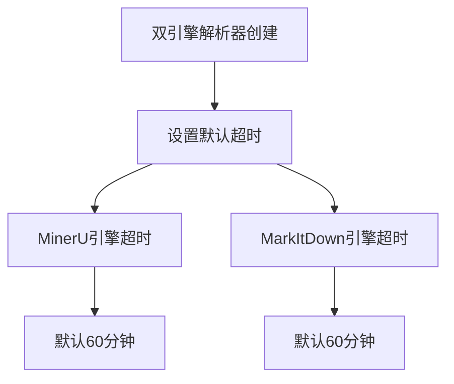
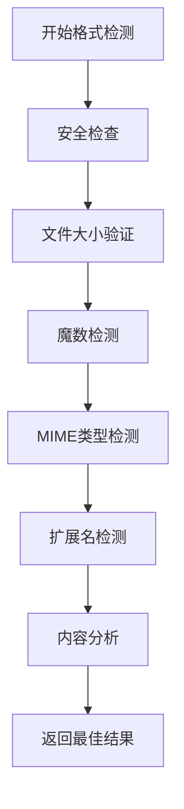
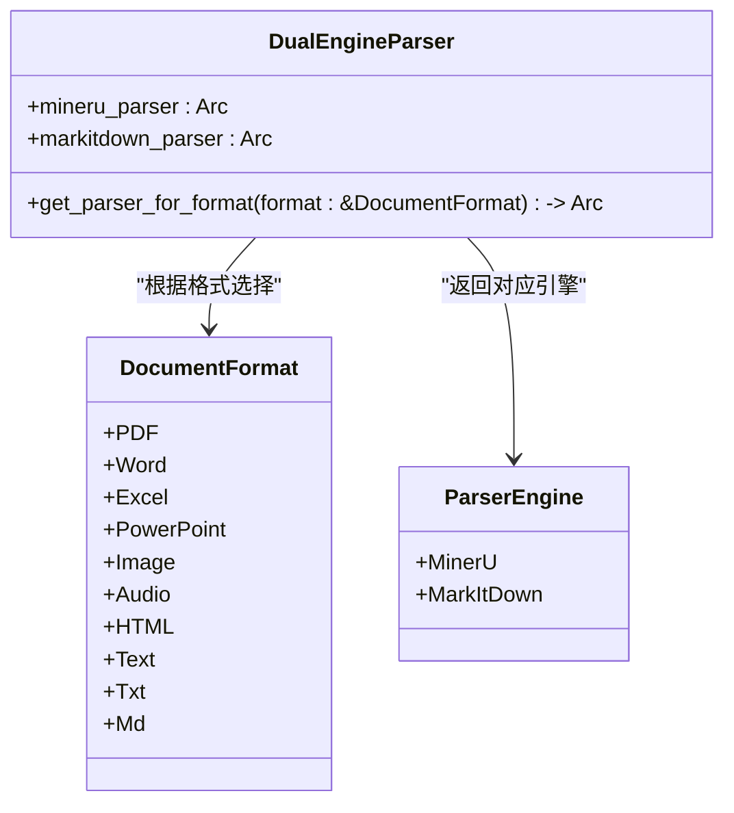
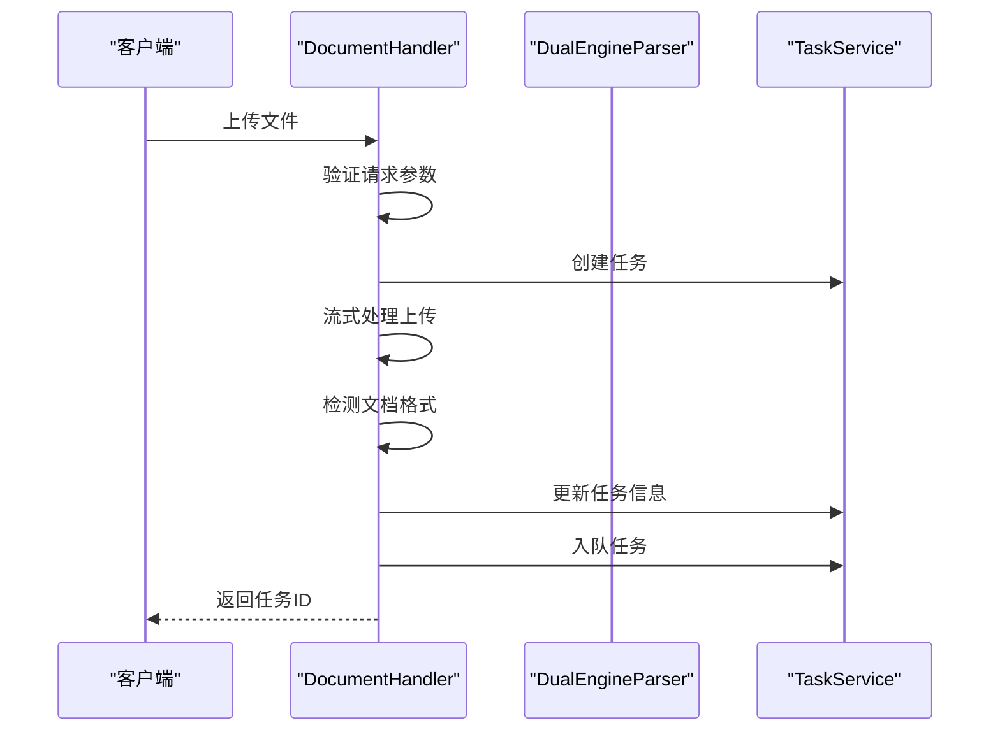
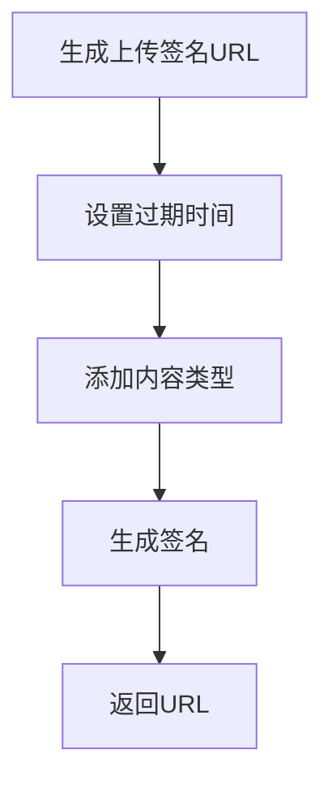
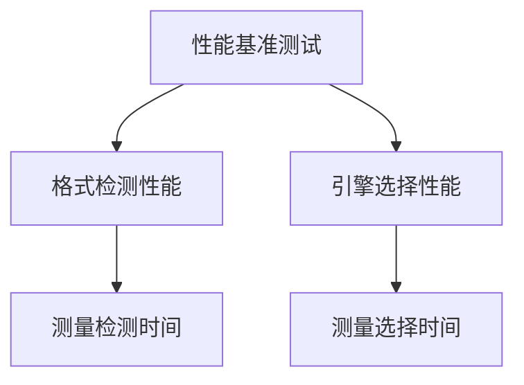
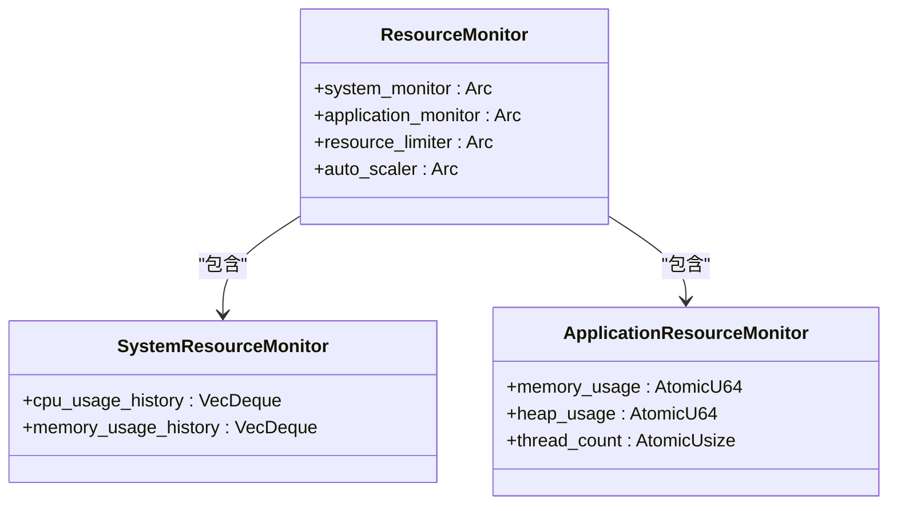

# 文档解析服务故障排除

<cite>
**本文档引用的文件**
- [dual_engine_parser.rs](file://document-parser/src/parsers/dual_engine_parser.rs)
- [document_handler.rs](file://document-parser/src/handlers/document_handler.rs)
- [oss_service.rs](file://document-parser/src/services/oss_service.rs)
- [resource_monitor.rs](file://document-parser/src/performance/resource_monitor.rs)
- [document_parsing_bench.rs](file://document-parser/benches/document_parsing_bench.rs)
- [format_detector.rs](file://document-parser/src/parsers/format_detector.rs)
- [document_format.rs](file://document-parser/src/models/document_format.rs)
- [parser_engine.rs](file://document-parser/src/models/parser_engine.rs)
- [markitdown_parser.rs](file://document-parser/src/parsers/markitdown_parser.rs)
- [mineru_parser.rs](file://document-parser/src/parsers/mineru_parser.rs)
</cite>

## 目录
1. [简介](#简介)
2. [解析超时问题排查](#解析超时问题排查)
3. [格式检测错误处理](#格式检测错误处理)
4. [结构化数据丢失问题](#结构化数据丢失问题)
5. [双引擎切换失败分析](#双引擎切换失败分析)
6. [文件上传解析失败](#文件上传解析失败)
7. [OSS集成问题排查](#oss集成问题排查)
8. [问题复现与性能测试](#问题复现与性能测试)
9. [结论](#结论)

## 简介

文档解析服务是一个复杂的系统，集成了多种解析引擎和处理流程。本故障排除指南旨在帮助开发者和运维人员识别和解决服务中常见的问题，包括解析超时、格式检测错误、结构化数据丢失等。通过深入分析核心组件如`dual_engine_parser.rs`、`document_handler.rs`和`resource_monitor.rs`，我们将提供详细的故障排查步骤和解决方案。

**Section sources**
- [dual_engine_parser.rs](file://document-parser/src/parsers/dual_engine_parser.rs#L1-L217)
- [document_handler.rs](file://document-parser/src/handlers/document_handler.rs#L1-L1113)
- [oss_service.rs](file://document-parser/src/services/oss_service.rs#L1-L939)

## 解析超时问题排查

解析超时是文档解析服务中最常见的问题之一。当文档内容复杂或系统资源不足时，解析过程可能超过预设的超时限制。

### 超时配置分析

在`dual_engine_parser.rs`中，双引擎解析器的超时配置如下：

**Diagram sources**
- [dual_engine_parser.rs](file://document-parser/src/parsers/dual_engine_parser.rs#L25-L50)

### 超时原因分析

1. **文档复杂度高**：大型PDF文档包含大量图片、表格和复杂布局，导致MinerU引擎处理时间过长。
2. **系统资源不足**：CPU或内存资源不足，导致解析进程变慢。
3. **网络延迟**：在使用远程模型或资源时，网络延迟可能导致超时。

### 解决方案

1. **调整超时配置**：根据实际需求调整`mineru_config.timeout`和`markitdown_config.timeout`参数。
2. **优化系统资源**：确保服务器有足够的CPU和内存资源。
3. **分块处理**：对于大型文档，考虑分块处理以减少单次解析时间。

**Section sources**
- [dual_engine_parser.rs](file://document-parser/src/parsers/dual_engine_parser.rs#L25-L50)
- [mineru_parser.rs](file://document-parser/src/parsers/mineru_parser.rs#L200-L250)

## 格式检测错误处理

格式检测错误可能导致文档被错误地解析或无法解析。`format_detector.rs`文件中的格式检测器负责识别文档的真实格式。

### 格式检测流程

**Diagram sources**
- [format_detector.rs](file://document-parser/src/parsers/format_detector.rs#L100-L200)

### 常见错误场景

1. **扩展名与内容不匹配**：文件扩展名为`.pdf`，但实际内容是文本。
2. **MIME类型错误**：上传时提供的MIME类型与文件实际类型不符。
3. **文件损坏**：文件部分内容损坏，导致魔数检测失败。

### 处理策略

1. **多重检测机制**：使用魔数、MIME类型和扩展名等多种方式综合判断。
2. **置信度评估**：为每种检测方法分配置信度，选择最高置信度的结果。
3. **安全检查**：验证文件大小和扩展名，防止恶意文件上传。

**Section sources**
- [format_detector.rs](file://document-parser/src/parsers/format_detector.rs#L100-L200)
- [document_format.rs](file://document-parser/src/models/document_format.rs#L1-L125)

## 结构化数据丢失问题

结构化数据丢失通常发生在解析过程中，特别是当文档包含复杂布局或特殊格式时。

### 数据丢失原因

1. **解析引擎限制**：某些引擎可能无法正确处理特定的文档结构。
2. **后处理错误**：在`post_process_content`阶段，错误的处理逻辑可能导致数据丢失。
3. **编码问题**：字符编码不匹配导致特殊字符丢失。

### 防止数据丢失

1. **选择合适的解析引擎**：根据文档类型选择最适合的解析引擎。
2. **验证解析结果**：在解析完成后，验证关键数据是否完整。
3. **备份原始数据**：在处理前备份原始文档，以便在出现问题时恢复。

**Section sources**
- [markitdown_parser.rs](file://document-parser/src/parsers/markitdown_parser.rs#L500-L600)
- [mineru_parser.rs](file://document-parser/src/parsers/mineru_parser.rs#L500-L600)

## 双引擎切换失败分析

双引擎解析器在`dual_engine_parser.rs`中实现，负责在MinerU和MarkItDown引擎之间切换。

### 引擎选择逻辑

**Diagram sources**
- [dual_engine_parser.rs](file://document-parser/src/parsers/dual_engine_parser.rs#L100-L150)
- [parser_engine.rs](file://document-parser/src/models/parser_engine.rs#L1-L47)

### 兼容性问题

1. **PDF格式**：MinerU引擎专门用于PDF解析，而MarkItDown用于其他格式。
2. **配置冲突**：两个引擎的配置参数可能不兼容，导致切换失败。
3. **资源竞争**：同时运行两个引擎可能导致资源竞争。

### 解决方案

1. **明确引擎职责**：确保每个引擎只处理其擅长的文档类型。
2. **统一配置管理**：使用全局配置管理器协调两个引擎的配置。
3. **资源隔离**：为每个引擎分配独立的资源池，避免竞争。

**Section sources**
- [dual_engine_parser.rs](file://document-parser/src/parsers/dual_engine_parser.rs#L100-L150)
- [parser_engine.rs](file://document-parser/src/models/parser_engine.rs#L1-L47)

## 文件上传解析失败

`document_handler.rs`文件中的`upload_document`函数负责处理文件上传和解析。

### 上传失败原因

1. **Content-Type不匹配**：上传时提供的Content-Type与文件实际类型不符。
2. **大文件内存溢出**：大文件上传可能导致内存不足。
3. **文件名不安全**：包含特殊字符的文件名可能导致解析失败。

### 上传处理流程

**Diagram sources**
- [document_handler.rs](file://document-parser/src/handlers/document_handler.rs#L100-L200)

### 解决方案

1. **验证Content-Type**：在上传前验证Content-Type与文件实际类型匹配。
2. **分块上传**：对于大文件，使用分块上传避免内存溢出。
3. **文件名清理**：清理文件名中的特殊字符，确保安全性。

**Section sources**
- [document_handler.rs](file://document-parser/src/handlers/document_handler.rs#L100-L200)
- [file_utils.rs](file://document-parser/src/utils/file_utils.rs#L1-L50)

## OSS集成问题排查

OSS集成在`oss_service.rs`文件中实现，负责与阿里云OSS进行交互。

### 常见问题

1. **签名URL失效**：生成的签名URL在短时间内失效。
2. **跨域上传失败**：CORS配置不当导致跨域上传失败。
3. **权限不足**：OSS访问密钥权限不足，无法完成操作。

### 签名URL生成

**Diagram sources**
- [oss_service.rs](file://document-parser/src/services/oss_service.rs#L500-L600)

### 解决方案

1. **延长URL有效期**：根据需要调整`expires_in`参数。
2. **正确配置CORS**：确保OSS bucket的CORS配置允许跨域请求。
3. **检查权限**：验证OSS访问密钥具有足够的权限。

**Section sources**
- [oss_service.rs](file://document-parser/src/services/oss_service.rs#L500-L600)
- [config.yml](file://document-parser/config.yml#L1-L20)

## 问题复现与性能测试

### 使用测试文件复现问题

`fixtures`目录中的测试文件可用于复现各种问题：

- `sample_markdown.md`：测试Markdown解析
- `sample_data.xml`：测试XML解析
- `technical_doc.md`：测试复杂文档解析

### 性能基准测试

`benches/document_parsing_bench.rs`文件提供了性能基准测试：

**Diagram sources**
- [document_parsing_bench.rs](file://document-parser/benches/document_parsing_bench.rs#L1-L47)

### 资源监控分析

`resource_monitor.rs`文件中的资源监控器可帮助分析内存和CPU使用情况：

**Diagram sources**
- [resource_monitor.rs](file://document-parser/src/performance/resource_monitor.rs#L50-L100)

**Section sources**
- [document_parsing_bench.rs](file://document-parser/benches/document_parsing_bench.rs#L1-L47)
- [resource_monitor.rs](file://document-parser/src/performance/resource_monitor.rs#L50-L100)
- [fixtures](file://document-parser/fixtures)

## 结论

本文档详细分析了文档解析服务中的常见问题及其解决方案。通过理解双引擎解析器的工作原理、文件上传处理流程和OSS集成机制，可以有效排查和解决各种故障。建议定期进行性能基准测试，并使用资源监控器来确保系统稳定运行。