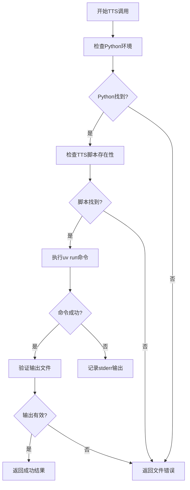
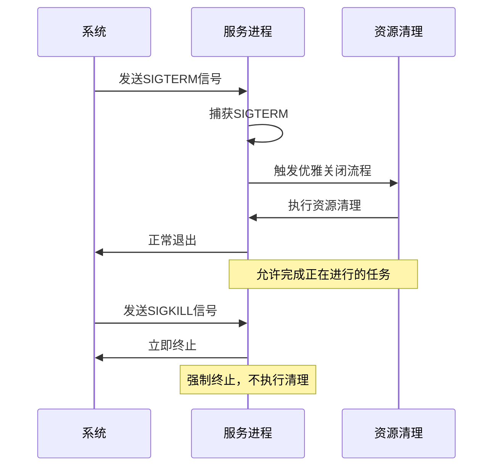
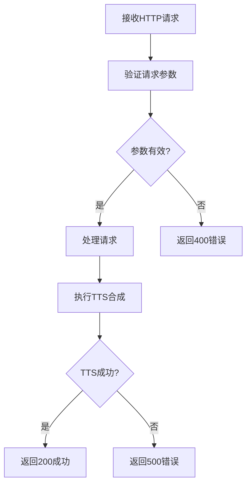
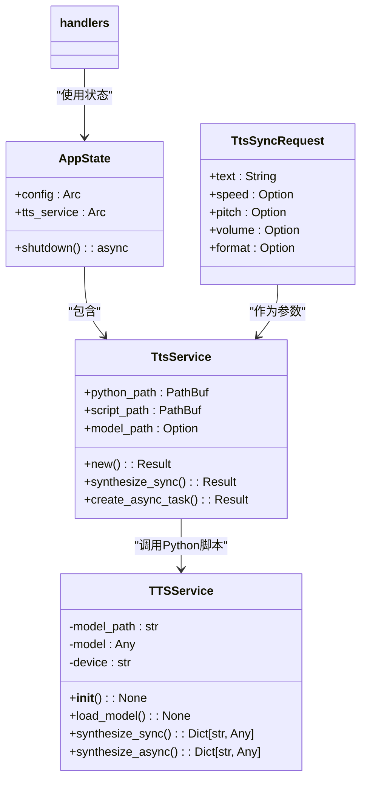

# 语音CLI工具故障排除

<cite>
**本文档引用的文件**
- [tts_service.rs](file://voice-cli/src/services/tts_service.rs)
- [signal_handling.rs](file://voice-cli/src/utils/signal_handling.rs)
- [handlers.rs](file://voice-cli/src/server/handlers.rs)
- [tts_service.py](file://voice-cli/tts_service.py)
- [integration_tests.rs](file://voice-cli/tests/integration_tests.rs)
</cite>

## 目录
1. [简介](#简介)
2. [TTS服务调用失败排查](#tts服务调用失败排查)
3. [信号处理与优雅关闭](#信号处理与优雅关闭)
4. [HTTP接口错误处理](#http接口错误处理)
5. [本地服务模拟与集成测试](#本地服务模拟与集成测试)
6. [结论](#结论)

## 简介
本文档旨在为语音CLI工具提供全面的故障排除指南，重点解决TTS服务调用失败、音频生成异常、进程信号处理错误等常见问题。通过深入分析核心组件的实现机制，为开发者提供有效的调试策略和解决方案。

## TTS服务调用失败排查

### Python环境与依赖问题
TTS服务通过Rust调用外部Python脚本实现语音合成功能，这种跨语言调用容易因环境配置问题导致失败。

**常见故障原因：**
- Python解释器缺失或路径配置错误
- 虚拟环境未正确激活
- 依赖包版本冲突或缺失
- 脚本执行权限不足

**诊断步骤：**
1. 验证Python环境：检查`.venv`虚拟环境是否存在且可访问
2. 确认依赖安装：确保`indextts`、`torch`、`torchaudio`等关键包已正确安装
3. 检查脚本权限：验证`tts_service.py`具有可执行权限

**Diagram sources**
- [tts_service.rs](file://voice-cli/src/services/tts_service.rs#L1-L287)
- [tts_service.py](file://voice-cli/tts_service.py#L1-L428)

**Section sources**
- [tts_service.rs](file://voice-cli/src/services/tts_service.rs#L1-L287)
- [tts_service.py](file://voice-cli/tts_service.py#L1-L428)

### 外部脚本执行问题
`tts_service.rs`使用`uv run`命令来确保在正确的虚拟环境中执行Python脚本，但可能遇到执行失败的情况。

**关键检查点：**
- 确保`uv`工具已安装并可执行
- 验证脚本路径的正确性（优先检查当前目录，然后是crate目录）
- 检查环境变量`TTS_MODEL_PATH`是否正确设置

**错误处理策略：**
当TTS合成失败时，系统会捕获并记录详细的错误信息，包括：
- 命令执行的stderr输出
- 命令执行的stdout输出
- 输出文件的存在性和大小验证

## 信号处理与优雅关闭

### SIGTERM与SIGKILL处理差异
信号处理模块提供了统一的信号处理机制，确保服务能够优雅地关闭。

**Diagram sources**
- [signal_handling.rs](file://voice-cli/src/utils/signal_handling.rs#L1-L199)

**Section sources**
- [signal_handling.rs](file://voice-cli/src/utils/signal_handling.rs#L1-L199)

### 优雅关闭过程中的资源清理
在`AppState`的`shutdown`方法中实现了应用状态的优雅关闭流程。

**清理失败场景：**
1. **Apalis管理器关闭失败**：当任务队列中有正在进行的任务时，关闭操作可能失败
2. **文件锁未释放**：正在处理的音频文件可能被锁定，导致无法清理
3. **数据库连接未关闭**：SQLite存储连接可能未正确释放

**解决方案：**
- 实现超时机制，避免无限等待
- 使用`warn!`级别日志记录非致命的清理失败
- 确保所有异步任务都有适当的取消信号处理

## HTTP接口错误处理

### 请求参数验证
HTTP处理器对请求参数进行严格的验证，确保输入数据的有效性。

**验证规则：**
- 文本不能为空
- 语速必须在0.5-2.0之间
- 音调必须在-20到20之间
- 音量必须在0.5-2.0之间

**Diagram sources**
- [handlers.rs](file://voice-cli/src/server/handlers.rs#L1-L799)

**Section sources**
- [handlers.rs](file://voice-cli/src/server/handlers.rs#L1-L799)

### 超时设置与并发控制
系统通过配置实现了合理的超时和并发控制策略。

**关键配置参数：**
- `task_timeout`: 任务超时时间（默认30秒）
- `max_concurrent_tasks`: 最大并发任务数（默认2个）
- `worker_timeout`: 工作线程超时时间

**调试建议：**
1. 监控任务队列长度，避免积压
2. 调整超时参数以适应不同规模的音频处理
3. 使用`/tasks/stats`端点监控系统性能指标

## 本地服务模拟与集成测试

### 本地服务模拟环境
通过`tts_service.py`脚本可以创建本地服务模拟环境，用于验证交互逻辑。

**模拟实现特点：**
- 当真实TTS库不可用时自动切换到Mock实现
- 支持多种音频格式输出（WAV、MP3等）
- 提供详细的日志输出便于调试

**测试验证步骤：**
1. 确保`tts_service.py`脚本可独立运行
2. 验证脚本的命令行参数解析正确性
3. 测试不同参数组合的输出结果

### 集成测试复现
`integration_tests.rs`提供了完整的业务流程测试，可用于复现复杂问题。

**测试覆盖场景：**
- 健康检查端点
- 模型列表获取
- 异步转录工作流
- 任务取消功能
- 任务统计信息
- 并发请求处理

**测试执行建议：**
- 使用临时目录避免污染生产环境
- 验证所有HTTP状态码的正确性
- 检查响应数据结构的完整性

**Diagram sources**
- [tts_service.rs](file://voice-cli/src/services/tts_service.rs#L1-L287)
- [tts_service.py](file://voice-cli/tts_service.py#L1-L428)
- [handlers.rs](file://voice-cli/src/server/handlers.rs#L1-L799)

**Section sources**
- [integration_tests.rs](file://voice-cli/tests/integration_tests.rs#L1-L450)

## 结论
通过系统性地分析TTS服务调用、信号处理和HTTP接口等关键组件，本文档提供了全面的故障排除指南。建议开发者在遇到问题时，按照从环境配置到代码逻辑的顺序逐步排查，充分利用提供的日志信息和测试工具，确保语音CLI工具的稳定运行。