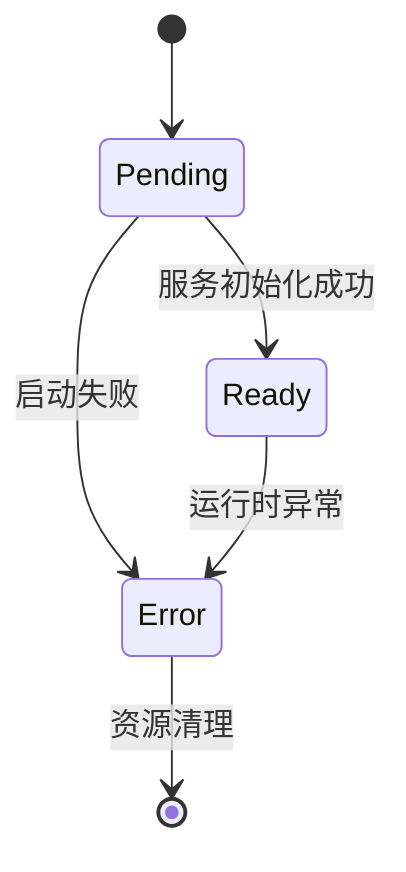
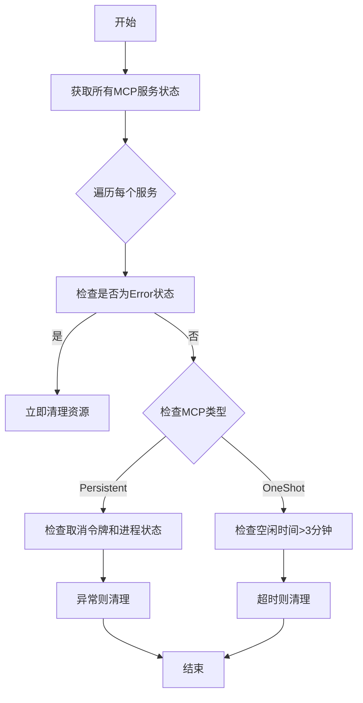
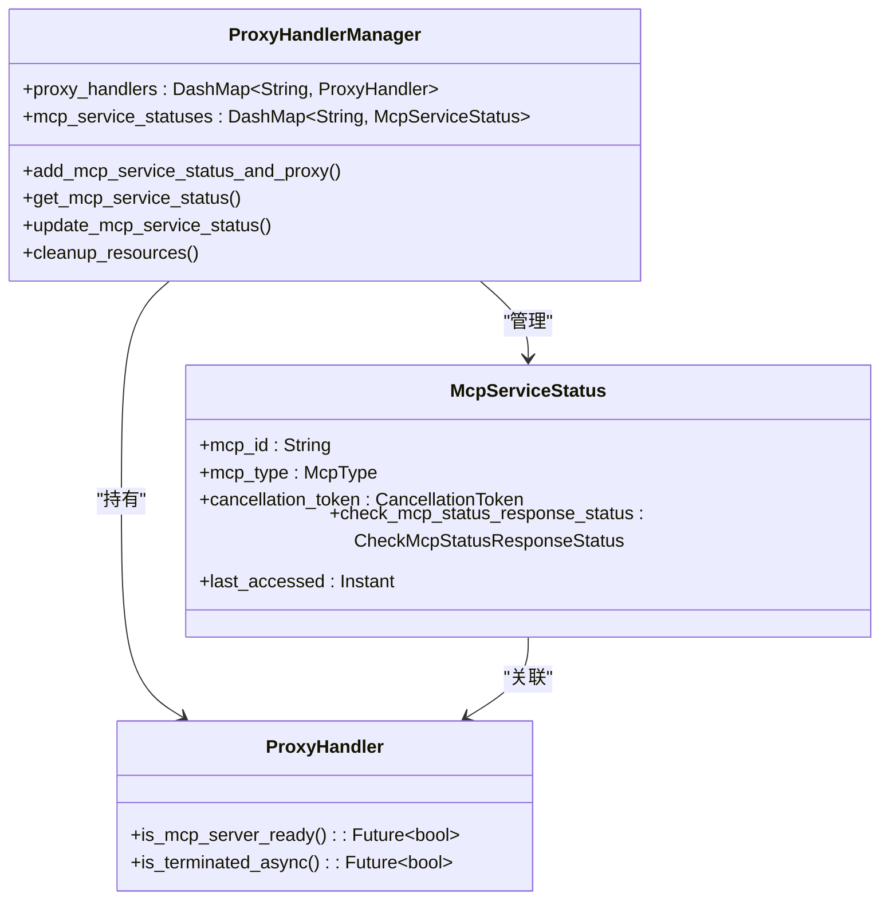

# MCP服务状态模型

<cite>
**本文档引用的文件**
- [mcp_check_status_model.rs](file://mcp-proxy/src/model/mcp_check_status_model.rs)
- [global.rs](file://mcp-proxy/src/model/global.rs)
- [schedule_check_mcp_live.rs](file://mcp-proxy/src/server/task/schedule_check_mcp_live.rs)
- [mcp_check_status_handler.rs](file://mcp-proxy/src/server/handlers/mcp_check_status_handler.rs)
- [mcp_dynamic_router_service.rs](file://mcp-proxy/src/server/mcp_dynamic_router_service.rs)
</cite>

## 目录
1. [引言](#引言)
2. [McpServiceStatus结构体详解](#mcpservicestatus结构体详解)
3. [状态语义与转换规则](#状态语义与转换规则)
4. [心跳检测与健康检查机制](#心跳检测与健康检查机制)
5. [状态调度与清理逻辑](#状态调度与清理逻辑)
6. [JSON序列化示例](#json序列化示例)
7. [与ProxyHandlerManager的关联关系](#与proxyhandlermanager的关联关系)
8. [在动态路由中的应用](#在动态路由中的应用)
9. [结论](#结论)

## 引言
本文档详细描述了MCP（Modular Control Plane）代理系统中的服务状态模型，重点分析`McpServiceStatus`结构体的设计与行为。该模型是系统实现动态服务管理、健康检查和资源清理的核心组件，通过精确的状态跟踪和定时调度机制，确保服务的高可用性和资源的高效利用。

**文档来源**
- [mcp_check_status_model.rs](file://mcp-proxy/src/model/mcp_check_status_model.rs)
- [global.rs](file://mcp-proxy/src/model/global.rs)

## McpServiceStatus结构体详解
`McpServiceStatus`结构体定义了MCP服务实例的运行时状态，包含以下核心字段：

| 字段名 | 类型 | 说明 |
|--------|------|------|
| `mcp_id` | String | 服务唯一标识符 |
| `mcp_type` | McpType | 服务类型（Persistent/OneShot） |
| `mcp_router_path` | McpRouterPath | 路由路径配置 |
| `cancellation_token` | CancellationToken | 服务取消令牌，用于优雅终止 |
| `check_mcp_status_response_status` | CheckMcpStatusResponseStatus | 当前服务状态（Ready/Pending/Error） |
| `last_accessed` | Instant | 最后访问时间戳，用于空闲检测 |

该结构体通过`DashMap`在`ProxyHandlerManager`中全局管理，确保线程安全的并发访问。

**Section sources**
- [global.rs](file://mcp-proxy/src/model/global.rs#L62-L77)

## 状态语义与转换规则
服务状态由`CheckMcpStatusResponseStatus`枚举定义，包含三种状态：



**状态转换规则：**
- **Pending**：服务正在启动或初始化中，此为初始状态
- **Ready**：服务已成功启动并通过健康检查
- **Error**：服务启动失败或运行时发生不可恢复错误

状态转换由`mcp_check_status_handler`触发，并通过`update_mcp_service_status`方法更新。

**Diagram sources**
- [mcp_check_status_model.rs](file://mcp-proxy/src/model/mcp_check_status_model.rs#L45-L58)
- [mcp_check_status_handler.rs](file://mcp-proxy/src/server/handlers/mcp_check_status_handler.rs#L150-L186)

## 心跳检测与健康检查机制
系统通过`check_mcp_status_handler`实现服务健康检查：

1. 客户端发起状态检查请求
2. 系统查询`mcp_service_statuses`获取当前状态
3. 若服务存在，调用`is_mcp_server_ready()`进行实时健康检查
4. 更新`last_accessed`时间戳，重置空闲计时器
5. 返回标准化的`CheckMcpStatusResponseParams`

健康检查采用心跳机制，每次成功访问都会刷新`last_accessed`时间，防止被误判为空闲服务。

**Section sources**
- [mcp_check_status_handler.rs](file://mcp-proxy/src/server/handlers/mcp_check_status_handler.rs#L50-L140)

## 状态调度与清理逻辑
`schedule_check_mcp_live`任务定期执行服务状态清理：



**清理触发条件：**
- 服务状态为Error
- 持久化服务被取消或进程终止
- 一次性服务空闲超过3分钟

任务每5分钟执行一次，确保资源及时回收。

**Diagram sources**
- [schedule_check_mcp_live.rs](file://mcp-proxy/src/server/task/schedule_check_mcp_live.rs#L10-L83)

## JSON序列化示例
`CheckMcpStatusResponseParams`结构体提供标准化的JSON输出：

**运行中状态（Ready）：**
```json
{
  "ready": true,
  "status": "Ready",
  "message": null
}
```

**已停止状态（Stopped）：**
```json
{
  "ready": false,
  "status": "Pending",
  "message": "服务正在启动中..."
}
```

**未知状态（Unknown）：**
```json
{
  "ready": false,
  "status": "Error",
  "message": "启动MCP服务失败: connection timeout"
}
```

**Section sources**
- [mcp_check_status_model.rs](file://mcp-proxy/src/model/mcp_check_status_model.rs#L20-L40)

## 与ProxyHandlerManager的关联关系
`ProxyHandlerManager`是MCP服务状态的核心管理器：



通过全局单例`GLOBAL_PROXY_MANAGER`，所有组件共享同一状态视图，确保状态一致性。

**Diagram sources**
- [global.rs](file://mcp-proxy/src/model/global.rs#L80-L206)

## 在动态路由中的应用
MCP状态模型与动态路由深度集成：

1. **路由注册**：服务启动时自动注册路由路径
2. **按需启动**：首次访问时动态创建服务实例
3. **状态驱动**：根据`check_mcp_status_response_status`决定服务可用性
4. **自动清理**：空闲或错误状态自动注销路由

当请求到达未注册路径时，系统会：
- 从请求头获取`x-mcp-json`配置
- 异步启动MCP服务
- 更新`McpServiceStatus`为Pending
- 成功后切换为Ready状态

**Section sources**
- [mcp_dynamic_router_service.rs](file://mcp-proxy/src/server/mcp_dynamic_router_service.rs#L10-L118)

## 结论
MCP服务状态模型通过精细化的状态管理、心跳检测和自动清理机制，实现了服务的动态生命周期管理。该模型不仅确保了系统的高可用性，还通过资源的按需分配和及时回收，优化了系统整体性能。与`ProxyHandlerManager`的深度集成，使得状态变更能够实时反映到路由系统中，为构建弹性、可扩展的代理服务提供了坚实基础。