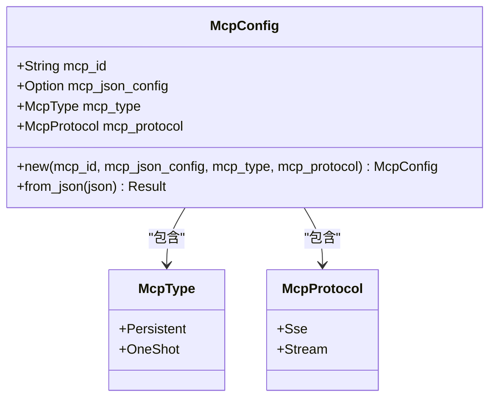
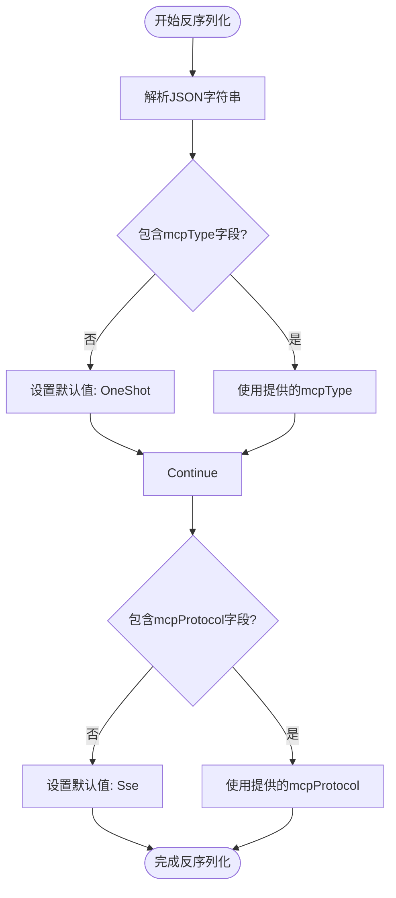
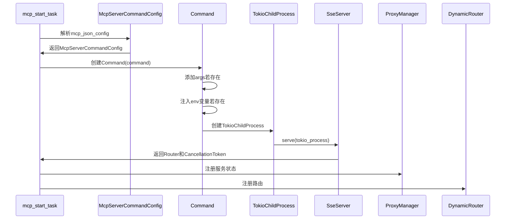
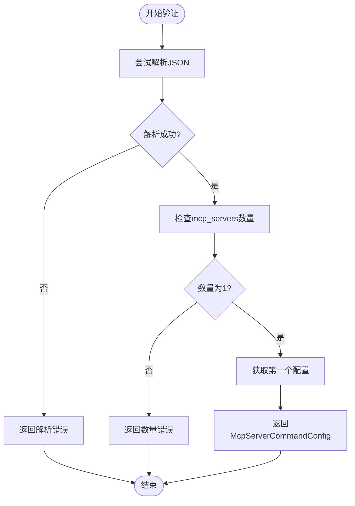

# MCP配置模型

<cite>
**本文档引用的文件**  
- [mcp_config.rs](file://mcp-proxy/src/model/mcp_config.rs)
- [mcp_router_model.rs](file://mcp-proxy/src/model/mcp_router_model.rs)
- [mcp_start_task.rs](file://mcp-proxy/src/server/task/mcp_start_task.rs)
- [config.yml](file://mcp-proxy/config.yml)
</cite>

## 目录
1. [引言](#引言)
2. [McpConfig数据模型结构](#mcpconfig数据模型结构)
3. [核心字段详解](#核心字段详解)
4. [配置反序列化与默认值填充](#配置反序列化与默认值填充)
5. [高级配置项与服务生命周期](#高级配置项与服务生命周期)
6. [启动流程与进程参数映射](#启动流程与进程参数映射)
7. [配置验证机制](#配置验证机制)
8. [结论](#结论)

## 引言
MCP（Modular Control Protocol）配置模型是mcp-proxy系统中用于定义和管理外部服务插件的核心数据结构。该模型通过`McpConfig`结构体实现，支持灵活的命令行执行、环境变量注入和协议选择。本文档深入解析其设计原理、字段约束、反序列化流程及与启动任务的集成机制，重点说明配置安全性、默认值处理和验证逻辑。

## McpConfig数据模型结构

`McpConfig`是MCP服务的核心配置结构，定义了插件的身份、类型、协议及执行参数。其字段通过Serde进行序列化控制，确保与外部JSON配置的兼容性。

**图示来源**  
- [mcp_config.rs](file://mcp-proxy/src/model/mcp_config.rs#L10-L72)

**本节来源**  
- [mcp_config.rs](file://mcp-proxy/src/model/mcp_config.rs#L10-L72)

## 核心字段详解

### mcp_id
- **含义**：MCP服务的唯一标识符，用于路由注册、状态跟踪和日志关联。
- **约束**：必填字段，字符串类型，通常由系统生成或用户指定。

### mcp_json_config
- **含义**：包含具体执行命令、参数和环境变量的JSON字符串，对应`McpServerCommandConfig`。
- **约束**：可选字段，但在启动任务中必须存在（通过`expect`强制解包）。

### command 与 args
- **command**：要执行的可执行文件路径或命令名（如`npx`、`python`）。
- **args**：传递给命令的参数列表，类型为`Option<Vec<String>>`。
- **使用约束**：
  - `args`为`Option`类型，允许为空。
  - 在`mcp_start_task.rs`中通过`if let Some(args) = &mcp_config.args`安全处理。

### env_vars
- **含义**：以键值对形式注入的环境变量，用于传递密钥、配置等敏感信息。
- **安全考虑**：
  - 环境变量通过`command.env(key, value)`直接设置，避免在命令行中暴露。
  - 日志中仅记录变量名和值的摘要，防止敏感信息泄露（如`BAIDU_MAP_API_KEY=xxx`）。
  - 建议使用环境变量而非命令行参数传递敏感数据。

### working_dir
- **说明**：当前模型未显式包含`working_dir`字段，子进程在默认工作目录下启动。
- **扩展建议**：可通过扩展`McpServerCommandConfig`添加`working_dir: Option<String>`字段以支持自定义工作目录。

**本节来源**  
- [mcp_router_model.rs](file://mcp-proxy/src/model/mcp_router_model.rs#L30-L36)
- [mcp_start_task.rs](file://mcp-proxy/src/server/task/mcp_start_task.rs#L50-L75)

## 配置反序列化与默认值填充

### 反序列化流程
配置从JSON字符串到`McpConfig`实例的转换通过`from_json`方法实现：
1. 调用`serde_json::from_str`解析JSON。
2. 利用Serde的`Deserialize`派生自动映射字段。
3. 处理`Option`类型字段的缺失情况。

### 默认值填充
通过`#[serde(default = "function")]`机制实现默认值：
- **mcp_type**：默认为`OneShot`，由`default_mcp_type()`函数提供。
- **mcp_protocol**：默认为`Sse`，由`default_mcp_protocol()`函数提供。

**图示来源**  
- [mcp_config.rs](file://mcp-proxy/src/model/mcp_config.rs#L10-L72)

**本节来源**  
- [mcp_config.rs](file://mcp-proxy/src/model/mcp_config.rs#L10-L72)

## 高级配置项与服务生命周期

### timeout
- **说明**：当前模型未直接包含`timeout`字段。
- **影响**：超时控制可能在更高层（如HTTP服务器或任务调度器）实现，用于限制MCP服务的响应时间。

### restart_policy
- **说明**：未在`McpConfig`中定义。
- **生命周期影响**：
  - `McpType::Persistent`：服务预期长期运行，失败后可能由外部监控重启。
  - `McpType::OneShot`：服务执行一次后退出，不自动重启。
- **实现位置**：重启策略可能由`schedule_check_mcp_live.rs`等监控任务实现。

**本节来源**  
- [mcp_config.rs](file://mcp-proxy/src/model/mcp_config.rs#L10-L72)
- [mcp_start_task.rs](file://mcp-proxy/src/server/task/mcp_start_task.rs#L30-L208)

## 启动流程与进程参数映射

`mcp_start_task.rs`中的`mcp_start_task`函数负责将`McpConfig`转化为实际的进程执行：

**图示来源**  
- [mcp_start_task.rs](file://mcp-proxy/src/server/task/mcp_start_task.rs#L30-L208)

**本节来源**  
- [mcp_start_task.rs](file://mcp-proxy/src/server/task/mcp_start_task.rs#L30-L208)

## 配置验证机制

### 字段校验
- **mcp_json_config**：在`mcp_start_task`中通过`expect`强制存在，否则panic。
- **McpServerCommandConfig**：通过`TryFrom<String>`实现：
  - 解析JSON为`McpJsonServerParameters`。
  - 验证`mcp_servers`哈希表**必须恰好包含一个**条目。
  - 返回第一个（也是唯一一个）`McpServerCommandConfig`。

### 错误处理
- 使用`anyhow::Result`进行错误传播。
- 关键错误点：
  - JSON解析失败：返回`Err`并记录错误日志。
  - `mcp_servers`数量不为1：返回明确错误信息。
  - 子进程创建失败：由`TokioChildProcess::new`返回错误。

**图示来源**  
- [mcp_router_model.rs](file://mcp-proxy/src/model/mcp_router_model.rs#L30-L389)

**本节来源**  
- [mcp_router_model.rs](file://mcp-proxy/src/model/mcp_router_model.rs#L30-L389)

## 结论
MCP配置模型通过`McpConfig`和`McpServerCommandConfig`结构实现了对插件服务的灵活管理。其设计强调安全性（环境变量注入）、健壮性（默认值填充）和可验证性（严格校验）。启动流程将配置无缝转化为进程执行，并通过全局管理器集成路由与状态。未来可扩展`working_dir`、`timeout`和`restart_policy`等字段以增强控制能力。