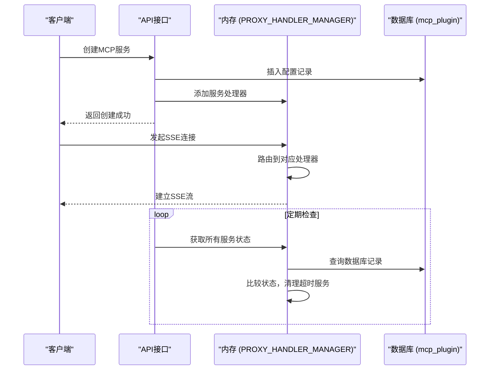
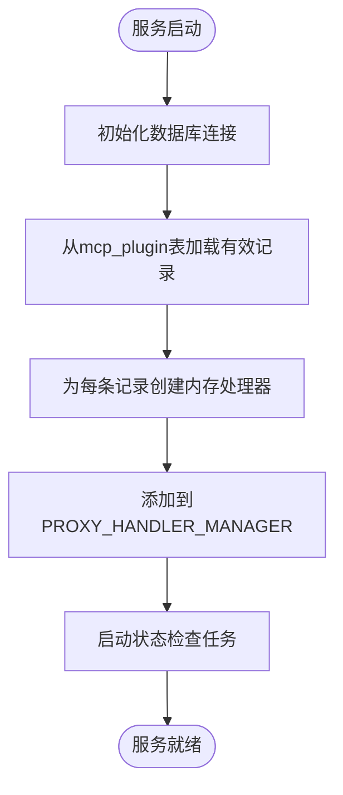
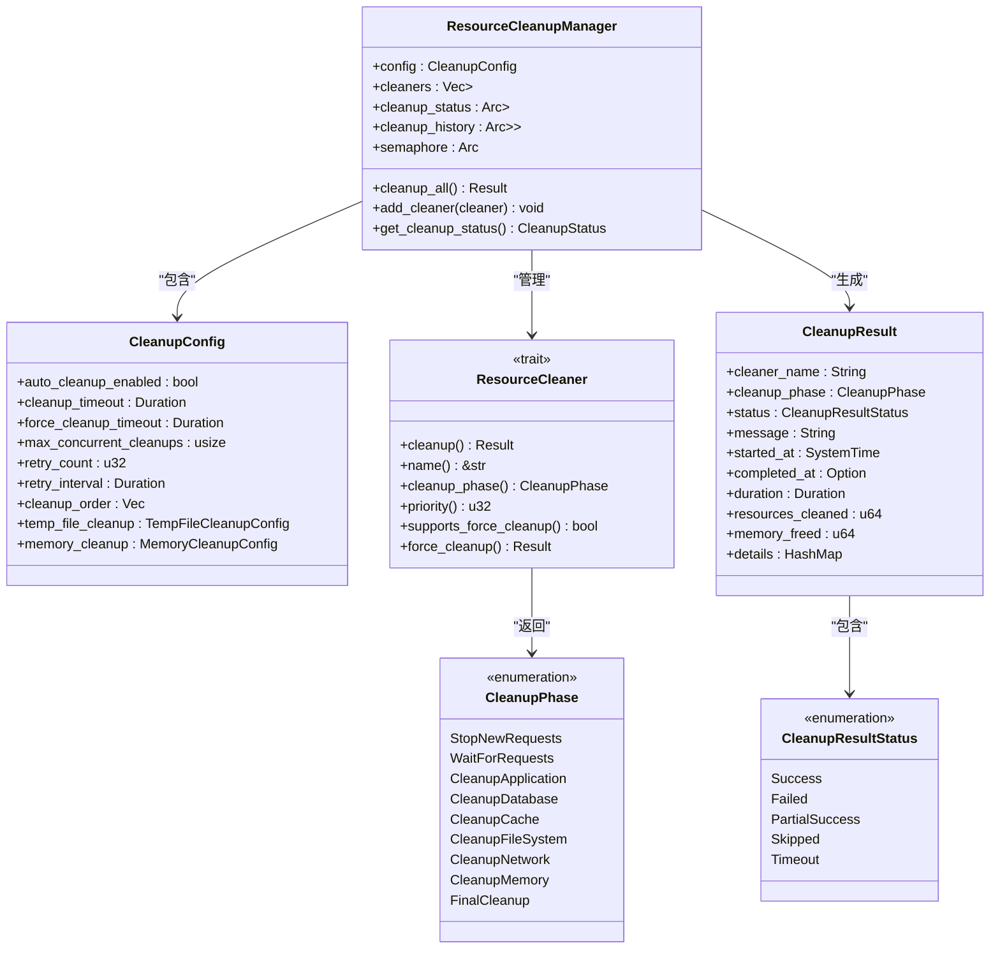
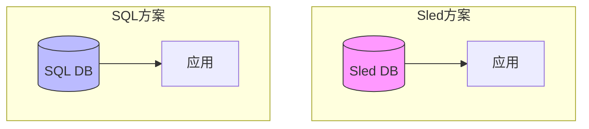

# 持久化数据模式

<cite>
**本文档引用的文件**   
- [creat_table.sql](file://mcp-proxy/creat_table.sql)
- [resource_cleanup.rs](file://document-parser/src/production/resource_cleanup.rs)
- [config.rs](file://document-parser/src/config.rs)
- [app_state.rs](file://document-parser/src/app_state.rs)
- [storage_service.rs](file://document-parser/src/services/storage_service.rs)
</cite>

## 目录
1. [引言](#引言)
2. [数据库表结构设计](#数据库表结构设计)
3. [内存与持久化协同机制](#内存与持久化协同机制)
4. [数据一致性与状态恢复](#数据一致性与状态恢复)
5. [数据保留与清理策略](#数据保留与清理策略)
6. [Sled与SQL方案对比](#sled与sql方案对比)
7. [结论](#结论)

## 引言
本文档详细说明基于`creat_table.sql`文件的数据库表结构设计，阐述其与内存中DashMap数据结构（如PROXY_HANDLER_MANAGER）的协同工作机制。文档涵盖数据持久化与内存状态的一致性保证策略、服务重启时的状态恢复流程、数据保留周期、清理任务触发条件及其对存储性能的影响，并对比Sled嵌入式数据库与SQL方案的适用场景与迁移路径。

## 数据库表结构设计

### MCP插件服务表 (mcp_plugin)
`mcp_plugin`表用于存储MCP插件服务的配置和状态信息，其结构设计如下：

```mermaid
erDiagram
mcp_plugin {
bigint id PK
varchar(128) name NOT NULL
varchar(512) command NOT NULL
JSON args NULL
JSON envs NULL
JSON mounts NULL
int port NULL
varchar(512) external_url NULL
varchar(128) container_name NULL
varchar(128) sse_path NULL
JSON config_json NULL
tinyint status DEFAULT 2 NOT NULL
tinyint enabled DEFAULT 1 NOT NULL
datetime created DEFAULT CURRENT_TIMESTAMP NOT NULL
bigint creator_id NULL
varchar(64) creator_name NULL
datetime modified DEFAULT CURRENT_TIMESTAMP ON UPDATE CURRENT_TIMESTAMP NULL
bigint modified_id NULL
varchar(64) modified_name NULL
tinyint yn DEFAULT 1 NULL
}
```

**表字段说明**
- **主键**: `id` 字段为自增主键，确保每条记录的唯一性。
- **核心配置**: `name`, `command`, `args`, `envs`, `mounts` 字段存储插件的基本配置信息，其中`args`, `envs`, `mounts`使用JSON格式存储复杂结构。
- **运行状态**: `port`, `external_url`, `container_name`, `sse_path` 字段记录插件的运行时信息。
- **状态与启用**: `status` 字段表示插件的启动状态（1:运行中, 2:已停止, 3:错误），`enabled` 字段表示插件是否启用（1:启用, 0:禁用）。
- **公共字段**: 包含创建和修改时间、操作人信息以及逻辑删除标记`yn`。

**索引与约束**
- 主键约束：`id` 字段为主键，保证唯一性。
- 非空约束：`name`, `command`, `created` 字段为非空。
- 默认值约束：`status`, `enabled`, `created`, `modified`, `yn` 字段设有默认值。
- 逻辑删除：`yn` 字段用于实现软删除，值为-1时表示记录无效。

**Diagram sources**
- [creat_table.sql](file://mcp-proxy/creat_table.sql#L1-L22)

**Section sources**
- [creat_table.sql](file://mcp-proxy/creat_table.sql#L1-L22)

## 内存与持久化协同机制

系统采用内存与数据库协同工作的模式，以平衡性能与数据可靠性。

### 内存数据结构 (PROXY_HANDLER_MANAGER)
在内存中，系统使用类似`DashMap`的并发哈希映射结构（如`PROXY_HANDLER_MANAGER`）来管理MCP服务的运行时状态。该结构存储了服务的路由、取消令牌（cancellation_token）和最后访问时间等信息，提供O(1)的快速访问性能。

### 协同工作流程
1. **服务启动**: 当通过API创建新的MCP服务时，首先将配置信息持久化到`mcp_plugin`表中，然后在内存的`PROXY_HANDLER_MANAGER`中创建对应的处理器。
2. **状态同步**: 内存中的状态变更（如服务状态从"STOPPED"变为"RUNNING"）会通过异步任务同步回数据库，确保持久化存储的最终一致性。
3. **服务访问**: 所有对MCP服务的请求（如SSE连接、消息发送）都直接通过内存中的`PROXY_HANDLER_MANAGER`进行路由，以获得最佳性能。
4. **状态检查**: 定期任务（如`schedule_check_mcp_live`）会遍历内存中的服务状态，并与数据库记录进行核对，清理超时或异常的服务。



**Diagram sources**
- [creat_table.sql](file://mcp-proxy/creat_table.sql#L1-L22)
- [schedule_check_mcp_live.rs](file://mcp-proxy/src/server/task/schedule_check_mcp_live.rs#L0-L31)

**Section sources**
- [creat_table.sql](file://mcp-proxy/creat_table.sql#L1-L22)
- [schedule_check_mcp_live.rs](file://mcp-proxy/src/server/task/schedule_check_mcp_live.rs#L0-L31)

## 数据一致性与状态恢复

### 一致性保证策略
系统采用“先写内存，后写数据库”的策略来保证数据一致性。当服务状态发生变更时：
1. 首先更新内存中的状态。
2. 然后通过异步任务将变更写入数据库。
3. 如果数据库写入失败，系统会记录错误日志并重试，但不会阻塞内存状态的更新，以保证服务的可用性。

这种策略牺牲了强一致性，但保证了高可用性和最终一致性。

### 服务重启状态恢复
在服务重启时，系统通过以下流程恢复内存状态：

1. **初始化数据库连接**: 启动时，系统首先根据配置文件中的`storage.sled.path`或数据库连接信息初始化存储层。
2. **加载持久化数据**: 从`mcp_plugin`表中查询所有`enabled=1`且`yn=1`的有效记录。
3. **重建内存状态**: 遍历查询结果，为每条记录调用`mcp_start_task`函数，重新在内存中创建服务处理器，并将其添加到`PROXY_HANDLER_MANAGER`中。
4. **状态校验**: 启动完成后，系统会定期检查内存状态与数据库的一致性，确保没有遗漏或错误。



**Diagram sources**
- [creat_table.sql](file://mcp-proxy/creat_table.sql#L1-L22)
- [config.rs](file://document-parser/src/config.rs#L660-L708)
- [app_state.rs](file://document-parser/src/app_state.rs#L121-L163)

**Section sources**
- [creat_table.sql](file://mcp-proxy/creat_table.sql#L1-L22)
- [config.rs](file://document-parser/src/config.rs#L660-L708)
- [app_state.rs](file://document-parser/src/app_state.rs#L121-L163)

## 数据保留与清理策略

### 数据保留周期
- **MCP插件配置**: 除非被逻辑删除（`yn=-1`），否则永久保留。
- **临时文件**: 根据`resource_cleanup.rs`中的`file_retention_duration`配置，默认保留1小时。
- **任务日志**: 根据`resource_cleanup.rs`中的`retention_days`配置，默认保留30天。

### 清理任务 (resource_cleanup.rs)
`resource_cleanup.rs`模块实现了应用关闭时的资源清理功能。

#### 触发条件
- **应用正常关闭**: 收到SIGTERM或SIGINT信号时。
- **应用异常关闭**: 发生未处理的panic时。
- **定期维护**: 可通过管理接口手动触发。

#### 清理阶段
清理过程分为多个阶段，按顺序执行：
1. `StopNewRequests`: 停止接收新请求。
2. `WaitForRequests`: 等待现有请求完成。
3. `CleanupApplication`: 清理应用资源。
4. `CleanupDatabase`: 关闭数据库连接池。
5. `CleanupCache`: 清理内存缓存。
6. `CleanupFileSystem`: 清理临时文件。
7. `CleanupNetwork`: 关闭网络连接。
8. `CleanupMemory`: 强制垃圾回收。
9. `FinalCleanup`: 最终清理。

#### 对存储性能的影响
- **正面影响**: 定期清理临时文件和过期日志可以释放磁盘空间，提高I/O性能。
- **负面影响**: 大规模清理任务会占用CPU和I/O资源，可能影响服务性能。系统通过`max_concurrent_cleanups`限制并发数来缓解此问题。



**Diagram sources**
- [resource_cleanup.rs](file://document-parser/src/production/resource_cleanup.rs#L0-L785)

**Section sources**
- [resource_cleanup.rs](file://document-parser/src/production/resource_cleanup.rs#L0-L785)

## Sled与SQL方案对比

### Sled嵌入式数据库
Sled是一个高性能的嵌入式键值存储数据库，适用于以下场景：
- **优点**:
  - 零配置，易于部署。
  - 高性能，低延迟。
  - ACID事务支持。
  - 适合存储结构化或半结构化数据。
- **缺点**:
  - 不支持复杂的SQL查询。
  - 缺乏成熟的管理工具。
  - 在大规模数据集上的查询性能可能不如关系型数据库。
- **适用场景**: 存储应用内部状态、缓存、会话数据等。

### SQL方案
SQL方案（如MySQL、PostgreSQL）是成熟的关系型数据库解决方案。
- **优点**:
  - 支持复杂的SQL查询和JOIN操作。
  - 成熟的管理工具和监控系统。
  - 强大的数据一致性和完整性约束。
  - 易于进行数据分析和报表生成。
- **缺点**:
  - 需要独立的数据库服务器，部署复杂。
  - 性能受网络延迟影响。
  - 对于简单的键值操作，性能可能不如嵌入式数据库。
- **适用场景**: 存储核心业务数据、需要复杂查询的场景、多应用共享数据。

### 迁移路径
从Sled迁移到SQL方案的路径如下：
1. **评估与规划**: 评估数据量、查询模式和性能要求，选择合适的SQL数据库。
2. **模式设计**: 将Sled中的键值结构映射为SQL表结构，如`storage_service.rs`中的`TASK_PREFIX`可映射为`tasks`表。
3. **双写阶段**: 修改应用代码，同时向Sled和SQL数据库写入数据，确保数据一致性。
4. **数据迁移**: 使用脚本将Sled中的历史数据批量导入SQL数据库。
5. **读取切换**: 将读取操作逐步切换到SQL数据库。
6. **停用Sled**: 确认所有数据和功能正常后，移除对Sled的依赖。



**Diagram sources**
- [config.rs](file://document-parser/src/config.rs#L660-L708)
- [app_state.rs](file://document-parser/src/app_state.rs#L121-L163)
- [storage_service.rs](file://document-parser/src/services/storage_service.rs#L0-L51)

**Section sources**
- [config.rs](file://document-parser/src/config.rs#L660-L708)
- [app_state.rs](file://document-parser/src/app_state.rs#L121-L163)
- [storage_service.rs](file://document-parser/src/services/storage_service.rs#L0-L51)

## 结论
本文档详细阐述了系统的持久化数据模式。`mcp_plugin`表的设计合理，涵盖了插件服务所需的所有配置和状态信息。系统通过内存与数据库的协同工作，在保证高性能的同时实现了数据的持久化。`resource_cleanup.rs`模块提供了完善的资源清理机制，确保了应用的优雅关闭。在存储方案的选择上，Sled适用于高性能、低延迟的内部状态存储，而SQL方案更适合需要复杂查询和强一致性的核心业务数据。根据具体需求选择合适的方案，或采用混合模式，可以最大化系统的性能和可靠性。