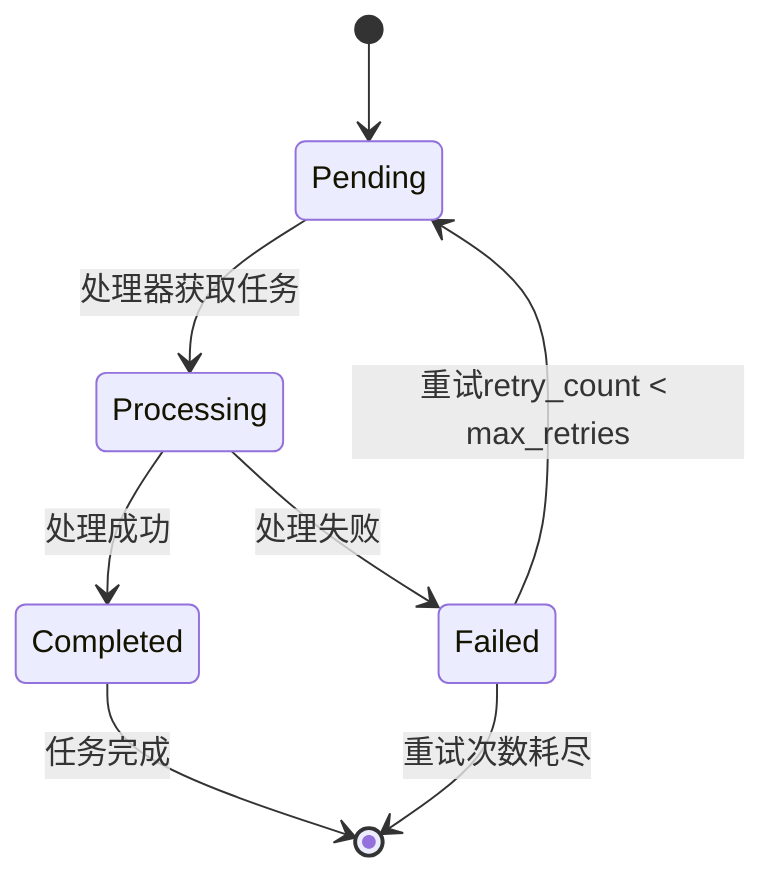

# 数据模型

<cite>
**本文档中引用的文件**  
- [mcp_config.rs](file://mcp-proxy/src/model/mcp_config.rs)
- [mcp_check_status_model.rs](file://mcp-proxy/src/model/mcp_check_status_model.rs)
- [stepped_task.rs](file://voice-cli/src/models/stepped_task.rs)
- [document_task.rs](file://document-parser/src/models/document_task.rs)
- [creat_table.sql](file://mcp-proxy/creat_table.sql)
</cite>

## 目录
1. [引言](#引言)
2. [核心实体概览](#核心实体概览)
3. [McpServiceStatus 与服务健康检查](#mcpservicestatus-与服务健康检查)
4. [McpConfig 配置模型](#mcpconfig-配置模型)
5. [DocumentTask 任务生命周期](#documenttask-任务生命周期)
6. [SteppedTask 进度追踪机制](#steppedtask-进度追踪机制)
7. [数据库持久化设计](#数据库持久化设计)
8. [数据模型序列化示例](#数据模型序列化示例)

## 引言
本文档旨在全面描述 `mcp-proxy` 系统中的核心数据模型。重点解析服务状态、配置、任务生命周期及进度追踪等关键实体的结构与语义，并结合数据库设计说明其持久化方案。

## 核心实体概览
系统围绕服务配置、任务处理和状态管理构建了多个核心数据模型：
- `McpConfig`：定义 MCP 服务的配置参数。
- `CheckMcpStatusResponseParams`：表示 MCP 服务的健康检查响应。
- `DocumentTask`：文档解析任务的核心数据结构，包含状态、进度和元数据。
- `AsyncTranscriptionTask` 及其演进类型：语音转录任务的多阶段数据模型。
- 数据库表 `mcp_plugin`：用于持久化 MCP 插件的配置与状态。

这些模型共同支撑了系统的配置管理、任务调度和状态监控功能。

## McpServiceStatus 与服务健康检查

### 状态字段语义
在服务健康检查机制中，`CheckMcpStatusResponseParams` 结构体是核心响应模型，其字段语义如下：
- **ready**：布尔值，表示服务是否处于 `READY` 状态。当 `status` 为 `Ready` 时，此值为 `true`。
- **status**：枚举类型 `McpStatusResponseEnum`，表示服务的当前状态，包括 `Ready`（就绪）、`Pending`（处理中）和 `Error`（错误）。
- **message**：可选字符串，用于携带状态的详细信息或错误消息。当 `status` 为 `Error` 时，错误信息会自动填充至此字段。

### 在健康检查中的作用
该模型是 `/check_mcp_is_status` 健康检查端点的直接输出。系统通过此模型向调用者清晰地传达 MCP 服务的实时运行状况。`ready` 字段为上层系统（如负载均衡器或任务调度器）提供了快速判断服务可用性的依据。`status` 和 `message` 则提供了更细粒度的状态信息，便于运维和调试。

**Section sources**
- [mcp_check_status_model.rs](file://mcp-proxy/src/model/mcp_check_status_model.rs#L20-L99)

## McpConfig 配置模型

### 配置规则
`McpConfig` 结构体定义了 MCP 服务实例的配置，其关键字段包括：
- **mcp_id**：服务的唯一标识符。
- **mcp_json_config**：可选的 JSON 格式配置字符串，用于传递服务特定的参数。
- **mcp_type**：服务类型，枚举值为 `Persistent`（持续运行）或 `OneShot`（一次性任务），默认为 `OneShot`。
- **mcp_protocol**：通信协议，目前默认为 `Sse`（Server-Sent Events）。

### 注入机制
`McpConfig` 实例主要通过 `from_json` 方法从 JSON 字符串反序列化创建。此方法利用 `serde` 库将外部传入的 JSON 配置数据（如 API 请求体）转换为内部的 `McpConfig` 对象，实现了配置的动态注入。该对象随后被用于启动或管理对应的 MCP 服务进程。

**Section sources**
- [mcp_config.rs](file://mcp-proxy/src/model/mcp_config.rs#L1-L72)

## DocumentTask 任务生命周期

### 生命周期状态
`DocumentTask` 模型通过 `TaskStatus` 枚举（在 `document_task.rs` 中定义）管理其生命周期，状态流转如下：
- **Pending**：任务已创建并加入队列，等待处理。这是任务的初始状态。
- **Processing**：任务正在被处理，`stage` 字段会记录当前所处的处理阶段（如格式检测、解析等）。
- **Completed**：任务已成功完成，`structured_document` 字段将包含解析结果。
- **Failed**：任务处理失败，`error_message` 字段会记录失败原因，`retry_count` 会递增。

### 任务队列流转逻辑
任务在队列中的流转由 `TaskService` 和 `TaskQueueService` 协同管理。当一个 `DocumentTask` 被创建时，其状态为 `Pending`。任务处理器从队列中取出 `Pending` 状态的任务，将其状态更新为 `Processing` 并开始执行。执行成功则更新为 `Completed`，失败则更新为 `Failed`。系统支持任务重试，当 `retry_count` 未达到 `max_retries` 且任务未过期时，可以调用 `reset` 方法将 `Failed` 任务重置回 `Pending` 状态，重新进入队列。



**Diagram sources**
- [document_task.rs](file://document-parser/src/models/document_task.rs#L1-L799)

**Section sources**
- [document_task.rs](file://document-parser/src/models/document_task.rs#L1-L799)

## SteppedTask 进度追踪机制

### 进度追踪字段
`voice-cli` 模块中的 `AsyncTranscriptionTask` 及其后续状态模型（如 `AudioProcessedTask`）实现了一个多阶段任务的进度追踪机制。其核心字段为：
- **current_step**：此概念由 `ProcessingStage` 枚举和 `ProgressDetails` 结构体共同体现。`ProcessingStage` 定义了任务的各个阶段（如 `AudioFormatDetection`, `WhisperTranscription`）。
- **total_steps**：虽然没有直接的 `total_steps` 字段，但任务的总阶段数是固定的，由 `ProcessingStage` 的变体数量隐式定义。
- **progress_details**：`ProgressDetails` 结构体包含 `current_stage`（当前阶段）、`stage_progress`（当前阶段的进度，0.0-1.0）和 `estimated_remaining`（预计剩余时间），提供了细粒度的进度信息。

### 支持进度追踪
该模型通过一系列不可变的、代表任务在不同阶段状态的结构体来支持进度追踪。当任务完成一个阶段（如音频格式处理），系统会创建一个新的 `AudioProcessedTask` 实例，它继承了原始任务的大部分信息，并添加了该阶段的处理结果。这种设计使得任务的每个状态都是清晰且可序列化的，便于在 API 响应中返回当前进度，也方便了错误排查和状态回溯。

**Section sources**
- [stepped_task.rs](file://voice-cli/src/models/stepped_task.rs#L1-L416)

## 数据库持久化设计

### Sled/SQL 持久化
根据 `creat_table.sql` 文件，系统使用 SQL 数据库（如 MySQL）来持久化 MCP 服务的配置和状态，而非 Sled。核心表为 `mcp_plugin`。

### 表结构与设计
```sql
CREATE TABLE IF NOT EXISTS mcp_plugin (
    id              bigint          NOT NULL AUTO_INCREMENT PRIMARY KEY COMMENT '主键',
    name            varchar(128)    NOT NULL COMMENT '插件名称',
    command         varchar(512)    NOT NULL COMMENT '启动命令',
    args            JSON            NULL COMMENT '启动参数(JSON格式)',
    envs            JSON            NULL COMMENT '环境变量(JSON格式)',
    ...
    status          tinyint         DEFAULT 2 NOT NULL COMMENT 'MCP启动状态:1:RUNNING(运行中),2:STOPPED(已停止),3:ERROR(错误)',
    enabled         tinyint         DEFAULT 1 NOT NULL COMMENT '是否启用:1(启用),0(禁用)',
    created         datetime        DEFAULT CURRENT_TIMESTAMP NOT NULL COMMENT '创建时间',
    modified        datetime        DEFAULT CURRENT_TIMESTAMP NULL ON UPDATE CURRENT_TIMESTAMP COMMENT '更新时间',
    yn              tinyint         DEFAULT 1               NULL COMMENT '逻辑标记,1:有效;-1:无效'
) DEFAULT CHARSET=utf8mb4 COMMENT='MCP插件服务表';
```

### 设计要点
- **主键**：`id` 字段为自增的 `bigint`，作为主键。
- **索引**：主键 `id` 自动创建唯一索引。`name` 字段可能也需要索引以支持快速查找。`status` 和 `enabled` 字段是常见的查询条件，为它们创建索引可以优化查询性能。
- **数据保留策略**：通过 `yn` 字段实现逻辑删除（软删除），标记为 `-1` 的记录被视为无效，但仍保留在数据库中。这允许数据恢复和审计。真正的数据清理（硬删除）可能需要一个后台任务定期执行，但当前设计未明确说明。

**Section sources**
- [creat_table.sql](file://mcp-proxy/creat_table.sql#L1-L23)

## 数据模型序列化示例

### McpConfig 序列化示例
```json
{
  "mcpId": "my-python-mcp",
  "mcpJsonConfig": "{\"model\": \"gpt-4\"}",
  "mcpType": "persistent",
  "mcpProtocol": "sse"
}
```

### CheckMcpStatusResponseParams 序列化示例
```json
{
  "ready": true,
  "status": "Ready",
  "message": null
}
```

### DocumentTask 序列化示例 (简化)
```json
{
  "id": "550e8400-e29b-41d4-a716-446655440000",
  "status": "Processing",
  "source_type": "Upload",
  "original_filename": "report.pdf",
  "document_format": "PDF",
  "progress": 75,
  "created_at": "2023-10-01T12:00:00Z",
  "updated_at": "2023-10-01T12:05:00Z",
  "expires_at": "2023-10-02T12:00:00Z"
}
```

### AsyncTranscriptionTask 序列化示例 (简化)
```json
{
  "task_id": "transcribe-001",
  "audio_file_path": "/tmp/audio.mp3",
  "original_filename": "meeting.mp3",
  "model": "whisper-large",
  "created_at": "2023-10-01T12:00:00Z",
  "priority": "High"
}
```