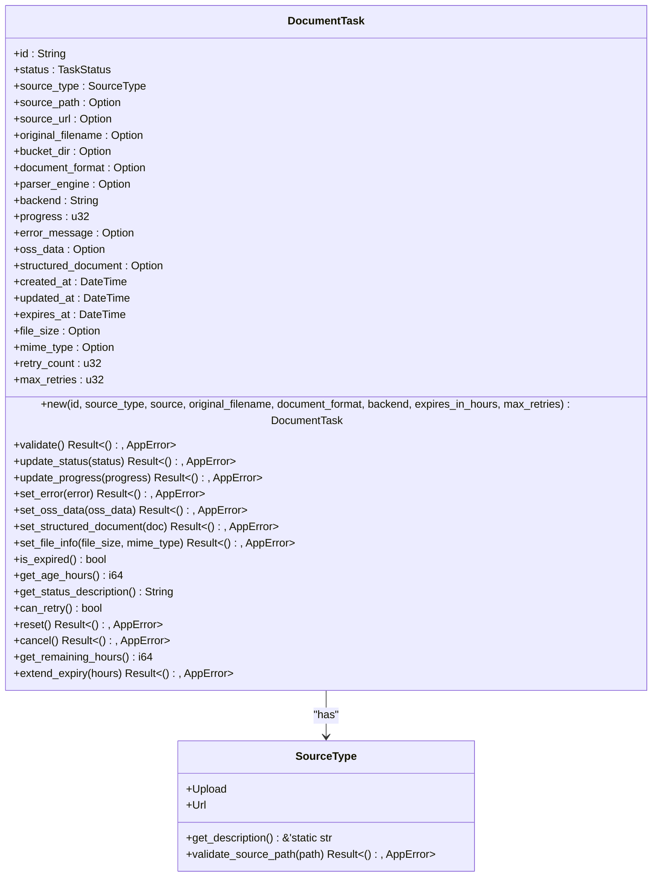
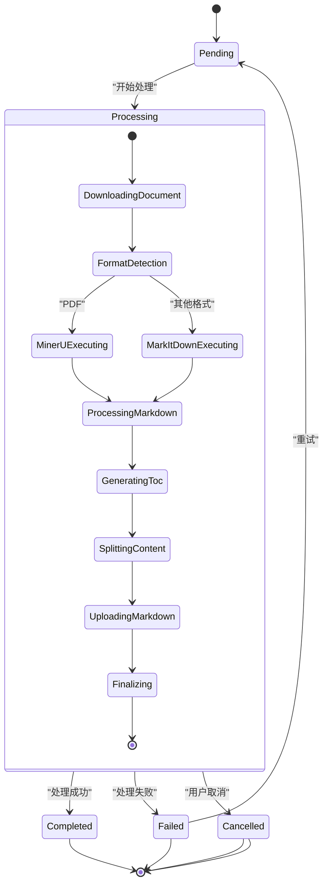
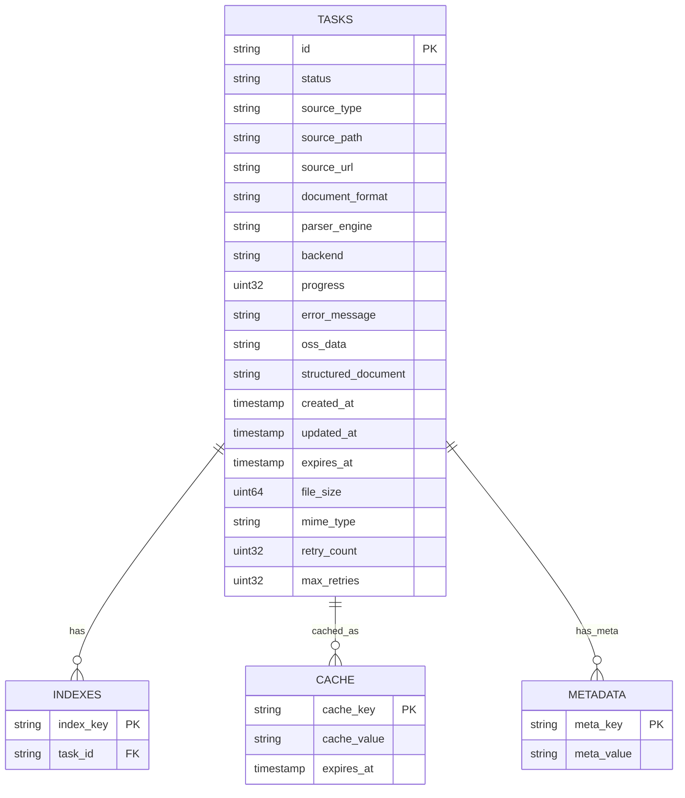
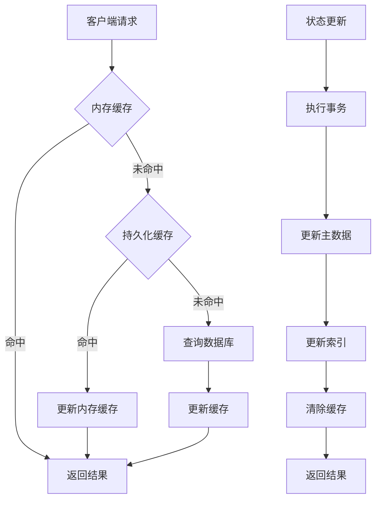
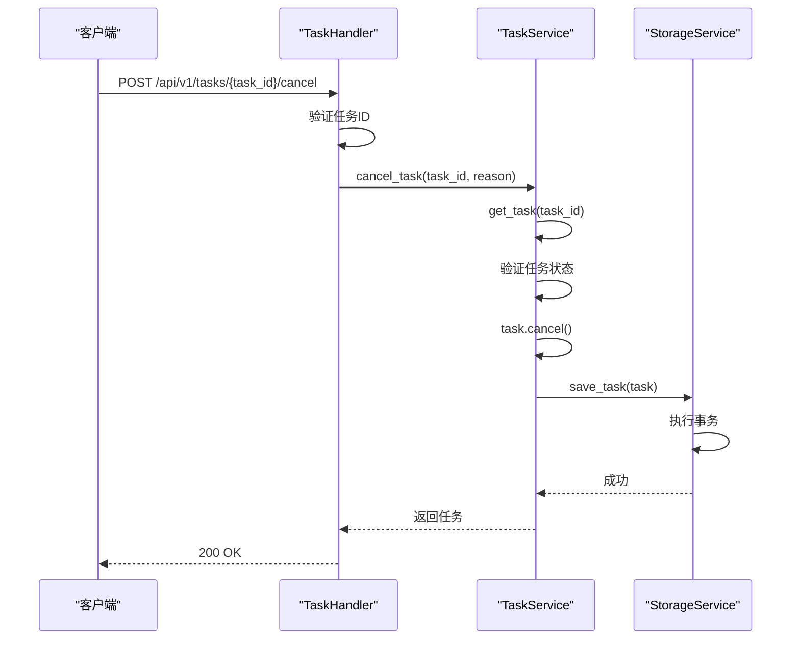
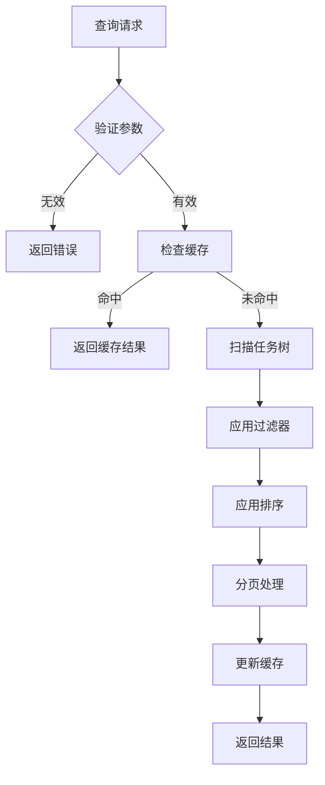

# 文档任务模型

<cite>
**本文档中引用的文件**  
- [document_task.rs](file://document-parser/src/models/document_task.rs)
- [task_status.rs](file://document-parser/src/models/task_status.rs)
- [storage_service.rs](file://document-parser/src/services/storage_service.rs)
- [task_handler.rs](file://document-parser/src/handlers/task_handler.rs)
- [task_service.rs](file://document-parser/src/services/task_service.rs)
</cite>

## 目录
1. [引言](#引言)
2. [DocumentTask实体结构](#documenttask实体结构)
3. [任务状态机与状态流转](#任务状态机与状态流转)
4. [任务元数据持久化策略](#任务元数据持久化策略)
5. [任务状态跨进程共享机制](#任务状态跨进程共享机制)
6. [状态变更触发与通知机制](#状态变更触发与通知机制)
7. [任务查询接口与性能优化](#任务查询接口与性能优化)
8. [结论](#结论)

## 引言

文档任务模型是文档解析服务的核心组件，负责管理文档处理任务的全生命周期。该模型通过`DocumentTask`实体定义任务的结构，利用`TaskStatus`枚举实现状态机控制，并通过`storage_service`和`task_service`实现任务状态的持久化与共享。本文档详细阐述了任务模型的各个组成部分及其交互机制，为开发者提供全面的技术参考。

## DocumentTask实体结构

`DocumentTask`实体定义了文档处理任务的核心属性，包括任务标识、来源信息、处理状态、时间戳等。该实体通过`derive_builder`宏生成构建器，确保对象创建的灵活性和安全性。

**图示来源**  
- [document_task.rs](file://document-parser/src/models/document_task.rs#L1-L799)

**本节来源**  
- [document_task.rs](file://document-parser/src/models/document_task.rs#L1-L799)

## 任务状态机与状态流转

任务状态机由`TaskStatus`枚举实现，定义了任务的五种核心状态：Pending（待处理）、Processing（处理中）、Completed（已完成）、Failed（失败）和Cancelled（已取消）。状态机通过`ProcessingStage`枚举细化处理阶段，确保任务流转的精确控制。

**图示来源**  
- [task_status.rs](file://document-parser/src/models/task_status.rs#L1-L799)

**本节来源**  
- [task_status.rs](file://document-parser/src/models/task_status.rs#L1-L799)

## 任务元数据持久化策略

任务元数据通过`sled`数据库实现持久化存储，采用多树结构组织数据。`tasks_tree`存储任务主数据，`index_tree`维护索引，`cache_tree`管理缓存，`metadata_tree`保存元数据。持久化策略确保数据的高可用性和一致性。

**图示来源**  
- [storage_service.rs](file://document-parser/src/services/storage_service.rs#L1-L799)

**本节来源**  
- [storage_service.rs](file://document-parser/src/services/storage_service.rs#L1-L799)

## 任务状态跨进程共享机制

任务状态通过`StorageService`实现跨进程共享，利用`Arc<Db>`和`Tree`结构确保多线程安全访问。内存缓存与持久化缓存结合，提升访问性能。事务机制保证状态更新的原子性，避免数据不一致。

**图示来源**  
- [storage_service.rs](file://document-parser/src/services/storage_service.rs#L1-L799)

**本节来源**  
- [storage_service.rs](file://document-parser/src/services/storage_service.rs#L1-L799)

## 状态变更触发与通知机制

状态变更通过`task_handler.rs`中的API实现触发，结合`task_service`进行业务逻辑处理。状态变更时，系统自动更新时间戳、验证数据完整性，并通过响应机制通知客户端。错误处理机制确保异常情况下的优雅降级。

**图示来源**  
- [task_handler.rs](file://document-parser/src/handlers/task_handler.rs#L1-L799)
- [task_service.rs](file://document-parser/src/services/task_service.rs#L1-L632)

**本节来源**  
- [task_handler.rs](file://document-parser/src/handlers/task_handler.rs#L1-L799)
- [task_service.rs](file://document-parser/src/services/task_service.rs#L1-L632)

## 任务查询接口与性能优化

任务查询接口支持多维度过滤，包括状态、格式、时间范围等。性能优化策略包括分页查询、结果缓存、索引优化和批量操作。查询接口设计兼顾灵活性与性能，满足不同场景下的需求。

**图示来源**  
- [task_handler.rs](file://document-parser/src/handlers/task_handler.rs#L1-L799)
- [storage_service.rs](file://document-parser/src/services/storage_service.rs#L1-L799)

**本节来源**  
- [task_handler.rs](file://document-parser/src/handlers/task_handler.rs#L1-L799)
- [storage_service.rs](file://document-parser/src/services/storage_service.rs#L1-L799)

## 结论

文档任务模型通过`DocumentTask`实体、`TaskStatus`状态机、`StorageService`持久化和`TaskHandler`API的协同工作，实现了文档处理任务的全生命周期管理。该模型具备高可靠性、高性能和良好的可扩展性，为文档解析服务提供了坚实的基础。未来可进一步优化状态机的复杂性，增强查询接口的灵活性，并完善监控和告警机制。