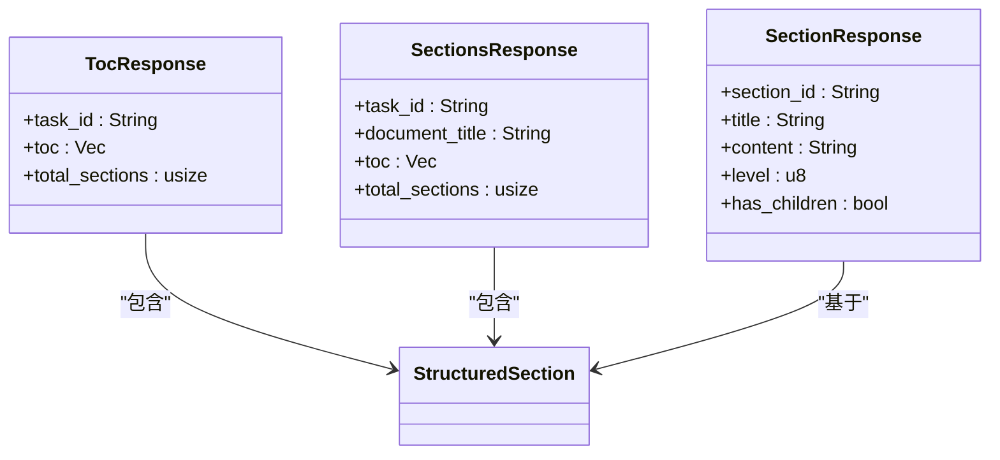
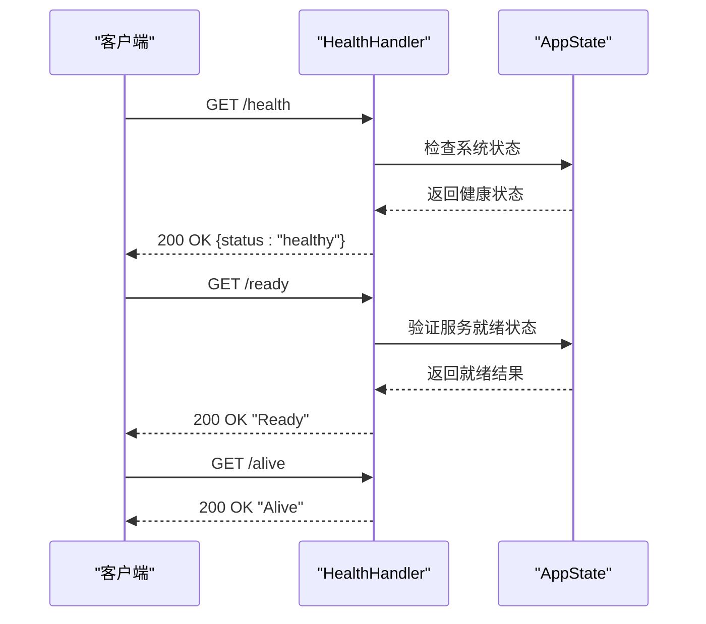
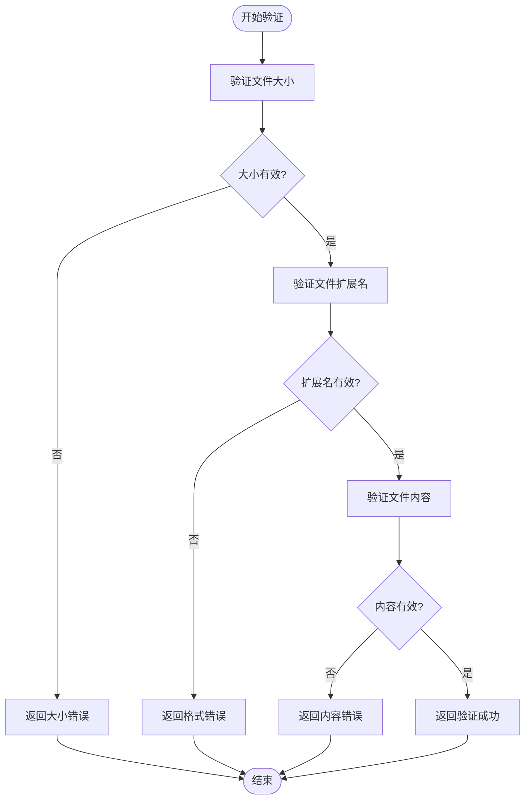

# API端点

<cite>
**本文档中引用的文件**  
- [document_handler.rs](file://document-parser/src/handlers/document_handler.rs)
- [toc_handler.rs](file://document-parser/src/handlers/toc_handler.rs)
- [health_handler.rs](file://document-parser/src/handlers/health_handler.rs)
- [validation.rs](file://document-parser/src/handlers/validation.rs)
- [http_result.rs](file://document-parser/src/models/http_result.rs)
- [routes.rs](file://document-parser/src/routes.rs)
</cite>

## 目录
1. [文档解析API](#文档解析api)
2. [目录生成API](#目录生成api)
3. [健康检查API](#健康检查api)
4. [请求验证机制](#请求验证机制)
5. [统一响应格式](#统一响应格式)
6. [API调用示例](#api调用示例)

## 文档解析API

`/document/parse`端点用于上传并解析文档，支持多种文件格式。该端点通过POST请求接收multipart/form-data格式的数据。

### 请求格式要求
- **请求方法**: POST
- **Content-Type**: multipart/form-data
- **请求体**: 包含文件字段的multipart表单数据

### 支持的文件类型
系统支持以下文件格式：
- PDF (.pdf)
- Word文档 (.docx, .doc)
- 文本文件 (.txt, .md, .html, .htm)
- Excel表格 (.xlsx, .xls, .csv)
- PowerPoint演示文稿 (.pptx, .ppt)
- 图像文件 (.jpg, .jpeg, .png, .gif, .bmp, .tiff)
- 音频文件 (.mp3, .wav, .m4a, .aac)

### 可选参数
- `enable_toc`: 布尔值，是否启用目录生成，默认为true
- `max_toc_depth`: 整数，目录最大深度，范围1-10，默认为6
- `bucket_dir`: 字符串，指定上传到OSS时的子目录路径

这些参数通过查询字符串传递，用于控制文档处理行为。`enable_toc`参数决定是否分析文档结构并生成章节树，`max_toc_depth`限制目录的层级深度以优化性能。

**Section sources**
- [document_handler.rs](file://document-parser/src/handlers/document_handler.rs#L0-L799)
- [routes.rs](file://document-parser/src/routes.rs#L43-L70)

## 目录生成API

TOCHandler实现了文档目录生成功能，能够从解析后的文档中提取结构化的章节树。

### 实现机制
TOCHandler通过分析文档中的标题层级来构建目录结构。系统使用递归算法处理嵌套的章节关系，确保生成的目录树准确反映文档的逻辑结构。



**Diagram sources**
- [toc_handler.rs](file://document-parser/src/handlers/toc_handler.rs#L0-L235)

### API端点
- `GET /api/v1/tasks/{task_id}/toc`: 获取指定任务的文档目录
- `GET /api/v1/tasks/{task_id}/sections/{section_id}`: 获取特定章节的内容
- `GET /api/v1/tasks/{task_id}/sections`: 获取所有章节的完整信息

返回的章节树结构包含章节ID、标题、层级、内容和子章节信息，支持无限嵌套，便于前端实现可展开的目录导航。

**Section sources**
- [toc_handler.rs](file://document-parser/src/handlers/toc_handler.rs#L0-L235)

## 健康检查API

HealthHandler提供健康检查接口，用于监控服务状态，特别适用于Kubernetes等容器编排系统的探针配置。

### 接口功能
- `/health`: 基础健康检查，验证服务基本功能
- `/ready`: 就绪检查，确认服务已准备好接收流量
- `/alive`: 存活检查，确认服务进程正在运行



**Diagram sources**
- [health_handler.rs](file://document-parser/src/handlers/health_handler.rs#L0-L37)

在Kubernetes环境中，这些接口可配置为livenessProbe和readinessProbe，实现自动化的服务健康监控和流量管理。

**Section sources**
- [health_handler.rs](file://document-parser/src/handlers/health_handler.rs#L0-L37)

## 请求验证机制

Validation模块负责对上传文件进行多层次的合规性校验，确保系统安全和数据完整性。

### 校验内容
- **文件大小**: 验证文件是否在允许的大小范围内
- **文件类型**: 检查文件扩展名和内容魔数是否匹配
- **内容合规性**: 确保文件内容符合预期格式



**Diagram sources**
- [validation.rs](file://document-parser/src/handlers/validation.rs#L0-L302)

系统返回标准化的错误响应，包含错误代码和详细信息，便于客户端进行错误处理。

**Section sources**
- [validation.rs](file://document-parser/src/handlers/validation.rs#L0-L302)

## 统一响应格式

基于http_result.rs定义的统一响应格式，确保所有API返回一致的JSON结构。

### 成功响应结构
```json
{
  "code": "0000",
  "message": "操作成功",
  "data": {
    // 具体响应数据
  },
  "success": true
}
```

### 错误响应结构
```json
{
  "code": "错误代码",
  "message": "错误描述",
  "data": null,
  "success": false
}
```

常见错误代码包括：
- `E001`: 系统错误
- `E002`: 格式不支持
- `E003`: 任务不存在
- `E004`: 处理失败

这种统一的响应格式简化了客户端的错误处理逻辑，提高了API的可用性。

**Section sources**
- [http_result.rs](file://document-parser/src/models/http_result.rs#L0-L72)

## API调用示例

### 使用curl调用文档解析API
```bash
curl -X POST http://localhost:8080/api/v1/documents/upload \
  -H "Content-Type: multipart/form-data" \
  -F "file=@/path/to/document.pdf" \
  -F "enable_toc=true" \
  -F "max_toc_depth=3"
```

### 使用Python requests库调用
```python
import requests

url = "http://localhost:8080/api/v1/documents/upload"
files = {'file': open('/path/to/document.pdf', 'rb')}
data = {
    'enable_toc': 'true',
    'max_toc_depth': '3'
}

response = requests.post(url, files=files, data=data)
print(response.json())
```

### 获取文档目录
```python
import requests

task_id = "your-task-id"
url = f"http://localhost:8080/api/v1/tasks/{task_id}/toc"

response = requests.get(url)
if response.status_code == 200:
    toc_data = response.json()
    print(f"目录包含{toc_data['data']['total_sections']}个章节")
else:
    print(f"获取目录失败: {response.json()}")
```

这些示例展示了如何使用不同工具调用API，实际使用时需要根据具体的服务地址和端口进行调整。

**Section sources**
- [document_handler.rs](file://document-parser/src/handlers/document_handler.rs#L0-L799)
- [toc_handler.rs](file://document-parser/src/handlers/toc_handler.rs#L0-L235)
- [health_handler.rs](file://document-parser/src/handlers/health_handler.rs#L0-L37)