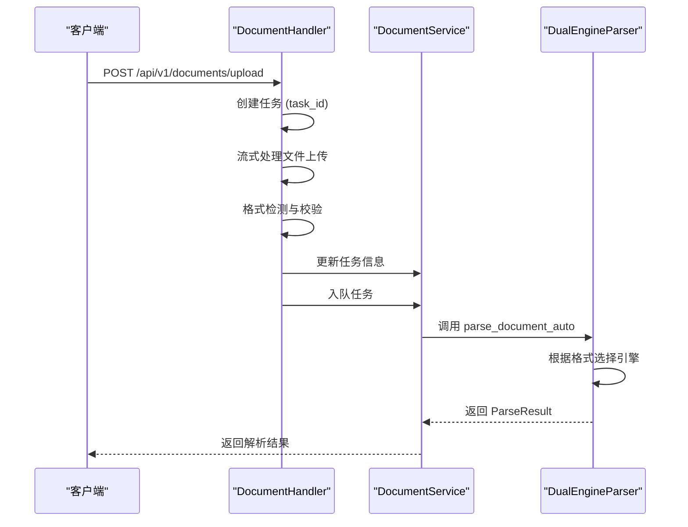

# 核心解析API

<cite>
**本文档中引用的文件**  
- [document_handler.rs](file://document-parser/src/handlers/document_handler.rs)
- [http_result.rs](file://document-parser/src/models/http_result.rs)
- [dual_engine_parser.rs](file://document-parser/src/parsers/dual_engine_parser.rs)
</cite>

## 目录
1. [核心解析API](#核心解析api)
2. [请求格式与参数说明](#请求格式与参数说明)
3. [文件上传与校验流程](#文件上传与校验流程)
4. [解析调用链分析](#解析调用链分析)
5. [响应结构与成功示例](#响应结构与成功示例)
6. [错误码说明](#错误码说明)
7. [使用示例](#使用示例)

## 请求格式与参数说明

文档解析服务的核心API端点 `/document/parse` 是一个POST接口，用于上传并解析多种格式的文档。该接口接收 `multipart/form-data` 格式的请求，主要字段包括 `file` 用于上传文件，以及若干可选查询参数。

支持的可选参数包括：
- **enable_toc**：布尔值，指示是否生成文档目录，默认为 `false`。
- **output_format**：字符串，控制输出格式（如JSON、Markdown等），具体值需参考配置。
- **custom_config**：JSON对象，用于传递自定义解析配置，影响解析行为和结果结构。

这些参数在 `UploadDocumentRequest` 结构体中定义，并通过 `Query` 提取器从请求中获取。

**Section sources**
- [document_handler.rs](file://document-parser/src/handlers/document_handler.rs#L167-L195)

## 文件上传与校验流程

文件上传后，系统通过 `Validation` 模块进行一系列完整性校验。首先，`process_multipart_upload_streaming_with_task_id` 函数处理流式上传，确保大文件也能高效处理。

校验流程包括：
1. **文件大小限制**：默认最大文件大小为10MB，由 `GlobalFileSizeConfig` 配置。若文件超过此限制，将返回413状态码。
2. **MIME类型检查**：通过 `detect_mime_type_from_format` 和 `detect_document_format_enhanced` 函数结合文件扩展名和内容魔数（magic number）进行格式检测。
3. **格式兼容性验证**：确保上传的文件格式在支持列表中，如PDF、DOCX、MD等。

所有校验逻辑由 `RequestValidator` 执行，确保只有合法且符合要求的文件才能进入解析阶段。

**Section sources**
- [document_handler.rs](file://document-parser/src/handlers/document_handler.rs#L300-L350)

## 解析调用链分析

从接收请求到最终调用 `DualEngineParser` 的完整调用链如下：

1. 请求由 `upload_document` 处理器接收。
2. 创建任务并获取 `task_id`，用于后续追踪。
3. 调用 `process_multipart_upload_streaming_with_task_id` 处理文件流并保存至临时路径。
4. 使用 `detect_document_format_enhanced` 检测文件格式。
5. 通过 `task_service` 更新任务信息，包括文件路径、原始文件名和格式。
6. 将任务加入队列，由后台工作池处理。
7. 后台任务调用 `document_service` 的解析方法，最终委托给 `DualEngineParser`。

`DualEngineParser` 根据文档格式选择合适的解析引擎：
- PDF文档使用 `MinerUParser`。
- 其他文本类格式（如Markdown、Word）使用 `MarkItDownParser`。



**Diagram sources**
- [document_handler.rs](file://document-parser/src/handlers/document_handler.rs#L200-L400)
- [dual_engine_parser.rs](file://document-parser/src/parsers/dual_engine_parser.rs#L50-L100)

## 响应结构与成功示例

成功响应遵循 `HttpResult<T>` 的统一结构，状态码为200。响应体包含以下字段：
- **code**: "0000" 表示成功。
- **message**: 描述性消息。
- **data**: 包含实际解析结果的对象。

`data` 对象包含：
- **parsed_content**: 解析后的结构化文本内容。
- **statistics**: 解析过程的统计信息，如页数、字符数等。
- **toc**: 当 `enable_toc=true` 时，包含生成的目录项列表。

```json
{
  "code": "0000",
  "message": "操作成功",
  "data": {
    "parsed_content": "# 标题\n这是解析后的内容...",
    "statistics": {
      "pages": 1,
      "characters": 500,
      "words": 100
    },
    "toc": [
      { "level": 1, "text": "标题", "page": 1 }
    ]
  }
}
```

**Section sources**
- [http_result.rs](file://document-parser/src/models/http_result.rs#L10-L40)

## 错误码说明

API定义了清晰的错误码体系，便于客户端处理异常情况：

- **400 Bad Request**: 请求参数错误，如缺少 `file` 字段或参数格式不正确。
- **413 Payload Too Large**: 文件大小超过10MB限制。
- **415 Unsupported Media Type**: 上传了不支持的文件格式，如 `.exe` 或 `.bin`。
- **408 Request Timeout**: 文件上传超时，通常为5分钟。
- **500 Internal Server Error**: 服务器内部错误，解析过程失败。

这些错误码在 `AppError` 枚举中定义，并通过 `ApiResponse::from_app_error` 转换为标准的 `HttpResult` 响应。

**Section sources**
- [document_handler.rs](file://document-parser/src/handlers/document_handler.rs#L190-L195)
- [http_result.rs](file://document-parser/src/models/http_result.rs#L42-L60)

## 使用示例

### 使用curl命令

```bash
# 解析PDF文件并生成目录
curl -X POST http://localhost:8087/api/v1/documents/upload \
  -F "file=@document.pdf" \
  -F "enable_toc=true" \
  -F "max_toc_depth=3"

# 解析Markdown文件
curl -X POST http://localhost:8087/api/v1/documents/upload \
  -F "file=@note.md" \
  -F "output_format=markdown"
```

### 使用Python requests库

```python
import requests

url = "http://localhost:8087/api/v1/documents/upload"
files = {'file': ('sample.pdf', open('sample.pdf', 'rb'), 'application/pdf')}
data = {'enable_toc': 'true', 'output_format': 'json'}

response = requests.post(url, files=files, data=data)
result = response.json()

if result['code'] == '0000':
    content = result['data']['parsed_content']
    toc = result['data'].get('toc', [])
    print("解析内容:", content)
    print("目录:", toc)
else:
    print("错误:", result['message'])
```

以上示例展示了如何上传PDF、Word和Markdown文件，并处理响应中的结构化文本内容。

**Section sources**
- [document_handler.rs](file://document-parser/src/handlers/document_handler.rs#L167-L195)
- [http_result.rs](file://document-parser/src/models/http_result.rs#L10-L40)