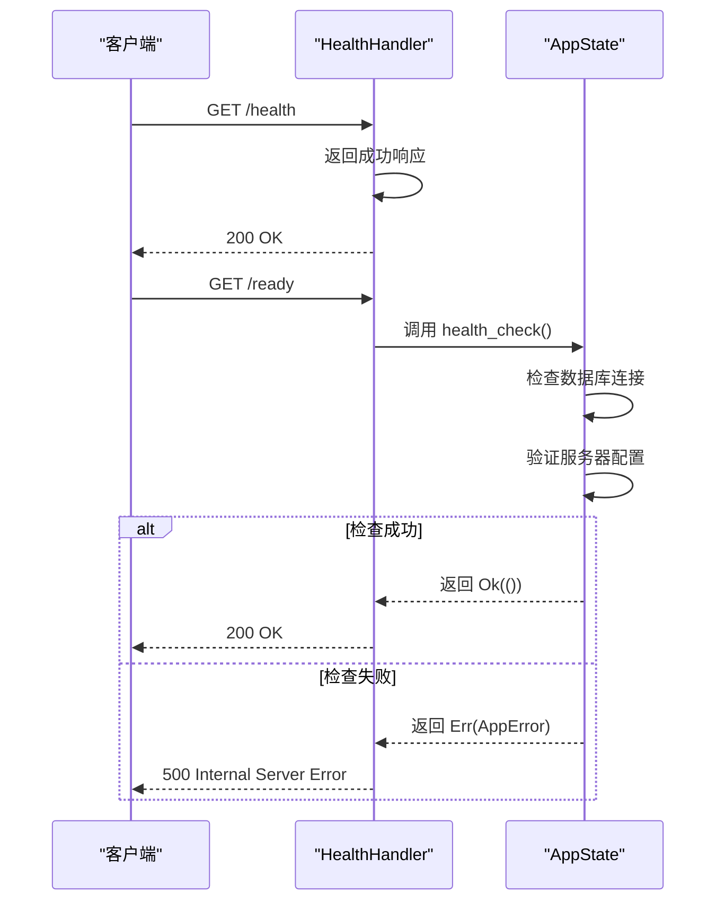
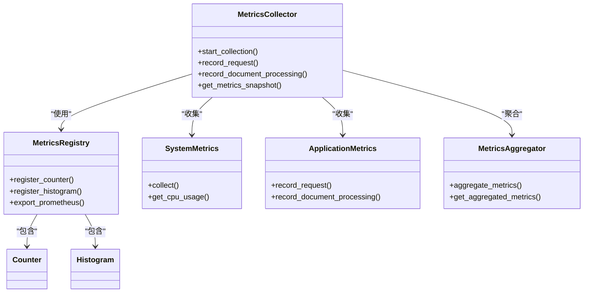
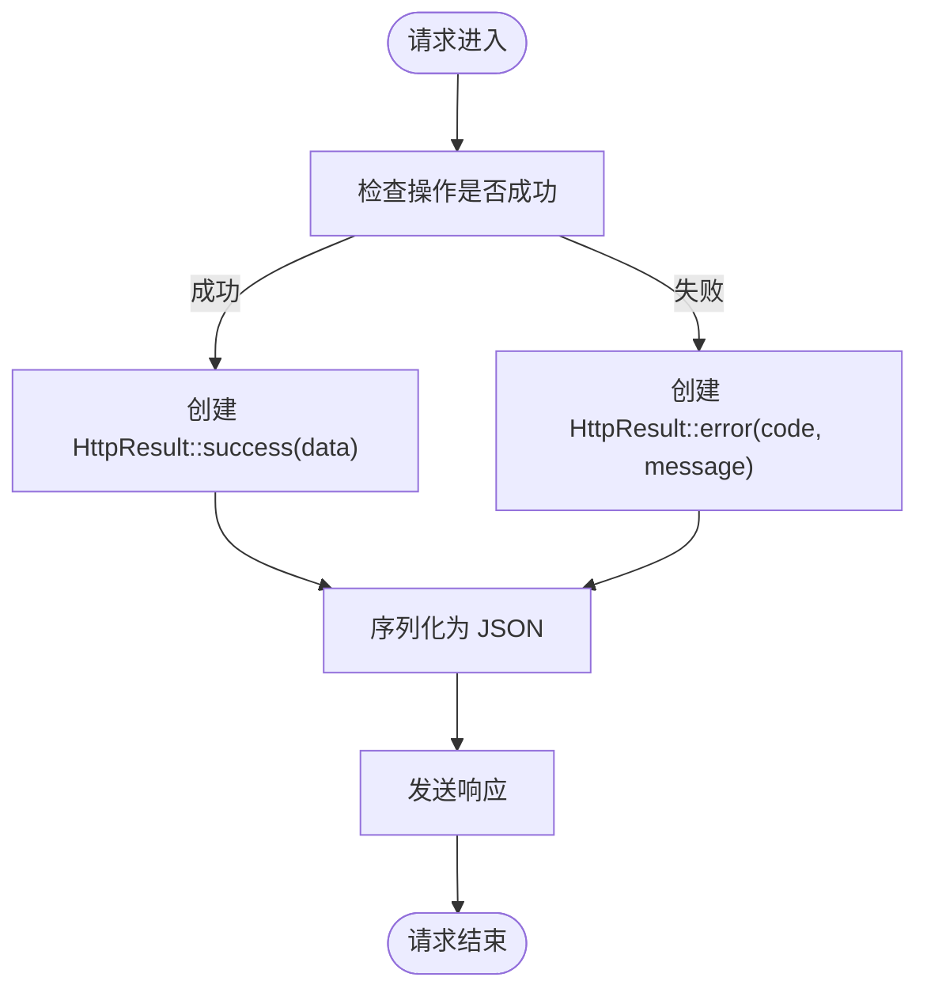

# 健康与监控

<cite>
**本文档中引用的文件**  
- [health_handler.rs](file://document-parser/src/handlers/health_handler.rs)
- [monitoring_handler.rs](file://document-parser/src/handlers/monitoring_handler.rs)
- [http_result.rs](file://document-parser/src/models/http_result.rs)
- [app_state.rs](file://document-parser/src/app_state.rs)
- [config.rs](file://document-parser/src/config.rs)
- [metrics_collector.rs](file://document-parser/src/performance/metrics_collector.rs)
- [metrics.rs](file://document-parser/src/utils/metrics.rs)
</cite>

## 目录
1. [简介](#简介)
2. [健康检查接口实现](#健康检查接口实现)
3. [监控指标收集与暴露](#监控指标收集与暴露)
4. [统一响应封装机制](#统一响应封装机制)
5. [Kubernetes探针配置](#kubernetes探针配置)
6. [Grafana可视化集成](#grafana可视化集成)
7. [性能影响与优化建议](#性能影响与优化建议)
8. [验证与测试](#验证与测试)

## 简介
本文档深入解析文档解析服务的健康检查与监控接口实现。详细说明了健康检查处理器如何评估服务整体健康度，监控处理器如何集成Prometheus指标收集，以及所有监控相关接口的统一响应封装机制。同时提供了在Kubernetes环境中的探针配置方式、Grafana可视化集成方法，以及高负载场景下的性能影响与优化建议。

## 健康检查接口实现

文档解析服务通过`health_handler.rs`和`monitoring_handler.rs`实现了多层次的健康检查机制。`health_check`端点用于基本的健康状态检查，返回简单的成功响应，表明服务进程正在运行。而`ready_check`端点则通过调用应用状态（AppState）的`health_check`方法，进行更深入的依赖检查。

`AppState`的`health_check`方法执行关键的健康验证，包括数据库连接检查（通过`sled`数据库的`flush`操作）和服务器端口配置的有效性验证。如果任何检查失败，将返回相应的错误响应，确保服务在不健康状态下不会被标记为就绪。



**图表来源**
- [health_handler.rs](file://document-parser/src/handlers/health_handler.rs#L1-L37)
- [app_state.rs](file://document-parser/src/app_state.rs#L280-L307)

**本节来源**
- [health_handler.rs](file://document-parser/src/handlers/health_handler.rs#L1-L37)
- [app_state.rs](file://document-parser/src/app_state.rs#L280-L307)

## 监控指标收集与暴露

服务通过`monitoring_handler.rs`中的`metrics`端点暴露监控指标，支持`prometheus`和`json`两种格式。该端点由`metrics_collector.rs`和`utils/metrics.rs`中的组件协同工作，实现指标的收集、聚合和导出。

核心监控指标包括：
- `http_requests_total`：计数器，记录总请求数。
- `document_parse_duration_seconds`：直方图，记录文档解析的持续时间。
- `errors_total`：计数器，记录发生的错误总数。

`MetricsCollector`负责协调整个指标收集过程，它启动后台任务定期从`SystemMetrics`（系统指标）和`ApplicationMetrics`（应用指标）收集数据，并通过`MetricsAggregator`进行聚合。`MetricsRegistry`作为指标注册表，管理所有已注册的计数器、仪表、直方图等，并提供`export_prometheus`方法将指标转换为Prometheus可读的文本格式。



**图表来源**
- [monitoring_handler.rs](file://document-parser/src/handlers/monitoring_handler.rs#L1-L356)
- [metrics_collector.rs](file://document-parser/src/performance/metrics_collector.rs#L1-L1134)
- [metrics.rs](file://document-parser/src/utils/metrics.rs#L1-L1274)

**本节来源**
- [monitoring_handler.rs](file://document-parser/src/handlers/monitoring_handler.rs#L1-L356)
- [metrics_collector.rs](file://document-parser/src/performance/metrics_collector.rs#L1-L1134)
- [metrics.rs](file://document-parser/src/utils/metrics.rs#L1-L1274)

## 统一响应封装机制

所有监控和健康检查接口均使用`http_result.rs`中定义的`HttpResult<T>`结构进行统一的响应封装。该结构包含三个核心字段：`code`（状态码）、`message`（描述信息）和`data`（可选的响应数据）。

对于成功的响应，使用`HttpResult::success(data)`方法，返回`code`为"0000"，`message`为"操作成功"。对于错误响应，使用`HttpResult::error(code, message)`方法，此时`data`字段为`None`。这种设计确保了所有API响应具有一致的结构，便于客户端解析。

`HttpResult`实现了`IntoResponse` trait，使其可以直接作为Axum框架的响应返回，简化了处理器的实现。



**图表来源**
- [http_result.rs](file://document-parser/src/models/http_result.rs#L1-L72)

**本节来源**
- [http_result.rs](file://document-parser/src/models/http_result.rs#L1-L72)

## Kubernetes探针配置

服务为Kubernetes环境提供了专门的存活（liveness）和就绪（readiness）探针。

- **存活探针** (`/alive`)：由`liveness_check`处理器处理。它仅检查服务进程是否在运行，返回简单的"Alive"文本。如果此探针失败，Kubernetes将重启Pod。
- **就绪探针** (`/ready`)：由`ready_check`处理器处理。它执行完整的健康检查，包括数据库连接等依赖项。如果此探针失败，Pod将从服务的负载均衡中移除，但不会被重启。

这种分离的设计允许服务在暂时无法处理请求（例如，数据库连接中断）时，通过就绪探针通知Kubernetes停止流量，而不会因为存活探针失败而被重启，从而避免了在恢复期间的反复重启。

**本节来源**
- [monitoring_handler.rs](file://document-parser/src/handlers/monitoring_handler.rs#L1-L356)

## Grafana可视化集成

要将服务的监控指标接入Grafana进行可视化，需进行以下配置：

1.  **Prometheus配置**：在Prometheus的`scrape_configs`中添加一个job，目标为服务的`/metrics`端点。
    ```yaml
    scrape_configs:
      - job_name: 'document-parser'
        static_configs:
          - targets: ['<service-host>:<service-port>']
    ```
2.  **Grafana数据源**：在Grafana中添加Prometheus作为数据源，指向Prometheus服务器。
3.  **创建仪表盘**：导入或创建一个新的仪表盘，使用PromQL查询来可视化指标。例如：
    -   **请求速率**：`rate(http_requests_total[5m])`
    -   **平均解析延迟**：`rate(document_parse_duration_seconds_sum[5m]) / rate(document_parse_duration_seconds_count[5m])`
    -   **错误率**：`rate(errors_total[5m])`

通过这些仪表盘，可以实时监控服务的性能、健康状况和错误趋势。

**本节来源**
- [monitoring_handler.rs](file://document-parser/src/handlers/monitoring_handler.rs#L1-L356)

## 性能影响与优化建议

在高负载场景下，频繁的指标收集和健康检查可能对服务性能产生影响。

**性能影响**：
- **CPU开销**：`metrics_collector`中的后台任务会定期收集系统指标（如CPU、内存），这会增加额外的CPU负担。
- **内存开销**：`ApplicationMetrics`和`CustomMetrics`会存储最近的请求和处理时长，占用一定内存。
- **I/O开销**：健康检查中的数据库`flush`操作会产生磁盘I/O。

**优化建议**：
1.  **调整收集频率**：根据实际需求，通过配置增加`metrics_collector`的`collection_interval`，减少系统调用的频率。
2.  **优化健康检查**：对于存活探针，确保其逻辑极其轻量。对于就绪探针，可以考虑缓存检查结果，避免每次请求都进行完整的数据库连接测试。
3.  **限制指标数据量**：在`ApplicationMetrics`中，限制`request_durations`和`processing_durations`等队列的大小，防止内存无限增长。
4.  **使用异步健康检查**：将耗时的健康检查操作（如OSS连接探测）放入异步任务中，避免阻塞HTTP请求处理线程。
5.  **监控指标本身**：监控`metrics_collection_duration_seconds`等指标，确保指标收集过程本身不会成为性能瓶颈。

**本节来源**
- [metrics_collector.rs](file://document-parser/src/performance/metrics_collector.rs#L1-L1134)
- [app_state.rs](file://document-parser/src/app_state.rs#L280-L307)

## 验证与测试

可以使用`curl`命令来验证健康状态和监控指标。

**验证健康状态**：
```bash
# 检查基本健康
curl http://localhost:8080/health

# 检查就绪状态
curl http://localhost:8080/ready

# 检查存活状态
curl http://localhost:8080/alive
```

**获取监控指标**：
```bash
# 获取Prometheus格式的指标
curl http://localhost:8080/metrics?format=prometheus

# 获取JSON格式的指标
curl http://localhost:8080/metrics?format=json
```

预期的健康检查响应示例：
```json
{
  "code": "0000",
  "message": "操作成功",
  "data": "health"
}
```

**本节来源**
- [health_handler.rs](file://document-parser/src/handlers/health_handler.rs#L1-L37)
- [monitoring_handler.rs](file://document-parser/src/handlers/monitoring_handler.rs#L1-L356)