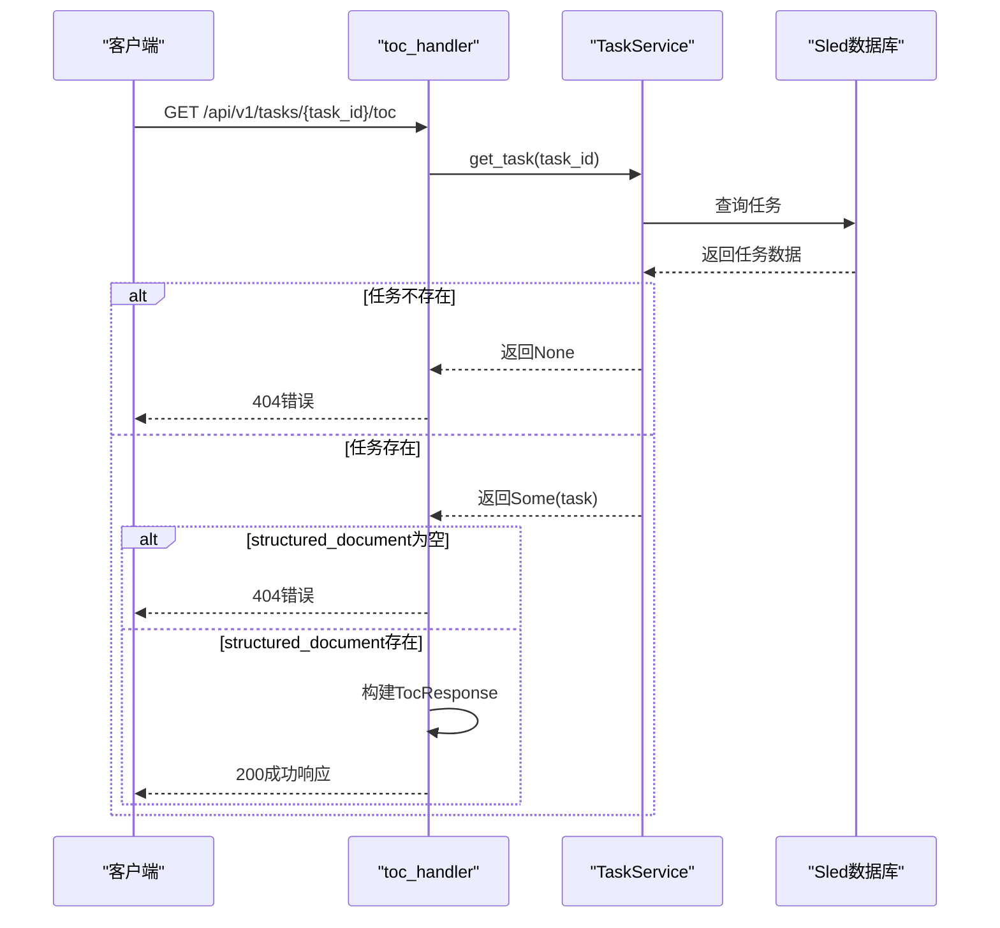
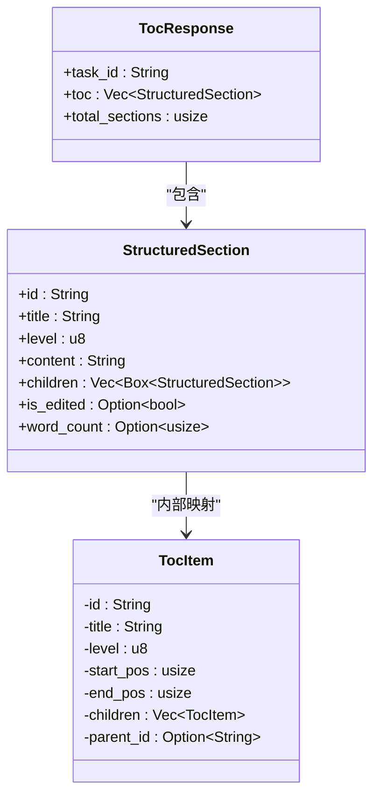
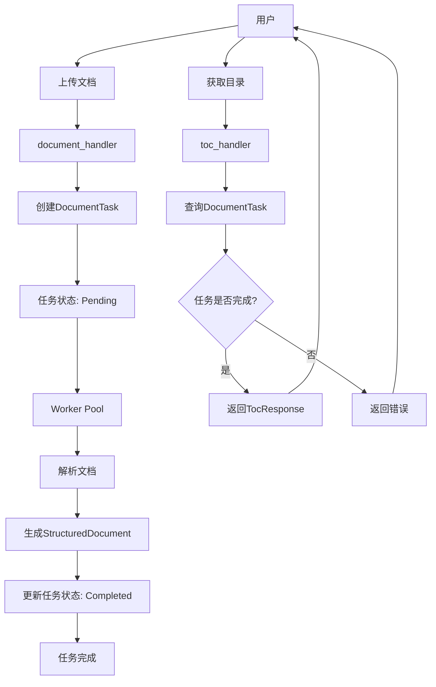

# 目录服务

<cite>
**本文档引用的文件**  
- [toc_handler.rs](file://document-parser/src/handlers/toc_handler.rs)
- [toc_item.rs](file://document-parser/src/models/toc_item.rs)
- [structured_document.rs](file://document-parser/src/models/structured_document.rs)
- [document_task.rs](file://document-parser/src/models/document_task.rs)
- [task_service.rs](file://document-parser/src/services/task_service.rs)
- [task_status.rs](file://document-parser/src/models/task_status.rs)
- [routes.rs](file://document-parser/src/routes.rs)
</cite>

## 目录
1. [简介](#简介)
2. [核心组件](#核心组件)
3. [API请求处理流程](#api请求处理流程)
4. [TOC数据结构定义](#toc数据结构定义)
5. [API协作关系](#api协作关系)
6. [响应示例与使用方法](#响应示例与使用方法)
7. [应用场景](#应用场景)
8. [性能考量](#性能考量)

## 简介
目录服务（TOC API）是文档解析系统的核心功能之一，提供从已解析的结构化文档中提取层级化目录树的能力。该服务通过`GET /api/v1/tasks/{task_id}/toc`端点，允许客户端获取指定任务的完整目录结构。此功能建立在主文档解析流程之上，用户需先提交文档解析任务，在任务完成后调用此接口获取目录信息。目录服务不仅支持获取完整的TOC树，还提供获取单个章节内容和所有章节列表的扩展接口，为前端导航、内容索引和文档渲染提供了坚实的数据基础。

## 核心组件

目录服务的核心由多个组件协同工作，包括处理HTTP请求的`toc_handler.rs`、定义数据结构的`toc_item.rs`和`structured_document.rs`，以及管理任务状态的`task_service.rs`。`toc_handler.rs`负责处理所有与目录相关的HTTP请求，验证任务状态并返回相应的JSON响应。`toc_item.rs`定义了目录项的内部数据结构，包含章节的ID、标题、层级、位置信息和子章节列表。`structured_document.rs`则封装了完整的结构化文档，其中的`toc`字段直接作为TOC API的返回数据。`task_service.rs`提供了任务查询功能，使`toc_handler`能够根据`task_id`检索任务及其关联的结构化文档。

**本节来源**
- [toc_handler.rs](file://document-parser/src/handlers/toc_handler.rs#L1-L235)
- [toc_item.rs](file://document-parser/src/models/toc_item.rs#L1-L326)
- [structured_document.rs](file://document-parser/src/models/structured_document.rs#L1-L799)
- [task_service.rs](file://document-parser/src/services/task_service.rs#L1-L632)

## API请求处理流程

`GET /api/v1/tasks/{task_id}/toc`端点的请求处理流程始于`routes.rs`中定义的路由，该路由将请求映射到`toc_handler.rs`中的`get_document_toc`函数。处理流程如下：首先，函数通过`State(state)`获取应用状态，其中包含`task_service`实例。然后，它调用`state.task_service.get_task(&task_id).await`异步查询指定`task_id`的任务。如果任务不存在，返回404错误。如果任务存在，则检查其`structured_document`字段是否为空。如果为空，说明任务尚未完成或未生成结构化文档，返回404错误。如果`structured_document`存在，则从其中提取`toc`、`total_sections`等信息，构建`TocResponse`对象，并通过`HttpResult::success`包装成标准的JSON响应返回给客户端。整个流程严格遵循任务状态机，确保只有在任务完成且文档已结构化时才提供目录数据。



**图示来源**
- [toc_handler.rs](file://document-parser/src/handlers/toc_handler.rs#L100-L130)
- [task_service.rs](file://document-parser/src/services/task_service.rs#L50-L70)
- [document_task.rs](file://document-parser/src/models/document_task.rs#L1-L967)

## TOC数据结构定义

TOC API返回的JSON数据结构由`TocResponse`和`StructuredSection`模型定义。`TocResponse`包含三个字段：`task_id`（任务唯一标识符）、`toc`（目录结构数组）和`total_sections`（章节总数）。`toc`数组中的每个元素都是一个`StructuredSection`对象，其核心字段包括：
- `id`：章节的唯一标识符，通常基于标题生成。
- `title`：章节的标题或名称。
- `level`：章节的层级深度，1表示顶级章节，2表示二级章节，以此类推。
- `content`：章节的正文内容。
- `children`：子章节列表，支持无限层级的嵌套结构。

`StructuredSection`模型在`structured_document.rs`中定义，其`children`字段被标记为`Vec<Box<StructuredSection>>`，以支持递归嵌套。`toc_item.rs`中的`TocItem`是内部使用的数据结构，包含更详细的元数据，如`start_pos`和`end_pos`（章节在原文中的起始和结束位置），但在返回给客户端的`StructuredSection`中，这些内部优化字段被省略，只暴露必要的业务字段。



**图示来源**
- [toc_handler.rs](file://document-parser/src/handlers/toc_handler.rs#L10-L50)
- [structured_document.rs](file://document-parser/src/models/structured_document.rs#L150-L250)
- [toc_item.rs](file://document-parser/src/models/toc_item.rs#L1-L50)

## API协作关系

目录服务与主解析API紧密协作，形成一个两阶段的处理流程。第一阶段是文档解析，用户通过`POST /api/v1/documents/upload`或`POST /api/v1/documents/uploadFromUrl`提交文档上传或URL下载请求。这些请求由`document_handler.rs`处理，创建一个`DocumentTask`并将其存入数据库，状态为`Pending`。随后，后台工作池（worker pool）处理该任务，经过格式检测、文档解析、Markdown处理等阶段，最终生成`StructuredDocument`并更新任务状态为`Completed`。第二阶段是目录获取，用户在确认任务完成后（可通过`GET /api/v1/tasks/{task_id}`查询状态），调用`GET /api/v1/tasks/{task_id}/toc`来获取目录。这种分离设计确保了长时任务的异步处理，避免了客户端长时间等待，同时提供了清晰的职责划分。



**图示来源**
- [document_handler.rs](file://document-parser/src/handlers/document_handler.rs#L1-L1113)
- [task_status.rs](file://document-parser/src/models/task_status.rs#L1-L998)
- [routes.rs](file://document-parser/src/routes.rs#L1-L125)

## 响应示例与使用方法

以下是一个典型的TOC API响应示例，展示了一个包含多级章节嵌套的目录结构：

```json
{
  "code": "0000",
  "message": "操作成功",
  "data": {
    "task_id": "a1b2c3d4-e5f6-7890-g1h2-i3j4k5l6m7n8",
    "total_sections": 5,
    "toc": [
      {
        "id": "introduction",
        "title": "第一章 介绍",
        "level": 1,
        "content": "这是第一章的内容...",
        "children": [
          {
            "id": "background",
            "title": "1.1 背景",
            "level": 2,
            "content": "这是1.1节的内容...",
            "children": []
          },
          {
            "id": "objectives",
            "title": "1.2 目标",
            "level": 2,
            "content": "这是1.2节的内容...",
            "children": []
          }
        ]
      },
      {
        "id": "methodology",
        "title": "第二章 方法论",
        "level": 1,
        "content": "这是第二章的内容...",
        "children": []
      }
    ]
  }
}
```

要使用curl命令获取特定任务的目录，可以执行以下命令：

```bash
curl -X GET "http://localhost:8080/api/v1/tasks/a1b2c3d4-e5f6-7890-g1h2-i3j4k5l6m7n8/toc" \
  -H "Content-Type: application/json"
```

此命令将向服务器发送GET请求，获取`task_id`为`a1b2c3d4-e5f6-7890-g1h2-i3j4k5l6m7n8`的任务的目录结构。

**本节来源**
- [toc_handler.rs](file://document-parser/src/handlers/toc_handler.rs#L100-L130)
- [http_result.rs](file://document-parser/src/models/http_result.rs#L1-L72)

## 应用场景

目录服务在多种场景下发挥着关键作用。在**文档导航**中，前端应用可以利用返回的`toc`数组构建一个可展开/折叠的侧边栏导航菜单，用户点击目录项即可跳转到相应章节。在**内容索引**中，搜索引擎或内部搜索功能可以利用`StructuredSection`的`id`和`title`字段建立全文索引，实现快速的内容定位。在**前端渲染**中，应用可以先加载轻量级的目录结构，然后根据用户交互按需加载具体章节内容，实现高效的懒加载（lazy loading）策略。此外，该API还可用于生成文档的静态大纲、进行内容分析或作为其他服务（如问答系统）的输入。

## 性能考量

对于超大文档，直接返回整个`toc`树和所有`content`可能会导致响应过大和性能下降。当前实现中，`StructuredSection`模型包含了`content`字段，这在获取完整章节列表时尤其成问题。一个优化的策略是实现**分页**或**分层加载**。例如，`get_all_sections`端点可以接受`page`和`size`参数，只返回指定页码的章节。或者，可以提供一个`get_toc_summary`端点，仅返回`id`、`title`和`level`，不包含`content`，用于初始的目录展示。当用户点击某个章节时，再通过`get_section_content`端点按需获取具体内容。此外，`structured_document.rs`中的`section_index`和`level_index`字段为O(1)时间复杂度的快速查找提供了基础，可以在处理大型文档时显著提升性能。