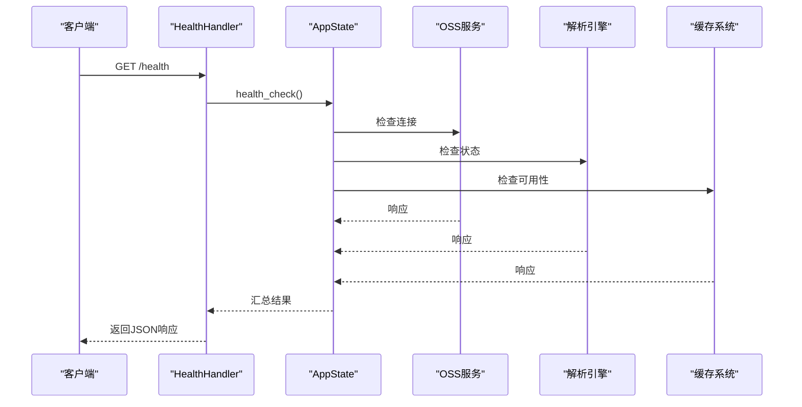
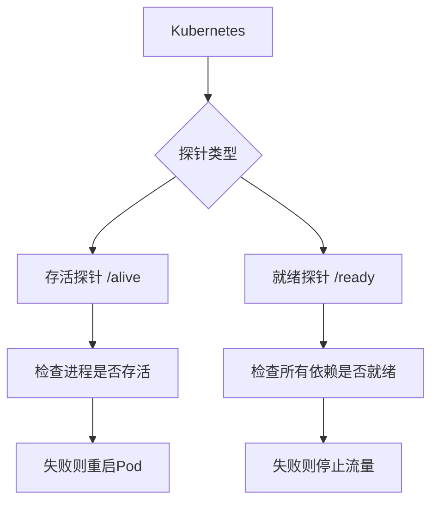
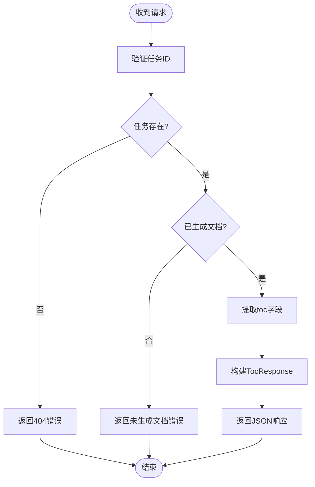
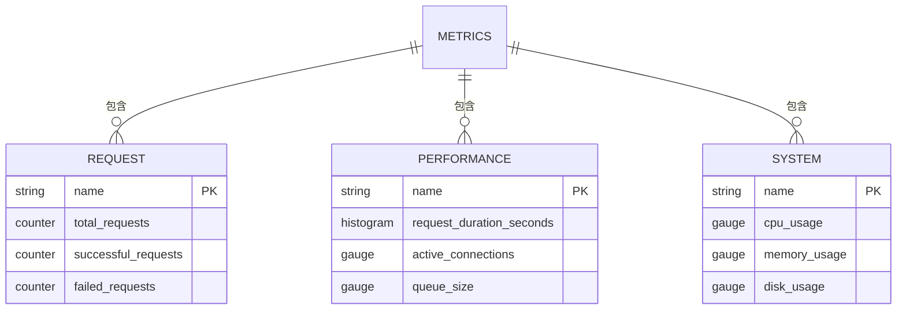

# 辅助功能API

<cite>
**本文档中引用的文件**  
- [health_handler.rs](file://document-parser/src/handlers/health_handler.rs)
- [monitoring_handler.rs](file://document-parser/src/handlers/monitoring_handler.rs)
- [toc_handler.rs](file://document-parser/src/handlers/toc_handler.rs)
- [http_result.rs](file://document-parser/src/models/http_result.rs)
- [structured_document.rs](file://document-parser/src/models/structured_document.rs)
- [toc_item.rs](file://document-parser/src/models/toc_item.rs)
</cite>

## 目录
1. [引言](#引言)
2. [健康检查API](#健康检查api)
3. [目录生成API](#目录生成api)
4. [监控指标API](#监控指标api)
5. [统一错误响应格式](#统一错误响应格式)
6. [使用示例](#使用示例)
7. [结论](#结论)

## 引言
本文档全面说明文档解析服务中的辅助功能API集合，涵盖健康检查、目录生成和监控指标三大核心功能。这些API为服务的稳定性监控、文档结构化展示和性能分析提供了关键支持。通过标准化的响应格式和清晰的接口设计，开发者能够轻松集成并利用这些功能，实现服务的自动化运维和深度分析。

## 健康检查API

健康检查API是确保服务高可用性的核心组件，包含`/health`、`/ready`和`/alive`三个端点，分别用于不同场景的健康状态探测。

### HealthHandler与核心组件检查
`HealthHandler`通过`health_check`端点（GET /health）对服务的核心组件进行综合健康检查。该端点会验证OSS连接、解析引擎和缓存系统的运行状态。在代码实现中，`health_check`函数会调用应用状态（AppState）的健康检查方法，对底层服务进行探测。如果所有核心组件均正常，返回包含`status`、`version`和`dependencies`字段的JSON响应；若任一组件异常，则返回相应的错误码和消息。



**Diagram sources**
- [health_handler.rs](file://document-parser/src/handlers/health_handler.rs#L0-L37)
- [monitoring_handler.rs](file://document-parser/src/handlers/monitoring_handler.rs#L61-L106)

**Section sources**
- [health_handler.rs](file://document-parser/src/handlers/health_handler.rs#L0-L37)
- [monitoring_handler.rs](file://document-parser/src/handlers/monitoring_handler.rs#L61-L106)

### Kubernetes探针配置
该API集成了对Kubernetes原生探针的支持，通过不同的端点实现精细化的容器管理。

- **存活探针 (Liveness Probe)**：配置为访问`/alive`端点。此探针仅确认服务进程是否在运行。如果探针失败，Kubernetes将重启Pod。其逻辑简单，不依赖任何外部服务，确保即使在严重故障下也能快速响应。
- **就绪探针 (Readiness Probe)**：配置为访问`/ready`端点。此探针检查服务是否已准备好接收流量，会验证所有核心依赖（如数据库、OSS）的连接。如果探针失败，Kubernetes会将该Pod从服务的负载均衡池中移除，但不会重启它，允许服务在恢复后自动重新加入。



**Diagram sources**
- [monitoring_handler.rs](file://document-parser/src/handlers/monitoring_handler.rs#L108-L152)

**Section sources**
- [monitoring_handler.rs](file://document-parser/src/handlers/monitoring_handler.rs#L108-L152)

## 目录生成API

目录生成API（GET /document/toc/{task_id}）是文档结构化处理的核心功能之一，它将已解析的文档内容转化为可导航的层级结构。

### 章节树构建逻辑
该API通过`get_document_toc`函数实现。当接收到请求时，它首先通过`task_service.get_task`方法根据`task_id`查询任务。如果任务存在且已生成`structured_document`，则直接返回其`toc`字段。`toc`是一个`Vec<StructuredSection>`类型的向量，其中每个`StructuredSection`对象代表一个章节，包含`level`、`title`、`id`和`children`等字段，从而形成一个嵌套的章节树。



**Diagram sources**
- [toc_handler.rs](file://document-parser/src/handlers/toc_handler.rs#L75-L117)
- [structured_document.rs](file://document-parser/src/models/structured_document.rs#L0-L799)

**Section sources**
- [toc_handler.rs](file://document-parser/src/handlers/toc_handler.rs#L75-L117)
- [structured_document.rs](file://document-parser/src/models/structured_document.rs#L0-L799)

### 与主解析API的配合
目录生成API与主文档解析API紧密配合。主解析API负责接收文档、调用解析引擎（如MinerU或MarkItDown）进行内容提取和结构化处理，并将结果（包括`toc`）存储在任务的`structured_document`中。目录生成API则作为后续的查询接口，允许客户端在解析完成后，按需获取文档的目录结构。这种分离设计实现了处理与查询的解耦，提高了系统的灵活性和可扩展性。

## 监控指标API

监控指标API（GET /metrics）为服务的性能监控和故障排查提供了数据支持，暴露了关键的Prometheus格式指标。

### Prometheus指标说明
该API通过`metrics`端点提供多种指标，支持`prometheus`和`json`两种格式。在Prometheus格式下，主要提供以下指标：

- **请求计数**：`app_requests_total`（计数器），记录服务处理的总请求数。
- **解析耗时直方图**：`app_request_duration_seconds`（直方图），记录每个请求的处理耗时，用于分析性能分布和延迟。
- **错误率**：通过`failed_requests`等指标间接计算，结合`total_requests`可以得出错误率。

这些指标被`metrics_collector`模块收集和聚合，为Prometheus等监控系统提供数据源。



**Diagram sources**
- [monitoring_handler.rs](file://document-parser/src/handlers/monitoring_handler.rs#L108-L152)
- [metrics_collector.rs](file://document-parser/src/performance/metrics_collector.rs#L288-L324)

**Section sources**
- [monitoring_handler.rs](file://document-parser/src/handlers/monitoring_handler.rs#L108-L152)
- [metrics_collector.rs](file://document-parser/src/performance/metrics_collector.rs#L288-L324)

## 统一错误响应格式

所有辅助API遵循统一的错误响应格式，确保客户端能够一致地处理各种错误情况。

### 基于http_result.rs的标准化
该格式由`http_result.rs`文件中的`HttpResult<T>`结构体定义。一个标准的错误响应包含三个核心字段：
- `code`: 错误码，如`E001`表示系统错误，`T002`表示任务不存在。
- `message`: 可读的错误描述信息。
- `data`: 数据字段，在错误响应中始终为`null`。

当API内部发生错误时，会调用`HttpResult::error`或`HttpResult::system_error`等静态方法创建错误响应对象，并通过`IntoResponse` trait自动转换为HTTP响应。这种设计保证了所有API的错误响应在结构上完全一致。

**Section sources**
- [http_result.rs](file://document-parser/src/models/http_result.rs#L0-L72)

## 使用示例

以下提供两个常用的`curl`命令示例，用于与辅助API进行交互。

### 检查服务健康状态
```bash
curl -X GET "http://localhost:8080/health"
```
此命令将返回类似以下的JSON响应：
```json
{
  "code": "0000",
  "message": "操作成功",
  "data": {
    "status": "healthy",
    "healthy_count": 1,
    "unhealthy_count": 0,
    "degraded_count": 0,
    "timestamp": 1700000000
  }
}
```
**实际应用价值**：此响应可用于CI/CD流水线中的部署后验证，或作为外部监控系统（如Prometheus）的健康目标。

### 获取任务目录
```bash
curl -X GET "http://localhost:8080/api/v1/tasks/123e4567-e89b-12d3-a456-426614174000/toc"
```
此命令将返回包含完整章节树的JSON响应，可用于前端应用动态生成文档导航菜单。

**实际应用价值**：客户端应用可以利用此数据构建交互式目录，实现一键跳转到指定章节，极大地提升长文档的阅读体验。

## 结论
本文档详细阐述了文档解析服务的辅助功能API。`HealthHandler`通过多级探针机制保障了服务的稳定性；目录生成API利用结构化数据模型实现了文档的高效导航；监控指标API为性能优化提供了数据基础；而统一的错误响应格式则简化了客户端的集成工作。这些API共同构成了一个健壮、可观测且易于集成的服务体系。