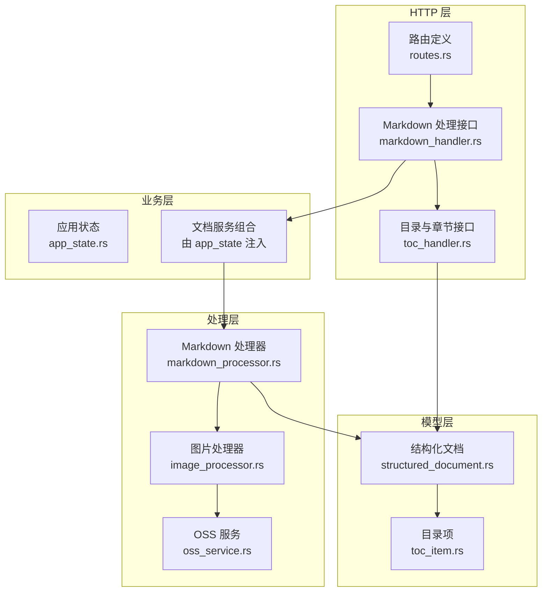
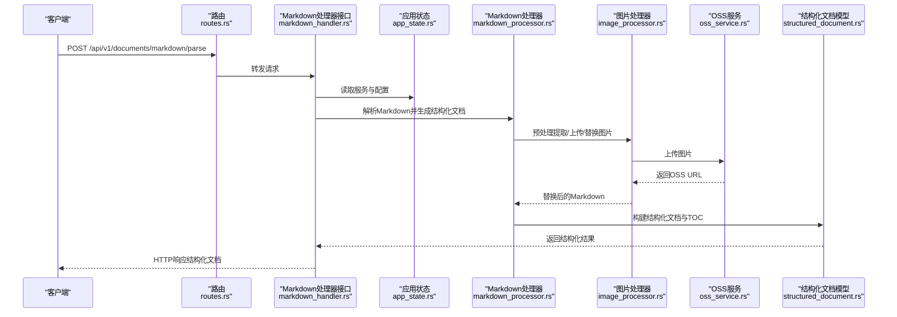
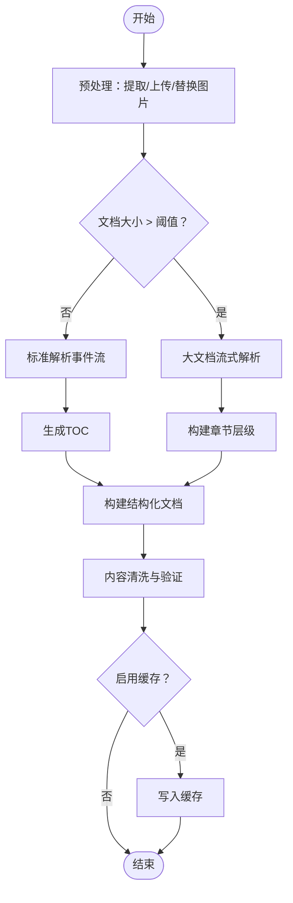
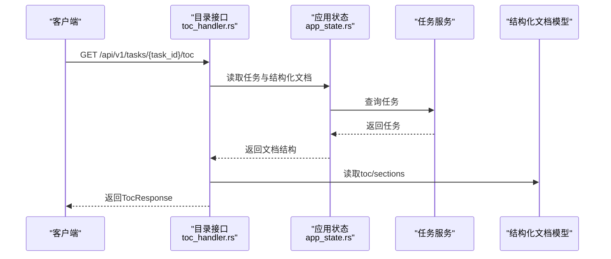
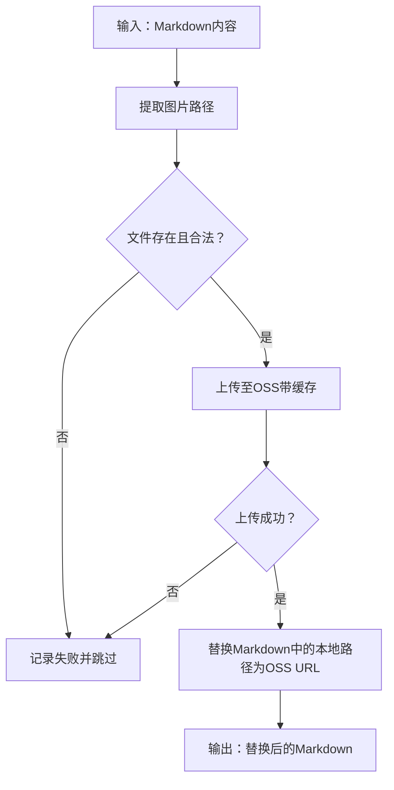
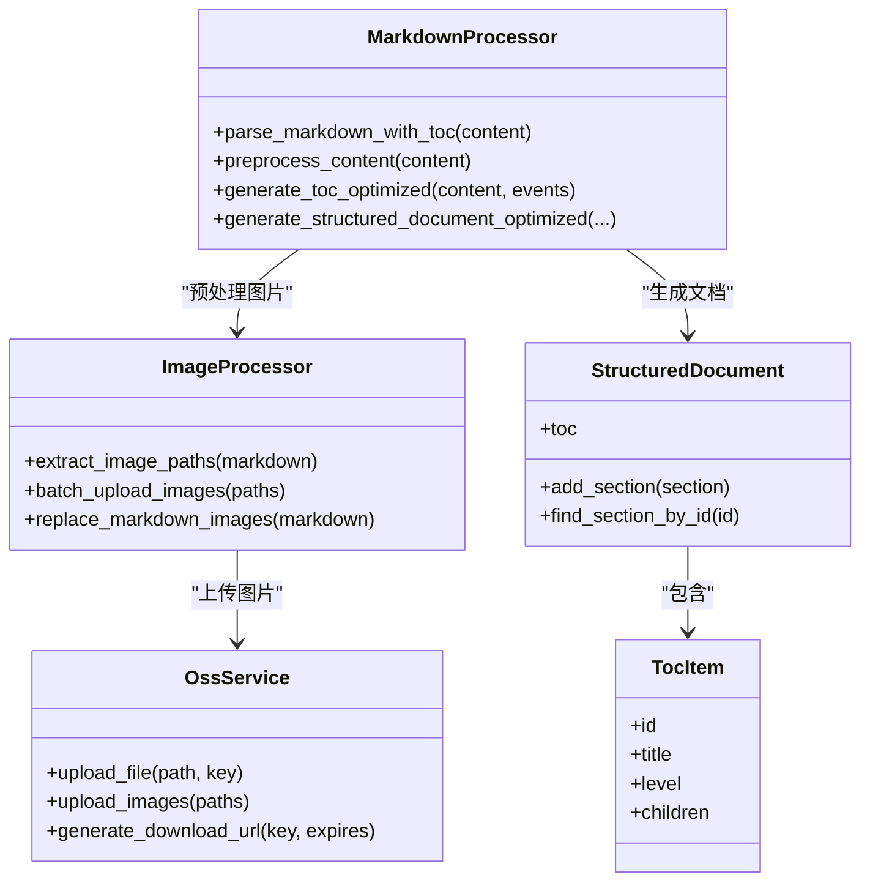

# Markdown处理

<cite>
**本文引用的文件**
- [markdown_processor.rs](file://document-parser/src/processors/markdown_processor.rs)
- [toc_handler.rs](file://document-parser/src/handlers/toc_handler.rs)
- [image_processor.rs](file://document-parser/src/services/image_processor.rs)
- [oss_service.rs](file://document-parser/src/services/oss_service.rs)
- [toc_item.rs](file://document-parser/src/models/toc_item.rs)
- [structured_document.rs](file://document-parser/src/models/structured_document.rs)
- [markdown_handler.rs](file://document-parser/src/handlers/markdown_handler.rs)
- [routes.rs](file://document-parser/src/routes.rs)
- [app_state.rs](file://document-parser/src/app_state.rs)
- [sample_markdown.md](file://document-parser/fixtures/sample_markdown.md)
- [markdown_image_processing.rs](file://document-parser/examples/markdown_image_processing.rs)
</cite>

## 目录
1. [简介](#简介)
2. [项目结构](#项目结构)
3. [核心组件](#核心组件)
4. [架构总览](#架构总览)
5. [详细组件分析](#详细组件分析)
6. [依赖关系分析](#依赖关系分析)
7. [性能考量](#性能考量)
8. [故障排查指南](#故障排查指南)
9. [结论](#结论)
10. [附录](#附录)

## 简介
本文件系统性讲解 Markdown 处理模块的功能与实现，覆盖以下方面：
- 语法解析：基于 pulldown-cmark 的事件流解析，支持标题、列表、表格、代码块、强调、脚注等丰富语法。
- 内容清洗与结构优化：空行清理、不可见字符过滤、锚点生成、标题层级规范化。
- 目录（TOC）生成：自动生成层级目录，支持最大深度限制与锚点链接。
- 图像处理：本地图片路径提取、批量上传至 OSS、替换 Markdown 中的图片链接。
- API 接口与使用示例：通过 HTTP 请求触发处理流程，返回结构化文档与目录。

## 项目结构
Markdown 处理模块位于 document-parser 子工程中，主要由以下层次构成：
- 处理器层：MarkdownProcessor 负责解析、生成 TOC、构建结构化文档、缓存与图片预处理。
- 服务层：ImageProcessor、OssService 提供图片上传与 OSS 交互能力。
- 模型层：StructuredDocument、TocItem 等模型承载结构化文档与目录数据。
- 处理入口：markdown_handler 提供 HTTP 接口；toc_handler 提供 TOC 查询接口；routes 定义路由。
- 应用状态：app_state 统一注入配置、服务与处理器实例。

图表来源
- [routes.rs](file://document-parser/src/routes.rs#L1-L127)
- [markdown_handler.rs](file://document-parser/src/handlers/markdown_handler.rs#L1-L200)
- [toc_handler.rs](file://document-parser/src/handlers/toc_handler.rs#L1-L120)
- [app_state.rs](file://document-parser/src/app_state.rs#L1-L140)
- [markdown_processor.rs](file://document-parser/src/processors/markdown_processor.rs#L1-L120)
- [image_processor.rs](file://document-parser/src/services/image_processor.rs#L1-L120)
- [oss_service.rs](file://document-parser/src/services/oss_service.rs#L1-L120)
- [structured_document.rs](file://document-parser/src/models/structured_document.rs#L1-L120)
- [toc_item.rs](file://document-parser/src/models/toc_item.rs#L1-L60)

章节来源
- [routes.rs](file://document-parser/src/routes.rs#L1-L127)
- [app_state.rs](file://document-parser/src/app_state.rs#L1-L140)

## 核心组件
- MarkdownProcessor：负责解析 Markdown、生成 TOC、构建结构化文档、缓存、图片预处理与大文档流式解析。
- ImageProcessor：提取 Markdown 中的图片路径、校验图片、批量上传至 OSS、替换 Markdown 中的本地图片链接。
- OssService：封装 OSS 上传、下载、签名 URL、批量上传等能力。
- StructuredDocument/TocItem：结构化文档与目录的数据模型，支持层级、索引、统计与内容清洗。
- markdown_handler：提供同步解析 Markdown 的 HTTP 接口，支持 multipart 上传与参数控制。
- toc_handler：提供 TOC 查询、章节详情与全部章节列表的 HTTP 接口。

章节来源
- [markdown_processor.rs](file://document-parser/src/processors/markdown_processor.rs#L1-L120)
- [image_processor.rs](file://document-parser/src/services/image_processor.rs#L1-L120)
- [oss_service.rs](file://document-parser/src/services/oss_service.rs#L1-L120)
- [structured_document.rs](file://document-parser/src/models/structured_document.rs#L1-L120)
- [toc_item.rs](file://document-parser/src/models/toc_item.rs#L1-L60)
- [markdown_handler.rs](file://document-parser/src/handlers/markdown_handler.rs#L1-L120)
- [toc_handler.rs](file://document-parser/src/handlers/toc_handler.rs#L1-L120)

## 架构总览
Markdown 处理的整体流程如下：
- HTTP 请求进入 routes.rs，根据路径分发到 markdown_handler 或 toc_handler。
- markdown_handler 调用 DocumentService（由 app_state 注入）进行内容校验与处理。
- DocumentService 内部委托 MarkdownProcessor 进行解析与结构化。
- 若开启图片处理，MarkdownProcessor 预处理阶段调用 ImageProcessor 提取并上传图片，再替换 Markdown 中的本地路径。
- MarkdownProcessor 生成 StructuredDocument 与 TOC，返回给 HTTP 层。
- toc_handler 从任务状态中读取 StructuredDocument，提供 TOC 与章节查询。

图表来源
- [routes.rs](file://document-parser/src/routes.rs#L44-L71)
- [markdown_handler.rs](file://document-parser/src/handlers/markdown_handler.rs#L141-L232)
- [app_state.rs](file://document-parser/src/app_state.rs#L90-L140)
- [markdown_processor.rs](file://document-parser/src/processors/markdown_processor.rs#L128-L207)
- [image_processor.rs](file://document-parser/src/services/image_processor.rs#L75-L168)
- [oss_service.rs](file://document-parser/src/services/oss_service.rs#L163-L231)
- [structured_document.rs](file://document-parser/src/models/structured_document.rs#L379-L479)

## 详细组件分析

### MarkdownProcessor：语法解析、内容清洗与结构优化
- 配置项
  - enable_toc/max_toc_depth：控制是否生成 TOC 以及最大层级。
  - enable_anchors：是否生成锚点 ID。
  - enable_cache/cache_ttl_seconds/max_cache_entries：缓存策略。
  - enable_content_validation：内容验证与清洗开关。
  - enable_image_processing/auto_upload_images：图片处理与自动上传开关。
  - large_document_threshold/streaming_buffer_size：大文档阈值与流式缓冲。
- 解析流程
  - 预处理：若启用图片处理，先提取 Markdown 中的图片路径，批量上传至 OSS，再替换本地路径为 OSS URL。
  - 标准解析：对小文档使用 pulldown-cmark 解析事件流，生成 TOC 与结构化文档。
  - 大文档解析：按行扫描标题，构建章节列表，再构建层级关系。
  - 内容清洗：移除空行、过滤不可见字符、长度与空内容校验。
  - 锚点生成：将标题转为小写、连字符化，去重并保证唯一。
- 结构化输出
  - 生成 StructuredDocument，包含 toc、sections、统计信息等。
  - 生成 DocumentStructure（用于 TOC 查询接口）。

图表来源
- [markdown_processor.rs](file://document-parser/src/processors/markdown_processor.rs#L128-L207)
- [markdown_processor.rs](file://document-parser/src/processors/markdown_processor.rs#L247-L328)
- [markdown_processor.rs](file://document-parser/src/processors/markdown_processor.rs#L543-L569)
- [markdown_processor.rs](file://document-parser/src/processors/markdown_processor.rs#L751-L792)

章节来源
- [markdown_processor.rs](file://document-parser/src/processors/markdown_processor.rs#L16-L120)
- [markdown_processor.rs](file://document-parser/src/processors/markdown_processor.rs#L128-L207)
- [markdown_processor.rs](file://document-parser/src/processors/markdown_processor.rs#L247-L328)
- [markdown_processor.rs](file://document-parser/src/processors/markdown_processor.rs#L543-L569)
- [markdown_processor.rs](file://document-parser/src/processors/markdown_processor.rs#L751-L792)

### TOC（目录）生成机制与 toc_handler 实现
- TOC 生成
  - 基于 pulldown-cmark 事件流，识别 Heading 事件，提取标题文本与层级。
  - 生成 TocItem 列表，维护父子关系，支持最大深度限制。
  - 可选生成锚点 ID，保证唯一性。
- 目录查询接口
  - get_document_toc：返回任务对应结构化文档的 TOC 与统计。
  - get_all_sections：返回文档标题、TOC 与总章节数。
  - get_section_content：按章节 ID 返回章节标题、内容、层级与是否有子章节。

图表来源
- [toc_handler.rs](file://document-parser/src/handlers/toc_handler.rs#L76-L118)
- [toc_handler.rs](file://document-parser/src/handlers/toc_handler.rs#L120-L190)
- [toc_handler.rs](file://document-parser/src/handlers/toc_handler.rs#L192-L236)
- [structured_document.rs](file://document-parser/src/models/structured_document.rs#L379-L479)
- [toc_item.rs](file://document-parser/src/models/toc_item.rs#L1-L60)

章节来源
- [toc_handler.rs](file://document-parser/src/handlers/toc_handler.rs#L76-L118)
- [toc_handler.rs](file://document-parser/src/handlers/toc_handler.rs#L120-L190)
- [toc_handler.rs](file://document-parser/src/handlers/toc_handler.rs#L192-L236)
- [toc_item.rs](file://document-parser/src/models/toc_item.rs#L1-L60)

### Markdown 图像处理：本地路径替换与 OSS 上传
- 图片提取与校验
  - 从 Markdown 中提取图片路径，跳过已为 URL 的图片。
  - 校验文件存在、大小与格式（支持 jpg/png/gif/webp/bmp）。
- 上传与缓存
  - 通过 OssService 上传图片，支持并发与重试。
  - 上传结果缓存，避免重复上传。
- 路径替换
  - 将 Markdown 中的本地图片路径替换为 OSS URL。
  - 支持批量处理与失败告警。

图表来源
- [image_processor.rs](file://document-parser/src/services/image_processor.rs#L257-L275)
- [image_processor.rs](file://document-parser/src/services/image_processor.rs#L75-L168)
- [image_processor.rs](file://document-parser/src/services/image_processor.rs#L200-L242)
- [oss_service.rs](file://document-parser/src/services/oss_service.rs#L163-L231)

章节来源
- [image_processor.rs](file://document-parser/src/services/image_processor.rs#L1-L120)
- [image_processor.rs](file://document-parser/src/services/image_processor.rs#L170-L242)
- [oss_service.rs](file://document-parser/src/services/oss_service.rs#L163-L231)

### API 接口说明与使用示例
- 路由注册
  - 文档处理：POST /api/v1/documents/markdown/parse
  - 目录查询：GET /api/v1/tasks/{task_id}/toc
  - 章节查询：GET /api/v1/tasks/{task_id}/sections/{section_id}
  - 全部章节：GET /api/v1/tasks/{task_id}/sections
  - Markdown 下载：GET /api/v1/tasks/{task_id}/markdown/download
  - Markdown URL：GET /api/v1/tasks/{task_id}/markdown/url

- 请求与响应要点
  - parse_markdown_sections
    - 请求：multipart/form-data，字段 file 为 Markdown 文件；查询参数可选控制 TOC 生成与锚点。
    - 响应：SectionsSyncResponse，包含结构化文档、处理耗时与字数统计。
  - get_document_toc/get_all_sections/get_section_content
    - 响应：TocResponse/SectionsResponse/SectionResponse，包含 TOC、章节内容与层级。
  - download_markdown/get_markdown_url
    - 支持临时签名 URL 与断点续传 Range 请求。

- 使用示例（HTTP）
  - 同步解析 Markdown
    - POST /api/v1/documents/markdown/parse
    - Content-Type: multipart/form-data
    - 表单字段：file（Markdown 文件）
    - 可选查询参数：enable_toc、max_toc_depth、enable_anchors、enable_cache
  - 获取目录
    - GET /api/v1/tasks/{task_id}/toc
  - 获取章节
    - GET /api/v1/tasks/{task_id}/sections/{section_id}
  - 下载 Markdown
    - GET /api/v1/tasks/{task_id}/markdown/download?temp=true&expires_hours=24
  - 获取 Markdown URL
    - GET /api/v1/tasks/{task_id}/markdown/url?temp=true&expires_hours=24

章节来源
- [routes.rs](file://document-parser/src/routes.rs#L44-L107)
- [markdown_handler.rs](file://document-parser/src/handlers/markdown_handler.rs#L141-L232)
- [markdown_handler.rs](file://document-parser/src/handlers/markdown_handler.rs#L373-L450)
- [markdown_handler.rs](file://document-parser/src/handlers/markdown_handler.rs#L658-L793)
- [toc_handler.rs](file://document-parser/src/handlers/toc_handler.rs#L76-L118)
- [toc_handler.rs](file://document-parser/src/handlers/toc_handler.rs#L120-L190)
- [toc_handler.rs](file://document-parser/src/handlers/toc_handler.rs#L192-L236)

## 依赖关系分析
- 组件耦合
  - MarkdownProcessor 依赖 pulldown-cmark 事件解析器与 moka 缓存。
  - ImageProcessor 依赖 regex 提取路径、tokio fs 与 OssService。
  - OssService 依赖 aliyun_oss_rust_sdk，提供上传、下载、签名 URL、批量上传等。
  - markdown_handler 与 toc_handler 通过 AppState 注入 DocumentService、TaskService 等。
- 关系图

图表来源
- [markdown_processor.rs](file://document-parser/src/processors/markdown_processor.rs#L128-L207)
- [image_processor.rs](file://document-parser/src/services/image_processor.rs#L75-L168)
- [oss_service.rs](file://document-parser/src/services/oss_service.rs#L163-L231)
- [structured_document.rs](file://document-parser/src/models/structured_document.rs#L379-L479)
- [toc_item.rs](file://document-parser/src/models/toc_item.rs#L1-L60)

章节来源
- [markdown_processor.rs](file://document-parser/src/processors/markdown_processor.rs#L128-L207)
- [image_processor.rs](file://document-parser/src/services/image_processor.rs#L75-L168)
- [oss_service.rs](file://document-parser/src/services/oss_service.rs#L163-L231)
- [structured_document.rs](file://document-parser/src/models/structured_document.rs#L379-L479)
- [toc_item.rs](file://document-parser/src/models/toc_item.rs#L1-L60)

## 性能考量
- 缓存策略：moka 缓存用于解析结果缓存，支持 TTL 与容量控制，显著降低重复请求延迟。
- 大文档优化：超过阈值的文档采用逐行扫描与流式处理，定期让出控制权避免阻塞。
- 并发上传：OSS 上传使用信号量限制并发，支持重试与分片（SDK支持时）。
- 内容清洗：过滤不可见字符与空行，减少冗余内容，提升渲染效率。
- 索引优化：StructuredDocument 内部维护章节 ID 与层级索引，支持 O(1) 查找与按层级检索。

章节来源
- [markdown_processor.rs](file://document-parser/src/processors/markdown_processor.rs#L1-L120)
- [markdown_processor.rs](file://document-parser/src/processors/markdown_processor.rs#L247-L328)
- [oss_service.rs](file://document-parser/src/services/oss_service.rs#L163-L231)
- [structured_document.rs](file://document-parser/src/models/structured_document.rs#L469-L540)

## 故障排查指南
- 常见错误与定位
  - 图片上传失败：检查 OSS 配置、文件大小与格式限制、网络连通性。
  - TOC 生成异常：确认标题层级是否符合规范，最大深度设置是否合理。
  - 大文档解析卡顿：适当提高阈值或优化并发参数。
  - 缓存命中率低：检查缓存键生成与 TTL 设置。
- 日志与监控
  - 使用 tracing 日志记录解析耗时、图片上传统计与错误信息。
  - 通过任务状态与结构化文档查询接口定位问题。

章节来源
- [image_processor.rs](file://document-parser/src/services/image_processor.rs#L90-L168)
- [oss_service.rs](file://document-parser/src/services/oss_service.rs#L134-L162)
- [markdown_processor.rs](file://document-parser/src/processors/markdown_processor.rs#L128-L207)

## 结论
Markdown 处理模块通过清晰的分层设计与完善的工具链，实现了从 Markdown 解析、目录生成、结构化输出到图片上传与 API 暴露的完整闭环。其缓存、并发与大文档优化策略确保了在高负载场景下的稳定性与性能。结合 TOC 查询接口与结构化文档模型，能够满足复杂文档的结构化展示与编辑需求。

## 附录
- 示例 Markdown 文件
  - [sample_markdown.md](file://document-parser/fixtures/sample_markdown.md#L1-L92)
- 图片处理示例
  - [markdown_image_processing.rs](file://document-parser/examples/markdown_image_processing.rs#L1-L120)