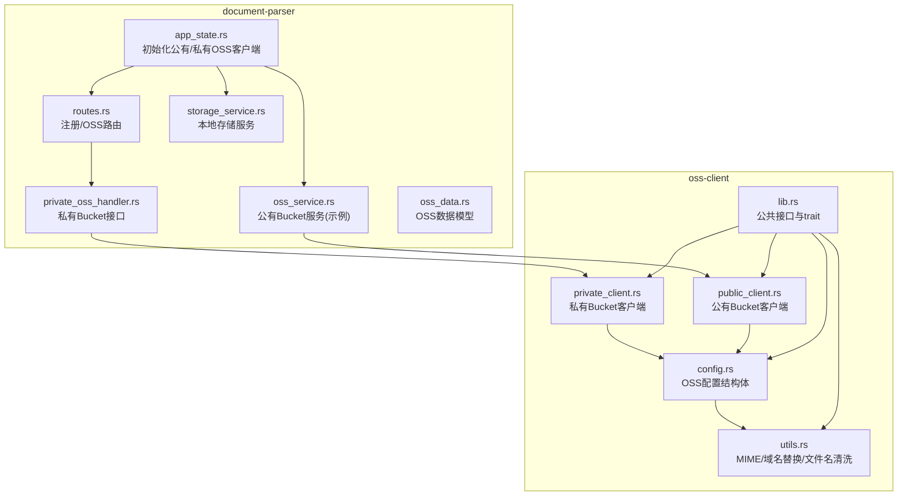
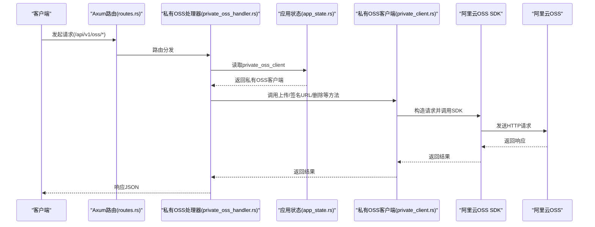
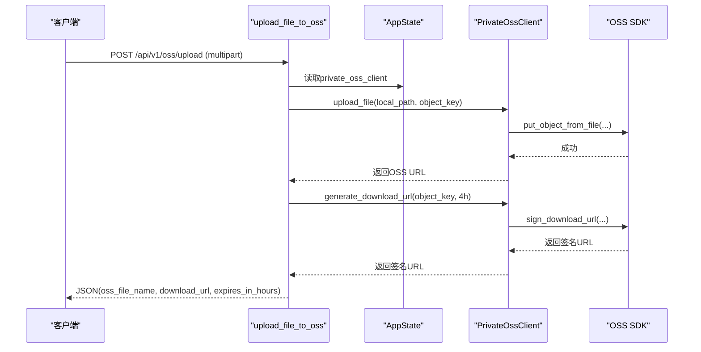
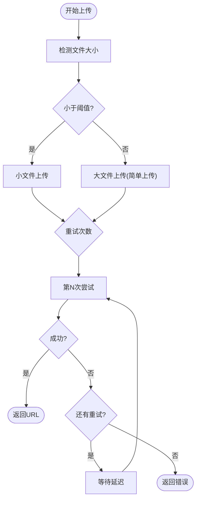
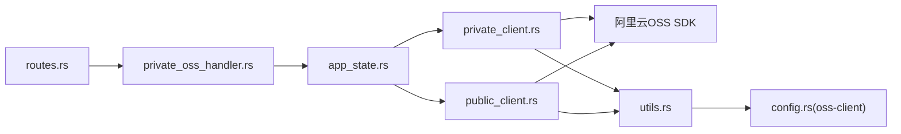

# OSS集成

<cite>
**本文引用的文件**
- [oss_service.rs](file://document-parser/src/services/oss_service.rs)
- [private_oss_handler.rs](file://document-parser/src/handlers/private_oss_handler.rs)
- [oss_data.rs](file://document-parser/src/models/oss_data.rs)
- [storage_service.rs](file://document-parser/src/services/storage_service.rs)
- [lib.rs](file://oss-client/src/lib.rs)
- [private_client.rs](file://oss-client/src/private_client.rs)
- [public_client.rs](file://oss-client/src/public_client.rs)
- [config.rs](file://oss-client/src/config.rs)
- [utils.rs](file://oss-client/src/utils.rs)
- [config.rs](file://document-parser/src/config.rs)
- [app_state.rs](file://document-parser/src/app_state.rs)
- [routes.rs](file://document-parser/src/routes.rs)
- [如何使用OSS签名URL上传文件.md](file://document-parser/如何使用OSS签名URL上传文件.md)
</cite>

## 目录
1. [简介](#简介)
2. [项目结构](#项目结构)
3. [核心组件](#核心组件)
4. [架构总览](#架构总览)
5. [详细组件分析](#详细组件分析)
6. [依赖关系分析](#依赖关系分析)
7. [性能考虑](#性能考虑)
8. [故障排查指南](#故障排查指南)
9. [结论](#结论)
10. [附录](#附录)

## 简介
本文件面向文档解析服务与阿里云OSS的集成方案，系统性阐述以下内容：
- oss_service 的实现要点：文件上传、下载、签名URL生成、批量上传、权限与安全策略、重试与并发控制。
- private_oss_handler 如何处理私有Bucket访问请求：上传、签名URL、删除、下载签名URL。
- 配置OSS连接参数的方法与最佳实践，以及如何实现解析结果自动存储。
- 使用签名URL上传文件的完整工作流程：安全策略、过期时间、跨域配置。
- 故障排查与性能优化建议。

## 项目结构
OSS集成涉及两个主要模块：
- document-parser：提供私有Bucket的HTTP接口、业务封装与存储服务。
- oss-client：提供公有/私有Bucket的统一客户端抽象与工具函数。

图表来源
- [app_state.rs](file://document-parser/src/app_state.rs#L1-L143)
- [routes.rs](file://document-parser/src/routes.rs#L1-L127)
- [private_oss_handler.rs](file://document-parser/src/handlers/private_oss_handler.rs#L1-L484)
- [oss_service.rs](file://document-parser/src/services/oss_service.rs#L1-L939)
- [storage_service.rs](file://document-parser/src/services/storage_service.rs#L1-L1340)
- [oss_data.rs](file://document-parser/src/models/oss_data.rs#L1-L123)
- [lib.rs](file://oss-client/src/lib.rs#L1-L159)
- [public_client.rs](file://oss-client/src/public_client.rs#L1-L612)
- [private_client.rs](file://oss-client/src/private_client.rs#L1-L219)
- [config.rs](file://oss-client/src/config.rs#L1-L86)
- [utils.rs](file://oss-client/src/utils.rs#L1-L502)

章节来源
- [app_state.rs](file://document-parser/src/app_state.rs#L1-L143)
- [routes.rs](file://document-parser/src/routes.rs#L1-L127)

## 核心组件
- 公有/私有OSS客户端抽象：通过统一trait接口封装上传、下载、签名URL生成、删除、存在性检查等能力。
- 私有Bucket HTTP处理器：提供上传、签名URL、删除、下载签名URL等REST接口。
- OSS服务（公有）：提供批量上传、下载、签名URL、删除、对象内容获取等能力，内置重试、并发与进度回调。
- 配置与状态：集中管理OSS配置、初始化客户端、暴露到应用状态。
- 数据模型：OSS数据结构与图片信息模型，便于解析结果与OSS对象的关联。

章节来源
- [lib.rs](file://oss-client/src/lib.rs#L1-L159)
- [private_oss_handler.rs](file://document-parser/src/handlers/private_oss_handler.rs#L1-L484)
- [oss_service.rs](file://document-parser/src/services/oss_service.rs#L1-L939)
- [app_state.rs](file://document-parser/src/app_state.rs#L1-L143)
- [oss_data.rs](file://document-parser/src/models/oss_data.rs#L1-L123)

## 架构总览
整体架构围绕“应用状态”持有公有/私有OSS客户端，并通过路由暴露私有Bucket接口；oss-service用于公有Bucket场景或作为通用能力参考。

图表来源
- [routes.rs](file://document-parser/src/routes.rs#L1-L127)
- [private_oss_handler.rs](file://document-parser/src/handlers/private_oss_handler.rs#L1-L484)
- [app_state.rs](file://document-parser/src/app_state.rs#L1-L143)
- [private_client.rs](file://oss-client/src/private_client.rs#L1-L219)

## 详细组件分析

### 私有Bucket HTTP处理器（private_oss_handler）
- 功能范围
  - 上传文件到私有Bucket：接收multipart表单，生成对象键，上传并返回下载URL（默认4小时有效）。
  - 获取上传签名URL：返回4小时有效期的PUT签名URL，支持自定义内容类型。
  - 获取下载签名URL：返回4小时有效期的GET签名URL。
  - 删除OSS文件：校验存在性后删除。
- 关键行为
  - 参数校验：文件名非空、客户端可用。
  - 对象键命名：支持前缀edu/，并进行文件名清洗与去重。
  - 签名URL过期时间：统一为4小时。
  - 错误处理：针对缺失文件、OSS客户端未配置、签名失败等情况返回相应错误码与消息。
- 安全策略
  - 使用签名URL限制访问范围与时间，避免泄露敏感资源。
  - 上传签名URL使用PUT方法，防止误用POST导致的歧义。
  - 删除操作前先检查文件存在性，避免误删。

图表来源
- [private_oss_handler.rs](file://document-parser/src/handlers/private_oss_handler.rs#L1-L216)
- [private_client.rs](file://oss-client/src/private_client.rs#L93-L117)

章节来源
- [private_oss_handler.rs](file://document-parser/src/handlers/private_oss_handler.rs#L1-L484)

### 公有Bucket客户端（public_client）
- 能力概述
  - 生成公开下载URL（无需签名，永久有效）。
  - 上传/删除/存在性检查等通用操作。
  - 批量生成公开URL与元信息获取。
- 适用场景
  - 公有Bucket的静态资源公开访问。
  - 不需要签名的场景，如公开文档、图片等。

章节来源
- [public_client.rs](file://oss-client/src/public_client.rs#L1-L612)

### 私有Bucket客户端（private_client）
- 能力概述
  - 生成上传/下载签名URL（可自定义过期时间）。
  - 上传/删除/存在性检查等通用操作。
  - 对象键前缀处理与域名替换工具。
- 与SDK交互
  - 使用RequestBuilder构造请求，调用SDK的签名与对象操作API。
  - 支持替换OSS域名，规避跨域问题。

章节来源
- [private_client.rs](file://oss-client/src/private_client.rs#L1-L219)
- [utils.rs](file://oss-client/src/utils.rs#L245-L275)

### OSS服务（公有）能力参考（oss_service）
- 并发与重试
  - 通过信号量限制并发上传。
  - 上传失败自动重试，支持指数退避。
- 批量上传
  - 支持进度回调，聚合成功/失败结果。
  - 自动检测文件大小，选择合适上传路径。
- 下载与签名
  - 下载到临时目录或指定路径。
  - 生成上传/下载签名URL，支持自定义过期时间与内容类型。
- 对象管理
  - 删除对象、批量删除、根据URL提取对象键。
- 错误处理
  - 明确区分404/网络/SDK等错误类型，便于上层处理。

图表来源
- [oss_service.rs](file://document-parser/src/services/oss_service.rs#L163-L231)
- [oss_service.rs](file://document-parser/src/services/oss_service.rs#L402-L472)
- [oss_service.rs](file://document-parser/src/services/oss_service.rs#L552-L642)

章节来源
- [oss_service.rs](file://document-parser/src/services/oss_service.rs#L1-L939)

### 配置与状态（app_state）
- 初始化公有/私有OSS客户端
  - 从配置中读取endpoint、bucket、access_key_id、access_key_secret、region、upload_directory。
  - 公有客户端默认启用；私有客户端初始化失败会记录警告并跳过。
- 暴露到应用状态
  - oss_client：公有客户端。
  - private_oss_client：私有客户端（可选）。

章节来源
- [app_state.rs](file://document-parser/src/app_state.rs#L1-L143)
- [config.rs](file://document-parser/src/config.rs#L684-L739)

### 数据模型（oss_data）
- OssData：包含markdown URL、对象键、图片列表与bucket信息。
- ImageInfo：包含原始路径、原始文件名、OSS对象键、OSS URL、文件大小、MIME类型、宽高（可选）。

章节来源
- [oss_data.rs](file://document-parser/src/models/oss_data.rs#L1-L123)

## 依赖关系分析
- 组件耦合
  - 私有Bucket接口依赖AppState中的private_oss_client。
  - oss-client提供统一trait，document-parser通过该trait屏蔽具体实现差异。
- 外部依赖
  - 阿里云OSS Rust SDK：负责底层HTTP请求与签名生成。
  - CORS中间件：允许跨域访问，便于前端直连签名URL。
- 可能的循环依赖
  - 当前结构清晰，无明显循环依赖迹象。

图表来源
- [routes.rs](file://document-parser/src/routes.rs#L1-L127)
- [private_oss_handler.rs](file://document-parser/src/handlers/private_oss_handler.rs#L1-L484)
- [app_state.rs](file://document-parser/src/app_state.rs#L1-L143)
- [private_client.rs](file://oss-client/src/private_client.rs#L1-L219)
- [public_client.rs](file://oss-client/src/public_client.rs#L1-L612)
- [utils.rs](file://oss-client/src/utils.rs#L1-L502)
- [config.rs](file://oss-client/src/config.rs#L1-L86)

章节来源
- [routes.rs](file://document-parser/src/routes.rs#L1-L127)
- [app_state.rs](file://document-parser/src/app_state.rs#L1-L143)

## 性能考虑
- 并发控制
  - 使用信号量限制同时上传数量，避免OSS限速与本地资源耗尽。
- 重试策略
  - 指数退避重试，减少瞬时错误对吞吐的影响。
- 批量上传
  - 使用流式并发，结合进度回调，提升大文件集合的处理效率。
- 下载与签名
  - 下载采用临时文件落盘，避免内存峰值；签名URL按需生成，减少重复计算。
- 域名替换
  - 通过域名替换规避跨域问题，减少浏览器CORS带来的额外开销。

章节来源
- [oss_service.rs](file://document-parser/src/services/oss_service.rs#L1-L939)
- [private_client.rs](file://oss-client/src/private_client.rs#L1-L219)
- [utils.rs](file://oss-client/src/utils.rs#L245-L275)

## 故障排查指南
- 私有Bucket接口常见问题
  - “OSS客户端未配置”：确认AppState初始化是否成功，私有客户端初始化失败会记录警告。
  - “文件名为空”：上传/签名URL接口要求file_name非空。
  - “签名URL生成失败”：检查access_key_id/secret、endpoint、bucket是否正确。
  - “删除文件不存在”：删除前会检查存在性，若不存在返回404。
- 公有Bucket问题
  - 公有URL不可用：确认bucket为公有，且对象键前缀正确。
  - 元信息获取失败：HEAD请求可能因网络或权限失败，需重试或检查权限。
- 通用问题
  - CORS跨域：路由层已启用宽松CORS，若仍出现跨域，请检查前端请求头与签名URL域名替换。
  - 文件大小限制：全局文件大小配置影响请求体大小限制，注意调整DefaultBodyLimit。
  - 临时文件写入失败：检查临时目录权限与磁盘空间。

章节来源
- [private_oss_handler.rs](file://document-parser/src/handlers/private_oss_handler.rs#L1-L484)
- [routes.rs](file://document-parser/src/routes.rs#L1-L127)
- [config.rs](file://document-parser/src/config.rs#L1-L800)

## 结论
本方案通过统一的OSS客户端抽象与严格的私有Bucket接口设计，实现了安全、可控、可扩展的文档解析与文件管理能力。私有Bucket接口提供签名URL上传与下载，配合合理的过期时间与跨域配置，既满足安全需求又兼顾易用性。公有Bucket客户端与oss_service为静态资源与批量处理提供了补充能力。通过合理的并发、重试与进度回调机制，系统在高负载场景下也能保持稳定与高效。

## 附录

### 配置OSS连接参数
- document-parser配置
  - 在配置中设置endpoint、public_bucket、private_bucket、access_key_id、access_key_secret、region、upload_directory。
  - 通过AppState初始化公有/私有客户端，私有客户端初始化失败会记录警告。
- oss-client配置
  - OssConfig包含endpoint、bucket、access_key_id、access_key_secret、region、upload_directory。
  - get_base_url与get_prefixed_key用于生成基础URL与带前缀的对象键。
- 环境变量
  - access_key_id与access_key_secret可通过环境变量注入，避免硬编码。

章节来源
- [config.rs](file://document-parser/src/config.rs#L684-L739)
- [app_state.rs](file://document-parser/src/app_state.rs#L1-L143)
- [config.rs](file://oss-client/src/config.rs#L1-L86)

### 实现解析结果自动存储
- 使用oss_service上传解析结果（如Markdown与图片）
  - 上传Markdown：生成唯一对象键，返回URL与object_key。
  - 上传图片：生成images目录下的对象键，返回ImageInfo。
  - 批量上传：支持进度回调，聚合结果。
- 将OSS数据写入本地存储
  - 使用StorageService保存任务与索引，实现解析结果的持久化与查询。
  - 可结合oss_data模型，将OSS URL与图片信息持久化。

章节来源
- [oss_service.rs](file://document-parser/src/services/oss_service.rs#L246-L283)
- [oss_service.rs](file://document-parser/src/services/oss_service.rs#L474-L497)
- [oss_service.rs](file://document-parser/src/services/oss_service.rs#L499-L642)
- [storage_service.rs](file://document-parser/src/services/storage_service.rs#L1-L1340)
- [oss_data.rs](file://document-parser/src/models/oss_data.rs#L1-L123)

### 使用签名URL上传文件的完整工作流程
- 获取上传签名URL
  - 调用/get上传签名URL接口，得到4小时有效期的PUT签名URL与对象键。
- 直接上传
  - 使用PUT方法向返回的URL上传文件，设置正确的Content-Type。
- 生成下载签名URL
  - 上传完成后，可调用/get下载签名URL接口获取4小时有效期的GET签名URL。
- 跨域配置
  - 路由层已启用宽松CORS；若仍出现跨域问题，检查前端请求头与签名URL域名替换。
- 安全策略
  - 仅授予必要时间窗口的签名URL，避免长期有效。
  - 对文件名进行清洗，避免路径穿越与非法字符。

章节来源
- [如何使用OSS签名URL上传文件.md](file://document-parser/如何使用OSS签名URL上传文件.md#L1-L218)
- [private_oss_handler.rs](file://document-parser/src/handlers/private_oss_handler.rs#L218-L309)
- [private_oss_handler.rs](file://document-parser/src/handlers/private_oss_handler.rs#L311-L389)
- [routes.rs](file://document-parser/src/routes.rs#L1-L127)
- [utils.rs](file://oss-client/src/utils.rs#L245-L275)