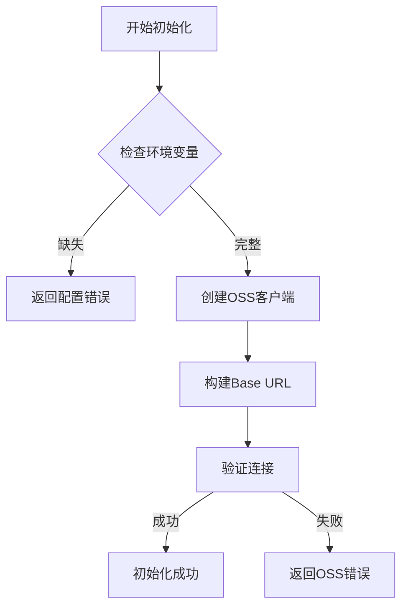
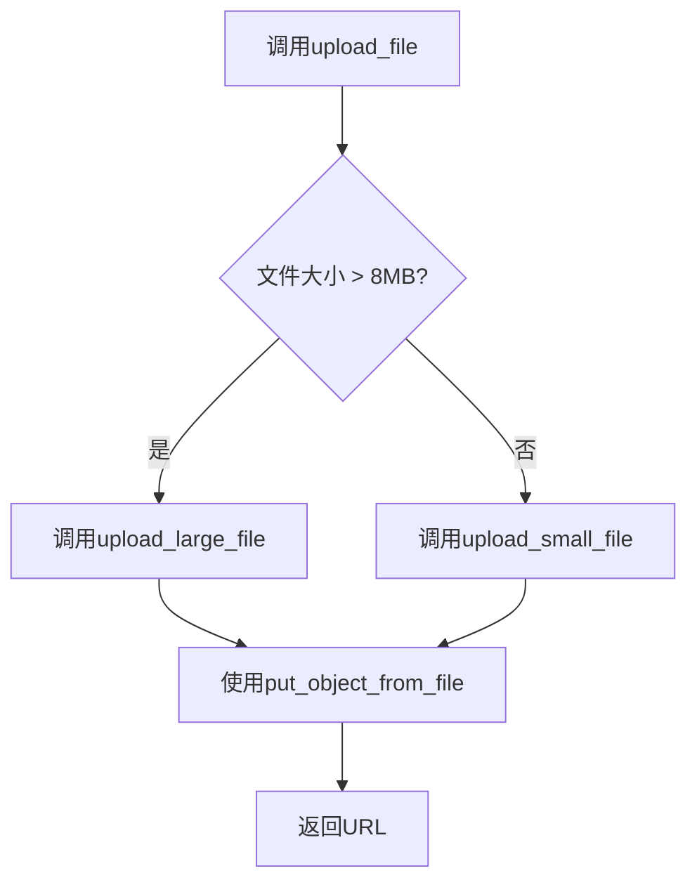
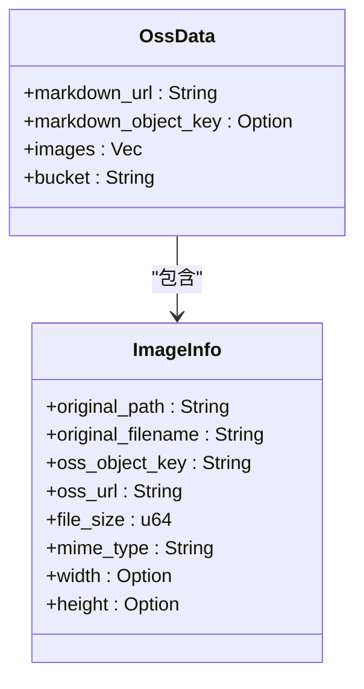
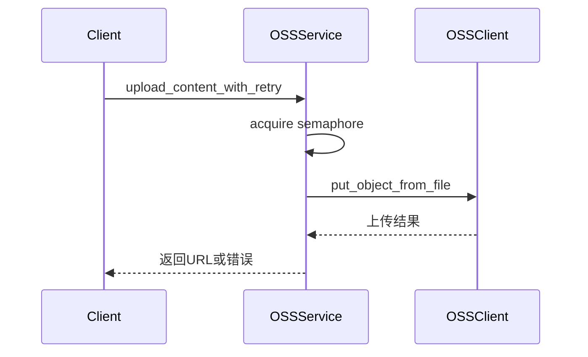
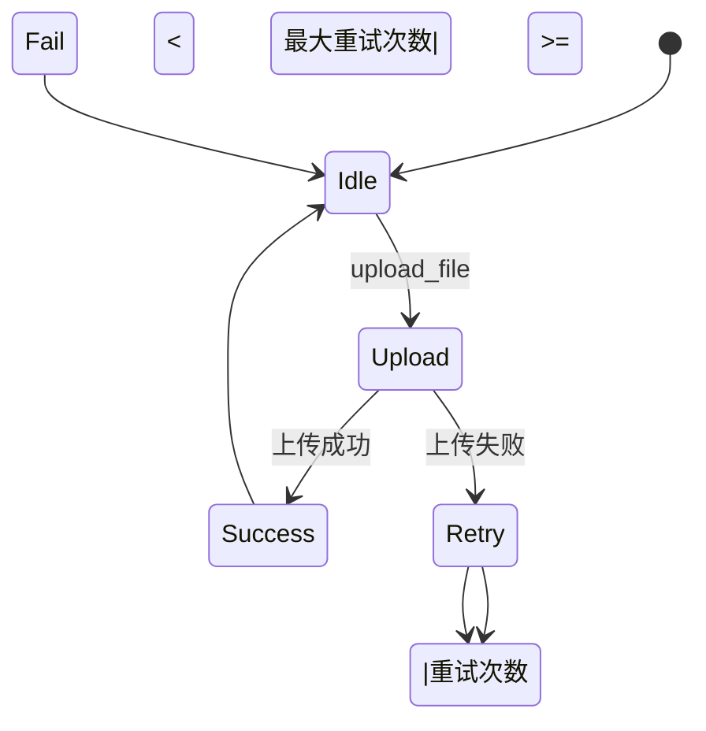

# OSS服务封装

<cite>
**本文档引用的文件**
- [oss_service.rs](file://document-parser/src/services/oss_service.rs)
- [oss_data.rs](file://document-parser/src/models/oss_data.rs)
- [private_client.rs](file://oss-client/src/private_client.rs)
- [utils.rs](file://oss-client/src/utils.rs)
- [如何使用OSS签名URL上传文件.md](file://document-parser/如何使用OSS签名URL上传文件.md)
</cite>

## 目录
1. [简介](#简介)
2. [OSS服务初始化与配置](#oss服务初始化与配置)
3. [核心操作实现](#核心操作实现)
4. [OSS数据结构详解](#oss数据结构详解)
5. [大文件分片上传与断点续传](#大文件分片上传与断点续传)
6. [上传进度监控](#上传进度监控)
7. [异常处理机制](#异常处理机制)
8. [性能优化策略](#性能优化策略)
9. [安全与域名替换](#安全与域名替换)
10. [结论](#结论)

## 简介
本文档深入解析`OSSService`模块的实现细节，重点阐述其如何封装阿里云OSS的核心操作，包括文件上传、下载、删除、元数据获取等。详细说明`oss_service.rs`中各方法的调用流程与异常处理机制，特别是与`oss-client`库的交互方式。同时，解释`OSSData`结构体在`oss_data.rs`中的字段定义及其在传输过程中的序列化行为。结合代码示例展示如何通过`OSSService`实现大文件的分片上传、断点续传和上传进度监控功能，并说明其实现原理与性能优化策略。

## OSS服务初始化与配置

`OSSService`模块通过`OssService`结构体封装了与阿里云OSS的交互逻辑。服务的初始化过程确保了配置的完整性和连接的可用性。



**Diagram sources**
- [oss_service.rs](file://document-parser/src/services/oss_service.rs#L95-L136)

**Section sources**
- [oss_service.rs](file://document-parser/src/services/oss_service.rs#L57-L136)

## 核心操作实现

`OSSService`提供了丰富的API来执行OSS的核心操作，包括文件上传、下载、删除和URL生成等。

### 文件上传
`upload_file`方法根据文件大小决定上传策略。对于小文件（小于8MB），直接使用简单上传；对于大文件，虽然当前实现仍使用简单上传，但已预留了分片上传的接口。



**Diagram sources**
- [oss_service.rs](file://document-parser/src/services/oss_service.rs#L173-L206)

### 文件下载
`download_to_path`方法负责将OSS上的文件下载到本地指定路径。它首先创建目标目录，然后调用`do_download`执行实际的下载操作。

### 文件删除
`delete_object`方法用于删除OSS上的单个对象，而`delete_objects`则支持批量删除。

### URL生成
`generate_download_url`和`generate_upload_url`方法分别用于生成带签名的下载和上传URL，支持自定义过期时间。

**Section sources**
- [oss_service.rs](file://document-parser/src/services/oss_service.rs#L138-L173)

## OSS数据结构详解

`OSSData`结构体定义了与OSS交互的数据模型，用于在系统内部传递和存储OSS相关的信息。

```rust
#[derive(Debug, Clone, Serialize, Deserialize, ToSchema)]
pub struct OssData {
    pub markdown_url: String,
    pub markdown_object_key: Option<String>,
    pub images: Vec<ImageInfo>,
    pub bucket: String,
}
```

`ImageInfo`结构体则用于存储图片的详细信息，包括原始路径、OSS对象键、URL、文件大小和MIME类型等。



**Diagram sources**
- [oss_data.rs](file://document-parser/src/models/oss_data.rs#L4-L34)

**Section sources**
- [oss_data.rs](file://document-parser/src/models/oss_data.rs#L4-L34)

## 大文件分片上传与断点续传

尽管当前实现中大文件上传仍使用简单上传，但`OSSService`的设计为分片上传和断点续传提供了基础。通过`upload_content_with_retry`方法，可以实现上传失败后的自动重试，这是断点续传的关键。



**Diagram sources**
- [oss_service.rs](file://document-parser/src/services/oss_service.rs#L411-L449)

## 上传进度监控

`OSSService`通过`ProgressCallback`类型支持上传进度的监控。`upload_images_with_progress`方法在批量上传图片时，会定期调用进度回调函数，通知上传的进度。

```rust
pub type ProgressCallback = Arc<dyn Fn(usize, usize) + Send + Sync>;
```

**Section sources**
- [oss_service.rs](file://document-parser/src/services/oss_service.rs#L5-L9)

## 异常处理机制

`OSSService`通过`AppError`枚举类型处理各种异常情况，包括配置错误、OSS操作错误等。在上传、下载等操作中，都会捕获底层SDK的错误并转换为`AppError`。



**Diagram sources**
- [oss_service.rs](file://document-parser/src/services/oss_service.rs#L411-L449)

## 性能优化策略

`OSSService`通过多种策略优化性能，包括并发控制、重试机制和临时文件的使用。

- **并发控制**：使用`Semaphore`限制同时上传的文件数量，避免资源耗尽。
- **重试机制**：在上传失败时自动重试，提高上传的可靠性。
- **临时文件**：在上传内容时，先将内容写入临时文件，再通过文件上传，减少内存占用。

**Section sources**
- [oss_service.rs](file://document-parser/src/services/oss_service.rs#L57-L93)

## 安全与域名替换

为了提高安全性和用户体验，`OSSService`支持域名替换。通过`replace_oss_domain`函数，可以将阿里云OSS的默认域名替换为自定义域名，避免跨域问题。

```rust
pub fn replace_oss_domain(url: &str) -> String {
    const OLD_DOMAIN: &str = "https://nuwa-packages.oss-rg-china-mainland.aliyuncs.com";
    const NEW_DOMAIN: &str = "https://statics-ali.nuwax.com";
    if url.starts_with(OLD_DOMAIN) {
        url.replacen(OLD_DOMAIN, NEW_DOMAIN, 1)
    } else {
        url.to_string()
    }
}
```

**Section sources**
- [utils.rs](file://oss-client/src/utils.rs#L244-L274)

## 结论
`OSSService`模块通过封装阿里云OSS的核心操作，提供了一个高效、可靠且易于使用的接口。其设计考虑了性能、安全性和用户体验，为系统中的文件管理提供了坚实的基础。通过进一步完善分片上传和断点续传功能，可以更好地支持大文件的上传需求。