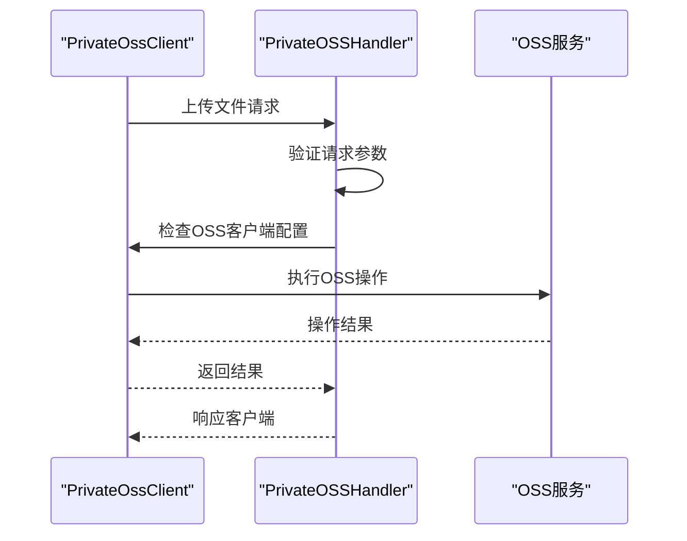
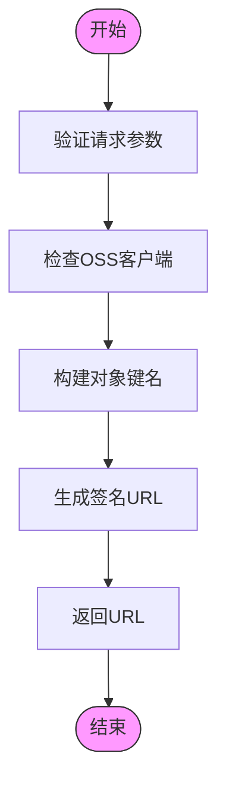
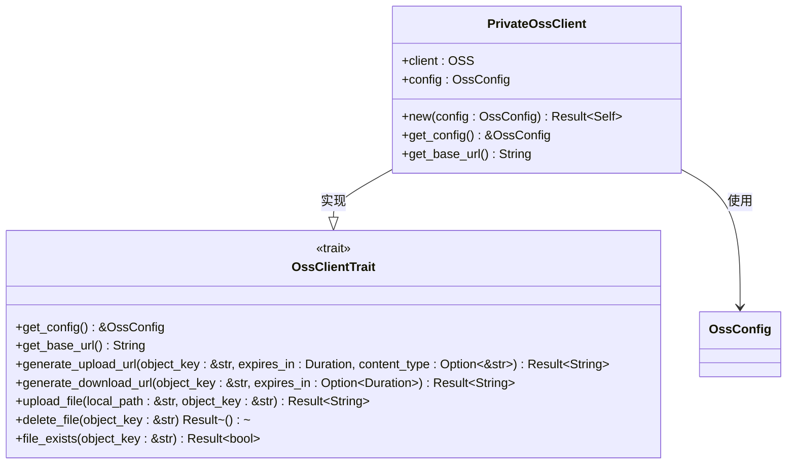
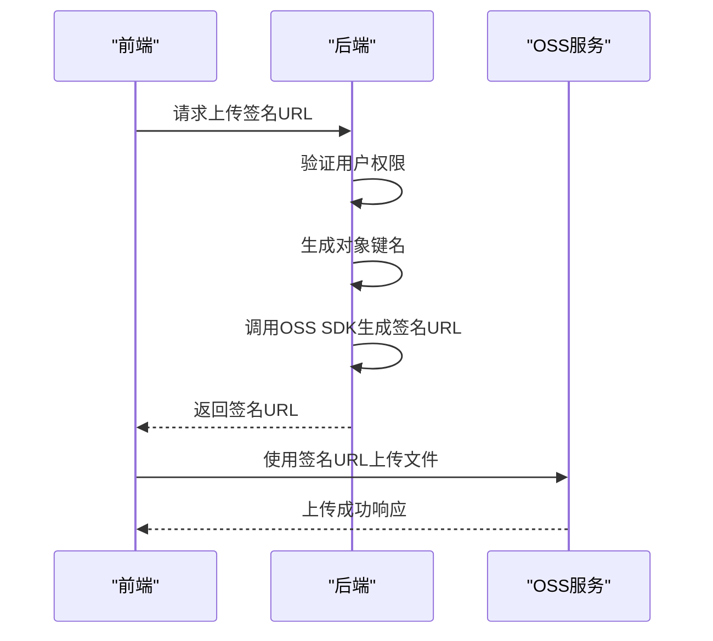

# 安全访问控制

<cite>
**本文档引用文件**   
- [private_oss_handler.rs](file://document-parser/src/handlers/private_oss_handler.rs)
- [private_client.rs](file://oss-client/src/private_client.rs)
- [oss_service.rs](file://document-parser/src/services/oss_service.rs)
- [app_state.rs](file://document-parser/src/app_state.rs)
- [oss_data.rs](file://document-parser/src/models/oss_data.rs)
- [config.rs](file://oss-client/src/config.rs)
- [utils.rs](file://oss-client/src/utils.rs)
- [document_task.rs](file://document-parser/src/models/document_task.rs)
- [如何使用OSS签名URL上传文件.md](file://document-parser/如何使用OSS签名URL上传文件.md)
</cite>

## 目录
1. [引言](#引言)
2. [私有OSS资源代理访问机制](#私有oss资源代理访问机制)
3. [签名URL生成流程](#签名url生成流程)
4. [权限验证与安全控制](#权限验证与安全控制)
5. [临时凭证处理](#临时凭证处理)
6. [代码示例](#代码示例)
7. [安全增强措施](#安全增强措施)
8. [结论](#结论)

## 引言
本文档全面介绍私有OSS资源的安全访问机制，重点分析`private_oss_handler.rs`如何实现对私有资源的代理访问与权限验证。基于“如何使用OSS签名URL上传文件.md”文档，详细说明签名URL的生成流程、有效期控制及安全性保障措施。系统通过`PrivateClient`安全地处理临时凭证，并防止未授权访问。同时讨论访问日志记录、请求频率限制等安全增强措施。

**Section sources**
- [private_oss_handler.rs](file://document-parser/src/handlers/private_oss_handler.rs#L1-L50)

## 私有OSS资源代理访问机制
系统通过`private_oss_handler.rs`中的多个处理函数实现对私有OSS资源的代理访问。这些处理函数作为API端点，接收客户端请求，验证权限后代理执行相应的OSS操作。

核心处理函数包括：
- `upload_file_to_oss`: 处理文件上传请求
- `get_upload_sign_url`: 获取上传签名URL
- `get_download_sign_url`: 获取下载签名URL
- `delete_file_from_oss`: 删除OSS文件

这些函数通过`AppState`中的`private_oss_client`与OSS服务进行交互，实现了对私有资源的安全代理访问。



**Diagram sources **
- [private_oss_handler.rs](file://document-parser/src/handlers/private_oss_handler.rs#L100-L200)
- [private_client.rs](file://oss-client/src/private_client.rs#L50-L100)

**Section sources**
- [private_oss_handler.rs](file://document-parser/src/handlers/private_oss_handler.rs#L1-L484)
- [private_client.rs](file://oss-client/src/private_client.rs#L1-L219)

## 签名URL生成流程
签名URL的生成是安全访问私有OSS资源的关键机制。系统通过`PrivateOssClient`的`generate_upload_url`和`generate_download_url`方法生成带有签名的URL。

### 上传签名URL生成
上传签名URL的生成流程如下：
1. 客户端请求获取上传签名URL
2. 服务端验证文件名等参数
3. 检查`private_oss_client`配置
4. 构建对象键名（自动添加`edu/`前缀）
5. 调用OSS SDK生成签名URL
6. 返回签名URL给客户端



**Diagram sources **
- [private_oss_handler.rs](file://document-parser/src/handlers/private_oss_handler.rs#L250-L300)
- [private_client.rs](file://oss-client/src/private_client.rs#L100-L120)

### 下载签名URL生成
下载签名URL的生成流程与上传类似，但有效期固定为4小时。系统通过`get_download_sign_url`函数处理下载请求，确保只有授权用户才能获取临时下载链接。

**Section sources**
- [private_oss_handler.rs](file://document-parser/src/handlers/private_oss_handler.rs#L301-L400)
- [private_client.rs](file://oss-client/src/private_client.rs#L120-L140)

## 权限验证与安全控制
系统实现了多层次的权限验证与安全控制机制，确保私有OSS资源的安全访问。

### 请求参数验证
所有API端点都对请求参数进行严格验证：
- 文件名不能为空或仅包含空白字符
- 存储桶名称必须有效
- 对象键名自动添加`edu/`前缀，确保资源隔离

### 客户端配置验证
在执行任何OSS操作前，系统会检查`private_oss_client`是否已正确配置：
```rust
let oss_client = match &state.private_oss_client {
    Some(client) => client,
    None => {
        error!("OSS客户端未配置");
        return ApiResponse::internal_error::<FileUploadResponse>("OSS客户端未配置")
            .into_response();
    }
};
```

### 文件存在性检查
在删除文件前，系统会先检查文件是否存在，避免误删操作：
```rust
match oss_client.file_exists(&object_key).await {
    Ok(exists) => {
        if !exists {
            warn!("要删除的文件不存在: {}", object_key);
            return ApiResponse::not_found::<DeleteFileResponse>("文件不存在").into_response();
        }
    }
    Err(e) => {
        error!("检查文件存在性失败: file_name={}, error={}", params.file_name, e);
        return ApiResponse::internal_error::<DeleteFileResponse>(&format!("检查文件存在性失败: {e}"))
            .into_response();
    }
}
```



**Diagram sources **
- [private_client.rs](file://oss-client/src/private_client.rs#L1-L50)
- [lib.rs](file://oss-client/src/lib.rs#L50-L100)

**Section sources**
- [private_oss_handler.rs](file://document-parser/src/handlers/private_oss_handler.rs#L1-L100)
- [private_client.rs](file://oss-client/src/private_client.rs#L1-L219)

## 临时凭证处理
系统通过`PrivateClient`安全地处理临时凭证，确保凭证的生成、使用和过期都受到严格控制。

### 凭证有效期控制
所有生成的签名URL都有固定的有效期（4小时），过期后无法访问：
```rust
// 4小时有效期
let expires_in = Duration::from_secs(4 * 3600);
```

### 凭证安全性保障
系统通过以下措施保障凭证安全性：
- 使用HTTPS传输签名URL
- 签名URL包含时间戳和签名，防止篡改
- 临时凭证无法用于获取长期访问权限

### 凭证生成与使用
`PrivateOssClient`的`generate_upload_url`方法负责生成上传凭证：
```rust
fn generate_upload_url(
    &self,
    object_key: &str,
    expires_in: std::time::Duration,
    content_type: Option<&str>,
) -> Result<String> {
    let prefixed_key = self.config.get_prefixed_key(object_key);

    let mut builder = RequestBuilder::new().with_expire(expires_in.as_secs() as i64);
    if let Some(ct) = content_type {
        builder = builder.with_content_type(ct);
    } else {
        builder = builder.with_content_type("application/octet-stream");
    }

    let url = self.client.sign_upload_url(&prefixed_key, &builder);
    let url = utils::replace_oss_domain(&url);
    Ok(url)
}
```

**Section sources**
- [private_client.rs](file://oss-client/src/private_client.rs#L100-L150)
- [config.rs](file://oss-client/src/config.rs#L1-L86)

## 代码示例
以下是签名URL生成与文件上传的代码示例，涵盖前端直传场景下的后端签名服务实现。

### 后端签名服务实现


**Diagram sources **
- [private_oss_handler.rs](file://document-parser/src/handlers/private_oss_handler.rs#L250-L350)
- [如何使用OSS签名URL上传文件.md](file://document-parser/如何使用OSS签名URL上传文件.md#L1-L50)

### 前端直传实现
前端获取签名URL后，可直接向OSS服务上传文件，无需经过后端服务器，提高上传效率并降低服务器负载。

**Section sources**
- [private_oss_handler.rs](file://document-parser/src/handlers/private_oss_handler.rs#L250-L400)
- [如何使用OSS签名URL上传文件.md](file://document-parser/如何使用OSS签名URL上传文件.md#L1-L100)

## 安全增强措施
系统实现了多项安全增强措施，进一步提升私有OSS资源访问的安全性。

### 访问日志记录
所有OSS操作都会被记录到日志中，便于审计和问题排查：
```rust
info!("OSS文件上传请求");
info!("生成上传签名URL成功: object_key={}, content_type={}", object_key, content_type);
error!("生成上传签名URL失败: file_name={}, error={}", params.file_name, e);
```

### 请求频率限制
虽然当前代码中未直接实现请求频率限制，但可通过中间件或API网关实现，防止恶意用户频繁请求签名URL。

### 文件名清理
系统会对上传的文件名进行清理，移除特殊字符，防止路径遍历等安全问题：
```rust
pub fn sanitize_filename(filename: &str) -> String {
    filename
        .chars()
        .map(|c| {
            if c.is_alphanumeric() || c == '.' || c == '-' || c == '_' {
                c
            } else {
                '_'
            }
        })
        .collect()
}
```

### 域名替换
系统会将OSS域名替换为自定义域名，解决跨域问题并隐藏实际存储位置：
```rust
pub fn replace_oss_domain(url: &str) -> String {
    const OLD_DOMAIN: &str = "https://nuwa-packages.oss-rg-china-mainland.aliyuncs.com";
    const NEW_DOMAIN: &str = "https://statics-ali.nuwax.com";
    debug!("替换OSS域名: {}", url);
    let new_url = if url.starts_with(OLD_DOMAIN) {
        url.replacen(OLD_DOMAIN, NEW_DOMAIN, 1)
    } else {
        url.to_string()
    };
    debug!("替换后的OSS域名: {}", new_url);
    new_url
}
```

**Section sources**
- [utils.rs](file://oss-client/src/utils.rs#L1-L502)
- [private_oss_handler.rs](file://document-parser/src/handlers/private_oss_handler.rs#L1-L484)

## 结论
本文档详细介绍了私有OSS资源的安全访问机制。系统通过`private_oss_handler.rs`实现对私有资源的代理访问与权限验证，基于“如何使用OSS签名URL上传文件.md”文档说明了签名URL的生成流程、有效期控制及安全性保障措施。`PrivateClient`安全地处理临时凭证，防止未授权访问。通过访问日志记录、文件名清理、域名替换等安全增强措施，系统提供了多层次的安全防护，确保私有OSS资源的安全访问。