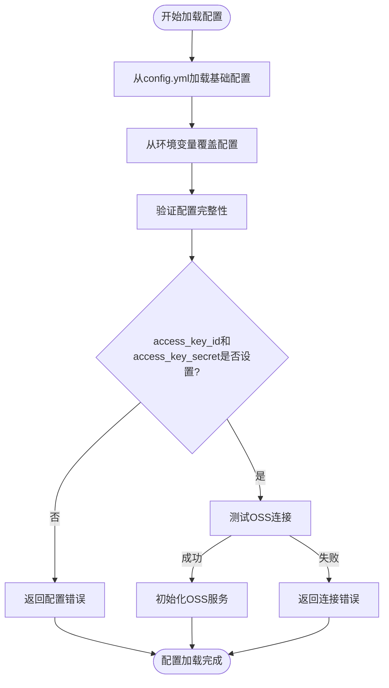
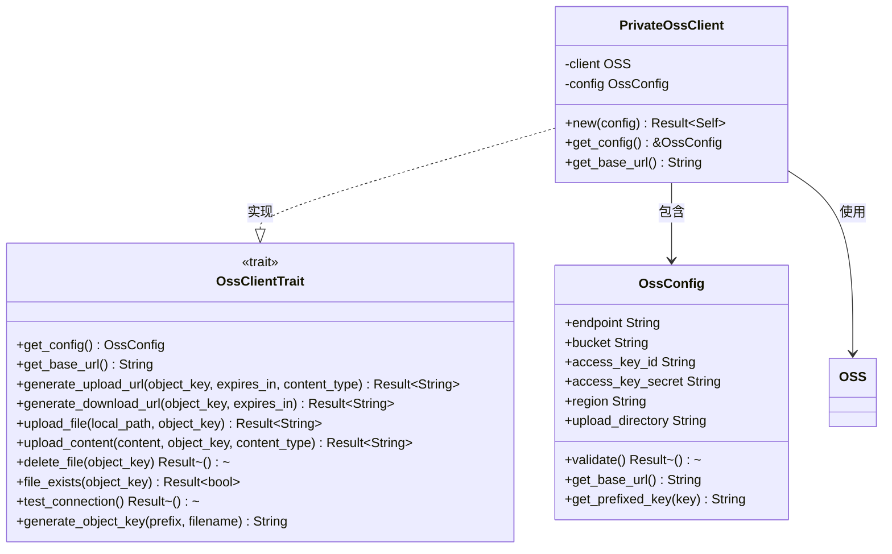

# 配置与认证

<cite>
**本文档引用的文件**
- [config.yml](file://document-parser/config.yml)
- [config.rs](file://document-parser/src/config.rs)
- [private_client.rs](file://oss-client/src/private_client.rs)
- [lib.rs](file://oss-client/src/lib.rs)
- [config.rs](file://oss-client/src/config.rs)
- [oss_service.rs](file://document-parser/src/services/oss_service.rs)
- [error.rs](file://oss-client/src/error.rs)
- [utils.rs](file://oss-client/src/utils.rs)
</cite>

## 目录
1. [OSS配置参数详解](#oss配置参数详解)
2. [配置加载与验证机制](#配置加载与验证机制)
3. [PrivateClient实现机制](#privateclient实现机制)
4. [配置错误排查方法](#配置错误排查方法)
5. [安全存储密钥最佳实践](#安全存储密钥最佳实践)

## OSS配置参数详解

在`document-parser/config.yml`文件中，OSS相关配置位于`storage.oss`节点下，包含以下关键参数：

- **endpoint**: OSS服务端点地址，用于指定OSS服务的访问域名。示例中配置为`oss-rg-china-mainland.aliyuncs.com`，对应阿里云华东地域的OSS服务。
- **public_bucket**: 公共存储桶名称，用于存储公开访问的文件。示例中为`nuwa-packages`，该存储桶中的文件可通过公共URL直接访问。
- **private_bucket**: 私有存储桶名称，用于存储需要权限控制的文件。示例中为`edu-nuwa-packages`，该存储桶中的文件需要通过签名URL才能访问。
- **access_key_id**: 访问密钥ID，用于身份认证。在配置文件中通过环境变量`${OSS_ACCESS_KEY_ID}`引用，避免明文存储。
- **access_key_secret**: 访问密钥密钥，与access_key_id配对使用进行身份认证。同样通过环境变量`${OSS_ACCESS_KEY_SECRET}`引用。
- **region**: 区域标识，指定OSS服务所在的地理区域。示例中为`oss-rg-china-mainland`，表示华东地域。
- **upload_directory**: 上传目录前缀，所有上传文件的OSS对象键（object key）都会加上此前缀，实现文件的逻辑分组。

这些参数共同定义了OSS服务的连接信息和访问策略，确保应用程序能够正确地与OSS服务进行交互。

**Section sources**
- [config.yml](file://document-parser/config.yml#L50-L58)

## 配置加载与验证机制

OSS配置的加载和验证主要通过`document-parser/src/config.rs`文件中的`AppConfig`结构体实现。配置加载过程遵循以下步骤：

1. **基础配置加载**: 通过`load_base_config()`方法从`config.yml`文件加载基础配置，该文件内容通过`include_str!("../config.yml")`在编译时嵌入。
2. **环境变量覆盖**: 使用`load_all_from_env()`方法从环境变量中读取配置值，覆盖配置文件中的占位符（如`${OSS_ACCESS_KEY_ID}`）。
3. **配置验证**: 调用`validate()`方法对所有配置项进行完整性验证。对于OSS配置，会检查`endpoint`、`public_bucket`、`private_bucket`等字段是否为空。
4. **运行时检查**: 在`OssService::new()`中，会进一步检查`access_key_id`和`access_key_secret`是否已通过环境变量正确设置。

配置验证机制确保了关键参数的完整性和有效性。例如，`OssConfig::validate()`方法会检查`access_key_id`和`access_key_secret`是否为空，并在`OssService::new_with_config()`中进行连接验证，确保OSS服务可访问。

**Diagram sources**
- [config.rs](file://document-parser/src/config.rs#L799-L800)
- [oss_service.rs](file://document-parser/src/services/oss_service.rs#L50-L100)

**Section sources**
- [config.rs](file://document-parser/src/config.rs#L799-L850)
- [oss_service.rs](file://document-parser/src/services/oss_service.rs#L50-L150)

## PrivateClient实现机制

`PrivateClient`的实现位于`oss-client/src/private_client.rs`文件中，通过`PrivateOssClient`结构体提供私有存储桶的安全访问功能。其核心机制包括：

1. **安全凭证管理**: `PrivateOssClient`在创建时接收`OssConfig`对象，其中包含`access_key_id`和`access_key_secret`。这些凭证在内存中以安全方式存储，并通过`OSS::new()`传递给底层SDK，避免在代码中硬编码。
2. **签名URL生成**: 通过`generate_upload_url`和`generate_download_url`方法生成带有签名的临时访问URL。签名URL包含过期时间、内容类型等限制，确保访问的安全性。
3. **文件操作**: 提供`upload_file`、`upload_content`、`delete_file`等异步方法，封装了底层SDK的复杂操作，简化了文件管理。
4. **连接测试**: `test_connection()`方法通过上传并删除测试文件来验证OSS连接的有效性，确保服务可用。

`PrivateOssClient`实现了`OssClientTrait`接口，该接口定义了所有OSS客户端的公共操作，确保了API的一致性和可扩展性。通过`async-trait`宏，所有方法都支持异步调用，适应高并发场景。

**Diagram sources**
- [private_client.rs](file://oss-client/src/private_client.rs#L0-L50)
- [lib.rs](file://oss-client/src/lib.rs#L50-L100)
- [config.rs](file://oss-client/src/config.rs#L0-L50)

**Section sources**
- [private_client.rs](file://oss-client/src/private_client.rs#L0-L100)
- [lib.rs](file://oss-client/src/lib.rs#L50-L100)

## 配置错误排查方法

当OSS功能出现配置错误时，可按照以下步骤进行排查：

1. **检查环境变量**: 确认`OSS_ACCESS_KEY_ID`和`OSS_ACCESS_KEY_SECRET`环境变量已正确设置。可通过`printenv`命令或在代码中添加日志输出验证。
2. **验证配置文件**: 检查`config.yml`中`storage.oss`节点的`endpoint`、`public_bucket`、`private_bucket`等参数是否正确，确保没有拼写错误。
3. **测试网络连接**: 确保服务器能够访问OSS的`endpoint`地址，可通过`ping`或`telnet`命令测试网络连通性。
4. **检查凭证权限**: 确认`access_key_id`和`access_key_secret`具有对指定存储桶的读写权限，避免权限不足导致的操作失败。
5. **查看日志信息**: 检查应用程序日志，特别是`OssService::new()`和`validate_connection()`方法的日志输出，获取详细的错误信息。

常见错误包括：环境变量未设置导致`access_key_id`为空、`endpoint`配置错误导致连接超时、存储桶名称拼写错误导致404错误等。通过系统化的排查，可以快速定位并解决配置问题。

**Section sources**
- [config.rs](file://document-parser/src/config.rs#L799-L850)
- [oss_service.rs](file://document-parser/src/services/oss_service.rs#L50-L150)

## 安全存储密钥最佳实践

为确保OSS访问凭证的安全，建议采用以下最佳实践：

1. **使用环境变量**: 如示例配置所示，将`access_key_id`和`access_key_secret`通过环境变量注入，避免在代码或配置文件中明文存储。
2. **密钥管理系统**: 使用专业的密钥管理系统（如Hashicorp Vault、AWS KMS）存储和管理密钥，通过API动态获取，减少密钥暴露风险。
3. **最小权限原则**: 为OSS访问密钥分配最小必要的权限，仅授予对特定存储桶的读写权限，避免使用具有全局权限的主账号密钥。
4. **定期轮换密钥**: 定期更换访问密钥，降低密钥泄露后的风险。阿里云OSS支持多组密钥同时生效，便于平滑过渡。
5. **安全传输**: 确保环境变量或密钥管理系统的通信过程使用HTTPS等加密协议，防止密钥在传输过程中被截获。

通过结合环境变量和密钥管理系统，可以构建一个既安全又灵活的密钥管理方案，有效保护OSS访问凭证，防止敏感信息泄露。

**Section sources**
- [config.yml](file://document-parser/config.yml#L56-L57)
- [config.rs](file://document-parser/src/config.rs#L799-L850)