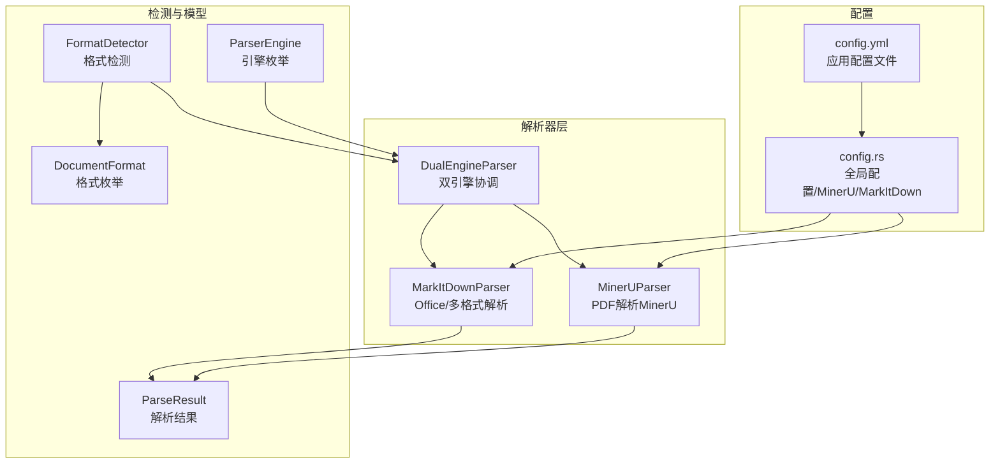
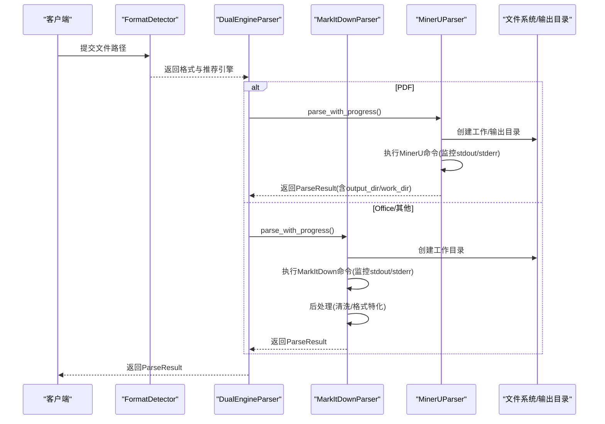
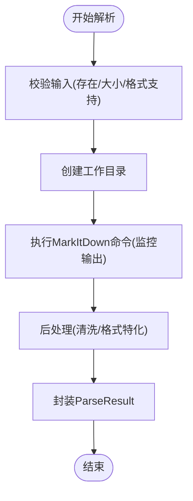
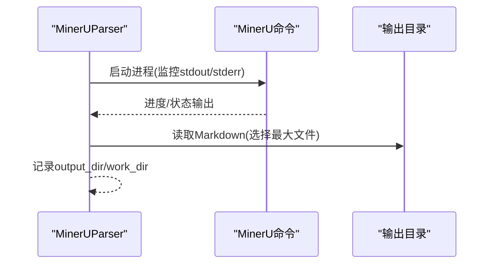
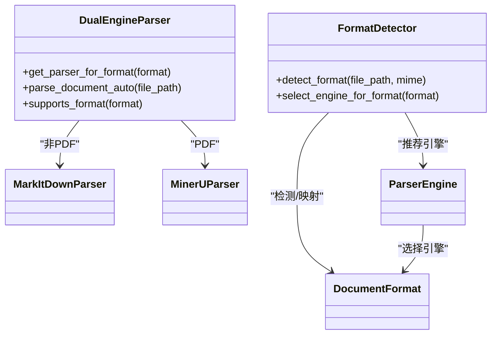
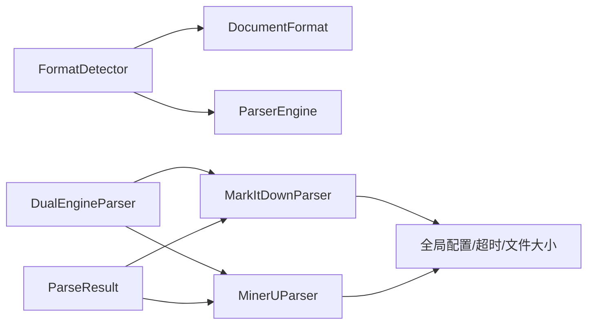

# Office文档解析（MarkItDown）

<cite>
**本文引用的文件**
- [markitdown_parser.rs](file://document-parser/src/parsers/markitdown_parser.rs)
- [mineru_parser.rs](file://document-parser/src/parsers/mineru_parser.rs)
- [dual_engine_parser.rs](file://document-parser/src/parsers/dual_engine_parser.rs)
- [parser_trait.rs](file://document-parser/src/parsers/parser_trait.rs)
- [format_detector.rs](file://document-parser/src/parsers/format_detector.rs)
- [document_format.rs](file://document-parser/src/models/document_format.rs)
- [parse_result.rs](file://document-parser/src/models/parse_result.rs)
- [parser_engine.rs](file://document-parser/src/models/parser_engine.rs)
- [config.rs](file://document-parser/src/config.rs)
- [config.yml](file://document-parser/config.yml)
- [README.md](file://document-parser/README.md)
- [USER_MANUAL.md](file://document-parser/USER_MANUAL.md)
- [minerU_design.md](file://spec/minerU_design.md)
</cite>

## 目录
1. [简介](#简介)
2. [项目结构](#项目结构)
3. [核心组件](#核心组件)
4. [架构总览](#架构总览)
5. [详细组件分析](#详细组件分析)
6. [依赖关系分析](#依赖关系分析)
7. [性能考量](#性能考量)
8. [故障排查指南](#故障排查指南)
9. [结论](#结论)
10. [附录](#附录)

## 简介
本文件聚焦于MarkItDown引擎对Office文档（.docx、.xlsx、.pptx等）的解析能力，系统阐述其如何将Office结构转换为Markdown，包括表格、图表、样式与复杂格式（如合并单元格、嵌套列表）的处理策略；同时说明与MinerU引擎的协同工作机制及双引擎自动切换逻辑，并给出配置选项与解析质量调优建议。

## 项目结构
围绕Office文档解析的关键代码位于document-parser模块，主要涉及：
- 解析器实现：MarkItDownParser、MinerUParser
- 双引擎协调：DualEngineParser
- 格式检测：FormatDetector
- 数据模型：DocumentFormat、ParseResult、ParserEngine
- 配置体系：全局文件大小限制、MinerU/MarkItDown配置、应用配置

图示来源
- [dual_engine_parser.rs](file://document-parser/src/parsers/dual_engine_parser.rs#L1-L217)
- [markitdown_parser.rs](file://document-parser/src/parsers/markitdown_parser.rs#L1-L200)
- [mineru_parser.rs](file://document-parser/src/parsers/mineru_parser.rs#L1-L200)
- [format_detector.rs](file://document-parser/src/parsers/format_detector.rs#L1-L200)
- [document_format.rs](file://document-parser/src/models/document_format.rs#L1-L125)
- [parse_result.rs](file://document-parser/src/models/parse_result.rs#L1-L71)
- [parser_engine.rs](file://document-parser/src/models/parser_engine.rs#L1-L47)
- [config.rs](file://document-parser/src/config.rs#L1-L200)
- [config.yml](file://document-parser/config.yml#L1-L78)

章节来源
- [README.md](file://document-parser/README.md#L1-L179)
- [USER_MANUAL.md](file://document-parser/USER_MANUAL.md#L1-L309)
- [minerU_design.md](file://spec/minerU_design.md#L1-L200)

## 核心组件
- MarkItDownParser：负责调用Python MarkItDown命令行工具，执行Office文档到Markdown的转换，支持进度回调、取消令牌、格式支持缓存、后处理清洗与格式特化处理。
- MinerUParser：负责调用MinerU命令行工具，专门处理PDF（含图片提取、表格识别、布局保持），并提供输出目录与工作目录信息以便后续图片路径替换。
- DualEngineParser：根据文件格式自动选择解析器（PDF走MinerU，其他格式走MarkItDown），并提供健康检查与统计信息。
- FormatDetector：多策略格式检测（魔数、扩展名、MIME、内容分析），并返回推荐引擎。
- DocumentFormat/ParseResult/ParserEngine：统一的数据模型与引擎选择逻辑。
- 配置体系：全局文件大小限制、MinerU/MarkItDown配置、应用配置文件。

章节来源
- [markitdown_parser.rs](file://document-parser/src/parsers/markitdown_parser.rs#L1-L200)
- [mineru_parser.rs](file://document-parser/src/parsers/mineru_parser.rs#L1-L200)
- [dual_engine_parser.rs](file://document-parser/src/parsers/dual_engine_parser.rs#L1-L120)
- [format_detector.rs](file://document-parser/src/parsers/format_detector.rs#L1-L200)
- [document_format.rs](file://document-parser/src/models/document_format.rs#L1-L125)
- [parse_result.rs](file://document-parser/src/models/parse_result.rs#L1-L71)
- [parser_engine.rs](file://document-parser/src/models/parser_engine.rs#L1-L47)
- [config.rs](file://document-parser/src/config.rs#L1-L200)
- [config.yml](file://document-parser/config.yml#L1-L78)

## 架构总览
双引擎解析的整体流程如下：
- 输入文件经FormatDetector检测格式与置信度，选择MinerU或MarkItDown。
- 对于PDF：MinerUParser执行MinerU命令，产出Markdown与图片等输出，记录输出目录与工作目录。
- 对于Office文档：MarkItDownParser执行MarkItDown命令，产出Markdown，随后进行后处理清洗与格式特化。
- 解析完成后统一封装为ParseResult，包含格式、引擎、处理时间、字数统计等。

图示来源
- [dual_engine_parser.rs](file://document-parser/src/parsers/dual_engine_parser.rs#L90-L160)
- [markitdown_parser.rs](file://document-parser/src/parsers/markitdown_parser.rs#L480-L693)
- [mineru_parser.rs](file://document-parser/src/parsers/mineru_parser.rs#L215-L405)

章节来源
- [minerU_design.md](file://spec/minerU_design.md#L1-L120)

## 详细组件分析

### MarkItDownParser：Office文档到Markdown的转换
- 进度与取消：支持进度回调与取消令牌，便于长耗时任务的可观测与中断。
- 输入校验：检查文件存在性、大小限制（全局配置）、格式支持（含缓存）。
- 命令执行：自动检测虚拟环境中的Python，调用MarkItDown命令行，传递输出文件、插件开关、数据URI保留等参数；监控stdout/stderr，动态更新进度与收集临时文件。
- 后处理：提供通用清洗（多余空行、标题格式修正）与格式特化（Excel/PowerPoint/Word）处理。
- 输出：生成ParseResult，包含Markdown内容、格式、引擎、处理时间、字数统计等。

图示来源
- [markitdown_parser.rs](file://document-parser/src/parsers/markitdown_parser.rs#L488-L793)

章节来源
- [markitdown_parser.rs](file://document-parser/src/parsers/markitdown_parser.rs#L1-L200)
- [markitdown_parser.rs](file://document-parser/src/parsers/markitdown_parser.rs#L248-L342)
- [markitdown_parser.rs](file://document-parser/src/parsers/markitdown_parser.rs#L488-L693)
- [markitdown_parser.rs](file://document-parser/src/parsers/markitdown_parser.rs#L695-L793)

### MinerUParser：PDF解析（MinerU）
- 进度与取消：与MarkItDown类似，支持进度回调与取消令牌。
- 命令执行：自动检测MinerU命令路径，拼接参数（后端、设备、显存限制、模型源等），监控输出并动态更新进度。
- 输出：读取输出目录中的Markdown文件，选择最大文件作为主输出；同时记录output_dir/work_dir供后续图片路径替换。
- 错误处理：捕获进程退出码/信号、超时、工作目录与输出目录调试信息，便于故障排查。

图示来源
- [mineru_parser.rs](file://document-parser/src/parsers/mineru_parser.rs#L215-L405)
- [mineru_parser.rs](file://document-parser/src/parsers/mineru_parser.rs#L443-L697)
- [mineru_parser.rs](file://document-parser/src/parsers/mineru_parser.rs#L699-L800)

章节来源
- [mineru_parser.rs](file://document-parser/src/parsers/mineru_parser.rs#L1-L200)
- [mineru_parser.rs](file://document-parser/src/parsers/mineru_parser.rs#L215-L405)
- [mineru_parser.rs](file://document-parser/src/parsers/mineru_parser.rs#L443-L697)

### 双引擎自动切换与格式选择
- 格式检测：FormatDetector综合魔数、扩展名、MIME、内容分析等策略，返回DetectionResult与recommended_engine。
- 引擎选择：DualEngineParser依据DocumentFormat自动选择MinerU（PDF）或MarkItDown（Word/Excel/PowerPoint/图片/音频/HTML/Text/Txt/Md）。
- 统一入口：parse_document_auto自动检测格式并调用对应解析器，简化上层调用。

图示来源
- [format_detector.rs](file://document-parser/src/parsers/format_detector.rs#L300-L487)
- [dual_engine_parser.rs](file://document-parser/src/parsers/dual_engine_parser.rs#L92-L136)
- [parser_engine.rs](file://document-parser/src/models/parser_engine.rs#L1-L47)
- [document_format.rs](file://document-parser/src/models/document_format.rs#L1-L125)

章节来源
- [format_detector.rs](file://document-parser/src/parsers/format_detector.rs#L1-L200)
- [dual_engine_parser.rs](file://document-parser/src/parsers/dual_engine_parser.rs#L1-L120)
- [parser_engine.rs](file://document-parser/src/models/parser_engine.rs#L1-L47)
- [document_format.rs](file://document-parser/src/models/document_format.rs#L1-L125)

### Office文档结构到Markdown的转换要点
- 表格与图表
  - MarkItDownParser在执行MarkItDown命令时，可通过参数控制图片数据URI保留，便于在Markdown中内嵌图片。
  - 对Excel内容，MarkItDownParser提供后处理，确保表格有适当标题与格式。
  - 对PowerPoint内容，MarkItDownParser提供后处理，将“Slide”转换为分隔符与标题，便于Markdown阅读。
- 样式与标题层次
  - MarkItDownParser提供通用清洗（去除多余空行、修复标题格式），并对Word文档进行标题层次优化（将可能的标题行提升为二级标题）。
- 复杂格式处理
  - 合并单元格：Office表格在转换为Markdown时通常会丢失合并信息，建议在上层结合原始表格元数据进行二次处理或标注。
  - 嵌套列表：Markdown列表层级有限，复杂嵌套建议在上层进行结构化重构或标注，避免信息丢失。
- 输出与质量
  - MarkItDownParser支持clean_output、extract_images、extract_tables、extract_metadata等质量设置，可在配置中开启或关闭。

章节来源
- [markitdown_parser.rs](file://document-parser/src/parsers/markitdown_parser.rs#L524-L693)
- [markitdown_parser.rs](file://document-parser/src/parsers/markitdown_parser.rs#L695-L793)
- [config.yml](file://document-parser/config.yml#L36-L48)

### 配置选项与调优建议
- 全局文件大小限制
  - 全局配置统一限制文件大小与大文档阈值，MarkItDownParser/MinerUParser在解析前都会进行校验。
- MinerU配置
  - 后端选择（pipeline/vlm-transformers/vlm-sglang-engine/vlm-sglang-client）、设备（cpu/cuda/npu/mps等）、显存限制（vram）、批处理大小、质量等级等。
  - 建议：GPU加速时合理设置max_concurrent与batch_size，避免显存溢出；根据实际GPU显存调整vram。
- MarkItDown配置
  - Python路径、超时、插件开关、功能开关（OCR、音频转录、Azure文档智能、YouTube转录）。
  - 建议：启用插件可增强多格式支持；OCR与音频转录会增加处理时间，按需开启。
- 应用配置
  - 服务器端口、日志级别、并发与队列大小、统一超时、存储（Sled/OSS）等。
  - 建议：根据业务流量调整max_concurrent与queue_size；统一processing_timeout以避免解析器超时差异。

章节来源
- [config.rs](file://document-parser/src/config.rs#L1-L200)
- [config.rs](file://document-parser/src/config.rs#L456-L631)
- [config.yml](file://document-parser/config.yml#L1-L78)
- [USER_MANUAL.md](file://document-parser/USER_MANUAL.md#L1-L200)

## 依赖关系分析
- 组件耦合
  - DualEngineParser对MarkItDownParser与MinerUParser的依赖为组合关系，通过Arc共享，便于并发与生命周期管理。
  - FormatDetector与DocumentFormat/ParserEngine紧密耦合，用于格式识别与引擎选择。
  - MarkItDownParser/MinerUParser均依赖全局文件大小配置与统一超时设置。
- 外部依赖
  - MarkItDown命令行工具与MinerU命令行工具，均由解析器通过子进程调用。
  - 虚拟环境自动检测与路径选择，提升部署与兼容性。

图示来源
- [format_detector.rs](file://document-parser/src/parsers/format_detector.rs#L300-L487)
- [dual_engine_parser.rs](file://document-parser/src/parsers/dual_engine_parser.rs#L1-L120)
- [config.rs](file://document-parser/src/config.rs#L1-L200)
- [parse_result.rs](file://document-parser/src/models/parse_result.rs#L1-L71)

章节来源
- [parser_trait.rs](file://document-parser/src/parsers/parser_trait.rs#L1-L57)
- [document_format.rs](file://document-parser/src/models/document_format.rs#L1-L125)
- [parser_engine.rs](file://document-parser/src/models/parser_engine.rs#L1-L47)

## 性能考量
- 并发与队列
  - 通过统一的并发控制与队列缓冲区，避免资源争用与阻塞。
- 超时与资源
  - 统一processing_timeout避免解析器超时差异导致的不稳定；GPU加速时注意显存上限与批处理大小。
- I/O与中间文件
  - 解析过程产生的临时文件与输出目录需及时清理，避免磁盘压力。
- 后处理成本
  - 清洗与格式特化会带来额外开销，建议在质量需求与性能之间权衡。

[本节为通用指导，不直接分析具体文件]

## 故障排查指南
- 常见问题
  - 虚拟环境未激活/依赖安装失败：参考用户手册中的环境初始化与依赖安装步骤。
  - GPU加速不生效：确认MinerU后端与设备配置，检查CUDA环境与显存限制。
  - 超时与取消：解析器支持取消令牌与超时控制，必要时增大processing_timeout。
  - 输出为空/未生成：检查MarkItDown/MinerU命令输出与工作目录，关注stderr错误信息。
- 调试建议
  - 查看日志级别与日志路径配置；
  - 使用parse_document_auto进行自动格式检测与引擎选择；
  - 对MinerUParser，利用output_dir/work_dir定位输出文件与图片路径。

章节来源
- [README.md](file://document-parser/README.md#L120-L179)
- [USER_MANUAL.md](file://document-parser/USER_MANUAL.md#L1-L200)
- [mineru_parser.rs](file://document-parser/src/parsers/mineru_parser.rs#L215-L405)
- [markitdown_parser.rs](file://document-parser/src/parsers/markitdown_parser.rs#L488-L693)

## 结论
MarkItDown引擎在Office文档解析方面具备完善的命令行调用、进度与取消支持、格式支持缓存与后处理能力，能够将Word/Excel/PowerPoint等Office结构转换为Markdown，并针对表格、图表、样式与复杂格式（合并单元格、嵌套列表）提供针对性处理策略。配合MinerU的PDF解析能力与双引擎自动切换机制，整体实现了多格式文档的高质量结构化输出。通过合理的配置与调优，可在稳定性与性能之间取得良好平衡。

[本节为总结性内容，不直接分析具体文件]

## 附录
- 相关设计文档与用户手册可参考：
  - [README.md](file://document-parser/README.md#L1-L179)
  - [USER_MANUAL.md](file://document-parser/USER_MANUAL.md#L1-L309)
  - [minerU_design.md](file://spec/minerU_design.md#L1-L200)

[本节为补充说明，不直接分析具体文件]