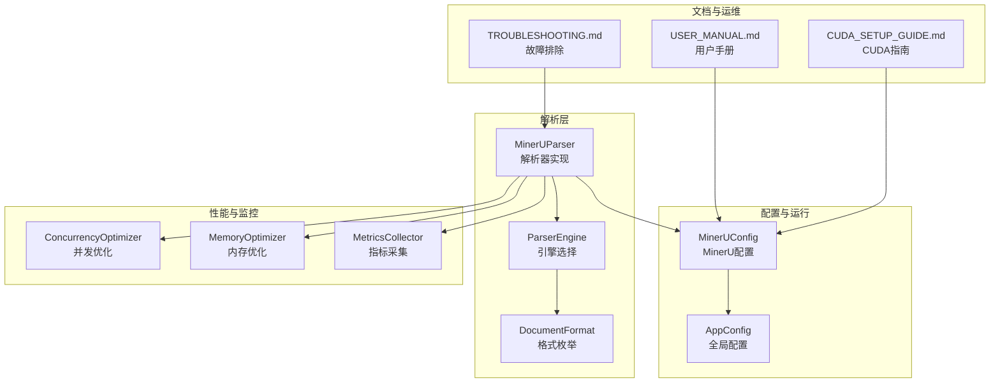
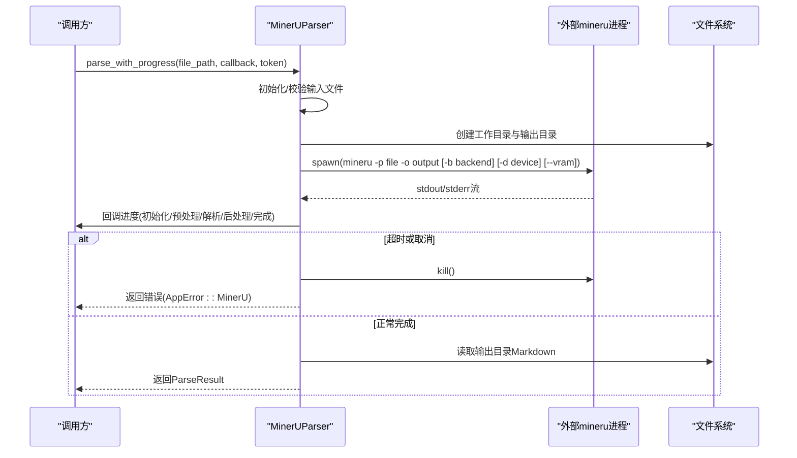
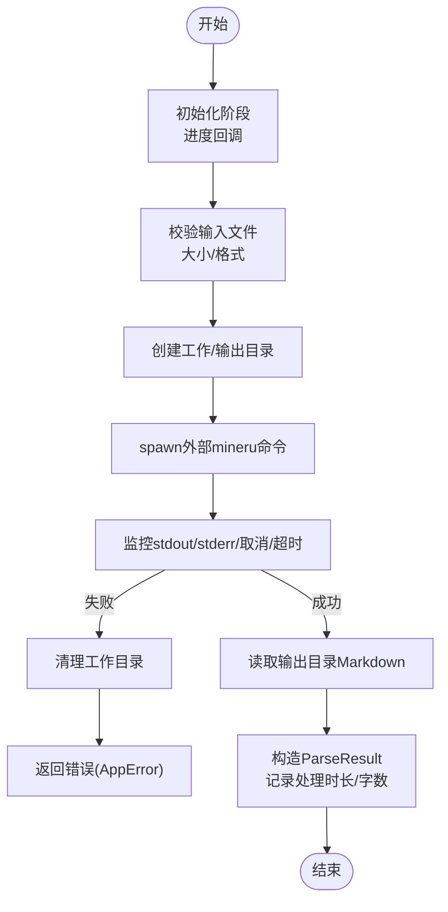
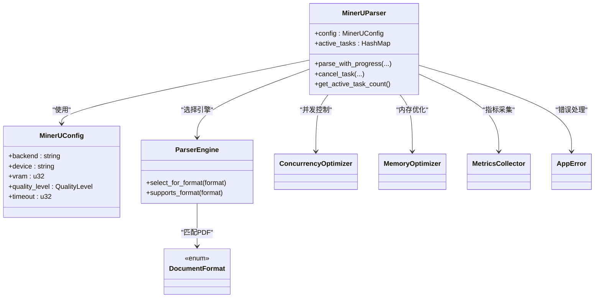

# PDF解析（MinerU）

<cite>
**本文引用的文件**
- [mineru_parser.rs](file://document-parser/src/parsers/mineru_parser.rs)
- [config.rs](file://document-parser/src/config.rs)
- [parser_engine.rs](file://document-parser/src/models/parser_engine.rs)
- [parser_trait.rs](file://document-parser/src/parsers/parser_trait.rs)
- [CUDA_SETUP_GUIDE.md](file://document-parser/CUDA_SETUP_GUIDE.md)
- [USER_MANUAL.md](file://document-parser/USER_MANUAL.md)
- [TROUBLESHOOTING.md](file://document-parser/TROUBLESHOOTING.md)
- [metrics_collector.rs](file://document-parser/src/performance/metrics_collector.rs)
- [concurrency_optimizer.rs](file://document-parser/src/performance/concurrency_optimizer.rs)
- [memory_optimizer.rs](file://document-parser/src/performance/memory_optimizer.rs)
- [document_parsing_bench.rs](file://document-parser/benches/document_parsing_bench.rs)
- [error.rs](file://document-parser/src/error.rs)
</cite>

## 目录
1. [简介](#简介)
2. [项目结构](#项目结构)
3. [核心组件](#核心组件)
4. [架构总览](#架构总览)
5. [详细组件分析](#详细组件分析)
6. [依赖关系分析](#依赖关系分析)
7. [性能与基准测试](#性能与基准测试)
8. [故障排查指南](#故障排查指南)
9. [结论](#结论)

## 简介
本文面向使用 MinerU 引擎进行 PDF 解析的用户与开发者，系统阐述 MinerU 解析器的实现原理与使用方法，涵盖以下主题：
- 文本提取、表格识别与布局分析的实现思路与流程
- GPU 加速机制与 CUDA 环境配置要求
- 解析任务的异步处理流程、错误恢复与资源管理
- 性能基准测试与优化建议
- 常见解析质量问题（如乱码、格式错乱）的定位与解决

## 项目结构
MinerU 解析能力位于 document-parser 子模块中，核心文件包括：
- 解析器实现：MinerUParser（负责调用外部 mineru 命令，监控进度与错误）
- 配置与引擎选择：MinerUConfig、ParserEngine、DocumentFormat
- 性能与资源管理：并发优化、内存优化、指标采集
- 用户与运维文档：CUDA 环境配置、用户手册、故障排除

图表来源
- [mineru_parser.rs](file://document-parser/src/parsers/mineru_parser.rs#L95-L120)
- [parser_engine.rs](file://document-parser/src/models/parser_engine.rs#L1-L47)
- [parser_trait.rs](file://document-parser/src/parsers/parser_trait.rs#L1-L57)
- [config.rs](file://document-parser/src/config.rs#L456-L583)
- [concurrency_optimizer.rs](file://document-parser/src/performance/concurrency_optimizer.rs#L1-L120)
- [memory_optimizer.rs](file://document-parser/src/performance/memory_optimizer.rs#L1-L120)
- [metrics_collector.rs](file://document-parser/src/performance/metrics_collector.rs#L1-L120)
- [USER_MANUAL.md](file://document-parser/USER_MANUAL.md#L1-L120)
- [CUDA_SETUP_GUIDE.md](file://document-parser/CUDA_SETUP_GUIDE.md#L1-L120)
- [TROUBLESHOOTING.md](file://document-parser/TROUBLESHOOTING.md#L1-L120)

章节来源
- [mineru_parser.rs](file://document-parser/src/parsers/mineru_parser.rs#L95-L120)
- [config.rs](file://document-parser/src/config.rs#L456-L583)
- [parser_engine.rs](file://document-parser/src/models/parser_engine.rs#L1-L47)
- [parser_trait.rs](file://document-parser/src/parsers/parser_trait.rs#L1-L57)

## 核心组件
- MinerUParser：封装 PDF 解析流程，负责文件校验、工作目录准备、调用外部 mineru 命令、进度回调、错误处理与结果读取。
- MinerUConfig：MinerU 引擎的运行配置，包括后端类型、Python 路径、并发、队列、超时、批大小、质量等级、设备与显存限制。
- ParserEngine/DocumentFormat：根据文档格式选择解析引擎（PDF 使用 MinerU，其他格式使用 MarkItDown）。
- 性能组件：并发优化器、内存优化器、指标采集器，支撑大规模解析任务的稳定性与可观测性。

章节来源
- [mineru_parser.rs](file://document-parser/src/parsers/mineru_parser.rs#L95-L120)
- [config.rs](file://document-parser/src/config.rs#L456-L583)
- [parser_engine.rs](file://document-parser/src/models/parser_engine.rs#L1-L47)
- [parser_trait.rs](file://document-parser/src/parsers/parser_trait.rs#L1-L57)
- [concurrency_optimizer.rs](file://document-parser/src/performance/concurrency_optimizer.rs#L1-L120)
- [memory_optimizer.rs](file://document-parser/src/performance/memory_optimizer.rs#L1-L120)
- [metrics_collector.rs](file://document-parser/src/performance/metrics_collector.rs#L1-L120)

## 架构总览
MinerU 解析器采用“外部命令调用 + 进度与错误监控”的异步架构：
- 解析器启动时创建隔离的工作目录与输出目录
- 通过 tokio::process::Command 调用外部 mineru 命令，并以管道方式读取 stdout/stderr
- 基于 tokio::time::timeout 控制整体超时，支持取消令牌中断进程
- 解析完成后读取输出目录中的 Markdown 结果，构造 ParseResult 返回

图表来源
- [mineru_parser.rs](file://document-parser/src/parsers/mineru_parser.rs#L159-L405)
- [mineru_parser.rs](file://document-parser/src/parsers/mineru_parser.rs#L444-L697)

章节来源
- [mineru_parser.rs](file://document-parser/src/parsers/mineru_parser.rs#L159-L405)
- [mineru_parser.rs](file://document-parser/src/parsers/mineru_parser.rs#L444-L697)

## 详细组件分析

### MinerUParser：PDF 解析器实现
- 配置与生命周期
  - 默认配置包含后端、Python 路径、并发、队列、超时、批大小、质量等级、设备与显存限制
  - 支持自动检测当前目录虚拟环境并推断 Python 路径
- 解析流程
  - 初始化阶段：进度回调“初始化解析环境”
  - 预处理阶段：创建工作目录与输出目录
  - 解析阶段：调用外部 mineru 命令，按需注入后端、设备与显存参数
  - 后处理阶段：读取输出目录中的 Markdown 内容
  - 完成阶段：汇总处理时长、字数，返回 ParseResult
- 进度与取消
  - 通过 CancellationToken 支持任务取消
  - 通过 tokio::time::timeout 控制超时
  - 通过 tokio::select! 轮询取消、输出与进程退出
- 错误处理
  - 文件校验失败、命令启动失败、进程退出码/信号、超时、输出目录为空等均映射为 AppError
  - 提供详细日志与调试信息（输入文件元数据、工作/输出目录状态）

图表来源
- [mineru_parser.rs](file://document-parser/src/parsers/mineru_parser.rs#L215-L405)
- [mineru_parser.rs](file://document-parser/src/parsers/mineru_parser.rs#L444-L697)

章节来源
- [mineru_parser.rs](file://document-parser/src/parsers/mineru_parser.rs#L72-L120)
- [mineru_parser.rs](file://document-parser/src/parsers/mineru_parser.rs#L159-L405)
- [mineru_parser.rs](file://document-parser/src/parsers/mineru_parser.rs#L444-L697)

### GPU 加速与 CUDA 环境配置
- 后端与设备参数
  - pipeline 后端：自动检测 CUDA 可用性，若可用则默认使用 -d cuda；也可通过 device 指定具体设备
  - pipeline 后端：支持 --vram 显存限制参数（单位 GB）
  - vlm-sglang-engine 后端：用于 GPU 加速（见用户手册与 CUDA 指南）
- 环境检查与安装
  - 用户手册提供系统依赖、CUDA 环境检查、MinerU/sglang 安装与验证步骤
  - CUDA 指南提供驱动、Toolkit、MinerU 依赖安装、验证 GPU 加速、性能调优与故障排除
- 配置要点
  - backend: pipeline 或 vlm-sglang-engine
  - device: cpu/cuda/cuda:0/npu/mps 等
  - vram: 仅 pipeline 后端且支持 CUDA 时有效
  - quality_level: Fast/Balanced/HighQuality

章节来源
- [mineru_parser.rs](file://document-parser/src/parsers/mineru_parser.rs#L490-L519)
- [config.rs](file://document-parser/src/config.rs#L456-L583)
- [USER_MANUAL.md](file://document-parser/USER_MANUAL.md#L43-L120)
- [CUDA_SETUP_GUIDE.md](file://document-parser/CUDA_SETUP_GUIDE.md#L1-L120)

### 文本提取、表格识别与布局分析
- 实现思路
  - MinerUParser 本身通过调用外部 mineru 命令完成解析，其具体算法细节由 mineru 引擎实现
  - 解析完成后读取输出目录中的 Markdown 内容，作为文本提取的结果
  - 表格识别与布局分析通常由 mineru 内部模型完成，MinerUParser 负责组织输入输出与进度反馈
- 输出与后续处理
  - 读取 Markdown 输出并统计字数，记录处理时长
  - 输出目录与工作目录路径随 ParseResult 返回，便于后续图片上传与路径替换

章节来源
- [mineru_parser.rs](file://document-parser/src/parsers/mineru_parser.rs#L344-L405)
- [mineru_parser.rs](file://document-parser/src/parsers/mineru_parser.rs#L763-L800)

### 异步处理、错误恢复与资源管理
- 异步与并发
  - 使用 tokio::process::Command 异步执行外部命令
  - 使用 tokio::sync::Mutex/HashMap 管理活跃任务，支持取消
  - 使用 tokio::time::timeout 控制超时，避免长时间阻塞
- 错误恢复
  - 进程失败时记录 stderr、退出码/信号、输入文件与目录状态
  - 超时场景提供明确提示与建议
  - 输出目录为空时提供调试信息（目录结构、文件大小等）
- 资源管理
  - 解析失败或超时时清理工作目录
  - 通过配置控制最大并发、队列大小、批大小与超时
  - 提供指标采集与性能优化组件（并发/内存/指标）

章节来源
- [mineru_parser.rs](file://document-parser/src/parsers/mineru_parser.rs#L197-L214)
- [mineru_parser.rs](file://document-parser/src/parsers/mineru_parser.rs#L289-L338)
- [mineru_parser.rs](file://document-parser/src/parsers/mineru_parser.rs#L671-L697)
- [concurrency_optimizer.rs](file://document-parser/src/performance/concurrency_optimizer.rs#L1-L120)
- [memory_optimizer.rs](file://document-parser/src/performance/memory_optimizer.rs#L1-L120)
- [metrics_collector.rs](file://document-parser/src/performance/metrics_collector.rs#L1-L120)

## 依赖关系分析
- MinerUParser 依赖
  - 配置：MinerUConfig（后端、设备、显存、质量等级等）
  - 引擎选择：ParserEngine/DocumentFormat（PDF 专属）
  - 性能组件：ConcurrencyOptimizer/MemoryOptimizer/MetricsCollector
  - 错误类型：AppError（统一错误模型）
- 外部依赖
  - 外部 mineru 命令（通过命令行参数控制后端、设备、显存等）
  - CUDA/sglang（可选，用于 GPU 加速）

图表来源
- [mineru_parser.rs](file://document-parser/src/parsers/mineru_parser.rs#L95-L120)
- [config.rs](file://document-parser/src/config.rs#L456-L583)
- [parser_engine.rs](file://document-parser/src/models/parser_engine.rs#L1-L47)
- [parser_trait.rs](file://document-parser/src/parsers/parser_trait.rs#L1-L57)
- [concurrency_optimizer.rs](file://document-parser/src/performance/concurrency_optimizer.rs#L1-L120)
- [memory_optimizer.rs](file://document-parser/src/performance/memory_optimizer.rs#L1-L120)
- [metrics_collector.rs](file://document-parser/src/performance/metrics_collector.rs#L1-L120)
- [error.rs](file://document-parser/src/error.rs#L1-L120)

章节来源
- [mineru_parser.rs](file://document-parser/src/parsers/mineru_parser.rs#L95-L120)
- [config.rs](file://document-parser/src/config.rs#L456-L583)
- [parser_engine.rs](file://document-parser/src/models/parser_engine.rs#L1-L47)
- [parser_trait.rs](file://document-parser/src/parsers/parser_trait.rs#L1-L57)

## 性能与基准测试
- 基准测试
  - 提供文档解析基准（格式检测、引擎选择），可用于评估解析链路开销
- 指标采集
  - MetricsCollector 提供系统与应用指标采集、聚合与导出（JSON/Prometheus/InfluxDB/CSV）
- 并发与内存优化
  - ConcurrencyOptimizer：任务队列、工作线程池、负载均衡、信号量并发控制
  - MemoryOptimizer：内存池、压缩、内存监控与清理
- 性能调优建议
  - GPU 加速：使用 vlm-sglang-engine 后端，合理设置 max_concurrent、batch_size、quality_level
  - 显存限制：pipeline 后端可通过 --vram 控制显存占用
  - 超时与队列：根据文档大小与并发调整 processing_timeout、queue_size

章节来源
- [document_parsing_bench.rs](file://document-parser/benches/document_parsing_bench.rs#L1-L47)
- [metrics_collector.rs](file://document-parser/src/performance/metrics_collector.rs#L1-L120)
- [concurrency_optimizer.rs](file://document-parser/src/performance/concurrency_optimizer.rs#L1-L120)
- [memory_optimizer.rs](file://document-parser/src/performance/memory_optimizer.rs#L1-L120)
- [CUDA_SETUP_GUIDE.md](file://document-parser/CUDA_SETUP_GUIDE.md#L160-L286)

## 故障排查指南
- 常见问题
  - FlashInfer 编译失败（math.h 缺失）：安装缺失的开发包并设置 CUDA 环境变量
  - 虚拟环境问题：权限、路径、权限不足导致创建/激活失败
  - 依赖安装问题：UV 工具、MinerU/MarkItDown 安装失败或网络超时
  - CUDA 环境：驱动、Toolkit、PyTorch CUDA 支持检查
- 诊断命令
  - document-parser check/troubleshoot/uv-init
  - nvidia-smi/nvcc 检查
  - 日志查看与清理
- 建议
  - 使用国内镜像源加速安装
  - 清理缓存与重置虚拟环境
  - 检查系统权限与磁盘空间

章节来源
- [TROUBLESHOOTING.md](file://document-parser/TROUBLESHOOTING.md#L1-L120)
- [TROUBLESHOOTING.md](file://document-parser/TROUBLESHOOTING.md#L120-L320)
- [TROUBLESHOOTING.md](file://document-parser/TROUBLESHOOTING.md#L320-L561)
- [USER_MANUAL.md](file://document-parser/USER_MANUAL.md#L1-L120)

## 结论
MinerU 解析器通过“外部命令 + 异步监控”的方式实现了 PDF 的文本提取、表格识别与布局分析，并提供了完善的 GPU 加速、并发与内存优化、指标采集与错误恢复机制。结合用户手册与 CUDA 指南，用户可在本地快速搭建 GPU 加速环境并获得稳定高效的解析体验。对于解析质量问题，建议从 CUDA 环境、后端与质量等级配置、超时与并发参数等方面入手排查与优化。