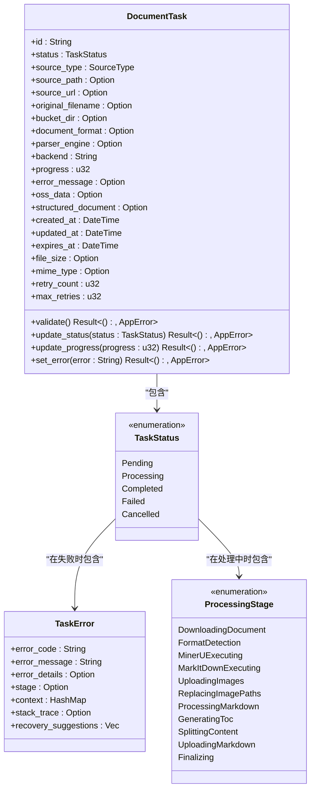
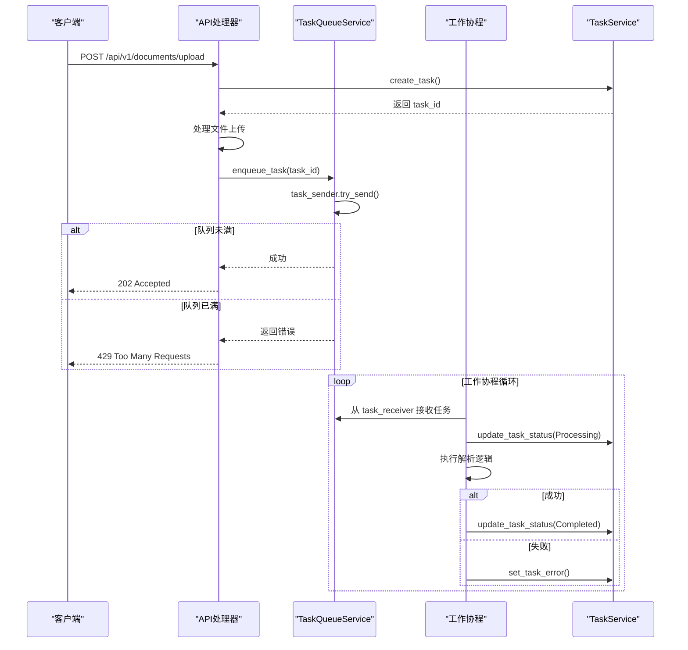
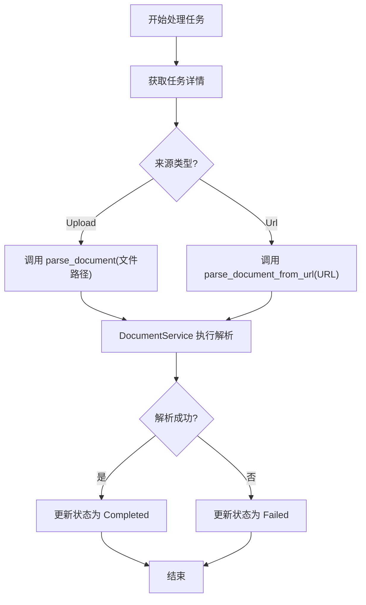

# 任务处理

<cite>
**本文档引用的文件**   
- [document_task.rs](file://document-parser/src/models/document_task.rs)
- [task_status.rs](file://document-parser/src/models/task_status.rs)
- [task_queue_service.rs](file://document-parser/src/services/task_queue_service.rs)
- [document_task_processor.rs](file://document-parser/src/services/document_task_processor.rs)
- [document_handler.rs](file://document-parser/src/handlers/document_handler.rs)
</cite>

## 目录
1. [引言](#引言)
2. [任务元数据与状态管理](#任务元数据与状态管理)
3. [任务队列与调度机制](#任务队列与调度机制)
4. [任务处理流程](#任务处理流程)
5. [HTTP API 任务生命周期](#http-api-任务生命周期)
6. [错误恢复与重试策略](#错误恢复与重试策略)
7. [性能优化建议](#性能优化建议)
8. [结论](#结论)

## 引言
本文档详细阐述了文档解析任务的全生命周期管理机制。系统通过 `DocumentTask` 模型封装任务的元数据、状态和执行上下文，利用 `TaskStatus` 枚举定义了清晰的状态流转逻辑。任务的有序调度与并发控制由 `TaskQueueService` 基于异步队列实现。`DocumentTaskProcessor` 负责消费队列中的任务，调用解析引擎执行，并更新任务状态。从 `document_handler.rs` 中的 API 端点出发，展示了从 HTTP 请求接收到任务创建、状态查询到结果获取的完整流程。文档还分析了任务重试、超时处理和错误恢复策略，并提供了通过 `ConcurrentOptimizer` 调整并发度以平衡资源利用率与响应延迟的性能优化建议。

## 任务元数据与状态管理

`DocumentTask` 结构体是任务管理的核心，它封装了任务的全部元数据、状态和执行上下文。该结构体通过 `derive_builder` 宏自动生成构建器，确保了对象创建的灵活性和安全性。

任务状态由 `TaskStatus` 枚举定义，它是一个丰富的状态机，包含 `Pending`、`Processing`、`Completed`、`Failed` 和 `Cancelled` 五种状态。每种状态都携带了特定的上下文信息，例如 `Pending` 状态记录了入队时间，`Processing` 状态包含了当前处理阶段和进度详情，`Completed` 状态记录了处理耗时，而 `Failed` 状态则包含了详细的 `TaskError` 信息。

**图示来源**
- [document_task.rs](file://document-parser/src/models/document_task.rs#L12-L60)
- [task_status.rs](file://document-parser/src/models/task_status.rs#L6-L32)

**本节来源**
- [document_task.rs](file://document-parser/src/models/document_task.rs#L12-L60)
- [task_status.rs](file://document-parser/src/models/task_status.rs#L6-L32)

## 任务队列与调度机制

`TaskQueueService` 是任务调度的核心，它基于 Tokio 的 `mpsc`（多生产者单消费者）有界通道实现了一个异步任务队列，有效实现了背压控制，防止系统因任务积压而崩溃。

该服务通过 `spawn_workers` 方法启动多个工作协程（worker），这些协程共享一个 `mpsc::Receiver`，直接从通道中消费 `QueueItem` 任务。这种 SPMC（单生产者多消费者）模式简化了并发模型。服务还维护了一个 `processing_tasks` 的 `HashMap`，用于跟踪所有正在处理的任务及其上下文（`TaskExecutionContext`），便于统计和健康检查。

**图示来源**
- [task_queue_service.rs](file://document-parser/src/services/task_queue_service.rs#L111-L141)
- [document_handler.rs](file://document-parser/src/handlers/document_handler.rs#L180-L230)

**本节来源**
- [task_queue_service.rs](file://document-parser/src/services/task_queue_service.rs#L111-L141)

## 任务处理流程

`DocumentTaskProcessor` 实现了 `TaskProcessor` trait，是任务的实际执行者。它通过 `process_task` 方法消费队列中的任务。

当工作协程接收到一个任务时，`DocumentTaskProcessor` 会根据任务的 `source_type` 进行分派。对于 `Upload` 类型，它调用 `DocumentService` 的 `parse_document` 方法，传入本地文件路径。对于 `Url` 类型，它则调用 `parse_document_from_url` 方法，启动下载和解析流程。整个处理过程由 `DocumentService` 协调，`DocumentTaskProcessor` 负责调用并处理结果，成功时更新为 `Completed` 状态，失败时更新为 `Failed` 状态。

**图示来源**
- [document_task_processor.rs](file://document-parser/src/services/document_task_processor.rs#L9-L15)
- [document_service.rs](file://document-parser/src/services/document_service.rs)

**本节来源**
- [document_task_processor.rs](file://document-parser/src/services/document_task_processor.rs#L9-L15)

## HTTP API 任务生命周期

`document_handler.rs` 中的 API 端点构成了任务生命周期的入口。以 `upload_document` 函数为例，其完整流程如下：

1.  **接收请求**：客户端通过 `POST /api/v1/documents/upload` 发送包含文件的 `multipart/form-data` 请求。
2.  **创建任务**：API 处理器首先调用 `TaskService::create_task` 创建一个新的 `DocumentTask`，并立即返回一个 `task_id`。
3.  **处理上传**：处理器流式处理上传的文件块，将其写入以 `task_id` 命名的临时文件，并进行格式检测。
4.  **更新任务**：将文件路径、原始文件名、检测到的格式等信息更新到任务中。
5.  **入队**：调用 `TaskQueueService::enqueue_task` 将 `task_id` 加入队列，返回 `202 Accepted` 状态码，表示任务已接受但尚未完成。
6.  **状态查询**：客户端可通过 `GET /api/v1/tasks/{task_id}` 查询任务状态，直到其变为 `Completed`。
7.  **获取结果**：任务完成后，客户端可通过 `GET /api/v1/tasks/{task_id}/result` 获取解析结果。

**本节来源**
- [document_handler.rs](file://document-parser/src/handlers/document_handler.rs#L180-L230)

## 错误恢复与重试策略

系统具备完善的错误恢复机制。`TaskStatus` 的 `Failed` 状态包含 `is_recoverable` 标志和 `retry_count`，`DocumentTask` 模型也包含 `max_retries` 字段。

`TaskQueueService` 在工作协程中捕获任务处理的错误。如果任务失败，它会调用 `TaskService` 更新任务状态为 `Failed`，并增加 `retry_count`。`TaskError` 结构体允许根据错误代码（如网络错误 `E009`）判断错误是否可恢复。虽然当前代码未直接实现自动重试，但 `can_retry` 方法为实现此功能提供了基础。`TaskQueueService` 还通过 `task_timeout` 和 `health_check_interval` 实现了超时处理和健康检查，防止任务卡死。

**本节来源**
- [task_status.rs](file://document-parser/src/models/task_status.rs#L6-L32)
- [document_task.rs](file://document-parser/src/models/document_task.rs#L12-L60)
- [task_queue_service.rs](file://document-parser/src/services/task_queue_service.rs#L111-L141)

## 性能优化建议

`TaskQueueService` 的 `QueueConfig` 提供了多个可调参数来优化性能：
- **`max_concurrent_tasks`**：控制并发处理的任务数。应根据 CPU 核心数和内存大小调整，避免过度并发导致资源耗尽。
- **`max_queue_size`**：控制队列的最大容量。过小会导致请求被拒绝，过大则可能耗尽内存。应结合预期的峰值负载设置。
- **`task_timeout`**：防止任务无限期挂起。应根据文档大小和解析引擎的平均处理时间设置合理的超时值。
- **`backpressure_threshold`**：当队列使用率超过此阈值时触发背压，可动态调整 `max_concurrent_tasks` 或通知上游系统降速。

此外，`ConcurrentOptimizer`（位于 `performance/concurrency_optimizer.rs`）模块可用于动态分析系统负载，并自动调整 `max_concurrent_tasks`，在高负载时降低并发度以保证稳定性，在低负载时提高并发度以提升吞吐量，从而在资源利用率和响应延迟之间取得最佳平衡。

**本节来源**
- [task_queue_service.rs](file://document-parser/src/services/task_queue_service.rs#L111-L141)
- [concurrency_optimizer.rs](file://document-parser/src/performance/concurrency_optimizer.rs)

## 结论
本文档全面解析了文档解析任务的全生命周期管理机制。系统通过 `DocumentTask` 和 `TaskStatus` 实现了对任务元数据和状态的精确控制，利用 `TaskQueueService` 和 `DocumentTaskProcessor` 构建了一个高效、可靠的异步处理管道。从 HTTP API 到后台处理，整个流程清晰且可追溯。通过合理的错误恢复策略和性能调优，系统能够稳定地处理大量文档解析请求。