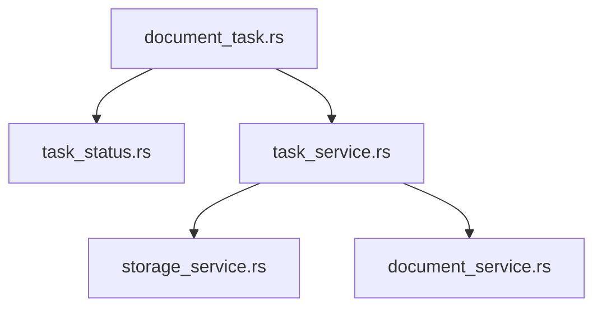
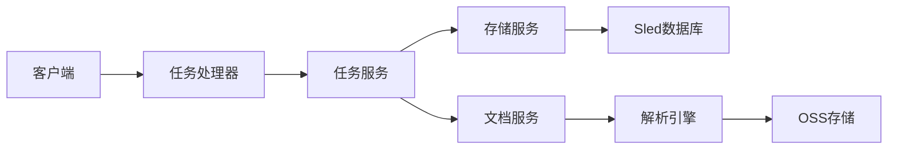
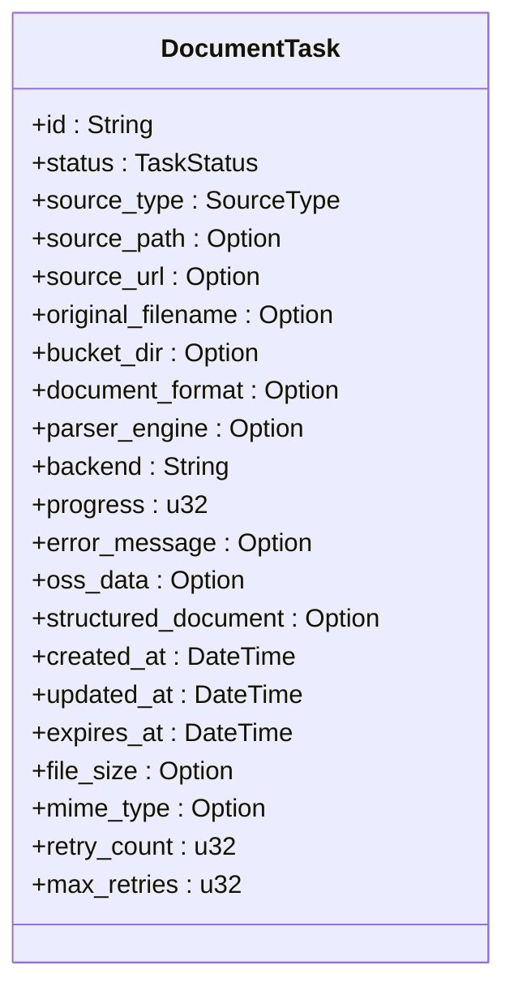
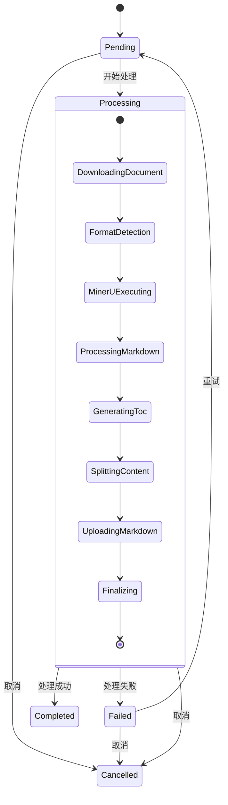
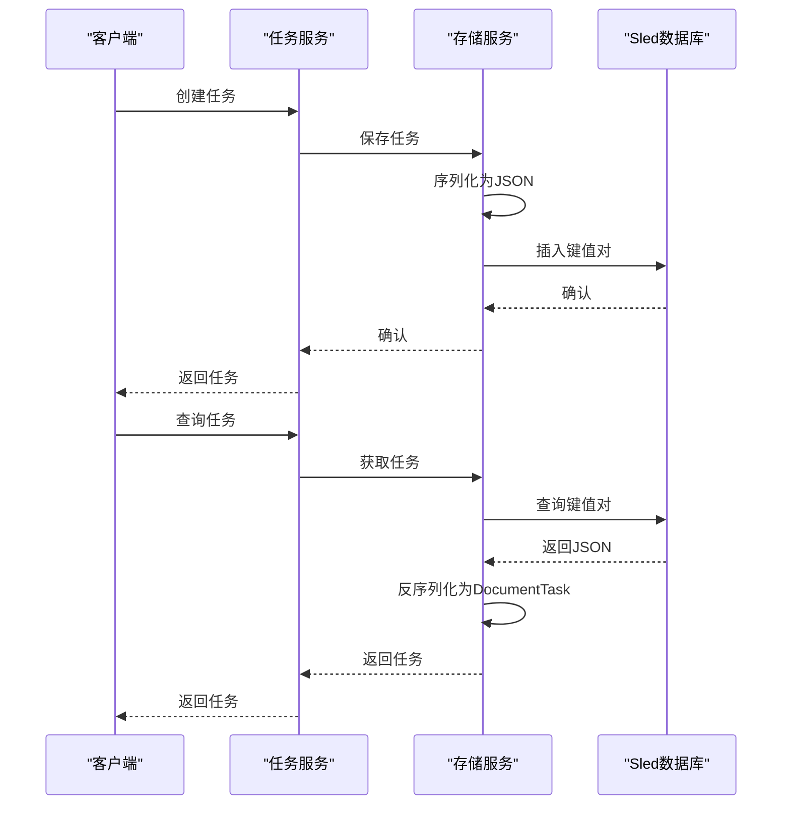
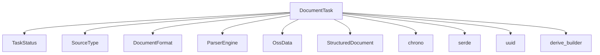

# 任务模型

<cite>
**本文档引用的文件**   
- [document_task.rs](file://document-parser/src/models/document_task.rs)
- [task_status.rs](file://document-parser/src/models/task_status.rs)
- [task_service.rs](file://document-parser/src/services/task_service.rs)
- [storage_service.rs](file://document-parser/src/services/storage_service.rs)
- [document_service.rs](file://document-parser/src/services/document_service.rs)
</cite>

## 目录
1. [简介](#简介)
2. [项目结构](#项目结构)
3. [核心组件](#核心组件)
4. [架构概述](#架构概述)
5. [详细组件分析](#详细组件分析)
6. [依赖分析](#依赖分析)
7. [性能考虑](#性能考虑)
8. [故障排除指南](#故障排除指南)
9. [结论](#结论)
10. [附录](#附录)（如有必要）

## 简介
本文档深入解析`DocumentTask`数据模型的结构设计与领域语义，详细说明其字段构成、任务生命周期状态流转机制、序列化/反序列化支持、数据库存储映射关系、默认值设置、验证逻辑和线程安全特性。同时提供实际代码示例展示任务实例的创建、状态变更与序列化过程，并指出在`task_queue_service`和`document_task_processor`中的使用上下文。

## 项目结构
`DocumentTask`数据模型位于`document-parser`模块的`src/models`目录下，是文档解析系统的核心数据结构。该模型与`task_status.rs`共同定义了任务的状态机，通过`task_service.rs`提供CRUD操作，并由`storage_service.rs`负责持久化存储。



**图示来源**
- [document_task.rs](file://document-parser/src/models/document_task.rs)
- [task_status.rs](file://document-parser/src/models/task_status.rs)
- [task_service.rs](file://document-parser/src/services/task_service.rs)
- [storage_service.rs](file://document-parser/src/services/storage_service.rs)
- [document_service.rs](file://document-parser/src/services/document_service.rs)

**本节来源**
- [document_task.rs](file://document-parser/src/models/document_task.rs)
- [task_service.rs](file://document-parser/src/services/task_service.rs)

## 核心组件
`DocumentTask`数据模型是文档解析系统的核心，它封装了任务的所有元数据和状态信息。该模型通过`serde`注解支持序列化/反序列化，便于持久化和网络传输。模型实现了完整的验证逻辑，确保数据完整性，并通过`Arc/RwLock`等机制保证线程安全。

**本节来源**
- [document_task.rs](file://document-parser/src/models/document_task.rs)
- [task_status.rs](file://document-parser/src/models/task_status.rs)

## 架构概述
`DocumentTask`模型在整个系统架构中处于核心位置，连接着任务创建、处理、存储和查询等多个组件。任务从创建开始，经过一系列处理阶段，最终达到终态，整个生命周期由`TaskStatus`枚举类型精确控制。



**图示来源**
- [task_service.rs](file://document-parser/src/services/task_service.rs)
- [storage_service.rs](file://document-parser/src/services/storage_service.rs)
- [document_service.rs](file://document-parser/src/services/document_service.rs)

## 详细组件分析
### DocumentTask模型分析
`DocumentTask`结构体定义了任务的所有属性，包括ID、状态、来源、格式、进度、时间戳等。每个字段都有明确的业务含义和默认值设置。

#### 字段构成


**图示来源**
- [document_task.rs](file://document-parser/src/models/document_task.rs)

#### 任务状态流转
`TaskStatus`枚举类型定义了任务的生命周期，包括待处理、处理中、已完成、失败、取消等状态。状态流转受到严格控制，终态不能转换到其他状态。



**图示来源**
- [task_status.rs](file://document-parser/src/models/task_status.rs)

**本节来源**
- [document_task.rs](file://document-parser/src/models/document_task.rs#L1-L100)
- [task_status.rs](file://document-parser/src/models/task_status.rs#L1-L100)

### 序列化与持久化
`DocumentTask`模型通过`serde`注解支持JSON序列化/反序列化，便于在内存和存储之间转换。`storage_service.rs`使用Sled嵌入式数据库存储任务数据，通过`serde_json`进行序列化。



**图示来源**
- [task_service.rs](file://document-parser/src/services/task_service.rs#L51-L87)
- [storage_service.rs](file://document-parser/src/services/storage_service.rs#L268-L304)

**本节来源**
- [task_service.rs](file://document-parser/src/services/task_service.rs#L51-L87)
- [storage_service.rs](file://document-parser/src/services/storage_service.rs#L268-L304)

## 依赖分析
`DocumentTask`模型依赖于多个其他组件，包括`TaskStatus`、`DocumentFormat`、`ParserEngine`等枚举类型，以及`serde`、`chrono`、`uuid`等外部库。这些依赖关系确保了模型的完整性和一致性。



**图示来源**
- [document_task.rs](file://document-parser/src/models/document_task.rs)
- [task_status.rs](file://document-parser/src/models/task_status.rs)

**本节来源**
- [document_task.rs](file://document-parser/src/models/document_task.rs#L1-L50)
- [task_status.rs](file://document-parser/src/models/task_status.rs#L1-L50)

## 性能考虑
`DocumentTask`模型在设计时考虑了性能因素，通过内存缓存、批量操作和并发控制等机制提高系统性能。`storage_service.rs`实现了内存缓存层，减少对磁盘的访问频率。

**本节来源**
- [storage_service.rs](file://document-parser/src/services/storage_service.rs)

## 故障排除指南
当任务处理出现问题时，可以通过检查`DocumentTask`的`error_message`字段和`status`字段来诊断问题。常见的错误包括文件格式不支持、解析引擎不匹配、文件大小超限等。

**本节来源**
- [document_task.rs](file://document-parser/src/models/document_task.rs#L142-L172)
- [task_status.rs](file://document-parser/src/models/task_status.rs#L445-L486)

## 结论
`DocumentTask`数据模型是文档解析系统的核心，它通过精心设计的字段构成、严格的状态流转控制、完整的验证逻辑和高效的序列化/持久化机制，确保了系统的稳定性和可靠性。该模型在`task_queue_service`和`document_task_processor`中被广泛使用，支撑着整个文档解析流程。

## 附录
### 代码示例
```rust
// 创建新任务
let task = DocumentTask::new(
    Uuid::new_v4().to_string(),
    SourceType::Upload,
    Some("/path/to/file.pdf".to_string()),
    Some("file.pdf".to_string()),
    Some(DocumentFormat::PDF),
    Some("pipeline".to_string()),
    Some(24),
    Some(3),
);

// 验证任务
assert!(task.validate().is_ok());

// 更新任务状态
let mut task = task;
task.update_status(TaskStatus::new_processing(ProcessingStage::FormatDetection))?;

// 序列化任务
let json = serde_json::to_string(&task)?;
```

**本节来源**
- [document_task.rs](file://document-parser/src/models/document_task.rs#L446-L493)
- [task_status.rs](file://document-parser/src/models/task_status.rs#L445-L486)