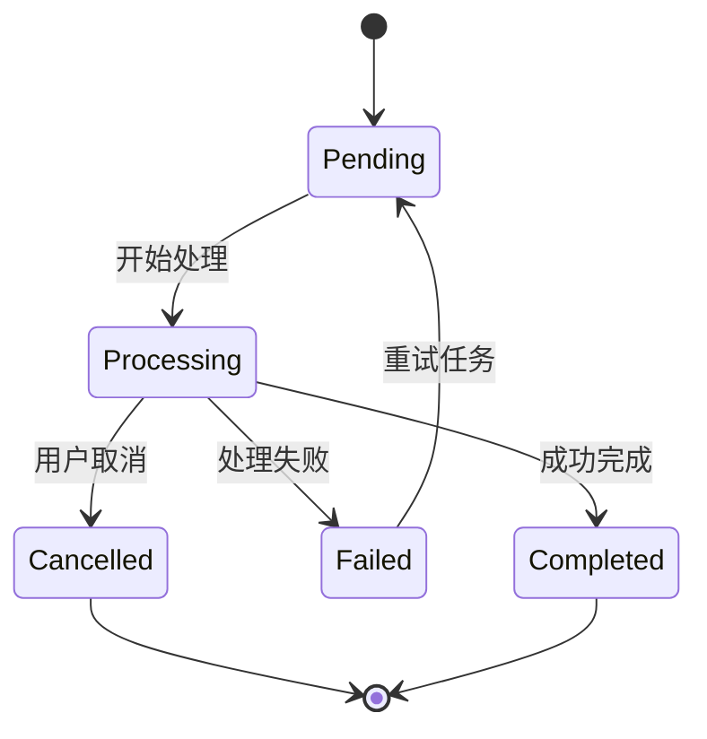
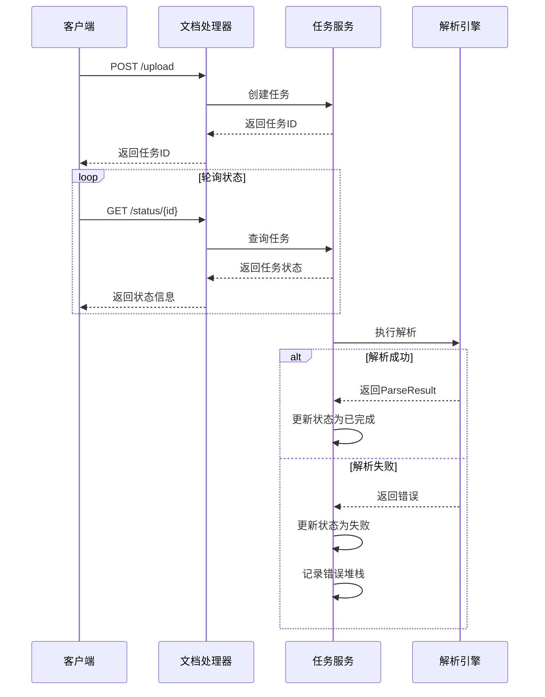

# 任务状态管理

<cite>
**本文档引用的文件**
- [document_task_processor.rs](file://document-parser/src/services/document_task_processor.rs)
- [document_service.rs](file://document-parser/src/services/document_service.rs)
- [task_status.rs](file://document-parser/src/models/task_status.rs)
- [document_task.rs](file://document-parser/src/models/document_task.rs)
- [document_handler.rs](file://document-parser/src/handlers/document_handler.rs)
- [task_service.rs](file://document-parser/src/services/task_service.rs)
- [parse_result.rs](file://document-parser/src/models/parse_result.rs)
</cite>

## 目录
1. [任务状态管理](#任务状态管理)
2. [任务处理流程](#任务处理流程)
3. [状态变更与持久化](#状态变更与持久化)
4. [任务状态查询接口](#任务状态查询接口)
5. [错误处理与重试机制](#错误处理与重试机制)
6. [解析结果模型](#解析结果模型)

## 任务处理流程

文档任务处理器（DocumentTaskProcessor）负责从任务队列获取任务并执行文档解析。当任务被分派给处理器时，系统首先获取任务详情，然后根据任务的 `source_type`（上传或URL）决定处理路径。

对于上传任务，处理器使用 `source_path` 指定的文件路径进行解析；对于URL任务，则使用 `source_url` 字段（或回退到 `source_path`）下载文档后进行解析。核心处理逻辑由 `DocumentService` 承担，包括格式检测、解析引擎选择和实际的文档转换。

解析流程从 `DocumentService` 的 `parse_document` 或 `parse_document_from_url` 方法开始，这些方法封装了完整的文档处理生命周期，包括超时控制、格式检测、解析执行和结果处理。

**Section sources**
- [document_task_processor.rs](file://document-parser/src/services/document_task_processor.rs#L1-L70)
- [document_service.rs](file://document-parser/src/services/document_service.rs#L1-L799)

## 状态变更与持久化

系统采用多阶段状态模型来跟踪任务执行过程。任务状态由 `TaskStatus` 枚举定义，包含待处理（Pending）、处理中（Processing）、已完成（Completed）、失败（Failed）和已取消（Cancelled）等状态。

当任务开始处理时，状态从 `Pending` 变更为 `Processing`，并指定具体的处理阶段（`ProcessingStage`）。处理阶段包括文档下载、格式识别、解析执行、图片上传、路径替换等。每个阶段都有预定义的进度百分比，用于提供细粒度的进度反馈。

状态变更通过 `TaskService` 进行持久化。`TaskService` 提供了 `update_task_status`、`update_task_stage` 和 `update_task_progress` 等方法，这些方法在更新任务状态后会将其保存到Sled数据库中。状态变更具有严格的验证规则，防止无效的状态转换（如从已完成状态变更为处理中状态）。

**Diagram sources**
- [task_status.rs](file://document-parser/src/models/task_status.rs#L1-L799)
- [document_task.rs](file://document-parser/src/models/document_task.rs#L1-L799)
- [task_service.rs](file://document-parser/src/services/task_service.rs#L1-L632)

## 任务状态查询接口

系统提供了RESTful API接口供客户端查询任务状态和获取解析结果。主要接口包括：

- `GET /documents/{id}/status`：查询任务当前状态，返回任务的 `TaskStatus` 信息，包括当前阶段、进度百分比和状态描述。
- `GET /documents/{id}/result`：获取任务的解析结果，返回 `ParseResult` 模型，包含转换后的Markdown内容、元信息和统计信息。

客户端可以通过轮询 `status` 接口来监控任务进展，或在状态变为 `Completed` 后调用 `result` 接口获取最终结果。状态查询接口由 `document_handler.rs` 中的处理函数实现，这些函数通过 `TaskService` 从数据库获取任务信息并返回给客户端。

**Section sources**
- [document_handler.rs](file://document-parser/src/handlers/document_handler.rs#L1-L799)
- [task_service.rs](file://document-parser/src/services/task_service.rs#L1-L632)

## 错误处理与重试机制

系统实现了全面的错误处理机制。当任务执行失败时，系统会创建 `TaskError` 对象，记录错误码、错误消息、堆栈跟踪和恢复建议等信息，并将任务状态更新为 `Failed`。`TaskError` 包含详细的上下文信息，便于问题诊断。

系统支持任务重试。`DocumentTask` 模型包含 `retry_count` 和 `max_retries` 字段，用于跟踪重试次数。当任务失败且 `can_retry()` 方法返回 `true` 时，客户端可以调用重试接口。重试操作会将任务状态重置为 `Pending`，并重置进度，然后重新入队处理。

对于长时间运行的任务，系统实现了超时中断处理。`parse_document` 方法使用 `timeout` 包装器，当处理时间超过配置的超时限制（默认60分钟）时，会自动中断处理并标记为超时失败。

**Diagram sources**
- [document_handler.rs](file://document-parser/src/handlers/document_handler.rs#L1-L799)
- [document_service.rs](file://document-parser/src/services/document_service.rs#L1-L799)
- [task_service.rs](file://document-parser/src/services/task_service.rs#L1-L632)

## 解析结果模型

`ParseResult` 模型封装了文档解析的输出和元信息。该模型包含以下字段：

- `markdown_content`：转换后的Markdown内容
- `format`：原始文档格式
- `engine`：使用的解析引擎（MinerU或MarkItDown）
- `processing_time`：处理耗时（秒）
- `word_count`：字数统计
- `error_count`：错误数量
- `output_dir`：解析引擎的输出目录路径
- `work_dir`：任务工作目录路径

`ParseResult` 模型通过统一的响应格式返回给调用方。在文档处理完成后，`DocumentService` 会将 `ParseResult` 保存到任务的 `structured_document` 中，并通过 `GET /documents/{id}/result` 接口提供给客户端。该模型的设计确保了结果的一致性和可预测性，便于客户端进行后续处理。

**Section sources**
- [parse_result.rs](file://document-parser/src/models/parse_result.rs#L1-L70)
- [document_service.rs](file://document-parser/src/services/document_service.rs#L1-L799)