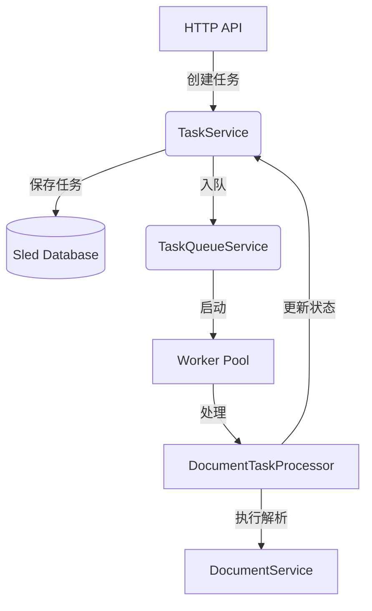
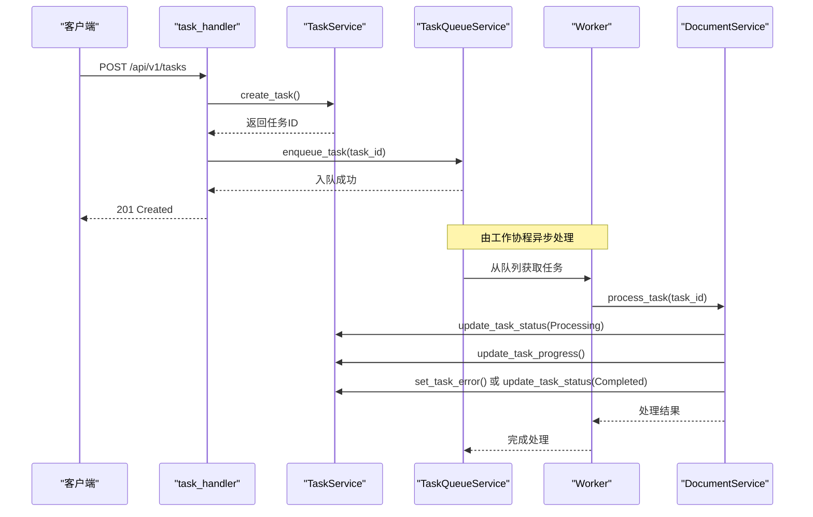

# 任务调度

<cite>
**本文档引用的文件**
- [task_queue_service.rs](file://document-parser/src/services/task_queue_service.rs)
- [task_service.rs](file://document-parser/src/services/task_service.rs)
- [task_handler.rs](file://document-parser/src/handlers/task_handler.rs)
- [environment_manager.rs](file://document-parser/src/utils/environment_manager.rs)
- [document_task.rs](file://document-parser/src/models/document_task.rs)
- [task_status.rs](file://document-parser/src/models/task_status.rs)
</cite>

## 目录
1. [引言](#引言)
2. [核心架构与组件](#核心架构与组件)
3. [任务调度机制详解](#任务调度机制详解)
4. [外部API与调度流程集成](#外部api与调度流程集成)
5. [容量控制与背压处理](#容量控制与背压处理)
6. [环境配置与动态调整](#环境配置与动态调整)
7. [性能调优建议](#性能调优建议)
8. [结论](#结论)

## 引言

本文档全面阐述了基于异步队列的任务调度机制。该机制是文档解析服务的核心，负责高效、可靠地处理文档解析任务。系统利用Tokio运行时构建了一个优先级队列，实现了任务的入队、出队与并发消费。通过`TaskQueueService`与`TaskService`的紧密协作，以及`task_handler.rs`中HTTP API端点的触发，形成了一个完整的任务生命周期管理闭环。文档将深入分析其内部实现、资源隔离策略、背压处理机制，并探讨如何通过环境配置进行动态调整和性能优化。

## 核心架构与组件

任务调度系统由多个核心组件构成，它们协同工作以实现高效的任务处理。

### TaskQueueService: 异步队列调度器

`TaskQueueService`是任务调度的核心，它利用Tokio的异步运行时和`mpsc`（多生产者，单消费者）通道构建了一个高性能的优先级队列。其主要职责包括：
- **任务入队与出队**：提供`enqueue_task`和内部消费机制。
- **并发消费**：启动多个工作协程（worker）并发处理任务。
- **状态监控**：维护队列的统计信息，如待处理、处理中、已完成任务的数量。
- **生命周期管理**：支持优雅启动和关闭。

该服务通过`QueueConfig`结构体进行配置，定义了最大并发任务数、队列大小、任务超时时间等关键参数。

### TaskService: 任务管理与持久化

`TaskService`负责任务的全生命周期管理，是任务的“大脑”和“记忆”。它与`TaskQueueService`紧密协作，主要功能包括：
- **任务创建与存储**：通过`create_task`方法创建新任务，并将其持久化到Sled数据库中。
- **状态管理**：提供`update_task_status`、`cancel_task`、`retry_task`等方法，用于更新任务状态（待处理、处理中、完成、失败、取消）。
- **查询与统计**：支持通过`get_task`、`list_tasks`获取任务详情，并通过`get_task_stats`提供全局任务统计。
- **数据模型**：与`DocumentTask`和`TaskStatus`模型交互，确保任务数据的完整性和一致性。

**Section sources**
- [task_service.rs](file://document-parser/src/services/task_service.rs#L1-L632)
- [task_queue_service.rs](file://document-parser/src/services/task_queue_service.rs#L1-L796)

### 协作关系

`TaskQueueService`与`TaskService`的协作关系是调度机制的关键。`TaskQueueService`专注于任务的**调度与执行**，而`TaskService`则负责任务的**元数据管理与持久化**。当一个任务被创建时，`TaskService`首先将其保存到数据库，然后`TaskQueueService`将其加入队列。在任务执行过程中，`TaskQueueService`会调用`TaskService`的方法来更新任务状态。这种职责分离的设计提高了系统的可维护性和可扩展性。

**Diagram sources**
- [task_service.rs](file://document-parser/src/services/task_service.rs#L1-L632)
- [task_queue_service.rs](file://document-parser/src/services/task_queue_service.rs#L1-L796)
- [document_task_processor.rs](file://document-parser/src/services/document_task_processor.rs#L1-L70)

## 任务调度机制详解

### 基于Tokio的异步优先级队列

`TaskQueueService`的核心是基于Tokio的`mpsc::channel`构建的有界通道。该通道的容量由`QueueConfig.max_queue_size`决定，这直接实现了**背压控制**。当队列满时，新的任务将无法入队，从而防止系统被过多的请求压垮。

任务的优先级通过`QueueItem`结构体中的`priority`字段实现。虽然当前的`spawn_simple_worker`工作模式直接从共享通道消费，但`priority`字段为未来实现更复杂的优先级调度算法（如高优先级任务优先处理）提供了基础。

### 任务的入队与出队流程

1.  **入队 (`enqueue_task`)**：
    -   首先检查队列服务是否已启动。
    -   创建一个`QueueItem`，包含任务ID、优先级和创建时间。
    -   调用`task_sender.try_send()`尝试将任务发送到通道。这是一个非阻塞操作。
    -   如果发送成功，`queued_count`原子计数器递增，任务成功入队。
    -   如果通道已满，触发背压，返回`AppError::Queue("队列已满，请稍后重试")`错误。

2.  **出队与消费**：
    -   通过`start`方法启动，该方法会创建`mpsc::channel`并启动多个工作协程（`spawn_simple_worker`）。
    -   每个工作协程在一个无限循环中，通过`tokio::select!`宏同时监听**关闭信号**和**任务接收**。
    -   当从通道接收到任务时，工作协程开始处理：
        -   更新任务状态为“处理中”。
        -   调用`TaskProcessor`（如`DocumentTaskProcessor`）的`process_task`方法执行具体业务逻辑。
        -   根据执行结果，更新任务状态为“完成”或“失败”。
        -   更新统计信息。

### 任务的并发消费

`TaskQueueService`通过`spawn_workers`方法启动多个工作协程。每个工作协程都是一个独立的`tokio::spawn`异步任务，它们共享一个`mpsc::Receiver`。这种SPMC（单生产者，多消费者）模式充分利用了Tokio的异步调度能力，实现了任务的并发处理。`QueueConfig.max_concurrent_tasks`参数直接控制了并发工作的数量，是系统吞吐量的关键。

**Section sources**
- [task_queue_service.rs](file://document-parser/src/services/task_queue_service.rs#L590-L621)
- [task_queue_service.rs](file://document-parser/src/services/task_queue_service.rs#L139-L181)
- [task_queue_service.rs](file://document-parser/src/services/task_queue_service.rs#L726-L764)

## 外部API与调度流程集成

外部请求通过`task_handler.rs`中的HTTP API端点触发整个任务调度流程。

### HTTP API端点

`task_handler.rs`定义了RESTful API，用于与任务调度系统交互：

-   **`POST /api/v1/tasks`**: 创建新任务。调用`TaskService.create_task`创建任务，然后调用`TaskQueueService.enqueue_task`将其加入队列。
-   **`GET /api/v1/tasks/{task_id}`**: 查询任务详情。调用`TaskService.get_task`从数据库获取任务信息。
-   **`POST /api/v1/tasks/{task_id}/cancel`**: 取消任务。调用`TaskService.cancel_task`更新任务状态。
-   **`POST /api/v1/tasks/{task_id}/retry`**: 重试任务。调用`TaskService.retry_task`重置任务状态并重新入队。

### 调度流程示例

以下是一个完整的任务创建与调度流程：

1.  **客户端发起请求**：`POST /api/v1/tasks`，请求体包含`source_type`, `source_path`, `format`。
2.  **API处理**：`create_task`处理函数被调用。
3.  **任务创建**：`TaskService.create_task`被调用，创建一个`DocumentTask`对象，并将其序列化后存储到Sled数据库。
4.  **任务入队**：`TaskQueueService.enqueue_task`被调用，将新创建的任务ID加入异步队列。
5.  **任务消费**：`TaskQueueService`的工作协程从队列中取出任务。
6.  **任务执行**：工作协程调用`DocumentTaskProcessor.process_task`，进而调用`DocumentService.parse_document`执行实际的文档解析逻辑。
7.  **状态更新**：在解析过程中，`DocumentService`会通过`TaskService`不断更新任务的处理阶段和进度。
8.  **流程结束**：解析成功或失败后，任务状态被更新为“完成”或“失败”，整个流程结束。

**Diagram sources**
- [task_handler.rs](file://document-parser/src/handlers/task_handler.rs#L1-L799)
- [task_service.rs](file://document-parser/src/services/task_service.rs#L1-L632)
- [task_queue_service.rs](file://document-parser/src/services/task_queue_service.rs#L1-L796)

## 容量控制与背压处理

### 容量控制

系统的容量由`QueueConfig`中的两个关键参数控制：
-   `max_concurrent_tasks`: 限制了同时处理任务的**工作协程**数量，防止CPU和内存资源被耗尽。
-   `max_queue_size`: 限制了等待处理的任务队列长度，防止内存中积压过多任务。

这种双重控制确保了系统在高负载下仍能稳定运行。

### 背压处理

背压是系统在过载时保护自身的一种机制。当`TaskQueueService`的队列已满时，`enqueue_task`方法会返回一个明确的错误（`AppError::Queue("队列已满，请稍后重试")`），而不是阻塞或丢弃任务。这使得上游调用者（如API）可以：
-   向客户端返回429状态码（Too Many Requests）。
-   实现重试逻辑（如指数退避）。
-   将任务暂存到更持久的存储（如Redis）稍后重试。

这种设计将压力从后端服务传递回客户端，避免了雪崩效应。

### 资源隔离

通过将任务处理逻辑封装在`TaskProcessor` trait中，并由`TaskQueueService`统一调度，实现了业务逻辑与调度逻辑的隔离。同时，每个任务的处理都在独立的异步任务中进行，利用Tokio的调度器实现了轻量级的资源隔离。数据库操作通过`TaskService`的原子操作和事务（`flush`）来保证数据一致性。

**Section sources**
- [task_queue_service.rs](file://document-parser/src/services/task_queue_service.rs#L726-L764)
- [task_queue_service.rs](file://document-parser/src/services/task_queue_service.rs#L590-L621)

## 环境配置与动态调整

### 基于环境的队列行为

系统通过`config.yml`文件进行配置。不同的环境（开发/生产）可以使用不同的配置文件，从而调整队列行为：
-   **开发环境**：可以设置较小的`max_concurrent_tasks`和`max_queue_size`，便于调试和观察。
-   **生产环境**：可以设置较大的值以最大化吞吐量。

### EnvironmentManager动态调整

`EnvironmentManager`是一个强大的工具，用于管理和监控Python依赖环境。虽然它不直接调整`TaskQueueService`的参数，但它的设计理念体现了系统的可配置性。通过`EnvironmentManager`，系统可以：
-   **动态检测环境**：检查CUDA、Python、虚拟环境等状态。
-   **自动修复问题**：在后台自动安装缺失的依赖（如MinerU）。
-   **提供诊断报告**：生成详细的环境健康报告。

这种动态调整能力确保了任务处理引擎（依赖Python）的稳定，间接保证了任务调度系统的整体可靠性。未来可以扩展`EnvironmentManager`的功能，使其能够根据系统负载动态调整`TaskQueueService`的并发数。

**Section sources**
- [environment_manager.rs](file://document-parser/src/utils/environment_manager.rs#L1-L799)
- [task_queue_service.rs](file://document-parser/src/services/task_queue_service.rs#L96-L141)

## 性能调优建议

1.  **批量处理**：虽然当前API是单任务创建，但可以扩展`task_handler`以支持批量创建任务（`POST /api/v1/tasks/batch`）。这样可以减少API调用开销，提高吞吐量。
2.  **延迟提交**：`TaskService`在每次`save_task`后都调用`flush()`来确保数据持久化。在高并发场景下，这可能成为瓶颈。可以考虑实现一个延迟提交策略，将多次更新合并后批量刷新到磁盘。
3.  **内存使用监控**：`QueueStats`中的`memory_usage_bytes`是一个估算值。应结合操作系统的内存监控工具（如`top`、`htop`）和Rust的内存分析工具（如`heaptrack`）进行更精确的内存使用分析。
4.  **优化工作协程数**：`max_concurrent_tasks`的值需要根据实际硬件（CPU核心数）和任务类型（CPU密集型或IO密集型）进行调优。对于IO密集型任务（如网络请求、文件读写），可以设置较高的并发数。
5.  **监控与告警**：利用`get_stats`和`get_task_stats`接口，建立监控系统。当`backpressure_events`或`failed_count`持续升高时，应及时发出告警。

## 结论

本文档详细阐述了基于`TaskQueueService`的异步任务调度机制。该系统通过Tokio运行时、有界通道和工作协程池，构建了一个高效、健壮的优先级队列。它与`TaskService`的职责分离设计，以及与HTTP API的无缝集成，形成了一个完整的任务处理闭环。通过容量控制、背压处理和环境动态管理，系统能够在各种负载下保持稳定。遵循本文档的性能调优建议，可以进一步提升系统的吞吐量和可靠性。