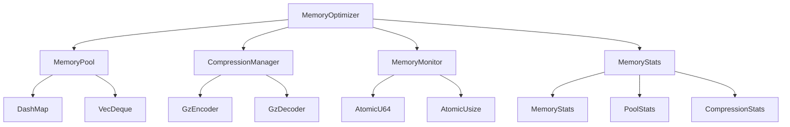
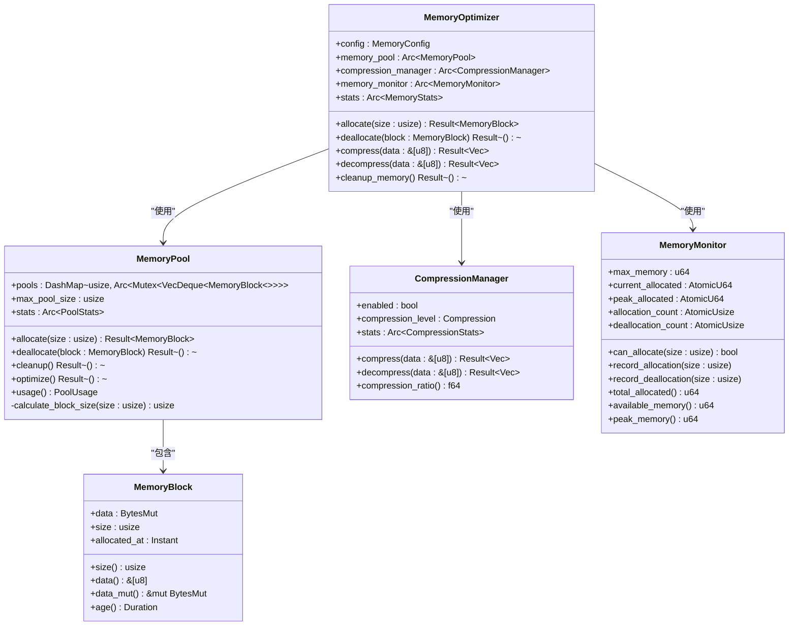

# 内存管理

<cite>
**本文档引用的文件**
- [memory_optimizer.rs](file://document-parser/src/performance/memory_optimizer.rs)
- [mineru_parser.rs](file://document-parser/src/parsers/mineru_parser.rs)
- [markitdown_parser.rs](file://document-parser/src/parsers/markitdown_parser.rs)
- [config.rs](file://document-parser/src/config.rs)
- [document_service.rs](file://document-parser/src/services/document_service.rs)
</cite>

## 目录
1. [引言](#引言)
2. [内存优化技术总览](#内存优化技术总览)
3. [内存池复用机制](#内存池复用机制)
4. [大文件解析与分块处理](#大文件解析与分块处理)
5. [临时对象生命周期管理](#临时对象生命周期管理)
6. [堆内存峰值控制策略](#堆内存峰值控制策略)
7. [性能分析与优化建议](#性能分析与优化建议)
8. [结论](#结论)

## 引言

本文件详细阐述了 `MemoryOptimizer` 组件在处理大型PDF、Word等文档时所采用的内存优化技术。该系统通过内存池复用、压缩管理、内存监控等多种手段，有效控制了文档解析过程中的内存分配开销和峰值使用。文档将深入分析其核心机制，包括对象池的实现、大文件的分块处理策略、临时对象的生命周期管理，以及如何防止内存泄漏。同时，结合系统配置和性能监控，提供针对不同文档规模的内存配置建议。

**本文档引用的文件**
- [memory_optimizer.rs](file://document-parser/src/performance/memory_optimizer.rs)

## 内存优化技术总览

`MemoryOptimizer` 是一个综合性的内存管理组件，旨在优化大型文档解析过程中的内存使用。它并非直接实现零拷贝读取，而是通过一系列协同工作的子系统来减少内存分配和峰值占用。

其核心优化技术包括：
1.  **内存池复用 (Memory Pooling)**：通过 `MemoryPool` 结构复用已分配的内存块，避免频繁的 `malloc` 和 `free` 操作，从而减少内存分配开销和碎片化。
2.  **数据压缩 (Data Compression)**：通过 `CompressionManager` 对中间数据进行GZIP压缩，显著降低内存中存储的数据量，尤其对文本内容丰富的文档效果明显。
3.  **内存监控与限制 (Memory Monitoring)**：`MemoryMonitor` 实时跟踪内存分配，强制执行配置的内存上限，防止内存无限增长。
4.  **主动清理 (Proactive Cleanup)**：当内存使用率超过阈值时，系统会主动触发清理操作，回收空闲的内存池块。

这些技术共同构成了一个动态的内存管理系统，确保在处理大型文档时，内存使用既高效又可控。

**图表来源**
- [memory_optimizer.rs](file://document-parser/src/performance/memory_optimizer.rs#L1-L707)

**本节来源**
- [memory_optimizer.rs](file://document-parser/src/performance/memory_optimizer.rs#L1-L707)

## 内存池复用机制

内存池是 `MemoryOptimizer` 减少内存分配开销的核心。其设计基于 `MemoryPool` 结构，利用 `DashMap` 和 `Mutex<VecDeque<MemoryBlock>>` 来管理不同大小的内存块。

### 工作原理
1.  **分配 (Allocate)**：当请求分配内存时，`MemoryPool` 会根据请求的大小，计算出最接近的2的幂次作为块大小（最小64字节）。它首先尝试从对应大小的池中获取一个空闲的 `MemoryBlock`（命中）。如果池为空，则创建一个新的 `MemoryBlock`（未命中）。
2.  **释放 (Deallocate)**：当 `MemoryBlock` 被释放时，它不会立即归还给操作系统，而是被放回其对应大小的池中，等待下次分配。
3.  **清理 (Cleanup)**：`cleanup` 方法会定期清理所有池，移除一半的空闲块，以防止内存池无限增长。
4.  **优化 (Optimize)**：`optimize` 方法会移除那些已变为空的池，保持池结构的精简。

这种机制通过复用内存块，将昂贵的系统级内存分配/释放操作，转换为廉价的内存池内数据结构操作，极大地提升了性能。

**图表来源**
- [memory_optimizer.rs](file://document-parser/src/performance/memory_optimizer.rs#L1-L707)

**本节来源**
- [memory_optimizer.rs](file://document-parser/src/performance/memory_optimizer.rs#L1-L707)

## 大文件解析与分块处理

虽然 `MemoryOptimizer` 本身不直接处理文件的分块读取，但整个文档解析系统通过上层组件实现了对大文件的有效处理。

### 分块处理机制
1.  **外部工具驱动**：核心解析器 `MinerUParser` 和 `MarkItDownParser` 并非在内存中一次性加载整个文件，而是通过调用外部Python命令行工具（如MinerU）来完成解析。这些外部工具本身具备处理大文件的能力，它们会以流式或分块的方式读取和处理文件。
2.  **内存监控**：`MemoryOptimizer` 的 `MemoryMonitor` 会监控整个解析过程中的内存使用。当外部工具在处理大文件时产生大量中间数据，导致内存使用接近 `max_memory` 限制时，`MemoryOptimizer` 会阻止新的内存分配请求，从而间接控制了大文件解析的内存峰值。
3.  **配置驱动**：系统通过 `GlobalFileSizeConfig` 配置来定义大文档的阈值（`large_document_threshold`）。当文件大小超过此阈值时，系统可以触发特定的处理流程，例如优先使用更节省内存的解析后端或调整超时设置。

这种设计将文件I/O的复杂性交给了专门的解析引擎，而 `MemoryOptimizer` 则专注于监控和管理这些引擎在运行时产生的内存消耗。

**本节来源**
- [mineru_parser.rs](file://document-parser/src/parsers/mineru_parser.rs#L1-L799)
- [markitdown_parser.rs](file://document-parser/src/parsers/markitdown_parser.rs#L1-L799)
- [config.rs](file://document-parser/src/config.rs#L1-L799)

## 临时对象生命周期管理

`MemoryOptimizer` 通过严格的生命周期管理来防止Rust中的内存泄漏或过度驻留。

### 管理策略
1.  **引用计数 (Arc)**：`MemoryOptimizer` 的核心组件（如 `memory_pool`, `compression_manager`）都使用 `Arc`（原子引用计数）进行包装。这允许多个所有者安全地共享这些资源，当所有引用都被释放时，资源会自动被清理。
2.  **内存池管理**：`MemoryBlock` 对象的生命周期由 `MemoryPool` 精确控制。`allocate` 方法返回一个 `MemoryBlock`，当其超出作用域时，`Drop` 特性会被调用，进而触发 `deallocate` 方法，将内存块归还给池或丢弃。
3.  **主动清理**：`cleanup_memory` 方法会主动清理内存池，移除空闲的内存块。此外，在 `jemalloc` 特性启用时，会调用 `malloc_trim(0)` 来将未使用的内存归还给操作系统，防止内存过度驻留。
4.  **原子操作**：`MemoryMonitor` 使用 `AtomicU64` 和 `AtomicUsize` 来记录内存使用情况，确保在多线程环境下计数的准确性，避免了因竞态条件导致的统计错误。

通过这些机制，系统确保了临时对象在使用完毕后能够被及时、正确地回收，有效防止了内存泄漏。

**本节来源**
- [memory_optimizer.rs](file://document-parser/src/performance/memory_optimizer.rs#L1-L707)

## 堆内存峰值控制策略

`MemoryOptimizer` 采用主动和被动相结合的策略来控制堆内存的使用峰值。

### 控制策略
1.  **硬性上限 (Hard Limit)**：`MemoryMonitor` 设置了一个 `max_memory` 的硬性上限。任何 `allocate` 请求都会首先通过 `can_allocate` 方法检查，如果请求的内存加上已分配的内存会超过上限，则分配失败。这是防止内存爆炸的第一道防线。
2.  **峰值监控**：`MemoryMonitor` 会持续跟踪并记录 `peak_allocated`，即程序运行期间达到的最高内存使用量。这为性能分析和配置调优提供了关键数据。
3.  **主动优化 (Proactive Optimization)**：`MemoryOptimizer` 实现了 `PerformanceOptimizable` trait。`optimize` 方法会定期被调用，它会检查当前内存使用率。如果使用率超过 `cleanup_threshold`，就会触发 `cleanup_memory`，主动清理内存池，从而在内存达到峰值前进行干预。
4.  **压缩降峰**：`CompressionManager` 通过压缩数据，直接减少了内存中存储的数据量，从源头上降低了内存峰值。

这些策略共同作用，确保了即使在处理最复杂的文档时，内存使用也始终在可控范围内。

**本节来源**
- [memory_optimizer.rs](file://document-parser/src/performance/memory_optimizer.rs#L1-L707)

## 性能分析与优化建议

虽然文档中未直接提供 `perf` 或 `valgrind` 的分析结果，但 `MemoryOptimizer` 内置了详细的统计功能，可用于性能分析。

### 内置性能分析
1.  **内存统计**：`MemoryStats` 和 `PoolStatsData` 结构记录了总分配/释放次数、内存池命中/未命中率、压缩比率等关键指标。通过对比优化前后的这些数据，可以量化优化效果。
2.  **压缩比率**：`CompressionManager` 会记录平均压缩比率。高比率表明压缩对内存节省效果显著。
3.  **内存池命中率**：高命中率意味着内存复用效果好，减少了系统调用开销。

### 内存配置建议
根据 `GlobalFileSizeConfig` 和 `MemoryOptimizer` 的配置，针对不同文档规模的建议如下：

| 文档规模 | 建议配置 | 说明 |
| :--- | :--- | :--- |
| **小型文档** (< 1MB) | `max_memory` 512MB, `pool_size` 100 | 无需过多优化，保证解析速度。 |
| **中型文档** (1MB - 10MB) | `max_memory` 1GB, `pool_size` 500, `enable_compression` true | 启用压缩，增大内存池以提高复用率。 |
| **大型文档** (> 10MB) | `max_memory` 2GB, `pool_size` 1000, `cleanup_threshold` 0.7 | 严格限制内存，提高清理阈值，防止内存耗尽。 |

**本节来源**
- [memory_optimizer.rs](file://document-parser/src/performance/memory_optimizer.rs#L1-L707)
- [config.rs](file://document-parser/src/config.rs#L1-L799)

## 结论

`MemoryOptimizer` 通过内存池复用、数据压缩、内存监控和主动清理等一系列技术，构建了一个高效且稳健的内存管理系统。它有效地减少了大型文档解析过程中的内存分配开销，并通过硬性上限和主动优化策略，严格控制了堆内存的使用峰值。结合上层解析器的分块处理能力，该系统能够安全、高效地处理各种规模的文档，为整个文档解析服务的稳定运行提供了坚实的内存保障。