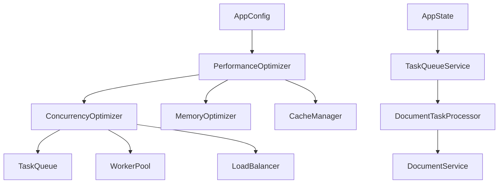
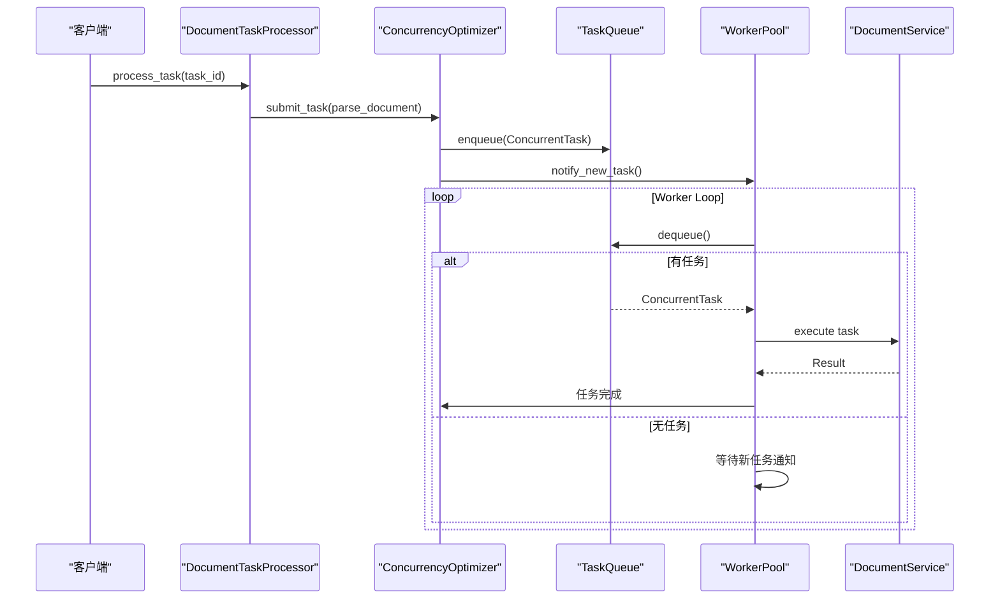
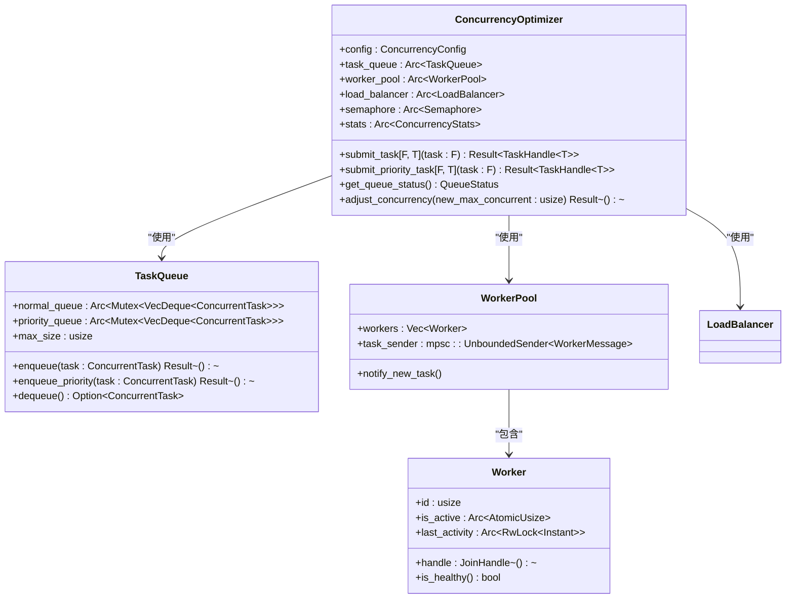
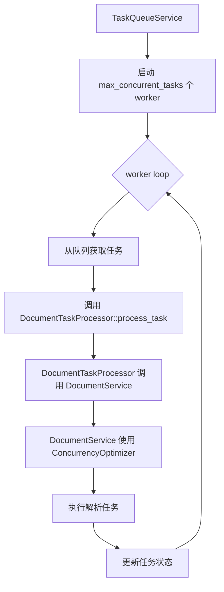
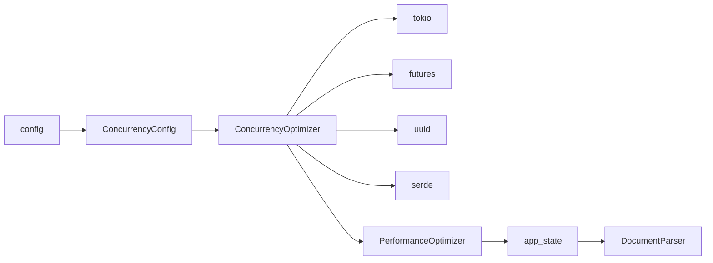

# 并发优化

<cite>
**本文档引用的文件**  
- [concurrency_optimizer.rs](file://document-parser/src/performance/concurrency_optimizer.rs)
- [document_task_processor.rs](file://document-parser/src/services/document_task_processor.rs)
- [task_queue_service.rs](file://document-parser/src/services/task_queue_service.rs)
- [app_state.rs](file://document-parser/src/app_state.rs)
- [config.rs](file://document-parser/src/config.rs)
</cite>

## 目录
1. [简介](#简介)
2. [项目结构](#项目结构)
3. [核心组件](#核心组件)
4. [架构概述](#架构概述)
5. [详细组件分析](#详细组件分析)
6. [依赖分析](#依赖分析)
7. [性能考量](#性能考量)
8. [故障排除指南](#故障排除指南)
9. [结论](#结论)

## 简介
本文档深入解析 `ConcurrencyOptimizer` 模块的实现机制，阐述其如何基于系统负载动态调整线程池大小与任务并发度。详细说明其内部使用的 tokio 运行时集成、任务调度策略以及 CPU 核心利用率监控逻辑。结合代码示例展示在高并发文档解析场景下的性能提升效果，并提供配置参数调优建议，如最大并发数、队列深度与任务分片策略。解释该模块如何与 `document_task_processor` 和服务调度协同工作，避免资源争用。包含常见问题如线程饥饿、任务堆积的诊断方法与解决方案。

## 项目结构
`ConcurrencyOptimizer` 模块位于 `document-parser/src/performance/` 目录下，是整个文档解析服务性能优化体系的核心。它与 `document_task_processor` 和 `task_queue_service` 紧密协作，共同管理文档解析任务的生命周期。`app_state` 负责协调这些组件的初始化和依赖注入，而 `config` 模块则为 `ConcurrencyOptimizer` 提供必要的配置参数。

**Diagram sources**
- [concurrency_optimizer.rs](file://document-parser/src/performance/concurrency_optimizer.rs#L1-L703)
- [app_state.rs](file://document-parser/src/app_state.rs#L1-L307)
- [config.rs](file://document-parser/src/config.rs#L1-L799)

**Section sources**
- [concurrency_optimizer.rs](file://document-parser/src/performance/concurrency_optimizer.rs#L1-L703)
- [app_state.rs](file://document-parser/src/app_state.rs#L1-L307)
- [config.rs](file://document-parser/src/config.rs#L1-L799)

## 核心组件
`ConcurrencyOptimizer` 的核心由 `TaskQueue`、`WorkerPool` 和 `LoadBalancer` 三个组件构成。`TaskQueue` 实现了优先级队列，能够区分普通任务和高优先级任务，确保关键任务得到及时处理。`WorkerPool` 管理着一个固定大小的 tokio 任务工作线程池，负责执行具体的文档解析任务。`LoadBalancer` 则根据预设的策略（如轮询）在工作线程间分配任务，以实现负载均衡。

**Section sources**
- [concurrency_optimizer.rs](file://document-parser/src/performance/concurrency_optimizer.rs#L1-L703)

## 架构概述
`ConcurrencyOptimizer` 的架构设计遵循了生产者-消费者模式。外部服务（如 `document_task_processor`）作为生产者，通过 `submit_task` 或 `submit_priority_task` 方法将任务提交到 `TaskQueue`。`WorkerPool` 中的各个工作线程作为消费者，持续监听任务队列，一旦有新任务到达，便立即获取并执行。`LoadBalancer` 在后台运行，监控各工作线程的负载情况，并在必要时进行任务再分配。整个过程由 `tokio::sync::Semaphore` 控制，确保并发任务数不会超过 `max_concurrent_tasks` 的限制。

**Diagram sources**
- [concurrency_optimizer.rs](file://document-parser/src/performance/concurrency_optimizer.rs#L1-L703)
- [document_task_processor.rs](file://document-parser/src/services/document_task_processor.rs#L1-L70)

## 详细组件分析

### ConcurrencyOptimizer 分析
`ConcurrencyOptimizer` 是一个高性能的并发控制中心，它通过 `tokio::sync::Semaphore` 来精确控制系统的最大并发度。当 `submit_task` 被调用时，它首先尝试获取一个信号量许可，如果当前并发数已达到 `max_concurrent_tasks`，则调用会自动挂起，直到有任务完成并释放许可。这种机制有效地防止了系统因过载而崩溃。

**Diagram sources**
- [concurrency_optimizer.rs](file://document-parser/src/performance/concurrency_optimizer.rs#L1-L703)

**Section sources**
- [concurrency_optimizer.rs](file://document-parser/src/performance/concurrency_optimizer.rs#L1-L703)

### 与 document_task_processor 的协同工作
`ConcurrencyOptimizer` 与 `document_task_processor` 通过 `TaskQueueService` 进行协同。`document_task_processor` 作为 `TaskProcessor` trait 的实现，其 `process_task` 方法被 `TaskQueueService` 的工作线程调用。`TaskQueueService` 内部集成了 `ConcurrencyOptimizer` 的配置，通过 `max_concurrent_tasks` 参数来控制工作线程池的大小，从而避免了 `document_task_processor` 因处理过多任务而导致的资源争用。

**Diagram sources**
- [task_queue_service.rs](file://document-parser/src/services/task_queue_service.rs#L1-L796)
- [document_task_processor.rs](file://document-parser/src/services/document_task_processor.rs#L1-L70)

**Section sources**
- [task_queue_service.rs](file://document-parser/src/services/task_queue_service.rs#L1-L796)
- [document_task_processor.rs](file://document-parser/src/services/document_task_processor.rs#L1-L70)

## 依赖分析
`ConcurrencyOptimizer` 的主要依赖包括 `tokio` 用于异步运行时和同步原语，`futures` 用于异步编程，`uuid` 用于生成任务ID，以及 `serde` 用于序列化。它与 `performance` 模块中的其他组件（如 `MemoryOptimizer` 和 `CacheManager`）共同构成了 `PerformanceOptimizer`，并通过 `app_state` 被整个应用所使用。其配置来源于 `config` 模块中的 `ConcurrencyConfig`。

**Diagram sources**
- [concurrency_optimizer.rs](file://document-parser/src/performance/concurrency_optimizer.rs#L1-L703)
- [mod.rs](file://document-parser/src/performance/mod.rs#L1-L440)
- [config.rs](file://document-parser/src/config.rs#L1-L799)

**Section sources**
- [concurrency_optimizer.rs](file://document-parser/src/performance/concurrency_optimizer.rs#L1-L703)
- [mod.rs](file://document-parser/src/performance/mod.rs#L1-L440)
- [config.rs](file://document-parser/src/config.rs#L1-L799)

## 性能考量
`ConcurrencyOptimizer` 的性能关键在于 `max_concurrent_tasks` 和 `task_queue_size` 的合理配置。`max_concurrent_tasks` 应根据服务器的 CPU 核心数和内存大小进行设置，通常建议设置为 CPU 核心数的 1-2 倍。`task_queue_size` 则决定了系统在高负载下的缓冲能力，过小会导致任务被拒绝，过大则可能耗尽内存。此外，`task_timeout` 可以防止任务无限期挂起，确保系统资源得到及时释放。

## 故障排除指南
**线程饥饿**：如果发现任务长时间处于队列中而无法执行，首先检查 `max_concurrent_tasks` 是否设置过低。其次，检查是否有任务因异常而卡住，导致工作线程无法释放。可以通过 `get_queue_status` 方法监控 `pending_tasks` 和 `active_tasks` 的数量来诊断。

**任务堆积**：任务堆积通常由 `max_concurrent_tasks` 设置过低或后端服务（如 MinerU）处理能力不足引起。解决方案包括增加 `max_concurrent_tasks`、优化后端服务性能或增加 `task_queue_size` 以提供更大的缓冲。

**Section sources**
- [concurrency_optimizer.rs](file://document-parser/src/performance/concurrency_optimizer.rs#L1-L703)
- [task_queue_service.rs](file://document-parser/src/services/task_queue_service.rs#L1-L796)

## 结论
`ConcurrencyOptimizer` 模块通过精细的并发控制和任务调度，显著提升了文档解析服务在高并发场景下的稳定性和性能。其与 `document_task_processor` 和 `task_queue_service` 的紧密集成，构建了一个高效、健壮的任务处理流水线。通过合理的配置调优和有效的故障排除，可以确保系统在各种负载下都能平稳运行。