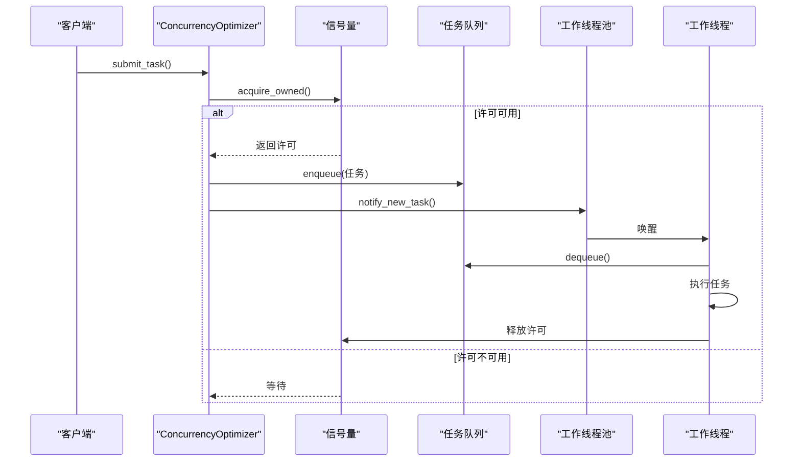
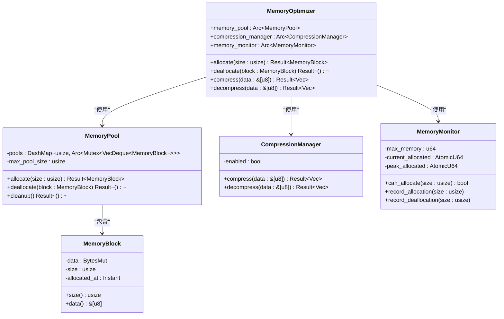
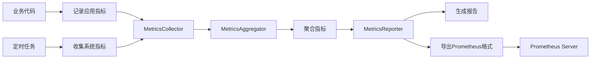

# 性能优化

<cite>
**本文档引用的文件**   
- [concurrency_optimizer.rs](file://document-parser/src/performance/concurrency_optimizer.rs)
- [cache_manager.rs](file://document-parser/src/performance/cache_manager.rs)
- [memory_optimizer.rs](file://document-parser/src/performance/memory_optimizer.rs)
- [metrics_collector.rs](file://document-parser/src/performance/metrics_collector.rs)
- [mod.rs](file://document-parser/src/performance/mod.rs)
- [config.rs](file://document-parser/src/config.rs)
</cite>

## 目录
1. [引言](#引言)
2. [并发优化器](#并发优化器)
3. [缓存管理器](#缓存管理器)
4. [内存优化器](#内存优化器)
5. [指标收集器](#指标收集器)
6. [性能调优指南](#性能调优指南)
7. [结论](#结论)

## 引言

本文档系统性地阐述了文档解析服务的性能优化策略与实现。文档解析服务是一个高并发、高资源消耗的应用，需要处理各种格式的文档（如PDF、Word、Markdown等），并将其转换为结构化的Markdown内容。为了确保服务的高效、稳定和可扩展性，我们设计并实现了一套全面的性能优化机制，涵盖并发处理、内存使用、缓存策略和性能监控四个方面。

本文档将详细介绍`ConcurrencyOptimizer`如何动态调整线程池大小与任务并发数，以最大化硬件资源利用率；`CacheManager`如何利用内存缓存减少重复解析开销；`MemoryOptimizer`在处理大型文档时的内存分配与释放优化技术；以及`MetricsCollector`如何收集关键性能指标并通过Prometheus等监控系统暴露。最后，本文档将提供一份详尽的性能调优指南，帮助运维和开发人员根据工作负载进行优化。

## 并发优化器

`ConcurrencyOptimizer`是文档解析服务的核心组件之一，负责管理任务队列、工作线程池和负载均衡，以实现高效的并发处理。其设计目标是最大化硬件资源利用率，同时防止系统因过载而崩溃。

### 核心组件与工作流程

`ConcurrencyOptimizer`由以下几个核心组件构成：

1.  **任务队列 (TaskQueue)**：采用双队列设计，包含一个普通队列和一个高优先级队列。高优先级队列的容量为总容量的一半，确保高优先级任务能够快速得到处理。任务提交时，根据其优先级被放入相应的队列。
2.  **工作线程池 (WorkerPool)**：由固定数量的`Worker`线程组成。每个`Worker`通过一个`mpsc::UnboundedReceiver`接收任务消息。当收到`NewTask`消息时，`Worker`会从`TaskQueue`中获取一个任务（优先从高优先级队列中获取）并执行。
3.  **信号量 (Semaphore)**：用于控制最大并发任务数。在提交任务时，必须先获取一个信号量许可，这确保了同时运行的任务数不会超过配置的上限。
4.  **负载均衡器 (LoadBalancer)**：负责在工作线程之间分配任务，目前实现了轮询（RoundRobin）等策略。

其工作流程如下：
1.  客户端调用`submit_task`或`submit_priority_task`方法提交任务。
2.  方法首先尝试从`semaphore`获取一个许可，如果当前并发数已达到上限，则调用会等待。
3.  获取许可后，创建一个`ConcurrentTask`对象，并根据其优先级放入`TaskQueue`的相应队列。
4.  `WorkerPool`收到`notify_new_task`信号，唤醒一个空闲的`Worker`。
5.  `Worker`从`TaskQueue`中取出任务并执行，执行完毕后释放信号量许可。



**Diagram sources**
- [concurrency_optimizer.rs](file://document-parser/src/performance/concurrency_optimizer.rs#L1-L704)

**Section sources**
- [concurrency_optimizer.rs](file://document-parser/src/performance/concurrency_optimizer.rs#L1-L704)

### 动态调整机制

`ConcurrencyOptimizer`提供了`adjust_concurrency`方法，允许在运行时动态调整最大并发任务数。该方法通过向`Semaphore`添加或减少许可来实现。例如，当系统监控到CPU利用率较低时，可以调用此方法增加并发数，以提高吞吐量；反之，当系统负载过高时，可以减少并发数以保护系统稳定。

## 缓存管理器

`CacheManager`旨在通过智能缓存策略，显著减少对计算密集型文档解析操作的重复调用，从而降低响应延迟和服务器负载。

### 缓存键设计与过期策略

`CacheManager`为不同类型的缓存数据（文档、解析结果、元数据）维护了独立的缓存实例。其缓存键设计遵循以下原则：
-   **文档缓存**：使用`DefaultHasher`对原始键进行哈希，生成一个唯一的`doc:{hash}`格式的键，以避免键名冲突。
-   **结果缓存**：使用`result:{task_id}`格式的键，直接关联到任务ID。
-   **元数据缓存**：使用`metadata:{key}`格式的键。

所有缓存条目都包含一个过期时间戳（`expires_at`）。`CacheManager`启动一个后台清理任务（`start_cleanup_task`），该任务以`cleanup_interval`（默认5分钟）为周期，扫描所有缓存，移除已过期的条目。

### 内存回收与驱逐机制

为了防止缓存无限增长，`CacheManager`实现了基于容量限制的驱逐机制。每个缓存都有一个`max_size`，当缓存条目数量达到此上限时，新的条目插入会触发驱逐。

`CacheManager`支持多种驱逐策略，由`EvictionPolicy`枚举定义：
-   **LRU (Least Recently Used)**：驱逐最久未使用的条目。这是默认策略，通过一个`access_order`队列来跟踪条目的访问顺序。
-   **LFU (Least Frequently Used)**：驱逐访问频率最低的条目。通过一个`access_count`映射来记录每个条目的访问次数。
-   **FIFO (First In, First Out)**：驱逐最早进入缓存的条目。
-   **Random**：随机驱逐一个条目。

此外，`CacheManager`还实现了`optimize_cache_distribution`方法，该方法会分析各缓存的命中率和使用情况，并根据预设规则动态调整缓存大小。例如，如果文档缓存的命中率低于50%，则会自动减小其容量；如果结果缓存的命中率高于90%且已满，则会自动增加其容量。

```mermaid
flowchart TD
A[提交缓存请求] --> B{缓存命中?}
B --> |是| C[返回缓存数据<br>record_hit()]
B --> |否| D[执行解析操作]
D --> E[将结果存入缓存<br>record_write()]
E --> F{缓存是否应驱逐?}
F --> |是| G[执行驱逐策略<br>evict_lru()/evict_lfu()]
F --> |否| H[直接返回]
C --> I[返回结果]
G --> I
```

**Diagram sources**
- [cache_manager.rs](file://document-parser/src/performance/cache_manager.rs#L1-L1069)

**Section sources**
- [cache_manager.rs](file://document-parser/src/performance/cache_manager.rs#L1-L1069)

## 内存优化器

`MemoryOptimizer`专注于管理内存资源，防止内存泄漏和峰值占用过高，确保服务在处理大型文档时的稳定性和可靠性。

### 内存池与分配优化

`MemoryOptimizer`的核心是`MemoryPool`，一个基于`DashMap`的内存池。其工作原理如下：
1.  **分配**：当需要分配一块内存时，`MemoryPool`会根据请求的大小，向上舍入到最近的2的幂次（如64, 128, 256...），然后尝试从对应大小的池中获取一个空闲的`MemoryBlock`。如果池中没有可用块，则创建一个新的`MemoryBlock`。
2.  **释放**：当`MemoryBlock`被释放时，它不会立即被销毁，而是被放回对应大小的池中，以供后续的相同大小的分配请求复用。这有效减少了频繁的内存分配/释放（`malloc/free`）系统调用，降低了内存碎片。
3.  **清理**：`MemoryPool`提供了`cleanup`方法，当内存使用率过高时，会定期清理各池，移除一半的空闲块，以回收内存。

### 内存压缩与监控

`MemoryOptimizer`集成了`CompressionManager`，在`enable_compression`配置开启时，会对大型数据进行GZIP压缩，以减少内存占用。压缩和解压操作的性能开销会被`CompressionStats`记录。

`MemoryMonitor`负责监控内存使用情况。它通过`AtomicU64`原子变量精确跟踪当前已分配的内存总量和峰值内存占用。在每次分配和释放时，都会更新这些计数器。`MemoryOptimizer`的`optimize`方法会定期检查内存使用率，如果超过`cleanup_threshold`（默认80%），则会触发`cleanup_memory`操作，清理内存池并尝试调用`malloc_trim`（在使用jemalloc时）来将未使用的内存归还给操作系统。



**Diagram sources**
- [memory_optimizer.rs](file://document-parser/src/performance/memory_optimizer.rs#L1-L708)

**Section sources**
- [memory_optimizer.rs](file://document-parser/src/performance/memory_optimizer.rs#L1-L708)

## 指标收集器

`MetricsCollector`是服务的“眼睛”，负责收集、聚合和报告关键性能指标，为监控、告警和性能分析提供数据支持。

### 指标收集与聚合

`MetricsCollector`收集三类指标：
1.  **系统指标 (SystemMetrics)**：通过后台任务定期收集，包括CPU使用率、内存使用量、磁盘IO等。
2.  **应用指标 (ApplicationMetrics)**：在代码的关键路径上手动记录，例如`record_request`记录每次HTTP请求的耗时和成功状态，`record_document_processing`记录文档处理的耗时和文件大小。
3.  **自定义指标 (CustomMetrics)**：允许记录计数器（Counter）、仪表盘（Gauge）和直方图（Histogram）等自定义指标。

收集到的原始指标会被`MetricsAggregator`按照`aggregation_window`（默认5分钟）进行聚合，计算出平均值、百分位数等统计信息，以减少数据量并便于分析。

### 指标暴露与报告

`MetricsCollector`支持多种指标导出格式，最核心的是Prometheus格式。`export_prometheus_format`方法会将当前指标快照转换为Prometheus的文本格式，例如：
```
# HELP app_requests_total Total number of requests
# TYPE app_requests_total counter
app_requests_total 1234
# HELP app_request_duration_seconds Request duration in seconds
# TYPE app_request_duration_seconds histogram
app_request_duration_seconds 0.123
```
通过暴露一个HTTP端点（如`/metrics`），Prometheus服务器可以定期抓取这些数据，从而在Grafana等可视化工具中展示监控图表。

此外，`MetricsCollector`还支持生成性能报告、设置告警阈值和检查告警，为运维人员提供主动的健康检查能力。



**Diagram sources**
- [metrics_collector.rs](file://document-parser/src/performance/metrics_collector.rs#L1-L1135)

**Section sources**
- [metrics_collector.rs](file://document-parser/src/performance/metrics_collector.rs#L1-L1135)

## 性能调优指南

本指南提供基于工作负载的性能调优建议。

### 并发参数调整
-   **高吞吐量场景**：增加`concurrency.max_concurrent_tasks`和`concurrency.worker_threads`。建议将`worker_threads`设置为CPU核心数。
-   **低延迟场景**：适当减小`concurrency.task_queue_size`，避免任务在队列中积压过久。
-   **资源受限场景**：降低`concurrency.max_concurrent_tasks`，防止内存耗尽。

### 缓存大小调整
-   **热点数据场景**：增加`cache.result_cache_size`和`cache.document_cache_size`，提高缓存命中率。
-   **内存紧张场景**：减小缓存大小，或启用`enable_compression`以压缩缓存数据。

### JVM堆内存设置
> **注意**：本服务为Rust编写，不涉及JVM。此部分可能为文档模板残留，实际应关注Rust进程的内存限制。
-   **大型文档处理**：确保系统有足够的物理内存，并适当增加`memory.max_memory_usage`配置。

### 瓶颈分析
-   **高QPS但高延迟**：检查`QueueStatus`中的`pending_tasks`是否持续增长，如果是，则需增加并发数。
-   **CPU利用率高**：检查`ConcurrencyStats`中的`peak_concurrent_tasks`，确认是否已达到并发上限。
-   **内存持续增长**：检查`MemoryStats`中的`peak_allocated`，并确认`MemoryOptimizer`的清理机制是否正常工作。
-   **缓存命中率低**：检查`CacheStats`中的`hit_rate`，分析是否需要调整缓存键设计或增加缓存大小。

**Section sources**
- [mod.rs](file://document-parser/src/performance/mod.rs#L1-L441)
- [config.rs](file://document-parser/src/config.rs#L1-L1493)

## 结论

本文档详细阐述了文档解析服务的性能优化体系。通过`ConcurrencyOptimizer`、`CacheManager`、`MemoryOptimizer`和`MetricsCollector`四个核心组件的协同工作，服务实现了高效的并发处理、智能的缓存管理、安全的内存使用和全面的性能监控。这套优化策略不仅提升了服务的性能和稳定性，也为后续的容量规划和问题排查提供了坚实的数据基础。遵循本文档的调优指南，可以针对不同的生产环境和工作负载，将服务性能调整至最佳状态。