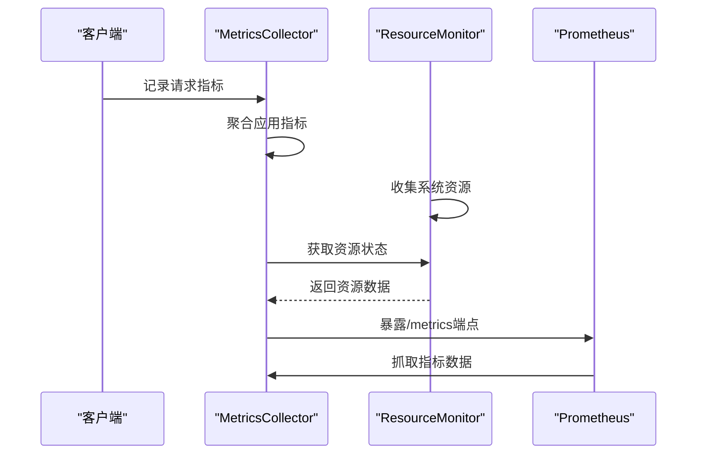
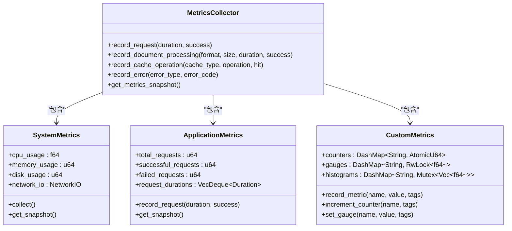
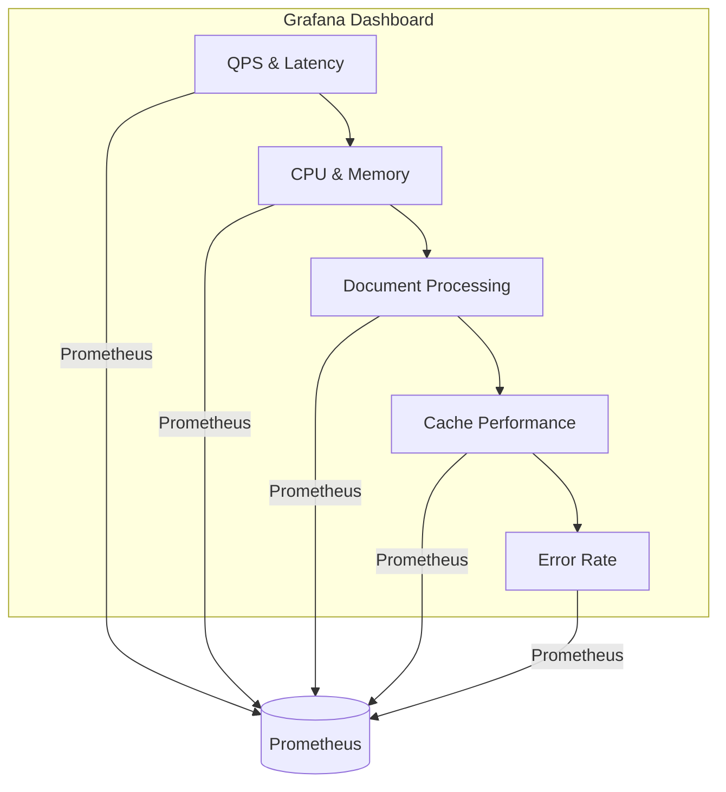
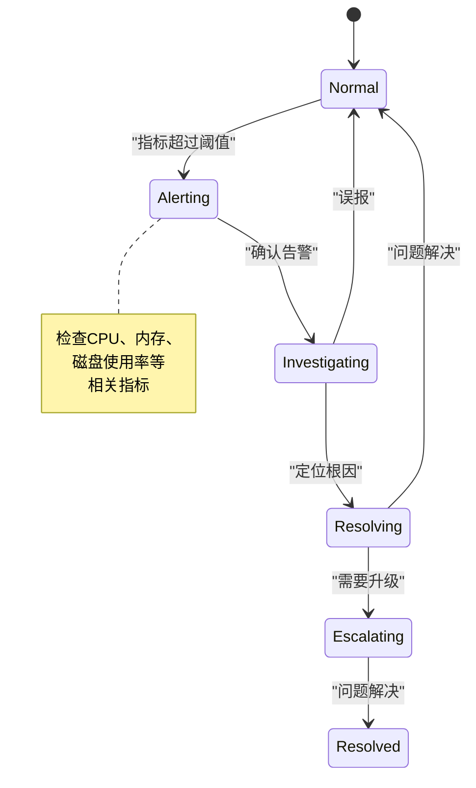
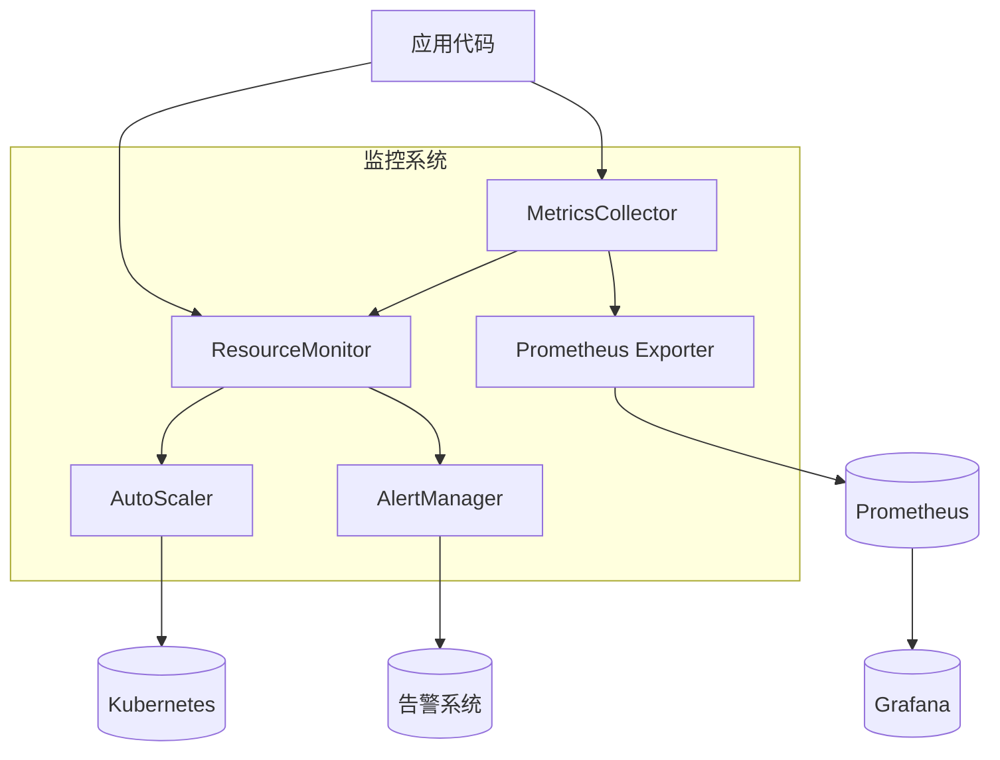

# 性能监控

<cite>
**本文档引用的文件**   
- [metrics_collector.rs](file://document-parser/src/performance/metrics_collector.rs)
- [resource_monitor.rs](file://document-parser/src/performance/resource_monitor.rs)
- [monitoring_handler.rs](file://document-parser/src/handlers/monitoring_handler.rs)
- [mod.rs](file://document-parser/src/performance/mod.rs)
- [main.rs](file://document-parser/src/main.rs)
- [app_state.rs](file://document-parser/src/app_state.rs)
- [routes.rs](file://document-parser/src/routes.rs)
</cite>

## 目录
1. [引言](#引言)
2. [核心组件协同机制](#核心组件协同机制)
3. [关键性能指标收集](#关键性能指标收集)
4. [与Prometheus集成](#与prometheus集成)
5. [指标标签设计](#指标标签设计)
6. [Grafana仪表板配置](#grafana仪表板配置)
7. [异常告警与根因分析](#异常告警与根因分析)
8. [系统架构](#系统架构)

## 引言
本系统通过MetricsCollector与ResourceMonitor两个核心组件协同工作，实现对文档解析服务的全面性能监控。MetricsCollector负责收集和聚合各类性能指标，包括文档解析延迟、QPS、内存占用和CPU使用率等；ResourceMonitor则专注于系统资源的监控、限制和自动扩缩容。两者共同为Prometheus等监控系统提供数据支持，并通过暴露/metrics端点实现指标的实时导出。

## 核心组件协同机制

MetricsCollector与ResourceMonitor通过异步任务和共享状态实现高效协同。MetricsCollector负责记录请求处理时间、文档解析耗时等应用级指标，而ResourceMonitor则监控系统级别的资源使用情况，如CPU、内存、磁盘和网络IO。



**Diagram sources**
- [metrics_collector.rs](file://document-parser/src/performance/metrics_collector.rs#L150-L250)
- [resource_monitor.rs](file://document-parser/src/performance/resource_monitor.rs#L150-L250)

**Section sources**
- [metrics_collector.rs](file://document-parser/src/performance/metrics_collector.rs#L1-L100)
- [resource_monitor.rs](file://document-parser/src/performance/resource_monitor.rs#L1-L100)

## 关键性能指标收集

系统收集的性能指标分为三大类：系统指标、应用指标和自定义指标。系统指标包括CPU使用率、内存占用、磁盘使用和网络IO；应用指标涵盖请求总数、成功/失败请求数、平均请求时长等；自定义指标则支持业务特定的监控需求。



**Diagram sources**
- [metrics_collector.rs](file://document-parser/src/performance/metrics_collector.rs#L100-L300)
- [mod.rs](file://document-parser/src/performance/mod.rs#L100-L200)

**Section sources**
- [metrics_collector.rs](file://document-parser/src/performance/metrics_collector.rs#L1-L500)

## 与Prometheus集成

系统通过暴露/metrics端点与Prometheus集成，支持Prometheus文本格式的指标导出。MetricsCollector实现了export_prometheus_format方法，将内部指标转换为Prometheus兼容的格式，包括HELP和TYPE注释以及相应的指标值。

```mermaid
flowchart TD
A[MetricsCollector] --> B{导出格式}
B --> |Prometheus| C["# HELP system_cpu_usage CPU使用率\n# TYPE system_cpu_usage gauge\nsystem_cpu_usage{} 75.5"]
B --> |JSON| D["{ \"system_metrics\": { \"cpu_usage\": 75.5 } }"]
B --> |InfluxDB| E["system_metrics cpu_usage=75.5 1700000000"]
B --> |CSV| F["timestamp,metric_type,metric_name,value\n1700000000,system,cpu_usage,75.5"]
C --> G[(Prometheus)]
D --> H[(其他系统)]
E --> I[(InfluxDB)]
F --> J[(CSV文件)]
```

**Diagram sources**
- [metrics_collector.rs](file://document-parser/src/performance/metrics_collector.rs#L700-L800)
- [monitoring_handler.rs](file://document-parser/src/handlers/monitoring_handler.rs#L150-L200)

**Section sources**
- [metrics_collector.rs](file://document-parser/src/performance/metrics_collector.rs#L600-L800)
- [monitoring_handler.rs](file://document-parser/src/handlers/monitoring_handler.rs#L100-L250)

## 指标标签设计

指标标签设计遵循多维分析原则，支持按文档类型、解析引擎、任务状态等维度进行切片和切块分析。标签通过HashMap<String, String>结构传递，允许在记录指标时动态添加维度信息。

```mermaid
erDiagram
METRIC ||--o{ LABEL : "包含"
METRIC {
string name
f64 value
timestamp collected_at
}
LABEL {
string key
string value
}
class MetricsCollector {
+record_document_processing(format, size, duration, success)
+record_cache_operation(cache_type, operation, hit)
+record_error(error_type, error_code)
}
MetricsCollector --> METRIC : "生成"
METRIC --> LABEL : "关联"
```

**Diagram sources**
- [metrics_collector.rs](file://document-parser/src/performance/metrics_collector.rs#L400-L500)
- [mod.rs](file://document-parser/src/performance/mod.rs#L300-L400)

**Section sources**
- [metrics_collector.rs](file://document-parser/src/performance/metrics_collector.rs#L300-L600)

## Grafana仪表板配置

Grafana仪表板配置建议包括多个面板，用于展示系统健康状况、性能趋势和资源使用情况。建议的面板包括：QPS和延迟趋势图、CPU和内存使用率、文档解析成功率、缓存命中率等。



**Diagram sources**
- [metrics_collector.rs](file://document-parser/src/performance/metrics_collector.rs#L1-L100)
- [monitoring_handler.rs](file://document-parser/src/handlers/monitoring_handler.rs#L1-L50)

## 异常告警与根因分析

系统支持对指标异常设置告警阈值，如延迟突增、内存泄漏等。当检测到异常时，系统会触发告警并启动根因分析流程，通过检查相关指标的关联性来定位问题根源。



**Diagram sources**
- [metrics_collector.rs](file://document-parser/src/performance/metrics_collector.rs#L500-L600)
- [resource_monitor.rs](file://document-parser/src/performance/resource_monitor.rs#L500-L600)

**Section sources**
- [metrics_collector.rs](file://document-parser/src/performance/metrics_collector.rs#L400-L700)
- [resource_monitor.rs](file://document-parser/src/performance/resource_monitor.rs#L400-L700)

## 系统架构

整个监控系统的架构由MetricsCollector、ResourceMonitor和外部监控系统组成。MetricsCollector负责收集和聚合指标，ResourceMonitor负责资源监控和限制，两者通过共享状态和异步通信实现协同工作。



**Diagram sources**
- [main.rs](file://document-parser/src/main.rs#L100-L200)
- [app_state.rs](file://document-parser/src/app_state.rs#L100-L200)
- [routes.rs](file://document-parser/src/routes.rs#L100-L200)

**Section sources**
- [main.rs](file://document-parser/src/main.rs#L1-L500)
- [app_state.rs](file://document-parser/src/app_state.rs#L1-L300)
- [routes.rs](file://document-parser/src/routes.rs#L1-L150)