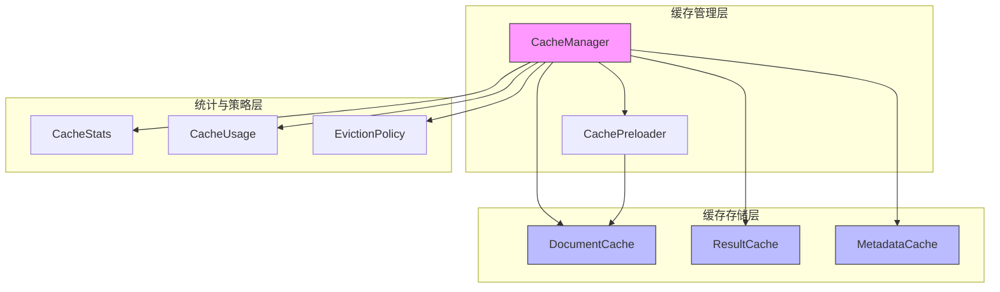
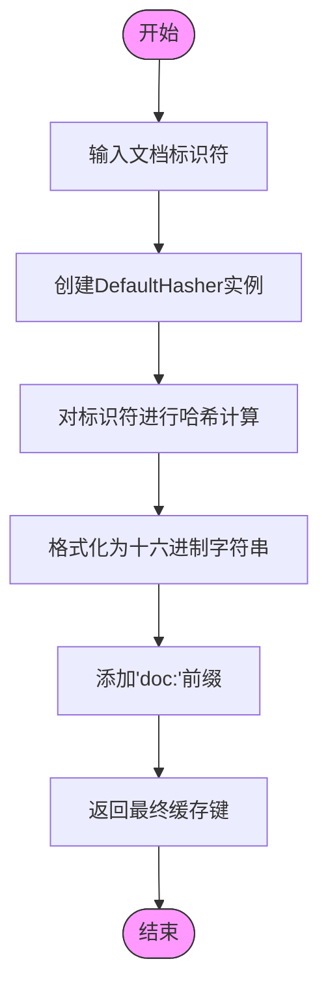
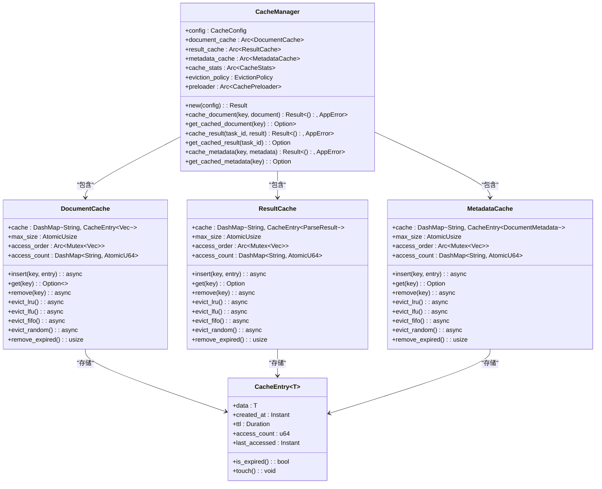
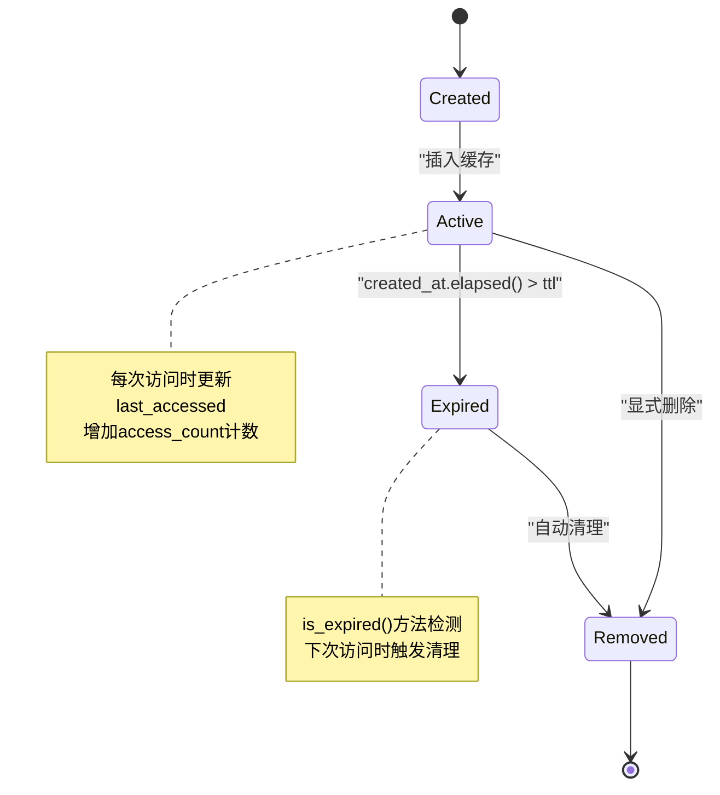
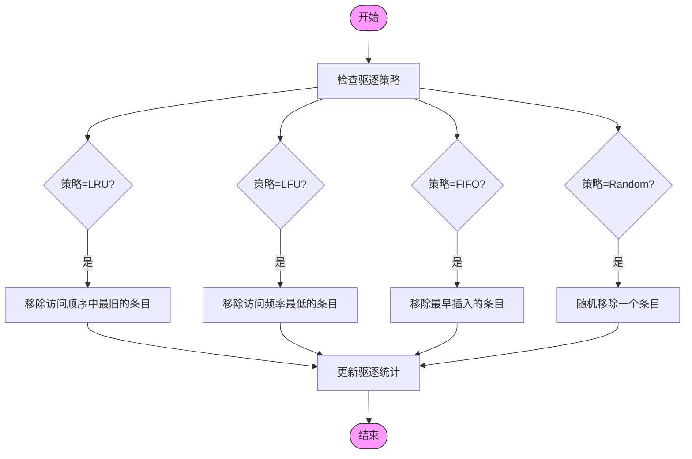
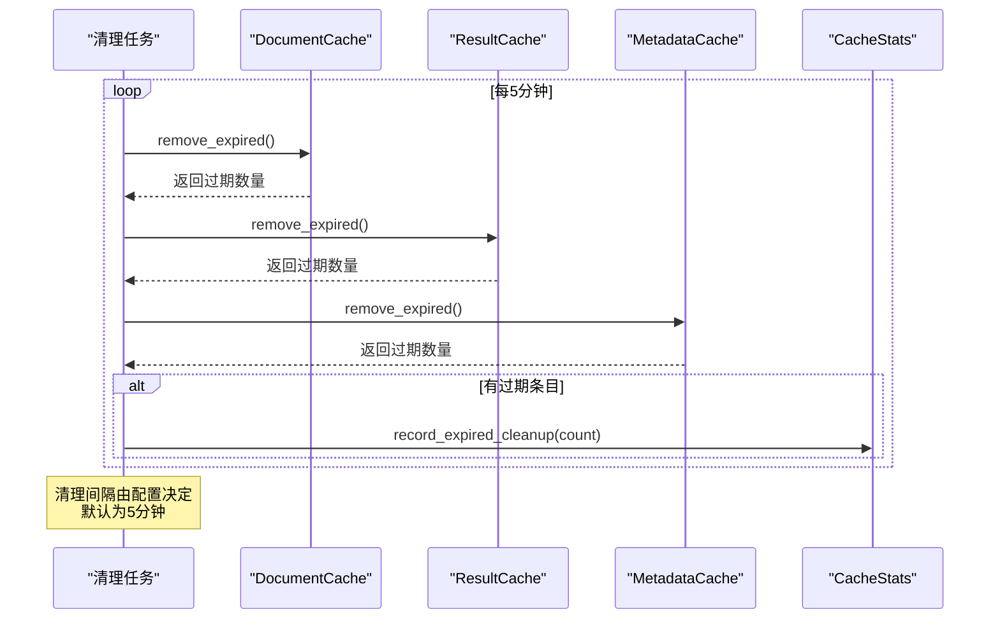
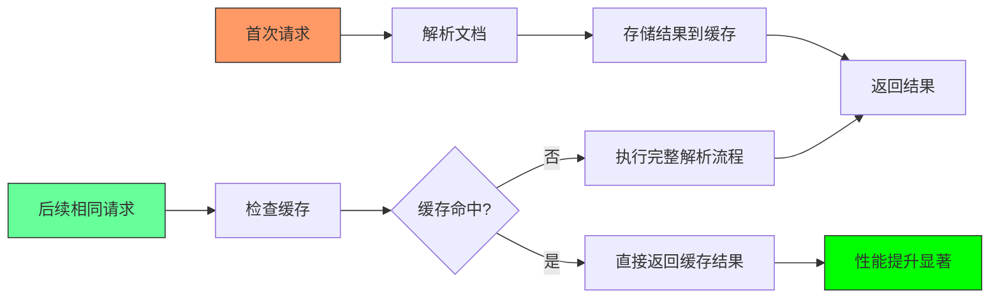
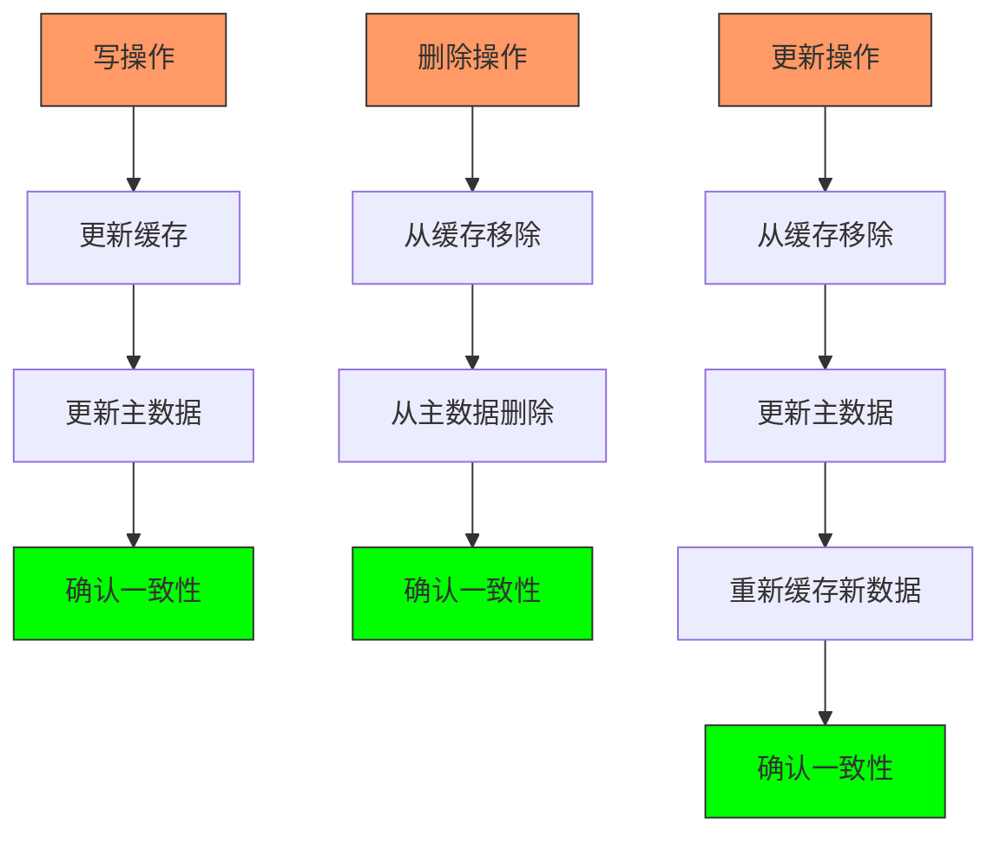
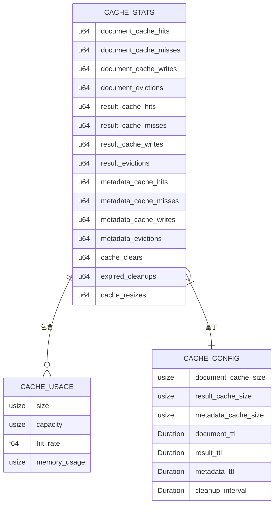

# 缓存策略

<cite>
**本文档引用的文件**  
- [cache_manager.rs](file://document-parser/src/performance/cache_manager.rs)
- [mod.rs](file://document-parser/src/performance/mod.rs)
</cite>

## 目录
1. [引言](#引言)
2. [缓存架构设计](#缓存架构设计)
3. [缓存键生成机制](#缓存键生成机制)
4. [多级缓存架构](#多级缓存架构)
5. [缓存生命周期管理](#缓存生命周期管理)
6. [驱逐策略实现](#驱逐策略实现)
7. [自动清理机制](#自动清理机制)
8. [性能增益分析](#性能增益分析)
9. [缓存一致性保障](#缓存一致性保障)
10. [监控与容量规划](#监控与容量规划)

## 引言
本文档全面介绍`CacheManager`的设计与实现，重点描述其基于文档指纹的缓存键生成机制与多级缓存架构。详细说明缓存条目生命周期管理、LRU或TTL过期策略的实现方式，以及内存压力下的自动清理机制。分析其在重复解析相同文档或相似内容时的性能增益，并阐述缓存一致性保障措施，防止脏数据问题。提供缓存命中率监控指标及容量规划建议。

## 缓存架构设计

**图示来源**  
- [cache_manager.rs](file://document-parser/src/performance/cache_manager.rs#L1-L1069)

**本节来源**  
- [cache_manager.rs](file://document-parser/src/performance/cache_manager.rs#L1-L1069)

## 缓存键生成机制

缓存管理器采用基于文档指纹的缓存键生成机制，通过哈希算法为每个文档生成唯一标识。该机制确保相同内容的文档始终映射到相同的缓存键，实现高效的缓存命中。

**图示来源**  
- [cache_manager.rs](file://document-parser/src/performance/cache_manager.rs#L215-L225)

**本节来源**  
- [cache_manager.rs](file://document-parser/src/performance/cache_manager.rs#L215-L225)

## 多级缓存架构

系统采用多级缓存架构，将不同类型的缓存数据分离存储，优化访问效率和内存使用。

**图示来源**  
- [cache_manager.rs](file://document-parser/src/performance/cache_manager.rs#L1-L1069)

**本节来源**  
- [cache_manager.rs](file://document-parser/src/performance/cache_manager.rs#L1-L1069)

## 缓存生命周期管理

缓存条目通过TTL（Time To Live）机制管理生命周期，确保数据的时效性和内存的有效利用。

**图示来源**  
- [cache_manager.rs](file://document-parser/src/performance/cache_manager.rs#L1000-L1015)

**本节来源**  
- [cache_manager.rs](file://document-parser/src/performance/cache_manager.rs#L1000-L1015)

## 驱逐策略实现

系统支持多种缓存驱逐策略，可根据配置灵活选择最适合业务场景的算法。

**图示来源**  
- [cache_manager.rs](file://document-parser/src/performance/cache_manager.rs#L233-L267)

**本节来源**  
- [cache_manager.rs](file://document-parser/src/performance/cache_manager.rs#L233-L267)

## 自动清理机制

系统通过后台任务定期清理过期缓存，确保内存使用效率和数据新鲜度。

**图示来源**  
- [cache_manager.rs](file://document-parser/src/performance/cache_manager.rs#L265-L285)

**本节来源**  
- [cache_manager.rs](file://document-parser/src/performance/cache_manager.rs#L265-L285)

## 性能增益分析

缓存系统通过减少重复文档解析操作，显著提升系统性能。

**图示来源**  
- [cache_manager.rs](file://document-parser/src/performance/cache_manager.rs#L150-L180)

**本节来源**  
- [cache_manager.rs](file://document-parser/src/performance/cache_manager.rs#L150-L180)

## 缓存一致性保障

系统通过多种机制确保缓存一致性，防止脏数据问题。

**图示来源**  
- [cache_manager.rs](file://document-parser/src/performance/cache_manager.rs#L120-L140)

**本节来源**  
- [cache_manager.rs](file://document-parser/src/performance/cache_manager.rs#L120-L140)

## 监控与容量规划

系统提供全面的监控指标和智能容量调整功能，帮助用户优化缓存配置。

**图示来源**  
- [cache_manager.rs](file://document-parser/src/performance/cache_manager.rs#L917-L1035)

**本节来源**  
- [cache_manager.rs](file://document-parser/src/performance/cache_manager.rs#L917-L1035)