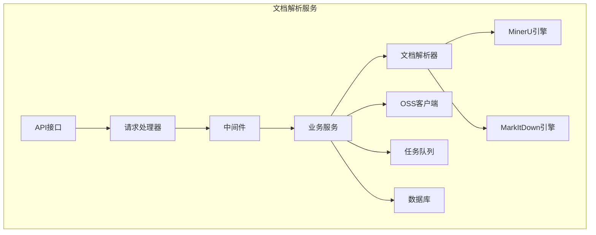
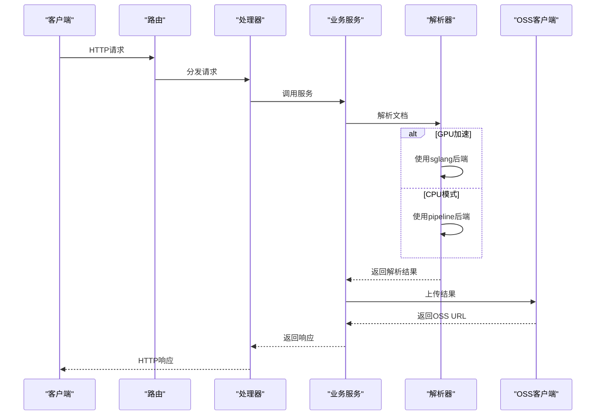
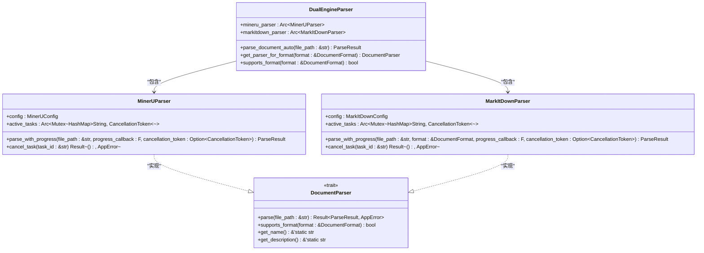
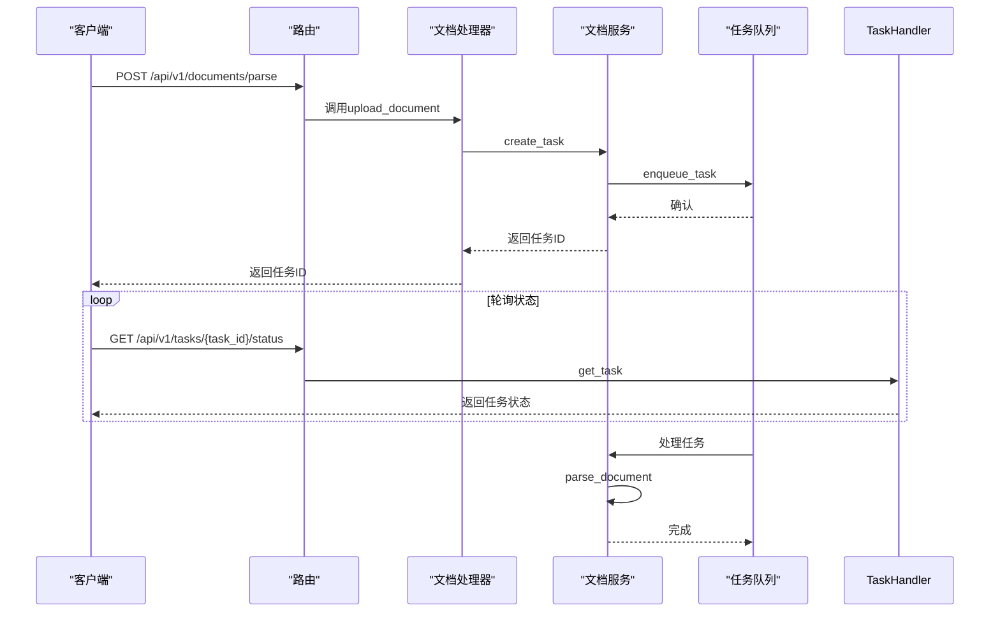
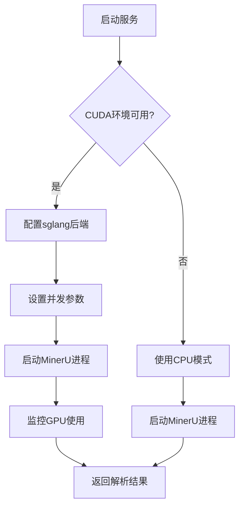
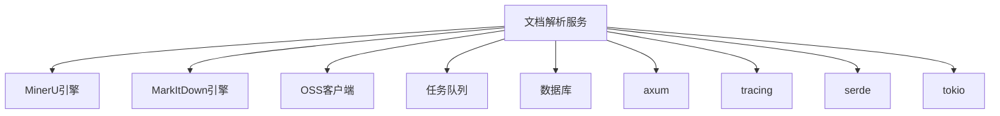

# 文档解析服务

<cite>
**本文档引用的文件**   
- [README.md](file://document-parser/README.md)
- [CUDA_SETUP_GUIDE.md](file://document-parser/CUDA_SETUP_GUIDE.md)
- [TROUBLESHOOTING.md](file://document-parser/TROUBLESHOOTING.md)
- [USER_MANUAL.md](file://document-parser/USER_MANUAL.md)
- [config.yml](file://document-parser/config.yml)
- [main.rs](file://document-parser/src/main.rs)
- [lib.rs](file://document-parser/src/lib.rs)
- [routes.rs](file://document-parser/src/routes.rs)
- [app_state.rs](file://document-parser/src/app_state.rs)
- [config.rs](file://document-parser/src/config.rs)
- [dual_engine_parser.rs](file://document-parser/src/parsers/dual_engine_parser.rs)
- [mineru_parser.rs](file://document-parser/src/parsers/mineru_parser.rs)
- [markitdown_parser.rs](file://document-parser/src/parsers/markitdown_parser.rs)
- [document_service.rs](file://document-parser/src/services/document_service.rs)
- [task_queue_service.rs](file://document-parser/src/services/task_queue_service.rs)
</cite>

## 目录
1. [介绍](#介绍)
2. [项目结构](#项目结构)
3. [核心组件](#核心组件)
4. [架构概述](#架构概述)
5. [详细组件分析](#详细组件分析)
6. [依赖分析](#依赖分析)
7. [性能考虑](#性能考虑)
8. [故障排除指南](#故障排除指南)
9. [结论](#结论)

## 介绍
文档解析服务是一个高性能的多格式文档解析系统，支持PDF、Word、Excel、PowerPoint等多种格式。该服务具备GPU加速能力，通过MinerU和MarkItDown双引擎实现高效解析。服务提供RESTful API接口，支持异步任务处理和OSS集成，适用于大规模文档处理场景。

## 项目结构
文档解析服务的项目结构清晰，主要包含以下几个核心目录：

- `assets/`: 存放静态资源文件
- `document-parser/`: 核心文档解析服务代码
  - `benches/`: 性能基准测试代码
  - `examples/`: 使用示例代码
  - `fixtures/`: 测试数据和配置文件
  - `src/`: 源代码目录
    - `handlers/`: HTTP请求处理器
    - `middleware/`: 中间件处理
    - `models/`: 数据模型定义
    - `parsers/`: 文档解析器实现
    - `performance/`: 性能优化组件
    - `processors/`: 内容处理器
    - `production/`: 生产环境相关组件
    - `services/`: 业务服务逻辑
    - `tests/`: 单元测试和集成测试
    - `utils/`: 工具函数
- `fastembed/`: 嵌入式服务
- `mcp-proxy/`: MCP代理服务
- `oss-client/`: OSS客户端
- `scripts/`: 脚本文件
- `spec/`: 规格说明
- `voice-cli/`: 语音CLI工具

**Diagram sources**
- [main.rs](file://document-parser/src/main.rs#L1-L1362)
- [lib.rs](file://document-parser/src/lib.rs#L1-L196)



**Section sources**
- [main.rs](file://document-parser/src/main.rs#L1-L1362)
- [lib.rs](file://document-parser/src/lib.rs#L1-L196)

## 核心组件

文档解析服务的核心组件包括双引擎解析系统、HTTP API接口、异步任务处理机制和OSS集成方案。服务通过MinerU和MarkItDown双引擎实现对多种文档格式的解析，支持GPU加速，并提供完善的错误处理和性能监控机制。

**Section sources**
- [dual_engine_parser.rs](file://document-parser/src/parsers/dual_engine_parser.rs#L1-L217)
- [mineru_parser.rs](file://document-parser/src/parsers/mineru_parser.rs#L1-L1361)
- [markitdown_parser.rs](file://document-parser/src/parsers/markitdown_parser.rs#L1-L1644)

## 架构概述

文档解析服务采用模块化架构设计，各组件职责明确，松耦合。服务启动时初始化应用状态，包括配置加载、数据库连接、OSS客户端初始化和任务队列设置。HTTP请求通过路由分发到相应的处理器，处理器调用业务服务完成具体操作。



**Diagram sources**
- [main.rs](file://document-parser/src/main.rs#L1-L1362)
- [routes.rs](file://document-parser/src/routes.rs#L1-L127)
- [app_state.rs](file://document-parser/src/app_state.rs#L1-L308)

## 详细组件分析

### 双引擎解析器分析
文档解析服务采用MinerU和MarkItDown双引擎架构，根据不同文档格式选择合适的解析引擎。PDF文档使用MinerU引擎进行专业解析，而Word、Excel、PowerPoint等Office文档则使用MarkItDown引擎。

#### 双引擎解析器类图


**Diagram sources**
- [dual_engine_parser.rs](file://document-parser/src/parsers/dual_engine_parser.rs#L1-L217)
- [mineru_parser.rs](file://document-parser/src/parsers/mineru_parser.rs#L1-L1361)
- [markitdown_parser.rs](file://document-parser/src/parsers/markitdown_parser.rs#L1-L1644)

### HTTP API接口分析
服务提供RESTful API接口，支持文档上传、解析、状态查询和结果获取等操作。API设计遵循OpenAPI规范，通过utoipa生成API文档。

#### API请求处理序列图


**Diagram sources**
- [routes.rs](file://document-parser/src/routes.rs#L1-L127)
- [document_handler.rs](file://document-parser/src/handlers/document_handler.rs)
- [task_handler.rs](file://document-parser/src/handlers/task_handler.rs)

### GPU加速实现分析
服务通过sglang支持CUDA环境下的GPU加速，显著提升PDF解析性能。GPU加速的实现机制包括CUDA环境检测、sglang后端配置和性能调优。

#### GPU加速工作流程


**Diagram sources**
- [CUDA_SETUP_GUIDE.md](file://document-parser/CUDA_SETUP_GUIDE.md#L1-L313)
- [config.rs](file://document-parser/src/config.rs#L1-L1489)
- [mineru_parser.rs](file://document-parser/src/parsers/mineru_parser.rs#L1-L1361)

## 依赖分析

文档解析服务的依赖关系清晰，各组件之间耦合度低。核心依赖包括：

- **双引擎解析器**: 依赖MinerU和MarkItDown解析引擎
- **OSS客户端**: 用于文件上传和下载
- **任务队列**: 管理异步任务处理
- **数据库**: 存储任务状态和解析结果
- **HTTP框架**: 使用axum处理HTTP请求



**Diagram sources**
- [Cargo.toml](file://document-parser/Cargo.toml)
- [main.rs](file://document-parser/src/main.rs#L1-L1362)
- [app_state.rs](file://document-parser/src/app_state.rs#L1-L308)

## 性能考虑

文档解析服务在设计时充分考虑了性能优化，包括并发控制、缓存机制和资源管理。

### 并发控制
服务通过配置文件中的`max_concurrent`参数控制最大并发数，避免资源过度消耗。对于GPU环境，建议根据GPU内存调整并发数：

```yaml
mineru:
  max_concurrent: 1    # 8GB GPU内存
  max_concurrent: 2    # 16GB GPU内存  
  max_concurrent: 4    # 24GB+ GPU内存
```

### 缓存机制
服务实现了多级缓存机制，包括：
- 解析结果缓存
- 格式检测缓存
- OSS客户端缓存

### 资源管理
服务通过以下机制管理资源：
- 临时文件自动清理
- 连接池管理
- 内存使用监控

**Section sources**
- [config.yml](file://document-parser/config.yml#L1-L78)
- [performance/](file://document-parser/src/performance/)
- [app_state.rs](file://document-parser/src/app_state.rs#L1-L308)

## 故障排除指南

### 常见问题及解决方案

| 问题类型 | 解决方案 |
|---------|---------|
| 虚拟环境创建失败 | 检查目录权限，使用`chmod 755 .`修改权限 |
| 依赖安装失败 | 使用国内镜像源，如`-i https://pypi.tuna.tsinghua.edu.cn/simple/` |
| GPU加速不生效 | 检查CUDA环境，确保`backend`配置为`vlm-sglang-engine` |
| 权限问题 | 使用管理员权限运行命令或修改目录权限 |

### 诊断命令
```bash
# 检查环境状态
document-parser check

# 显示故障排除指南
document-parser troubleshoot

# 查看日志
tail -f logs/log.$(date +%Y-%m-%d)
```

**Section sources**
- [TROUBLESHOOTING.md](file://document-parser/TROUBLESHOOTING.md#L1-L561)
- [USER_MANUAL.md](file://document-parser/USER_MANUAL.md#L1-L309)

## 结论

文档解析服务是一个功能强大、架构清晰的多格式文档解析系统。通过MinerU和MarkItDown双引擎，服务能够高效处理PDF、Word、Excel等多种文档格式。GPU加速功能显著提升了PDF解析性能，而RESTful API接口和OSS集成方案使得服务易于集成和扩展。服务的模块化设计和完善的错误处理机制确保了系统的稳定性和可靠性。