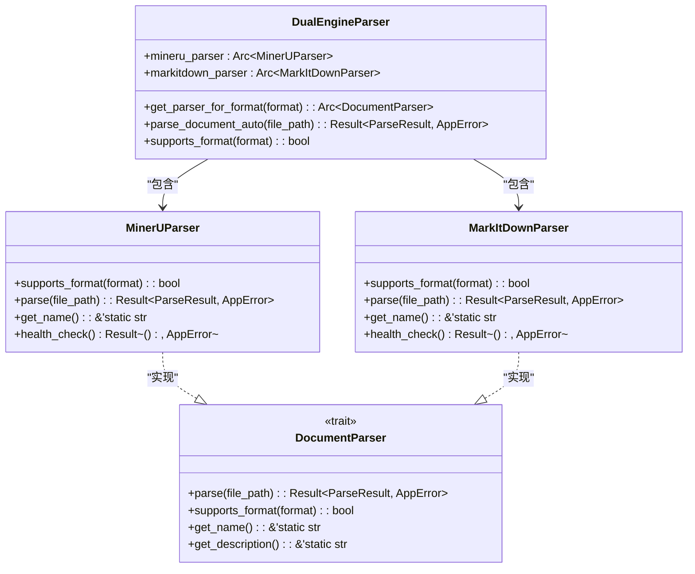
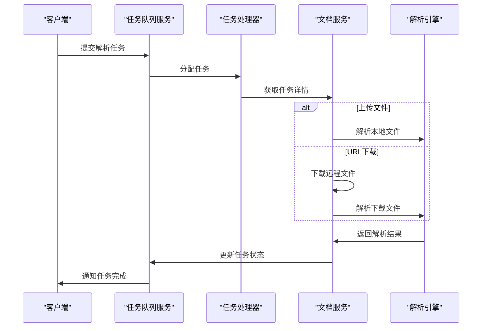
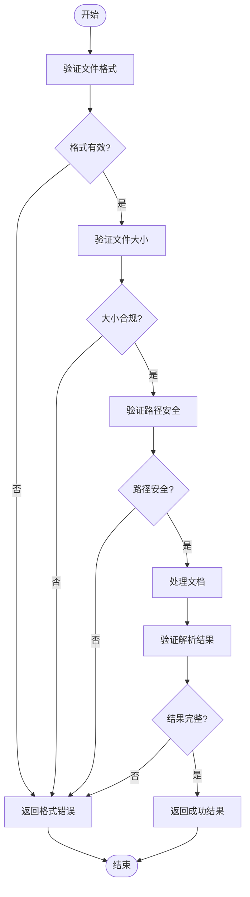
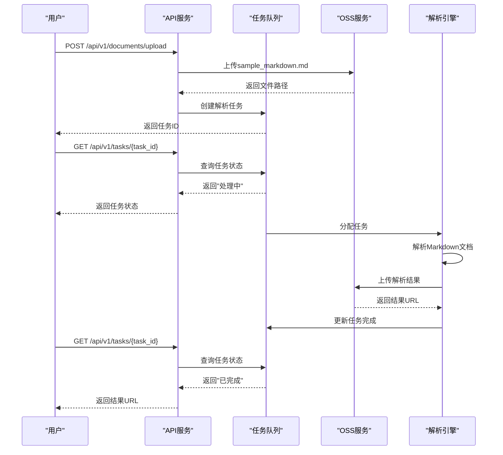
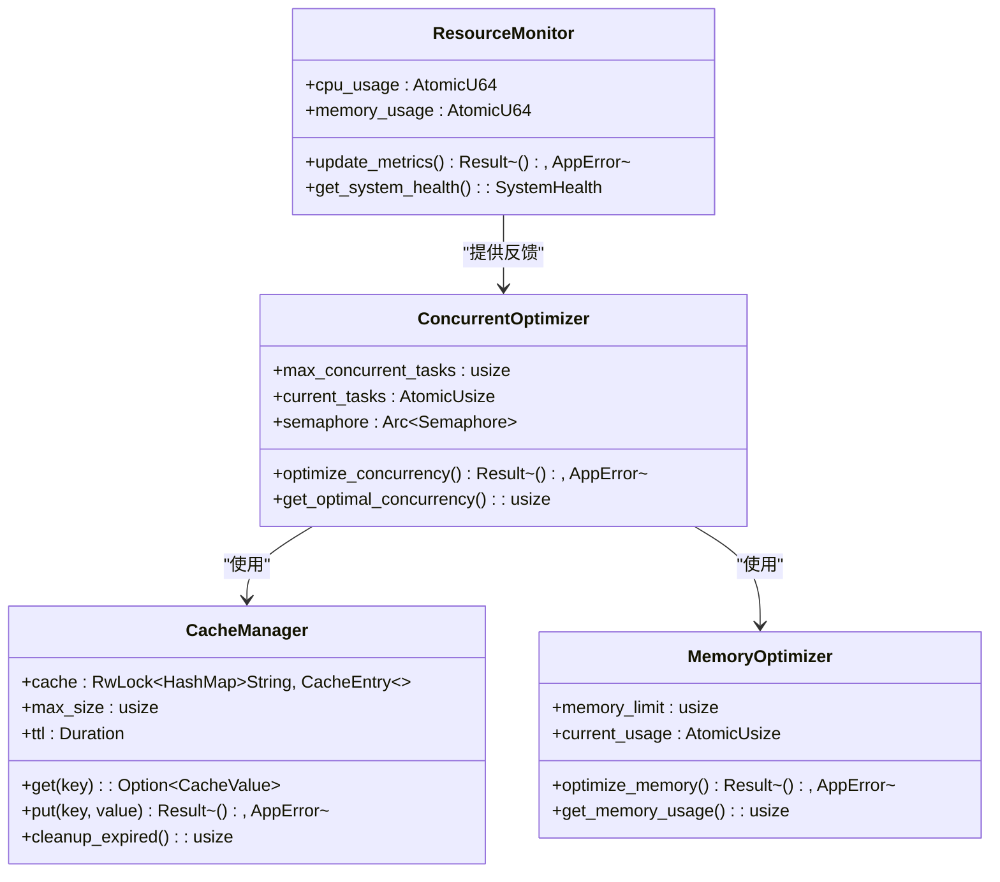
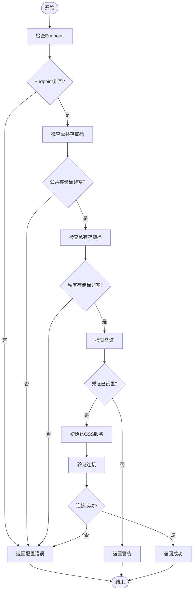

# 文档解析服务

<cite>
**本文档引用的文件**   
- [dual_engine_parser.rs](file://document-parser/src/parsers/dual_engine_parser.rs)
- [markitdown_parser.rs](file://document-parser/src/parsers/markitdown_parser.rs)
- [mineru_parser.rs](file://document-parser/src/parsers/mineru_parser.rs)
- [document_task_processor.rs](file://document-parser/src/services/document_task_processor.rs)
- [task_queue_service.rs](file://document-parser/src/services/task_queue_service.rs)
- [oss_service.rs](file://document-parser/src/services/oss_service.rs)
- [toc_handler.rs](file://document-parser/src/handlers/toc_handler.rs)
- [validation.rs](file://document-parser/src/handlers/validation.rs)
- [config.rs](file://document-parser/src/config.rs)
- [concurrency_optimizer.rs](file://document-parser/src/performance/concurrency_optimizer.rs)
- [sample_markdown.md](file://document-parser/fixtures/sample_markdown.md)
</cite>

## 目录
1. [简介](#简介)
2. [核心解析引擎](#核心解析引擎)
3. [任务处理架构](#任务处理架构)
4. [文档目录生成](#文档目录生成)
5. [输入输出验证](#输入输出验证)
6. [API调用流程示例](#api调用流程示例)
7. [性能优化策略](#性能优化策略)
8. [OSS集成配置](#oss集成配置)
9. [结论](#结论)

## 简介
文档解析服务是一个高性能的多格式文档处理系统，支持将PDF、Word、Excel、PowerPoint等格式转换为结构化的Markdown文档。该服务采用双引擎解析架构，结合MinerU和MarkItDown解析器的优势，提供GPU加速能力，并通过任务队列和OSS集成实现高效的文档处理流水线。

**Section sources**
- [README.md](file://document-parser/README.md#L0-L56)

## 核心解析引擎

文档解析服务的核心是DualEngineParser，它协调MarkitdownParser与MineruParser两个解析引擎，根据文档格式自动选择最合适的解析器。

DualEngineParser通过FormatDetector自动检测输入文档的格式，然后分派到相应的解析引擎：
- **MinerU解析器**：专门处理PDF格式，提供专业的PDF解析、图片提取和表格识别功能
- **MarkItDown解析器**：处理Word、Excel、PowerPoint等Office格式，保持文档结构和格式转换

**Diagram sources**
- [dual_engine_parser.rs](file://document-parser/src/parsers/dual_engine_parser.rs#L13-L17)
- [mineru_parser.rs](file://document-parser/src/parsers/mineru_parser.rs#L1275-L1312)
- [markitdown_parser.rs](file://document-parser/src/parsers/markitdown_parser.rs#L1473-L1511)

**Section sources**
- [dual_engine_parser.rs](file://document-parser/src/parsers/dual_engine_parser.rs#L0-L216)

## 任务处理架构

文档解析服务采用基于任务队列的异步处理架构，通过DocumentTaskProcessor和TaskQueueService协同工作，实现高效的文档解析任务调度。

DocumentTaskProcessor作为任务处理器，从TaskQueueService获取任务并分派到相应的解析逻辑。任务支持两种源类型：
- **上传文件**：通过文件路径直接解析
- **URL下载**：先下载远程文件，再进行解析

**Diagram sources**
- [document_task_processor.rs](file://document-parser/src/services/document_task_processor.rs#L9-L15)
- [task_queue_service.rs](file://document-parser/src/services/task_queue_service.rs#L111-L141)

**Section sources**
- [document_task_processor.rs](file://document-parser/src/services/document_task_processor.rs#L0-L70)

## 文档目录生成

TOCHandler负责生成文档的目录结构，将解析后的Markdown内容转换为层次化的目录。该功能通过分析Markdown中的标题层级（#、##、###等）来构建树状结构的目录。

目录生成器会：
1. 解析Markdown文档中的所有标题
2. 根据标题层级建立父子关系
3. 为每个目录项生成唯一的锚点ID
4. 输出结构化的TOC数据，可用于导航和索引

**Section sources**
- [toc_handler.rs](file://document-parser/src/handlers/toc_handler.rs)

## 输入输出验证

Validation模块确保所有输入输出符合规范要求，防止无效数据进入处理流程。验证机制包括：
- 文件格式验证：确保上传的文件是支持的格式
- 文件大小限制：防止过大的文件导致资源耗尽
- 路径安全检查：防止路径遍历攻击
- 结果完整性验证：确保解析结果包含必要的字段

**Diagram sources**
- [validation.rs](file://document-parser/src/handlers/validation.rs)

**Section sources**
- [validation.rs](file://document-parser/src/handlers/validation.rs)

## API调用流程示例

以下流程展示了从上传文档到获取解析结果的完整API调用过程，以sample_markdown.md测试文件为例：

**Diagram sources**
- [sample_markdown.md](file://document-parser/fixtures/sample_markdown.md)
- [document_handler.rs](file://document-parser/src/handlers/document_handler.rs#L990-L1030)

## 性能优化策略

文档解析服务采用多种性能优化策略，确保在高并发场景下的稳定性和效率。ConcurrentOptimizer在多文档并发处理中发挥关键作用，通过以下机制优化性能：

- **并发控制**：限制同时运行的解析任务数量，防止资源过载
- **内存优化**：管理解析过程中的内存使用，避免内存泄漏
- **缓存机制**：缓存频繁访问的数据，减少重复计算
- **资源监控**：实时监控系统资源使用情况，动态调整处理策略

**Diagram sources**
- [concurrency_optimizer.rs](file://document-parser/src/performance/concurrency_optimizer.rs)

**Section sources**
- [concurrency_optimizer.rs](file://document-parser/src/performance/concurrency_optimizer.rs)

## OSS集成配置

OSS服务集成允许将解析结果持久化存储，并提供公共访问URL。配置OSS服务需要设置以下关键参数：

### OSS配置参数
| 参数 | 描述 | 示例值 |
|------|------|--------|
| endpoint | OSS服务端点 | oss-cn-beijing.aliyuncs.com |
| public_bucket | 公共存储桶名称 | document-public |
| private_bucket | 私有存储桶名称 | document-private |
| access_key_id | 访问密钥ID | LTAI5tQZ*********** |
| access_key_secret | 访问密钥密钥 | sFEmWU*************** |
| base_url | 基础URL前缀 | https://document-public.oss-cn-beijing.aliyuncs.com |

### 配置验证
OSS配置在初始化时会进行验证，确保所有必需字段都已正确设置：

**Diagram sources**
- [oss_service.rs](file://document-parser/src/services/oss_service.rs#L57-L136)
- [config.rs](file://document-parser/src/config.rs#L705-L750)

**Section sources**
- [oss_service.rs](file://document-parser/src/services/oss_service.rs#L0-L136)
- [config.rs](file://document-parser/src/config.rs#L705-L750)

## 结论
文档解析服务通过DualEngineParser协调MinerU和MarkItDown双引擎，实现了对多种文档格式的高效解析。基于任务队列的异步处理架构确保了系统的可扩展性和稳定性，而OSS集成则提供了可靠的存储解决方案。通过TOCHandler和Validation模块，服务能够生成结构化的目录并确保数据合规性。ConcurrentOptimizer等性能优化组件使得系统能够在高并发场景下保持高性能，满足大规模文档处理需求。