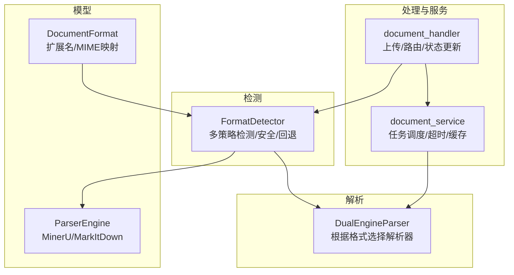
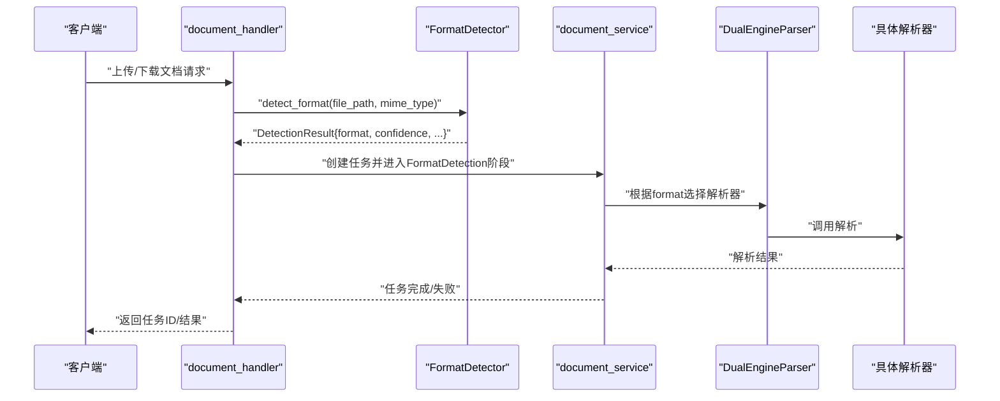
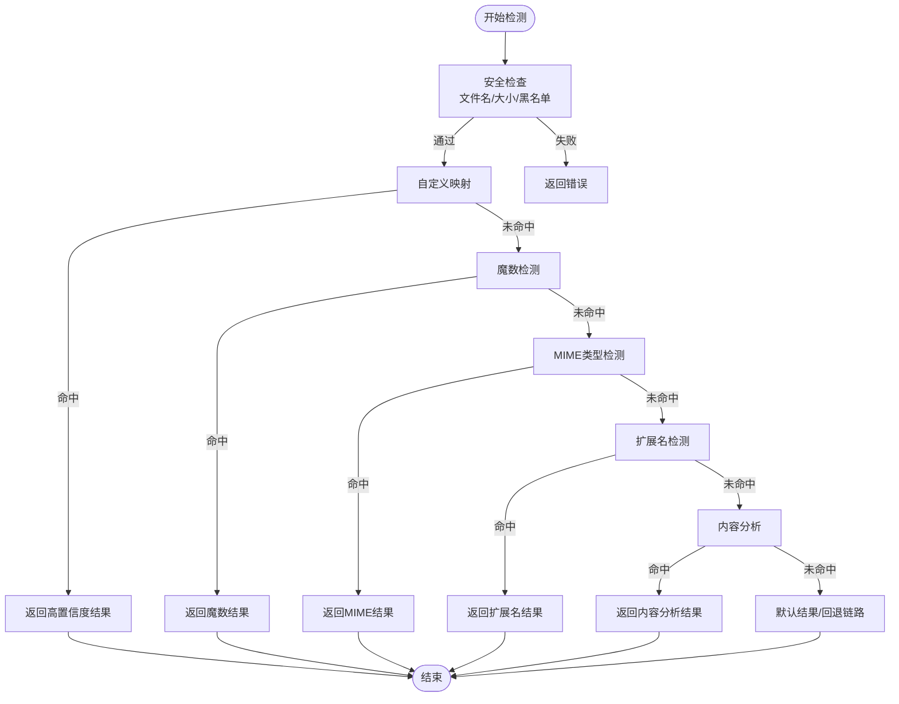
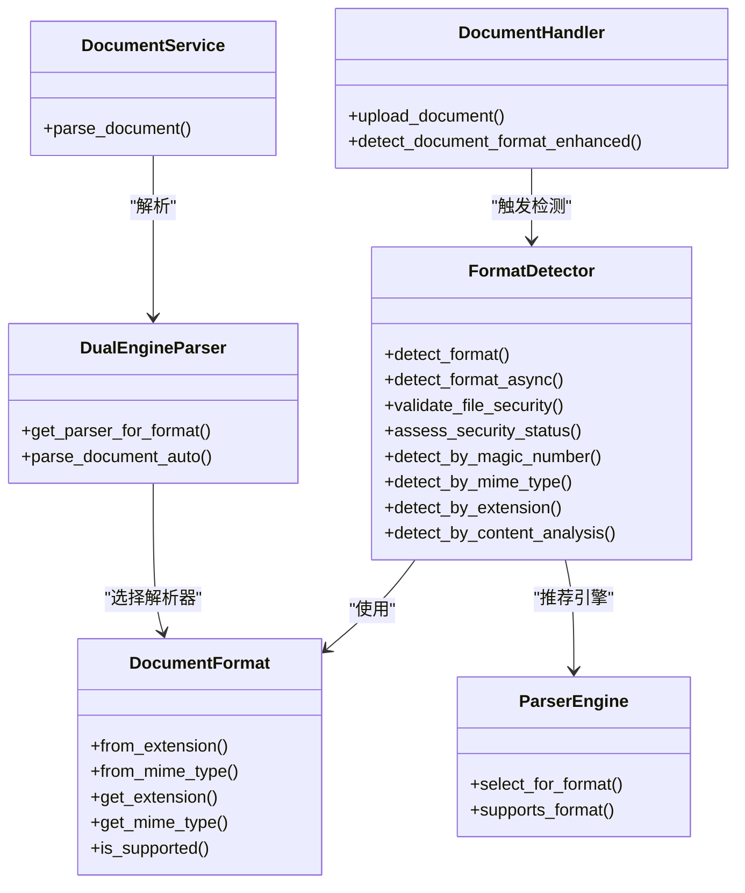

# 格式检测

<cite>
**本文引用的文件**
- [format_detector.rs](file://document-parser/src/parsers/format_detector.rs)
- [document_format.rs](file://document-parser/src/models/document_format.rs)
- [parser_engine.rs](file://document-parser/src/models/parser_engine.rs)
- [dual_engine_parser.rs](file://document-parser/src/parsers/dual_engine_parser.rs)
- [document_handler.rs](file://document-parser/src/handlers/document_handler.rs)
- [document_service.rs](file://document-parser/src/services/document_service.rs)
- [parsers/mod.rs](file://document-parser/src/parsers/mod.rs)
- [TROUBLESHOOTING.md](file://document-parser/TROUBLESHOOTING.md)
</cite>

## 目录
1. [简介](#简介)
2. [项目结构](#项目结构)
3. [核心组件](#核心组件)
4. [架构总览](#架构总览)
5. [详细组件分析](#详细组件分析)
6. [依赖关系分析](#依赖关系分析)
7. [性能考量](#性能考量)
8. [故障排除指南](#故障排除指南)
9. [结论](#结论)
10. [附录](#附录)

## 简介
本文聚焦文档解析服务中的“格式检测”机制，系统性阐述 format_detector 模块如何识别 PDF、Word、Excel、Markdown 等常见文档格式。内容覆盖文件头魔数检测、扩展名匹配、MIME 类型验证、DocumentFormat 枚举设计与作用、以及与解析器选择、任务路由的集成方式；同时提供扩展支持新格式的方法、常见检测失败场景与解决方案。

## 项目结构
围绕格式检测的关键文件组织如下：
- 模型层：DocumentFormat 定义文档格式集合与转换逻辑
- 检测器：FormatDetector 提供多策略检测、安全校验、置信度与回退链路
- 解析器：ParserEngine 与 DualEngineParser 根据格式选择合适引擎
- 处理器与服务：document_handler 与 document_service 将检测结果纳入任务生命周期

图表来源
- [document_format.rs](file://document-parser/src/models/document_format.rs#L1-L125)
- [parser_engine.rs](file://document-parser/src/models/parser_engine.rs#L1-L47)
- [format_detector.rs](file://document-parser/src/parsers/format_detector.rs#L1-L120)
- [dual_engine_parser.rs](file://document-parser/src/parsers/dual_engine_parser.rs#L1-L120)
- [document_handler.rs](file://document-parser/src/handlers/document_handler.rs#L1-L120)
- [document_service.rs](file://document-parser/src/services/document_service.rs#L1-L120)

章节来源
- [parsers/mod.rs](file://document-parser/src/parsers/mod.rs#L1-L13)

## 核心组件
- DocumentFormat：集中定义支持的文档格式（PDF、Word、Excel、PowerPoint、Image、Audio、HTML、Text、Txt、Md、Other），并提供 from_extension/from_mime_type/get_extension/get_mime_type/is_supported 等静态方法，支撑检测与路由。
- FormatDetector：实现多策略检测（自定义映射、魔数、MIME、扩展名、内容分析）、安全校验（大小、扩展名黑名单、文件名合法性）、性能配置（缓存、并行、超时）与回退链路（fallback_methods）。
- ParserEngine：定义解析引擎（MinerU 专用于 PDF；MarkItDown 用于其他格式），并提供 select_for_format/supports_format 等能力。
- DualEngineParser：在解析阶段根据 DocumentFormat 选择具体解析器（MinerU 或 MarkItDown），并与 FormatDetector 的检测结果衔接。
- document_handler/document_service：在上传/下载流程中触发检测、更新任务状态、驱动解析流程。

章节来源
- [document_format.rs](file://document-parser/src/models/document_format.rs#L1-L125)
- [format_detector.rs](file://document-parser/src/parsers/format_detector.rs#L1-L120)
- [parser_engine.rs](file://document-parser/src/models/parser_engine.rs#L1-L47)
- [dual_engine_parser.rs](file://document-parser/src/parsers/dual_engine_parser.rs#L1-L120)
- [document_handler.rs](file://document-parser/src/handlers/document_handler.rs#L1-L120)
- [document_service.rs](file://document-parser/src/services/document_service.rs#L1-L120)

## 架构总览
格式检测在解析流程中的位置与交互如下：

图表来源
- [document_handler.rs](file://document-parser/src/handlers/document_handler.rs#L160-L220)
- [format_detector.rs](file://document-parser/src/parsers/format_detector.rs#L320-L487)
- [document_service.rs](file://document-parser/src/services/document_service.rs#L150-L220)
- [dual_engine_parser.rs](file://document-parser/src/parsers/dual_engine_parser.rs#L90-L120)

## 详细组件分析

### FormatDetector：多策略检测与安全校验
- 多策略检测顺序（同步/异步均遵循相同顺序）：
  1) 自定义映射（custom_mappings）
  2) 魔数检测（magic number）
  3) MIME 类型检测
  4) 扩展名检测
  5) 内容分析（基于前若干字节的文本比例与特征）
- 置信度与回退链路：
  - 每个策略返回 DetectionResult，包含 format、confidence、detection_method、recommended_engine、fallback_methods 等。
  - 若任一策略置信度达到阈值（如≥0.9），立即返回；否则累积 fallback_methods 并保留最佳结果。
- 安全校验：
  - 文件名安全检查（黑名单扩展名、路径穿越字符）
  - 文件大小限制（全局配置）
  - 安全状态评估（根据扩展名与格式类别给出 Safe/Suspicious/Dangerous/Unknown）
- 性能配置：
  - 缓存开关、缓存大小限制、并行检测、检测超时等
- Office 文档特殊处理：
  - ZIP 魔数时进一步推断 Word/Excel/PPT（docx/xlsx/pptx）

图表来源
- [format_detector.rs](file://document-parser/src/parsers/format_detector.rs#L320-L487)
- [format_detector.rs](file://document-parser/src/parsers/format_detector.rs#L579-L780)

章节来源
- [format_detector.rs](file://document-parser/src/parsers/format_detector.rs#L1-L120)
- [format_detector.rs](file://document-parser/src/parsers/format_detector.rs#L320-L487)
- [format_detector.rs](file://document-parser/src/parsers/format_detector.rs#L579-L780)
- [format_detector.rs](file://document-parser/src/parsers/format_detector.rs#L850-L888)

### DocumentFormat：格式枚举与映射
- from_extension：将扩展名映射到 DocumentFormat，如 pdf/docx/xlsx/pptx/jpg/png/mp3/wav/html/md/txt/csv/json/xml 等。
- from_mime_type：将 MIME 类型映射到 DocumentFormat，如 application/pdf、application/vnd.openxmlformats-officedocument.wordprocessingml.document 等。
- get_extension/get_mime_type：反向映射，便于生成响应或回填元数据。
- is_supported：判断是否为受支持格式（非 Other）。

章节来源
- [document_format.rs](file://document-parser/src/models/document_format.rs#L1-L125)

### ParserEngine 与 DualEngineParser：解析器选择
- ParserEngine：
  - MinerU：专用于 PDF
  - MarkItDown：用于 Word、Excel、PowerPoint、Image、Audio、HTML、Text、Txt、Md 等
- DualEngineParser：
  - 根据 DocumentFormat 选择对应解析器实例
  - parse_document_auto：自动检测格式并解析
  - get_parser_for_format/supports_format：与 FormatDetector 的 DetectionResult.recommended_engine 协同

章节来源
- [parser_engine.rs](file://document-parser/src/models/parser_engine.rs#L1-L47)
- [dual_engine_parser.rs](file://document-parser/src/parsers/dual_engine_parser.rs#L90-L120)

### 处理器与服务：检测在任务流中的集成
- document_handler：
  - 上传/下载入口，负责参数校验、安全检查、任务创建与状态推进
  - detect_document_format_enhanced：结合扩展名、魔数、内容一致性进行增强检测
  - detect_mime_type_from_format：根据检测结果生成 MIME 类型字符串
- document_service：
  - 维护任务生命周期（Pending/Processing/Completed/Failed）
  - parse_document：在超时控制下调用解析流程，解析阶段依据 FormatDetector 的结果选择解析器

章节来源
- [document_handler.rs](file://document-parser/src/handlers/document_handler.rs#L1-L120)
- [document_handler.rs](file://document-parser/src/handlers/document_handler.rs#L555-L598)
- [document_handler.rs](file://document-parser/src/handlers/document_handler.rs#L1091-L1112)
- [document_service.rs](file://document-parser/src/services/document_service.rs#L150-L220)

## 依赖关系分析
- FormatDetector 依赖 DocumentFormat、ParserEngine（用于推荐引擎）
- DualEngineParser 依赖 FormatDetector（自动检测）与具体解析器（MinerUParser/MarkItDownParser）
- document_handler 依赖 FormatDetector（上传/下载时的格式检测）与 document_service（任务调度）
- document_service 依赖 DualEngineParser 与任务服务（TaskService）

图表来源
- [document_format.rs](file://document-parser/src/models/document_format.rs#L1-L125)
- [format_detector.rs](file://document-parser/src/parsers/format_detector.rs#L1-L120)
- [parser_engine.rs](file://document-parser/src/models/parser_engine.rs#L1-L47)
- [dual_engine_parser.rs](file://document-parser/src/parsers/dual_engine_parser.rs#L1-L120)
- [document_handler.rs](file://document-parser/src/handlers/document_handler.rs#L1-L120)
- [document_service.rs](file://document-parser/src/services/document_service.rs#L1-L120)

## 性能考量
- 缓存与并行：FormatDetector 支持缓存与并行检测配置，可在高并发场景提升吞吐。
- 超时控制：检测与解析均设置超时，避免长时间阻塞。
- 置信度阈值：当某策略置信度达到阈值（如≥0.9）即短路返回，减少无效 IO。
- 魔数缓冲区：默认读取固定字节数，兼顾速度与准确性。

章节来源
- [format_detector.rs](file://document-parser/src/parsers/format_detector.rs#L1-L120)
- [format_detector.rs](file://document-parser/src/parsers/format_detector.rs#L579-L780)
- [document_service.rs](file://document-parser/src/services/document_service.rs#L1-L120)

## 故障排除指南
- 常见检测失败场景与对策：
  - 扩展名缺失或不匹配：内容分析与魔数检测可作为补充；若两者不一致，按可靠性策略决定采用内容检测结果。
  - MIME 类型不可靠：对 text/plain 等低置信度 MIME 类型，优先依赖魔数/扩展名/内容分析。
  - 文件名包含危险字符或扩展名在黑名单：安全检查直接拒绝。
  - 文件过大：触发文件大小限制错误。
  - Office 文档魔数为 ZIP：需进一步推断 docx/xlsx/pptx。
- 任务失败与恢复：
  - FormatDetection 阶段失败的任务会被标记为不可恢复（Unsupported format）。
  - 其他阶段（如下载/解析）失败可按 recoverable 字段决定是否重试。
- 环境与依赖问题：
  - MinerU/MarkItDown 安装失败、CUDA/依赖缺失等问题不在格式检测范围内，但会影响解析阶段；请参考故障排除文档进行环境修复。

章节来源
- [format_detector.rs](file://document-parser/src/parsers/format_detector.rs#L120-L220)
- [format_detector.rs](file://document-parser/src/parsers/format_detector.rs#L320-L487)
- [document_handler.rs](file://document-parser/src/handlers/document_handler.rs#L555-L598)
- [document_service.rs](file://document-parser/src/services/document_service.rs#L150-L220)
- [TROUBLESHOOTING.md](file://document-parser/TROUBLESHOOTING.md#L1-L120)

## 结论
FormatDetector 通过“魔数 + MIME + 扩展名 + 内容分析 + 自定义映射”的多策略组合，结合安全校验与回退链路，实现了对 PDF、Word、Excel、Markdown 等主流文档格式的稳健识别。配合 DocumentFormat 的统一枚举与 ParserEngine 的解析器选择，形成从检测到解析的闭环。在任务路由层面，document_handler 与 document_service 将检测结果无缝接入任务生命周期，确保解析流程的可控与可观测。

## 附录

### 实际代码示例（以路径引用代替代码片段）
- 同步检测主流程
  - [同步检测主流程](file://document-parser/src/parsers/format_detector.rs#L320-L487)
- 异步检测主流程
  - [异步检测主流程](file://document-parser/src/parsers/format_detector.rs#L489-L578)
- 魔数检测（同步/异步）
  - [魔数检测（同步）](file://document-parser/src/parsers/format_detector.rs#L667-L713)
  - [魔数检测（异步）](file://document-parser/src/parsers/format_detector.rs#L205-L254)
- MIME 类型检测
  - [MIME 类型检测](file://document-parser/src/parsers/format_detector.rs#L633-L665)
- 扩展名检测
  - [扩展名检测](file://document-parser/src/parsers/format_detector.rs#L599-L631)
- 内容分析检测
  - [内容分析检测](file://document-parser/src/parsers/format_detector.rs#L256-L299)
- Office 文档格式推断
  - [Office 格式推断](file://document-parser/src/parsers/format_detector.rs#L715-L728)
- 解析器选择
  - [解析器选择（FormatDetector）](file://document-parser/src/parsers/format_detector.rs#L730-L745)
  - [解析器选择（DualEngineParser）](file://document-parser/src/parsers/dual_engine_parser.rs#L90-L120)
- 增强格式检测（处理器侧）
  - [增强格式检测](file://document-parser/src/handlers/document_handler.rs#L563-L598)
  - [根据格式生成 MIME 类型](file://document-parser/src/handlers/document_handler.rs#L1091-L1112)

### 扩展支持新文档格式的步骤
- 在 DocumentFormat 中添加新变体并完善 from_extension/from_mime_type 映射
  - [新增格式映射](file://document-parser/src/models/document_format.rs#L1-L125)
- 在 FormatDetector 中：
  - 若需要魔数识别，在 detect_by_magic_number 中添加签名与格式映射
    - [魔数签名定义](file://document-parser/src/parsers/format_detector.rs#L781-L820)
  - 若需要扩展名识别，已在 from_extension 中覆盖
  - 若需要 MIME 类型识别，已在 detect_by_mime_type 中覆盖
  - 若需要自定义映射，可通过 add_custom_mapping 注册
    - [自定义映射注册](file://document-parser/src/parsers/format_detector.rs#L315-L320)
- 在 ParserEngine/DualEngineParser 中为新格式分配解析器
  - [解析器选择逻辑](file://document-parser/src/models/parser_engine.rs#L1-L47)
  - [双引擎解析器选择](file://document-parser/src/parsers/dual_engine_parser.rs#L90-L120)
- 在处理器/服务中确保任务状态与错误处理覆盖新格式
  - [任务状态与错误处理](file://document-parser/src/services/document_service.rs#L150-L220)