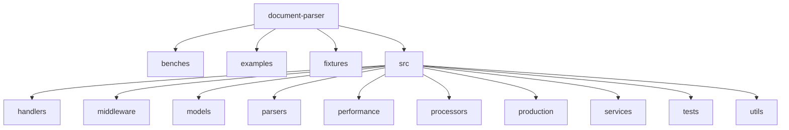
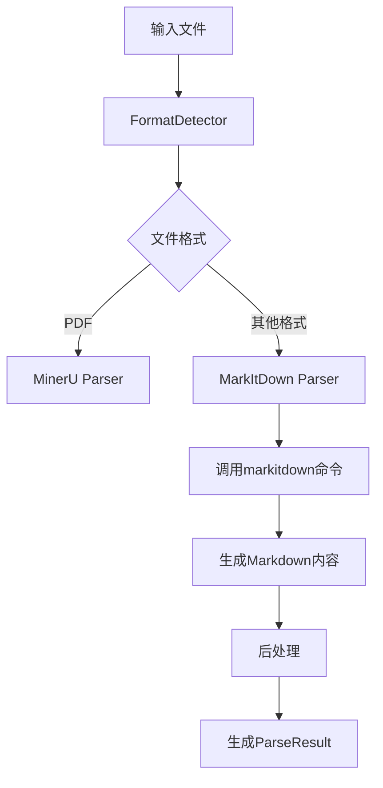
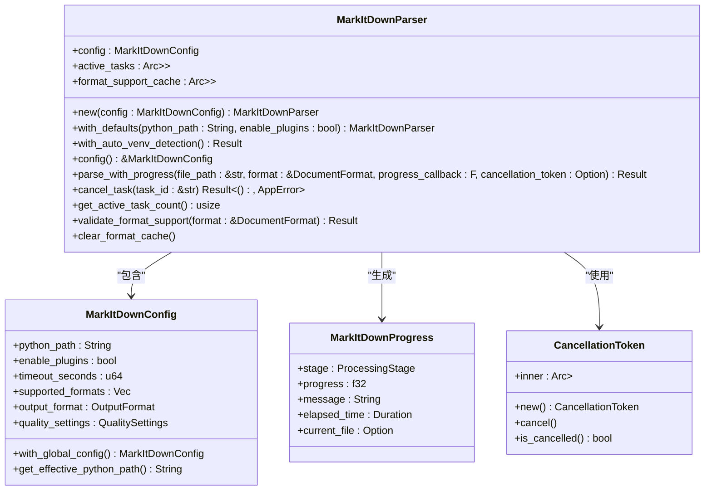
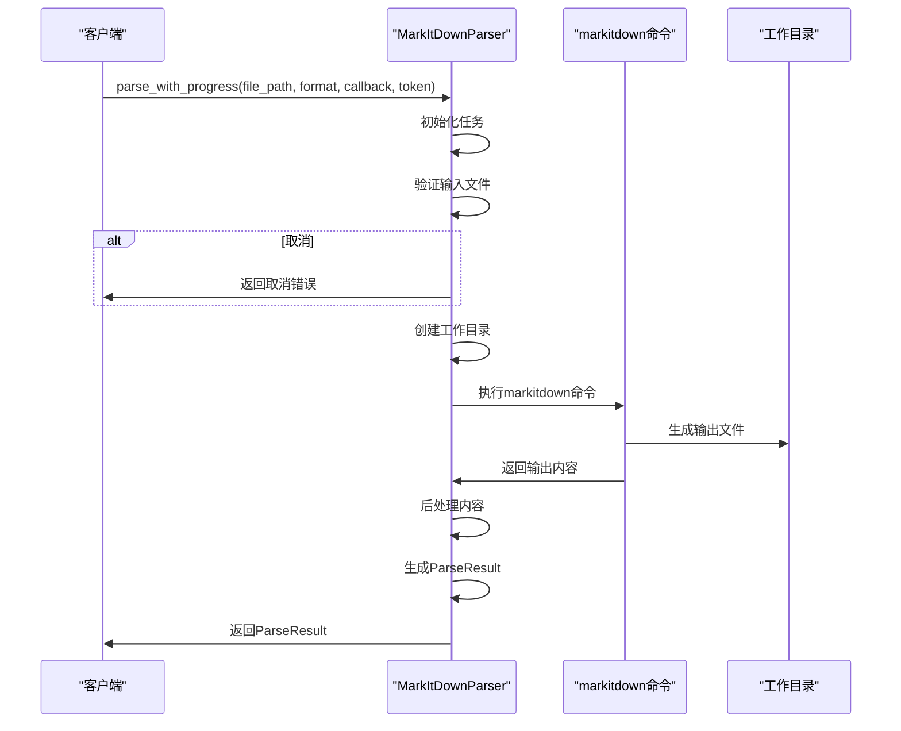
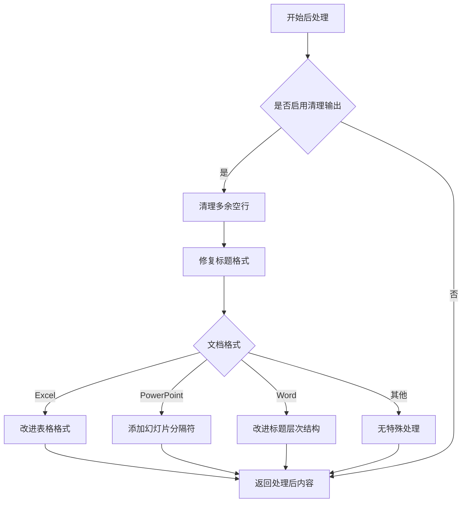

# Markitdown解析器

<cite>
**本文档引用的文件**
- [markitdown_parser.rs](file://document-parser/src/parsers/markitdown_parser.rs)
- [parser_trait.rs](file://document-parser/src/parsers/parser_trait.rs)
- [structured_document.rs](file://document-parser/src/models/structured_document.rs)
- [parse_result.rs](file://document-parser/src/models/parse_result.rs)
- [format_detector.rs](file://document-parser/src/parsers/format_detector.rs)
- [document_format.rs](file://document-parser/src/models/document_format.rs)
- [parser_engine.rs](file://document-parser/src/models/parser_engine.rs)
- [sample_markdown.md](file://document-parser/fixtures/sample_markdown.md)
- [simple_markdown.md](file://document-parser/fixtures/simple_markdown.md)
</cite>

## 目录
1. [简介](#简介)
2. [项目结构](#项目结构)
3. [核心组件](#核心组件)
4. [架构概述](#架构概述)
5. [详细组件分析](#详细组件分析)
6. [依赖分析](#依赖分析)
7. [性能考量](#性能考量)
8. [故障排除指南](#故障排除指南)
9. [结论](#结论)

## 简介
MarkitdownParser是一个多格式文档解析器，专门用于将各种文档格式转换为结构化的Markdown内容。它作为`DocumentParser`接口的具体实现，能够处理Word、Excel、PowerPoint、图片、音频等多种格式。该解析器通过调用外部Python工具`markitdown`来执行实际的转换工作，并提供了进度跟踪、取消支持和错误处理等高级功能。通过分析`sample_markdown.md`和`simple_markdown.md`等示例文件，可以深入了解其解析过程和生成的结构化文档对象。

## 项目结构
项目结构清晰地组织了各个模块，包括处理程序、中间件、模型、解析器、性能优化、处理器、服务、测试和工具等。核心的解析功能位于`document-parser/src/parsers`目录下，其中`markitdown_parser.rs`是本分析的重点。

**Diagram sources**
- [project_structure](file://document-parser)

**Section sources**
- [project_structure](file://document-parser)

## 核心组件
MarkitdownParser的核心组件包括`MarkItDownParser`结构体、`DocumentParser`特征以及相关的配置和进度跟踪机制。`MarkItDownParser`实现了`DocumentParser`特征，提供了`parse`、`supports_format`、`get_name`和`get_description`等方法。解析器通过`parse_with_progress`方法执行解析任务，并支持进度回调和取消令牌。

**Section sources**
- [markitdown_parser.rs](file://document-parser/src/parsers/markitdown_parser.rs#L0-L1645)
- [parser_trait.rs](file://document-parser/src/parsers/parser_trait.rs#L0-L57)

## 架构概述
MarkitdownParser的架构设计遵循了模块化和可扩展的原则。它通过`FormatDetector`检测输入文件的格式，并根据格式选择合适的解析引擎。对于非PDF格式的文件，使用`MarkItDown`引擎进行解析。解析过程包括初始化、输入验证、预处理、转换、后处理和最终化等阶段。

**Diagram sources**
- [markitdown_parser.rs](file://document-parser/src/parsers/markitdown_parser.rs#L0-L1645)
- [format_detector.rs](file://document-parser/src/parsers/format_detector.rs#L0-L1298)
- [parser_engine.rs](file://document-parser/src/models/parser_engine.rs#L0-L47)

## 详细组件分析
### MarkItDownParser分析
MarkItDownParser是`DocumentParser`特征的具体实现，负责解析非PDF格式的文档。它通过调用外部Python工具`markitdown`来执行转换，并提供了丰富的配置选项和进度跟踪功能。

#### 类图

**Diagram sources**
- [markitdown_parser.rs](file://document-parser/src/parsers/markitdown_parser.rs#L0-L1645)

**Section sources**
- [markitdown_parser.rs](file://document-parser/src/parsers/markitdown_parser.rs#L0-L1645)

### 解析流程分析
MarkitdownParser的解析流程包括多个阶段，从初始化到最终化，每个阶段都有明确的任务和进度报告。

#### 序列图

**Diagram sources**
- [markitdown_parser.rs](file://document-parser/src/parsers/markitdown_parser.rs#L0-L1645)

**Section sources**
- [markitdown_parser.rs](file://document-parser/src/parsers/markitdown_parser.rs#L0-L1645)

### 后处理分析
MarkitdownParser在解析完成后会对生成的Markdown内容进行后处理，以确保输出的质量和一致性。

#### 流程图

**Diagram sources**
- [markitdown_parser.rs](file://document-parser/src/parsers/markitdown_parser.rs#L0-L1645)

**Section sources**
- [markitdown_parser.rs](file://document-parser/src/parsers/markitdown_parser.rs#L0-L1645)

## 依赖分析
MarkitdownParser依赖于多个外部组件和内部模块，形成了一个复杂的依赖网络。

```mermaid
graph TD
A[MarkItDownParser] --> B[DocumentParser]
A --> C[AppError]
A --> D[DocumentFormat]
A --> E[ParseResult]
A --> F[FormatDetector]
A --> G[GlobalFileSizeConfig]
A --> H[async_trait]
A --> I[std::collections::HashMap]
A --> J[std::path::Path]
A --> K[std::process::Stdio]
A --> L[std::sync::Arc]
A --> M[std::time::Duration]
A --> N[std::time::Instant]
A --> O[tokio::fs]
A --> P[tokio::io::AsyncBufReadExt]
A --> Q[tokio::io::BufReader]
A --> R[tokio::process::Command]
A --> S[tokio::sync::Mutex]
A --> T[tokio::sync::RwLock]
A --> U[tokio::sync::mpsc]
A --> V[tokio::time::timeout]
A --> W[tracing]
A --> X[uuid]
```

**Diagram sources**
- [markitdown_parser.rs](file://document-parser/src/parsers/markitdown_parser.rs#L0-L1645)

**Section sources**
- [markitdown_parser.rs](file://document-parser/src/parsers/markitdown_parser.rs#L0-L1645)

## 性能考量
MarkitdownParser在设计时考虑了性能优化，通过异步I/O、并发处理和缓存机制来提高解析效率。然而，在处理复杂排版文档时，由于需要调用外部Python工具，可能会出现性能瓶颈。对于纯文本或轻量级富文本场景，其性能表现优秀，但在处理大型文档或高并发请求时，需要谨慎评估资源消耗。

## 故障排除指南
在使用MarkitdownParser时，可能会遇到一些常见问题，如文件格式不支持、解析超时、输出内容为空等。以下是一些故障排除建议：

- **文件格式不支持**：确保输入文件的格式在`MarkItDownConfig`的`supported_formats`列表中。
- **解析超时**：检查`timeout_seconds`配置是否足够长，或者优化输入文件的大小。
- **输出内容为空**：验证输入文件是否为空，或者检查`markitdown`命令是否正确执行。
- **Python环境问题**：确保Python虚拟环境已正确设置，并且`python_path`配置指向正确的Python解释器。

**Section sources**
- [markitdown_parser.rs](file://document-parser/src/parsers/markitdown_parser.rs#L0-L1645)
- [format_detector.rs](file://document-parser/src/parsers/format_detector.rs#L0-L1298)

## 结论
MarkitdownParser是一个功能强大且灵活的多格式文档解析器，能够有效地将各种文档转换为结构化的Markdown内容。通过深入分析其源码，我们了解了其内部工作原理、架构设计和性能特点。尽管在处理复杂文档时可能存在一些局限性，但其模块化的设计和丰富的配置选项使其成为一个可靠的文档解析解决方案。