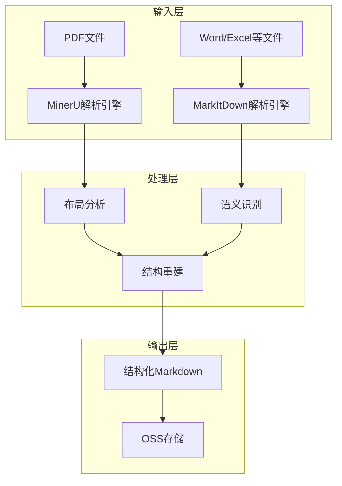
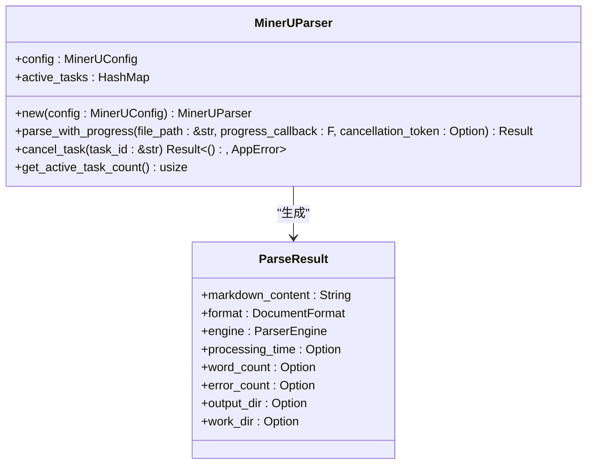
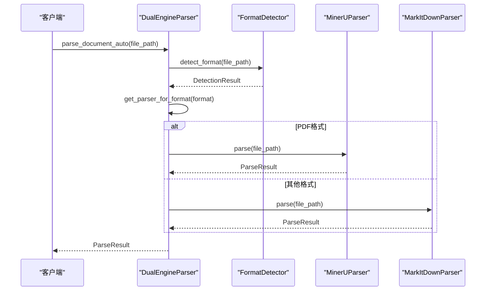
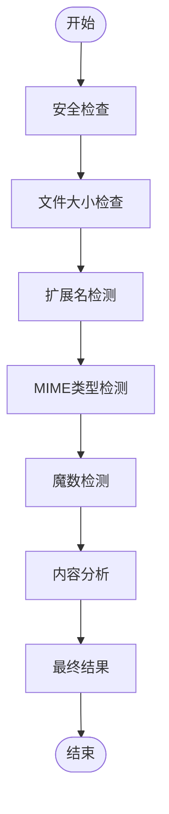
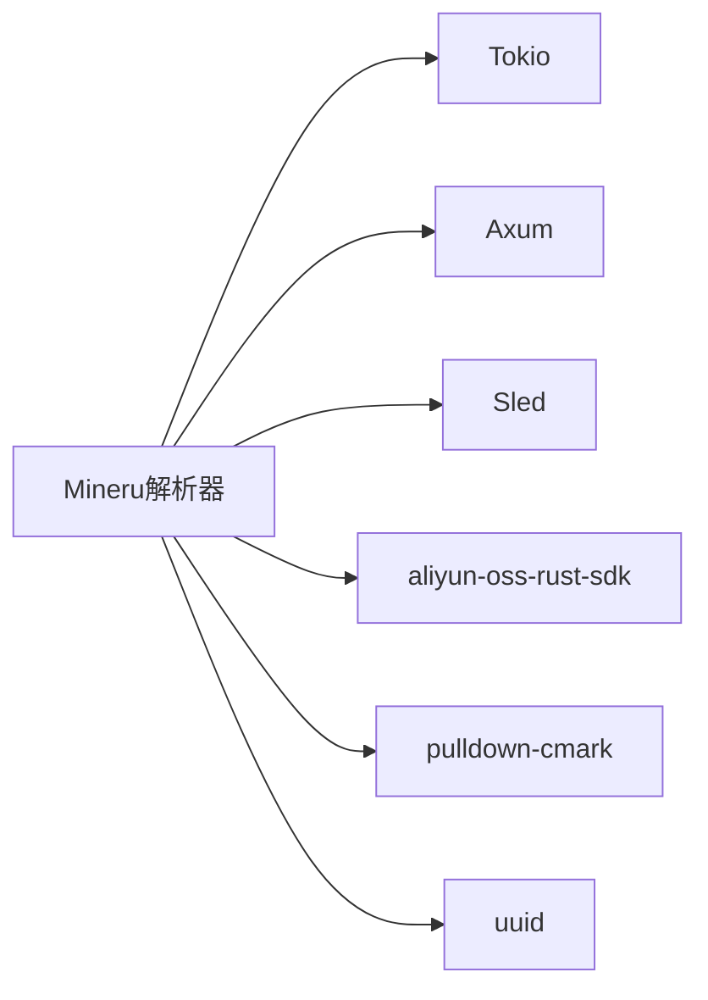

# Mineru解析器

<cite>
**本文档引用的文件**  
- [minerU_design.md](file://spec/minerU_design.md)
- [mineru_parser.rs](file://document-parser/src/parsers/mineru_parser.rs)
- [parser_trait.rs](file://document-parser/src/parsers/parser_trait.rs)
- [dual_engine_parser.rs](file://document-parser/src/parsers/dual_engine_parser.rs)
- [format_detector.rs](file://document-parser/src/parsers/format_detector.rs)
- [document_format.rs](file://document-parser/src/models/document_format.rs)
- [parser_engine.rs](file://document-parser/src/models/parser_engine.rs)
- [parse_result.rs](file://document-parser/src/models/parse_result.rs)
- [technical_doc.md](file://document-parser/fixtures/technical_doc.md)
</cite>

## 目录
1. [引言](#引言)
2. [项目结构](#项目结构)
3. [核心组件](#核心组件)
4. [架构概述](#架构概述)
5. [详细组件分析](#详细组件分析)
6. [依赖分析](#依赖分析)
7. [性能考量](#性能考量)
8. [故障排除指南](#故障排除指南)
9. [结论](#结论)

## 引言
Mineru解析器是一个专为复杂技术文档设计的深度解析系统，能够从PDF、Word等二进制格式中提取出保持原始逻辑结构的Markdown内容。该系统结合了布局分析、语义识别和结构重建算法，通过MinerU和MarkItDown双引擎策略，实现了对多种文档格式的高效解析。本文档将全面解析MineruParser的设计理念与技术实现，重点阐述其在处理复杂技术文档时的深度解析能力。

## 项目结构
Mineru解析器的项目结构清晰，主要分为以下几个核心目录：
- **assets**: 存放静态资源文件
- **document-parser**: 核心文档解析模块
- **mcp-proxy**: 代理服务模块
- **oss-client**: 对象存储客户端
- **scripts**: 脚本文件
- **spec**: 设计规范文档
- **voice-cli**: 语音命令行接口

其中，`document-parser`目录是核心解析模块，包含了处理文档解析的主要逻辑。

**Section sources**
- [minerU_design.md](file://spec/minerU_design.md#L1-L1280)

## 核心组件
Mineru解析器的核心组件包括：
- **MinerUParser**: 专门用于PDF文档解析的组件
- **MarkItDownParser**: 用于处理其他格式文档的组件
- **DualEngineParser**: 双引擎解析器管理器
- **FormatDetector**: 格式检测器
- **DocumentFormat**: 文档格式枚举
- **ParserEngine**: 解析引擎枚举
- **ParseResult**: 解析结果模型

这些组件协同工作，实现了对多种文档格式的智能解析。

**Section sources**
- [mineru_parser.rs](file://document-parser/src/parsers/mineru_parser.rs#L1-L1364)
- [markitdown_parser.rs](file://document-parser/src/parsers/markitdown_parser.rs#L1-L1645)
- [dual_engine_parser.rs](file://document-parser/src/parsers/dual_engine_parser.rs#L1-L217)
- [format_detector.rs](file://document-parser/src/parsers/format_detector.rs#L1-L1298)
- [document_format.rs](file://document-parser/src/models/document_format.rs#L1-L125)
- [parser_engine.rs](file://document-parser/src/models/parser_engine.rs#L1-L47)
- [parse_result.rs](file://document-parser/src/models/parse_result.rs#L1-L71)

## 架构概述
Mineru解析器采用双引擎架构，根据文档格式智能选择最优解析器。对于PDF文档，使用专业的MinerU解析引擎；对于其他格式，则使用MarkItDown解析引擎。这种设计充分发挥了各自引擎的优势，提高了整体解析质量。

**Diagram sources**
- [minerU_design.md](file://spec/minerU_design.md#L1-L1280)
- [dual_engine_parser.rs](file://document-parser/src/parsers/dual_engine_parser.rs#L1-L217)

## 详细组件分析

### MinerUParser分析
MinerUParser是专门用于PDF文档解析的核心组件，它通过调用MinerU命令行工具来实现PDF到Markdown的转换。该组件支持进度跟踪和取消操作，能够有效管理解析任务。

**Diagram sources**
- [mineru_parser.rs](file://document-parser/src/parsers/mineru_parser.rs#L1-L1364)
- [parse_result.rs](file://document-parser/src/models/parse_result.rs#L1-L71)

### DualEngineParser分析
DualEngineParser作为双引擎解析器的管理器，负责根据文档格式选择合适的解析器。它通过`get_parser_for_format`方法实现智能路由，确保每种格式都能得到最优处理。

**Diagram sources**
- [dual_engine_parser.rs](file://document-parser/src/parsers/dual_engine_parser.rs#L1-L217)
- [format_detector.rs](file://document-parser/src/parsers/format_detector.rs#L1-L1298)

### FormatDetector分析
FormatDetector组件负责检测文档格式，它采用多重检测策略，包括文件扩展名、MIME类型、魔数检测和内容分析。这种多层检测机制确保了格式识别的准确性。

**Diagram sources**
- [format_detector.rs](file://document-parser/src/parsers/format_detector.rs#L1-L1298)

## 依赖分析
Mineru解析器的依赖关系清晰，主要依赖包括：
- **Rust标准库**: 提供基础功能
- **Tokio**: 异步运行时
- **Axum**: Web框架
- **Sled**: 嵌入式数据库
- **aliyun-oss-rust-sdk**: 阿里云OSS SDK
- **pulldown-cmark**: Markdown解析
- **uuid**: UUID生成

这些依赖通过Cargo.toml文件进行管理，确保了项目的可维护性和可扩展性。

**Diagram sources**
- [Cargo.toml](file://Cargo.toml#L1-L10)

## 性能考量
Mineru解析器在设计时充分考虑了性能优化，主要体现在以下几个方面：
- **并发控制**: 基于channel的并发控制，精确管理资源使用
- **缓存机制**: 解析结果缓存，避免重复计算
- **按需加载**: 只加载用户点击的内容
- **增量更新**: 支持内容的增量更新

这些优化措施确保了系统在处理大规模文档时仍能保持高效性能。

## 故障排除指南
在使用Mineru解析器时，可能会遇到以下常见问题：
- **文件格式不支持**: 检查文件格式是否在支持列表中
- **解析超时**: 增加超时时间或检查系统资源
- **CUDA不可用**: 确保CUDA环境正确配置
- **虚拟环境问题**: 检查Python虚拟环境是否正确创建

通过查看日志文件和错误信息，可以快速定位和解决问题。

**Section sources**
- [mineru_parser.rs](file://document-parser/src/parsers/mineru_parser.rs#L1-L1364)
- [markitdown_parser.rs](file://document-parser/src/parsers/markitdown_parser.rs#L1-L1645)

## 结论
Mineru解析器通过结合布局分析、语义识别和结构重建算法，实现了对复杂技术文档的深度解析。其双引擎架构和智能格式识别机制，确保了对多种文档格式的高效处理。通过与ParserTrait的集成，系统具有良好的扩展性和维护性。在处理XML等半结构化数据时，特殊的转换逻辑保证了数据的完整性和准确性。整体而言，Mineru解析器是一个功能强大、性能优越的文档解析解决方案。