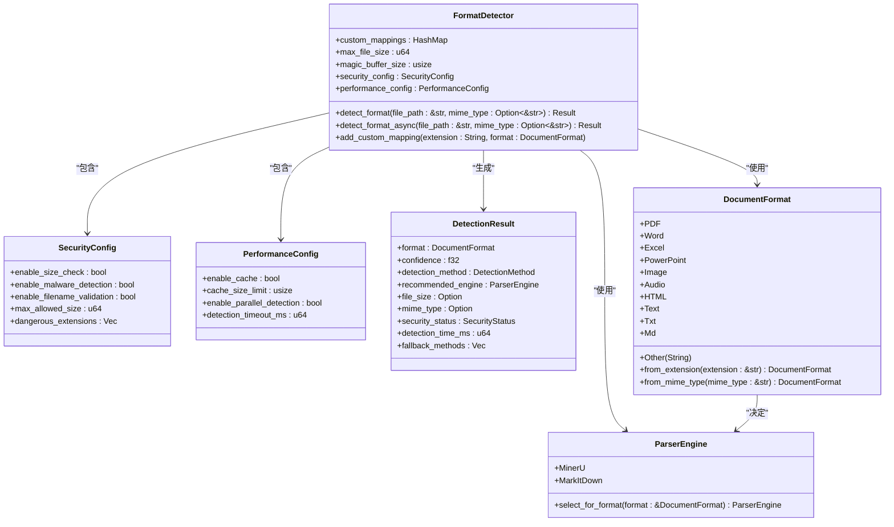
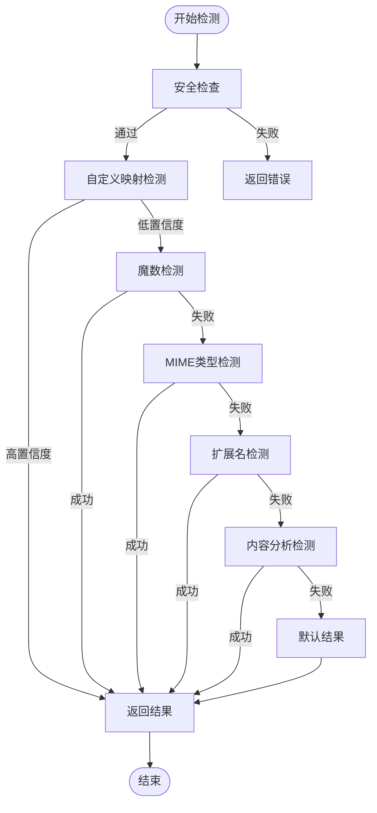
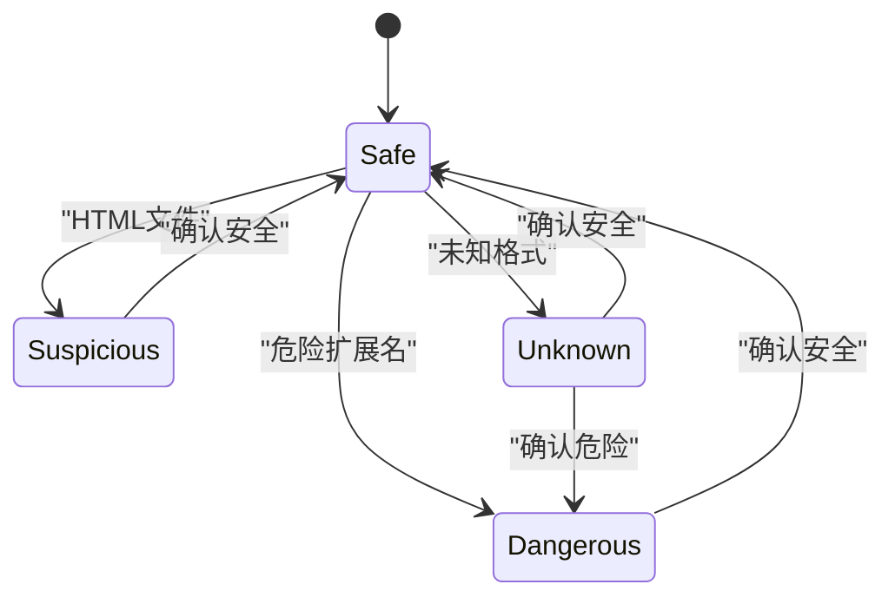
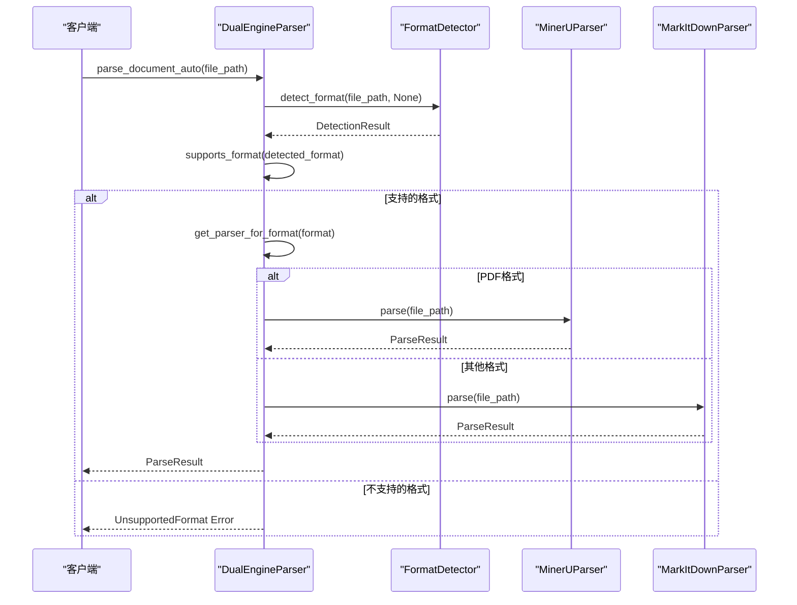
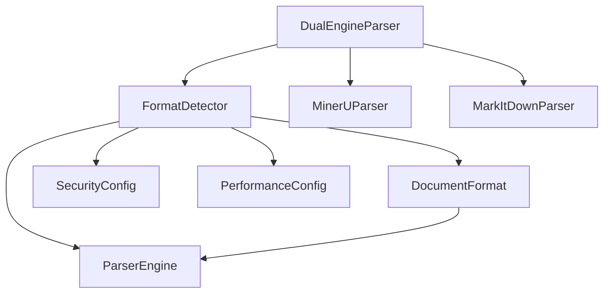
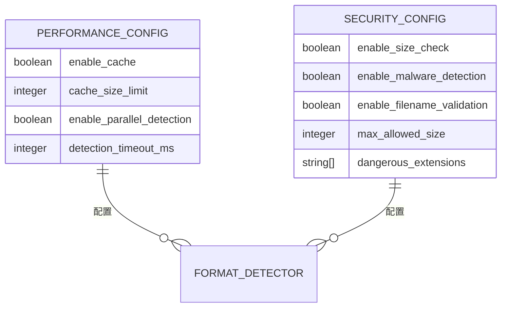

# 格式检测

<cite>
**本文档中引用的文件**
- [format_detector.rs](file://document-parser/src/parsers/format_detector.rs)
- [dual_engine_parser.rs](file://document-parser/src/parsers/dual_engine_parser.rs)
- [document_format.rs](file://document-parser/src/models/document_format.rs)
- [parser_engine.rs](file://document-parser/src/models/parser_engine.rs)
- [sample_markdown.md](file://document-parser/fixtures/sample_markdown.md)
- [sample_data.xml](file://document-parser/fixtures/sample_data.xml)
- [sample_text.txt](file://document-parser/fixtures/sample_text.txt)
- [均线为王之一：均线100分.pdf](file://document-parser/fixtures/均线为王之一：均线1000分.pdf)
- [upload_parse_test.md](file://document-parser/fixtures/upload_parse_test.md)
</cite>

## 目录
1. [简介](#简介)
2. [核心组件](#核心组件)
3. [架构概览](#架构概览)
4. [详细组件分析](#详细组件分析)
5. [依赖分析](#依赖分析)
6. [性能考量](#性能考量)
7. [故障排除指南](#故障排除指南)
8. [结论](#结论)

## 简介
`FormatDetector` 模块是文档解析系统中的核心组件，负责通过多种维度手段精准判断输入文档的类型。该模块结合文件扩展名、魔数（Magic Number）识别、内容特征分析等技术，实现对 Markdown、PDF、Word、XML 等多种格式的准确检测。本文档详细阐述其设计与实现机制，说明其在 `dual_engine_parser.rs` 中的调用时机与决策流程，以及如何将不同格式的文档路由至对应的解析引擎。

## 核心组件

`FormatDetector` 模块通过多维度检测策略实现文档格式的精准识别。它首先进行安全检查，然后依次尝试自定义映射、魔数检测、MIME 类型检测、扩展名检测和内容分析检测，最终返回置信度最高的检测结果。

**Section sources**
- [format_detector.rs](file://document-parser/src/parsers/format_detector.rs#L0-L1298)

## 架构概览

`FormatDetector` 模块的设计遵循多重检测策略，确保在各种情况下都能准确识别文档格式。其核心组件包括格式检测器、安全检查配置、性能配置和检测结果等。

**Diagram sources**
- [format_detector.rs](file://document-parser/src/parsers/format_detector.rs#L0-L1298)
- [document_format.rs](file://document-parser/src/models/document_format.rs#L0-L125)
- [parser_engine.rs](file://document-parser/src/models/parser_engine.rs#L0-L47)

## 详细组件分析

### FormatDetector 分析

`FormatDetector` 是核心的格式检测器，负责通过多种手段识别文档格式。它首先进行安全检查，然后依次尝试自定义映射、魔数检测、MIME 类型检测、扩展名检测和内容分析检测。

#### 检测流程

**Diagram sources**
- [format_detector.rs](file://document-parser/src/parsers/format_detector.rs#L0-L1298)

#### 安全状态评估

**Diagram sources**
- [format_detector.rs](file://document-parser/src/parsers/format_detector.rs#L0-L1298)

**Section sources**
- [format_detector.rs](file://document-parser/src/parsers/format_detector.rs#L0-L1298)

### DualEngineParser 分析

`DualEngineParser` 是双引擎解析器管理器，负责根据检测到的文档格式选择合适的解析引擎。它结合了 `MinerU` 和 `MarkItDown` 两个解析引擎，分别处理 PDF 和其他格式的文档。

#### 解析流程

**Diagram sources**
- [dual_engine_parser.rs](file://document-parser/src/parsers/dual_engine_parser.rs#L0-L217)

**Section sources**
- [dual_engine_parser.rs](file://document-parser/src/parsers/dual_engine_parser.rs#L0-L217)

## 依赖分析

`FormatDetector` 模块依赖于多个核心组件，包括文档格式定义、解析引擎选择、安全配置和性能配置等。这些组件共同协作，确保格式检测的准确性和安全性。

**Diagram sources**
- [format_detector.rs](file://document-parser/src/parsers/format_detector.rs#L0-L1298)
- [dual_engine_parser.rs](file://document-parser/src/parsers/dual_engine_parser.rs#L0-L217)
- [document_format.rs](file://document-parser/src/models/document_format.rs#L0-L125)
- [parser_engine.rs](file://document-parser/src/models/parser_engine.rs#L0-L47)

**Section sources**
- [format_detector.rs](file://document-parser/src/parsers/format_detector.rs#L0-L1298)
- [dual_engine_parser.rs](file://document-parser/src/parsers/dual_engine_parser.rs#L0-L217)

## 性能考量

`FormatDetector` 模块在设计时充分考虑了性能因素。通过配置性能参数，如启用缓存、并行检测和设置检测超时时间，可以有效提升检测效率。

### 性能配置

**Diagram sources**
- [format_detector.rs](file://document-parser/src/parsers/format_detector.rs#L0-L1298)

## 故障排除指南

### 常见误识别案例
1. **扩展名与实际内容不符**：例如，将 XML 文件保存为 `.txt` 扩展名。
2. **魔数检测失败**：某些文件可能没有标准的魔数签名。
3. **内容分析不准确**：文本文件可能包含多种格式的内容，导致分析结果不准确。

### 优化建议
1. **添加自定义映射**：对于特定场景，可以通过 `add_custom_mapping` 方法添加自定义格式映射。
2. **调整置信度阈值**：根据实际需求调整不同检测方法的置信度。
3. **扩展魔数签名**：增加更多文件类型的魔数签名定义，提高检测准确性。

**Section sources**
- [format_detector.rs](file://document-parser/src/parsers/format_detector.rs#L0-L1298)

## 结论

`FormatDetector` 模块通过多维度检测策略，实现了对多种文档格式的精准识别。其设计充分考虑了安全性、性能和可扩展性，能够有效应对各种复杂的文档解析场景。通过与 `DualEngineParser` 的协同工作，系统能够智能地选择最适合的解析引擎，确保文档解析的高效和准确。