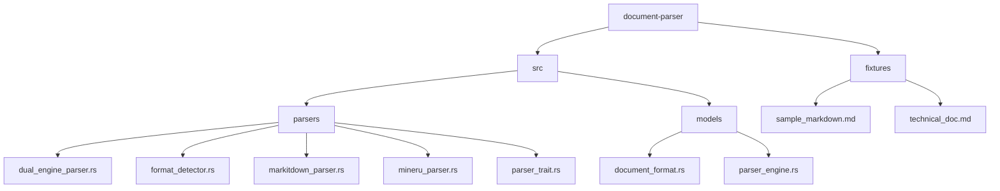
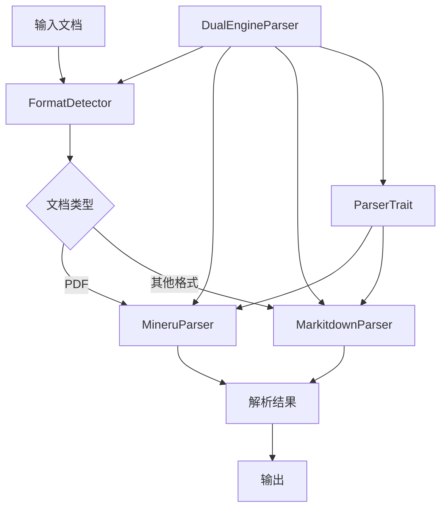
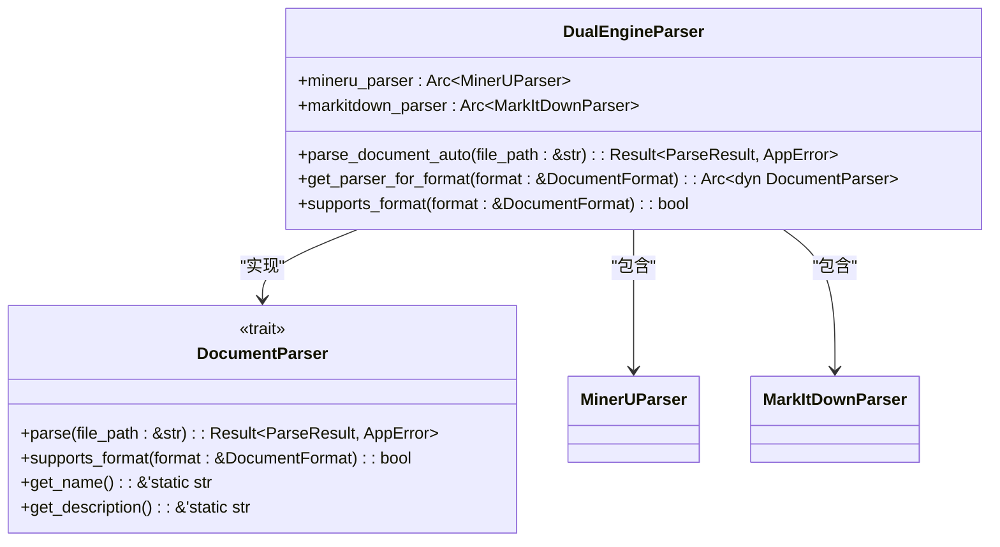
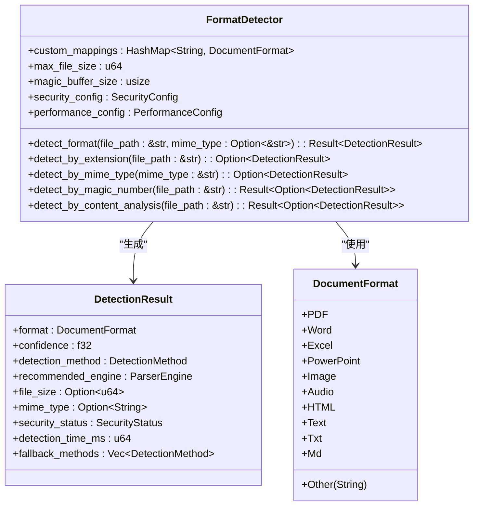
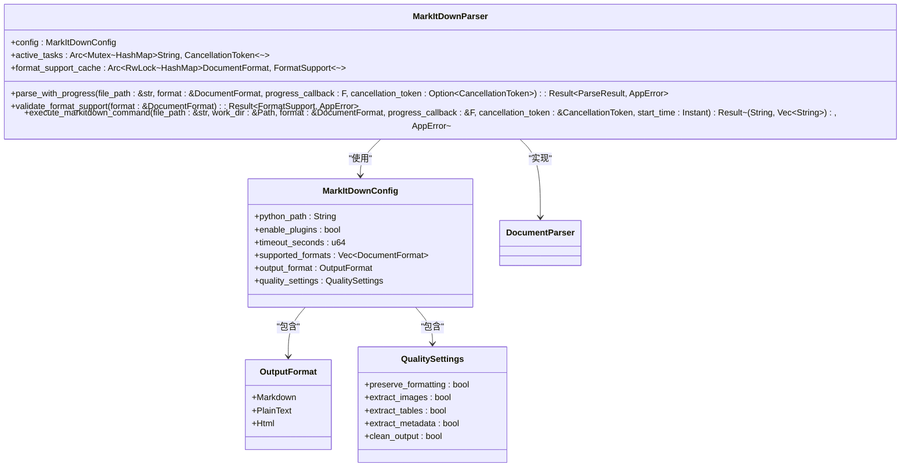
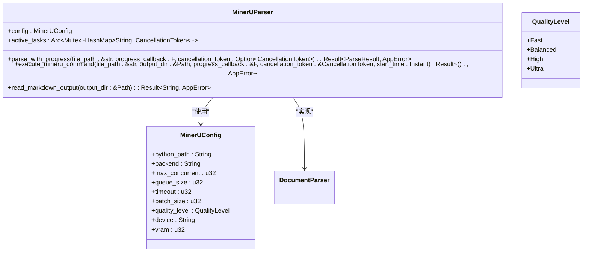
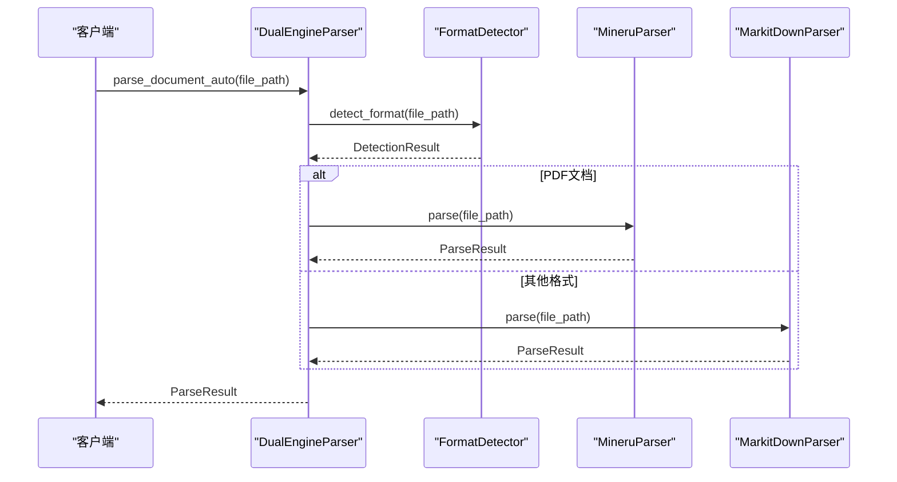
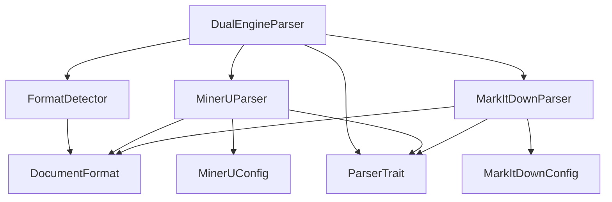

# 解析引擎

<cite>
**本文档引用的文件**
- [dual_engine_parser.rs](file://document-parser/src/parsers/dual_engine_parser.rs)
- [format_detector.rs](file://document-parser/src/parsers/format_detector.rs)
- [markitdown_parser.rs](file://document-parser/src/parsers/markitdown_parser.rs)
- [mineru_parser.rs](file://document-parser/src/parsers/mineru_parser.rs)
- [parser_trait.rs](file://document-parser/src/parsers/parser_trait.rs)
- [document_format.rs](file://document-parser/src/models/document_format.rs)
- [parser_engine.rs](file://document-parser/src/models/parser_engine.rs)
- [sample_markdown.md](file://document-parser/fixtures/sample_markdown.md)
- [technical_doc.md](file://document-parser/fixtures/technical_doc.md)
</cite>

## 目录
1. [简介](#简介)
2. [项目结构](#项目结构)
3. [核心组件](#核心组件)
4. [架构概述](#架构概述)
5. [详细组件分析](#详细组件分析)
6. [依赖分析](#依赖分析)
7. [性能考量](#性能考量)
8. [故障排除指南](#故障排除指南)
9. [结论](#结论)

## 简介
本文档深入阐述了文档解析服务的核心解析引擎架构。重点分析了DualEngineParser如何协调MarkitdownParser与MineruParser，实现对PDF、Word、Excel等多格式文档的智能解析。详细解释了FormatDetector如何基于文件头、扩展名和内容特征准确识别文档类型，并路由至相应解析器。描述了ParserTrait定义的统一解析接口规范，以及各具体解析器的实现差异。结合fixtures中的sample_markdown.md和technical_doc.md，展示了不同格式文档的解析流程与输出结构。

## 项目结构

**图示来源**
- [dual_engine_parser.rs](file://document-parser/src/parsers/dual_engine_parser.rs)
- [format_detector.rs](file://document-parser/src/parsers/format_detector.rs)
- [markitdown_parser.rs](file://document-parser/src/parsers/markitdown_parser.rs)
- [mineru_parser.rs](file://document-parser/src/parsers/mineru_parser.rs)
- [parser_trait.rs](file://document-parser/src/parsers/parser_trait.rs)
- [document_format.rs](file://document-parser/src/models/document_format.rs)
- [parser_engine.rs](file://document-parser/src/models/parser_engine.rs)
- [sample_markdown.md](file://document-parser/fixtures/sample_markdown.md)
- [technical_doc.md](file://document-parser/fixtures/technical_doc.md)

**章节来源**
- [dual_engine_parser.rs](file://document-parser/src/parsers/dual_engine_parser.rs#L1-L217)
- [format_detector.rs](file://document-parser/src/parsers/format_detector.rs#L1-L1298)
- [markitdown_parser.rs](file://document-parser/src/parsers/markitdown_parser.rs#L1-L1645)
- [mineru_parser.rs](file://document-parser/src/parsers/mineru_parser.rs#L1-L1364)

## 核心组件

本文档的核心组件包括DualEngineParser、FormatDetector、MarkitdownParser、MineruParser以及统一的ParserTrait接口。DualEngineParser作为协调中心，根据文档类型选择合适的解析器；FormatDetector负责准确识别文档格式；MarkitdownParser和MineruParser分别处理非PDF和PDF格式的文档；ParserTrait定义了统一的解析接口规范。

**章节来源**
- [dual_engine_parser.rs](file://document-parser/src/parsers/dual_engine_parser.rs#L1-L217)
- [format_detector.rs](file://document-parser/src/parsers/format_detector.rs#L1-L1298)
- [markitdown_parser.rs](file://document-parser/src/parsers/markitdown_parser.rs#L1-L1645)
- [mineru_parser.rs](file://document-parser/src/parsers/mineru_parser.rs#L1-L1364)
- [parser_trait.rs](file://document-parser/src/parsers/parser_trait.rs#L1-L57)

## 架构概述

**图示来源**
- [dual_engine_parser.rs](file://document-parser/src/parsers/dual_engine_parser.rs#L1-L217)
- [format_detector.rs](file://document-parser/src/parsers/format_detector.rs#L1-L1298)
- [markitdown_parser.rs](file://document-parser/src/parsers/markitdown_parser.rs#L1-L1645)
- [mineru_parser.rs](file://document-parser/src/parsers/mineru_parser.rs#L1-L1364)
- [parser_trait.rs](file://document-parser/src/parsers/parser_trait.rs#L1-L57)

## 详细组件分析

### DualEngineParser分析
DualEngineParser是双引擎解析器的管理器，负责协调MineruParser和MarkitdownParser。它根据文档格式自动选择合适的解析器，并提供统一的解析接口。

**图示来源**
- [dual_engine_parser.rs](file://document-parser/src/parsers/dual_engine_parser.rs#L13-L17)
- [parser_trait.rs](file://document-parser/src/parsers/parser_trait.rs#L1-L57)

**章节来源**
- [dual_engine_parser.rs](file://document-parser/src/parsers/dual_engine_parser.rs#L1-L217)

### FormatDetector分析
FormatDetector负责检测文档格式，它通过多种方法（文件扩展名、MIME类型、魔数、内容分析）来确定文档的真实格式，并评估其安全性。

**图示来源**
- [format_detector.rs](file://document-parser/src/parsers/format_detector.rs#L11-L24)
- [document_format.rs](file://document-parser/src/models/document_format.rs#L1-L125)

**章节来源**
- [format_detector.rs](file://document-parser/src/parsers/format_detector.rs#L1-L1298)
- [document_format.rs](file://document-parser/src/models/document_format.rs#L1-L125)

### MarkitdownParser分析
MarkitdownParser是多格式文档解析器，支持Word、Excel、PowerPoint、图片、音频等多种格式。它通过调用外部Python工具MarkItDown来实现文档解析。

**图示来源**
- [markitdown_parser.rs](file://document-parser/src/parsers/markitdown_parser.rs#L1473-L1511)
- [parser_trait.rs](file://document-parser/src/parsers/parser_trait.rs#L1-L57)

**章节来源**
- [markitdown_parser.rs](file://document-parser/src/parsers/markitdown_parser.rs#L1-L1645)

### MineruParser分析
MineruParser是专业的PDF解析引擎，专注于PDF文档的解析，支持图片提取、表格识别和布局保持等高级功能。

**图示来源**
- [mineru_parser.rs](file://document-parser/src/parsers/mineru_parser.rs#L1275-L1312)
- [parser_trait.rs](file://document-parser/src/parsers/parser_trait.rs#L1-L57)

**章节来源**
- [mineru_parser.rs](file://document-parser/src/parsers/mineru_parser.rs#L1-L1364)

### 解析流程分析
以下序列图展示了文档解析的完整流程，从输入文档到最终输出的全过程。

**图示来源**
- [dual_engine_parser.rs](file://document-parser/src/parsers/dual_engine_parser.rs#L1-L217)
- [format_detector.rs](file://document-parser/src/parsers/format_detector.rs#L1-L1298)
- [markitdown_parser.rs](file://document-parser/src/parsers/markitdown_parser.rs#L1-L1645)
- [mineru_parser.rs](file://document-parser/src/parsers/mineru_parser.rs#L1-L1364)

**章节来源**
- [dual_engine_parser.rs](file://document-parser/src/parsers/dual_engine_parser.rs#L1-L217)
- [format_detector.rs](file://document-parser/src/parsers/format_detector.rs#L1-L1298)

## 依赖分析

**图示来源**
- [dual_engine_parser.rs](file://document-parser/src/parsers/dual_engine_parser.rs#L1-L217)
- [format_detector.rs](file://document-parser/src/parsers/format_detector.rs#L1-L1298)
- [markitdown_parser.rs](file://document-parser/src/parsers/markitdown_parser.rs#L1-L1645)
- [mineru_parser.rs](file://document-parser/src/parsers/mineru_parser.rs#L1-L1364)
- [parser_trait.rs](file://document-parser/src/parsers/parser_trait.rs#L1-L57)
- [document_format.rs](file://document-parser/src/models/document_format.rs#L1-L125)

**章节来源**
- [dual_engine_parser.rs](file://document-parser/src/parsers/dual_engine_parser.rs#L1-L217)
- [format_detector.rs](file://document-parser/src/parsers/format_detector.rs#L1-L1298)
- [markitdown_parser.rs](file://document-parser/src/parsers/markitdown_parser.rs#L1-L1645)
- [mineru_parser.rs](file://document-parser/src/parsers/mineru_parser.rs#L1-L1364)
- [parser_trait.rs](file://document-parser/src/parsers/parser_trait.rs#L1-L57)
- [document_format.rs](file://document-parser/src/models/document_format.rs#L1-L125)

## 性能考量
双引擎协同工作在解析精度与速度上具有显著优势。MineruParser专注于PDF文档，能够保持复杂的布局和提取高质量的图片与表格；MarkitdownParser则支持多种文档格式，具有良好的通用性和稳定性。通过FormatDetector的智能路由，系统能够为不同类型的文档选择最合适的解析器，从而在保证解析质量的同时提高整体性能。

## 故障排除指南
当解析失败时，首先检查输入文件是否存在且可读，然后确认文件格式是否被支持。对于PDF文档，确保MineruParser的Python环境配置正确；对于其他格式，检查MarkitdownParser的配置。查看日志中的错误信息，根据具体的错误类型进行相应的处理。

**章节来源**
- [dual_engine_parser.rs](file://document-parser/src/parsers/dual_engine_parser.rs#L1-L217)
- [format_detector.rs](file://document-parser/src/parsers/format_detector.rs#L1-L1298)
- [markitdown_parser.rs](file://document-parser/src/parsers/markitdown_parser.rs#L1-L1645)
- [mineru_parser.rs](file://document-parser/src/parsers/mineru_parser.rs#L1-L1364)

## 结论
本文档详细阐述了文档解析服务的核心解析引擎架构。DualEngineParser通过协调MarkitdownParser与MineruParser，实现了对多种文档格式的智能解析。FormatDetector基于文件头、扩展名和内容特征准确识别文档类型，并路由至相应解析器。ParserTrait定义了统一的解析接口规范，确保了各解析器的兼容性和可扩展性。该架构在解析精度与速度上表现出色，适用于需要处理多种文档格式的场景。