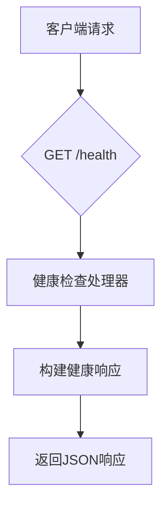
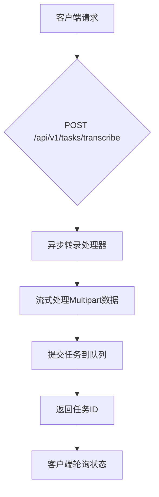
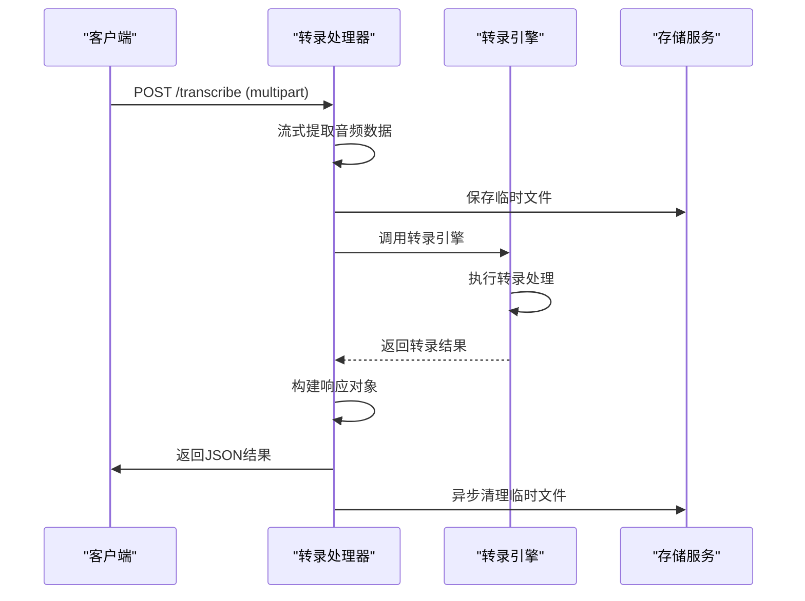
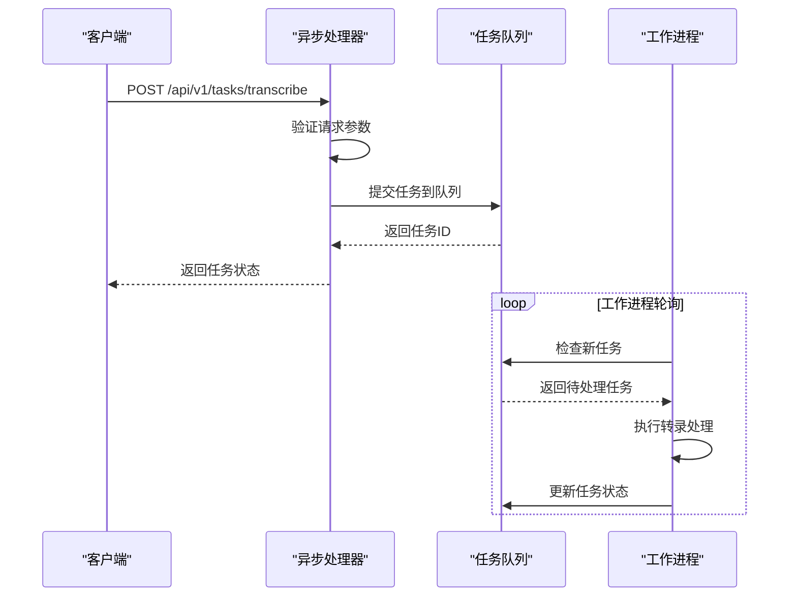
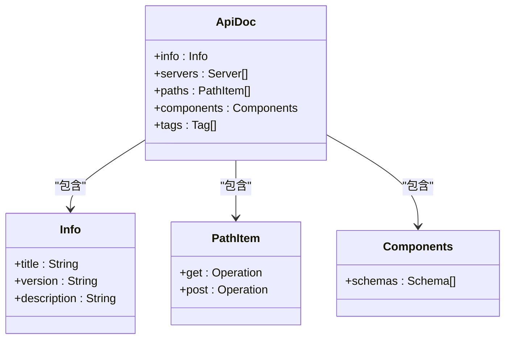
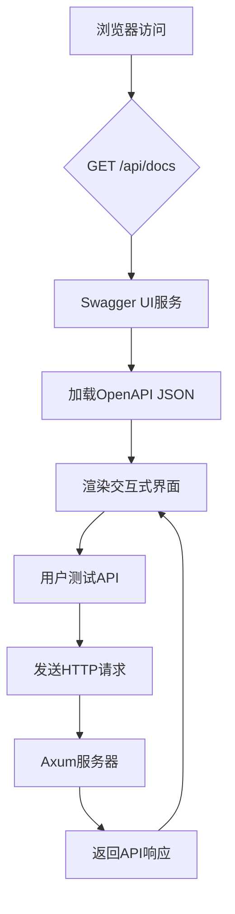
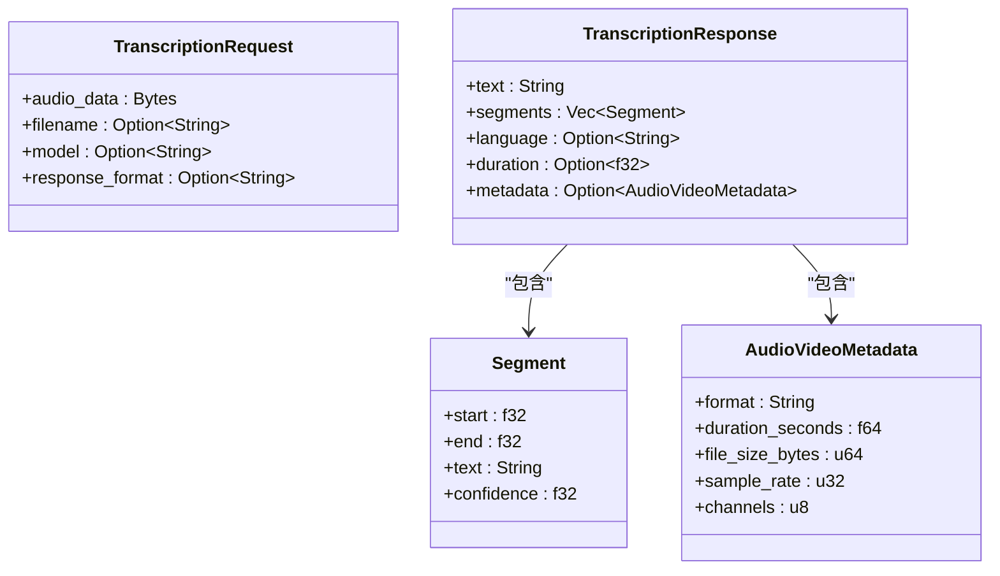
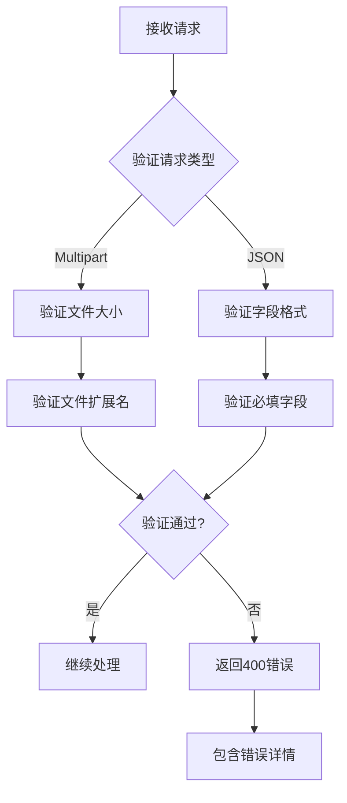
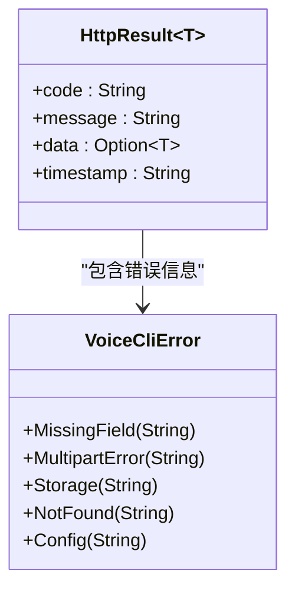
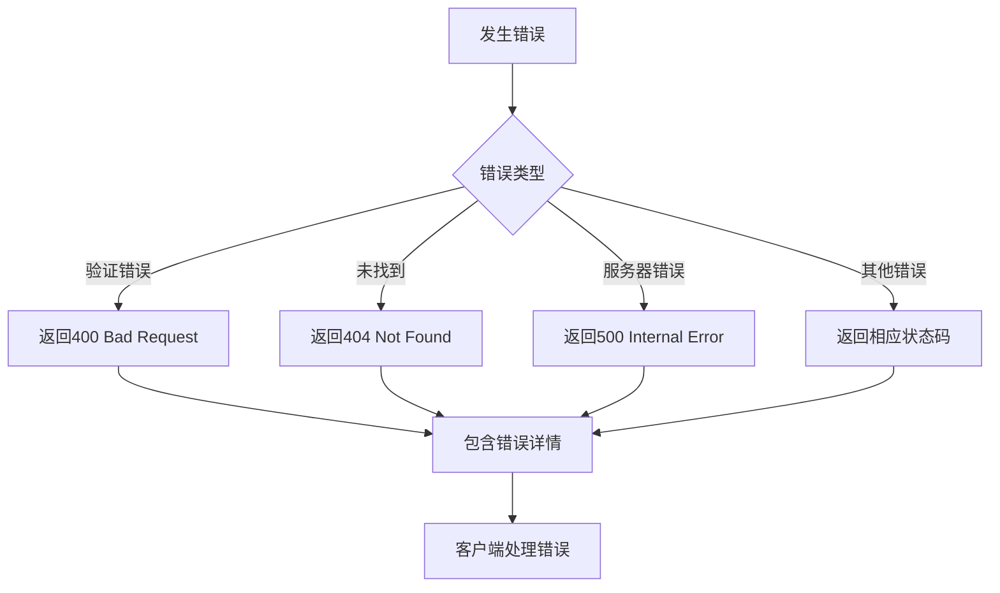

# HTTP接口与OpenAPI

<cite>
**本文档引用的文件**  
- [handlers.rs](file://voice-cli/src/server/handlers.rs)
- [openapi.rs](file://voice-cli/src/openapi.rs)
- [request.rs](file://voice-cli/src/models/request.rs)
</cite>

## 目录
1. [简介](#简介)
2. [核心RESTful端点](#核心restful端点)
3. [请求处理流程](#请求处理流程)
4. [OpenAPI规范生成](#openapi规范生成)
5. [请求模型与验证](#请求模型与验证)
6. [API调用示例](#api调用示例)
7. [错误处理机制](#错误处理机制)

## 简介
本项目基于Axum框架构建了一套完整的RESTful API，提供语音转录服务。系统支持同步与异步任务处理，包含健康检查、任务管理、模型查询等核心功能。通过集成utoipa库，自动生成符合OpenAPI 3.0规范的文档，支持Swagger UI可视化调试界面。

**Section sources**
- [handlers.rs](file://voice-cli/src/server/handlers.rs#L1-L100)
- [openapi.rs](file://voice-cli/src/openapi.rs#L1-L20)

## 核心RESTful端点

### 健康检查端点


**Diagram sources**
- [handlers.rs](file://voice-cli/src/server/handlers.rs#L100-L130)

### 任务提交端点


**Diagram sources**
- [handlers.rs](file://voice-cli/src/server/handlers.rs#L200-L250)

### 状态查询端点
```mermaid
flowchart TD
A[客户端请求] --> B{GET /api/v1/tasks/{task_id}}
B --> C[获取任务处理器]
C --> D[查询任务状态]
D --> E{任务是否存在?}
E --> |是| F[返回状态信息]
E --> |否| G[返回404错误]
F --> H[客户端根据状态决定下一步]
```

**Diagram sources**
- [handlers.rs](file://voice-cli/src/server/handlers.rs#L350-L380)

## 请求处理流程

### 同步转录处理流程


**Diagram sources**
- [handlers.rs](file://voice-cli/src/server/handlers.rs#L150-L190)

### 异步任务处理流程


**Diagram sources**
- [handlers.rs](file://voice-cli/src/server/handlers.rs#L250-L300)

## OpenAPI规范生成

### OpenAPI文档结构


**Diagram sources**
- [openapi.rs](file://voice-cli/src/openapi.rs#L10-L50)

### Swagger UI集成


**Diagram sources**
- [openapi.rs](file://voice-cli/src/openapi.rs#L60-L80)

## 请求模型与验证

### 请求数据模型


**Diagram sources**
- [request.rs](file://voice-cli/src/models/request.rs#L50-L150)

### 字段验证机制


**Diagram sources**
- [request.rs](file://voice-cli/src/models/request.rs#L150-L200)

## API调用示例

### curl调用示例
```bash
# 健康检查
curl -X GET http://localhost:8080/health

# 同步转录
curl -X POST http://localhost:8080/transcribe \
  -F "file=@audio.mp3" \
  -F "model=base" \
  -F "response_format=json"

# 提交异步任务
curl -X POST http://localhost:8080/api/v1/tasks/transcribe \
  -F "file=@audio.mp3" \
  -F "model=small"

# 查询任务状态
curl -X GET http://localhost:8080/api/v1/tasks/123456789/status

# 获取任务结果
curl -X GET http://localhost:8080/api/v1/tasks/123456789/result

# 取消任务
curl -X POST http://localhost:8080/api/v1/tasks/123456789
```

**Section sources**
- [handlers.rs](file://voice-cli/src/server/handlers.rs#L100-L400)

### Python脚本调用
```python
import requests
import json

# 基础配置
BASE_URL = "http://localhost:8080"
HEADERS = {"Content-Type": "application/json"}

def health_check():
    """健康检查"""
    response = requests.get(f"{BASE_URL}/health")
    return response.json()

def sync_transcribe(audio_path, model="base"):
    """同步转录"""
    with open(audio_path, 'rb') as f:
        files = {'file': f}
        data = {'model': model}
        response = requests.post(f"{BASE_URL}/transcribe", files=files, data=data)
        return response.json()

def async_transcribe(audio_path, model="base"):
    """异步转录"""
    with open(audio_path, 'rb') as f:
        files = {'file': f}
        data = {'model': model}
        response = requests.post(f"{BASE_URL}/api/v1/tasks/transcribe", files=files, data=data)
        return response.json()

def get_task_status(task_id):
    """获取任务状态"""
    response = requests.get(f"{BASE_URL}/api/v1/tasks/{task_id}")
    return response.json()

def get_task_result(task_id):
    """获取任务结果"""
    response = requests.get(f"{BASE_URL}/api/v1/tasks/{task_id}/result")
    return response.json()

# 使用示例
if __name__ == "__main__":
    # 检查服务状态
    print("服务状态:", health_check())
    
    # 提交异步任务
    result = async_transcribe("test.mp3", "small")
    task_id = result['data']['task_id']
    print(f"任务提交成功: {task_id}")
    
    # 查询状态
    status = get_task_status(task_id)
    print(f"任务状态: {status}")
```

**Section sources**
- [handlers.rs](file://voice-cli/src/server/handlers.rs#L100-L400)

## 错误处理机制

### 错误响应结构


**Diagram sources**
- [handlers.rs](file://voice-cli/src/server/handlers.rs#L50-L80)

### 错误处理流程


**Diagram sources**
- [handlers.rs](file://voice-cli/src/server/handlers.rs#L400-L450)