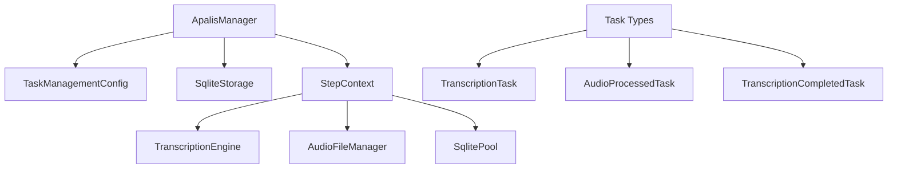
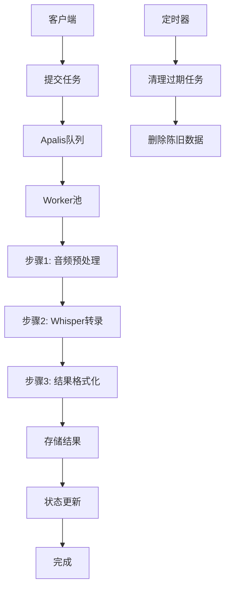
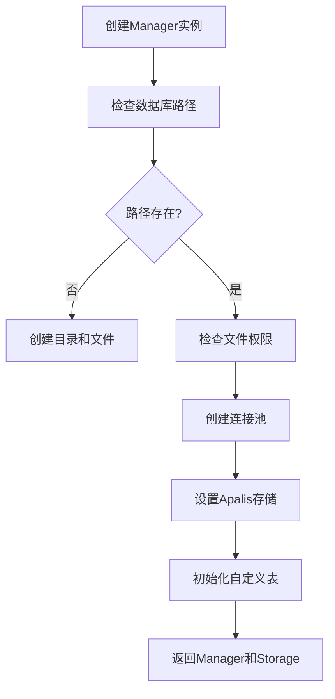
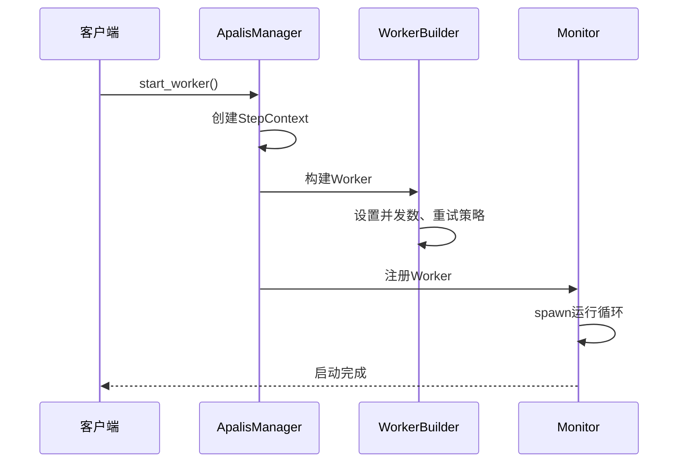
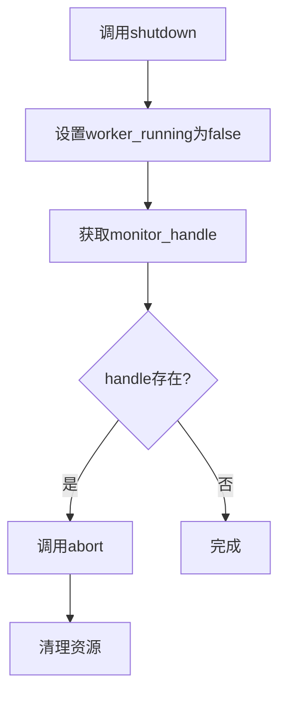
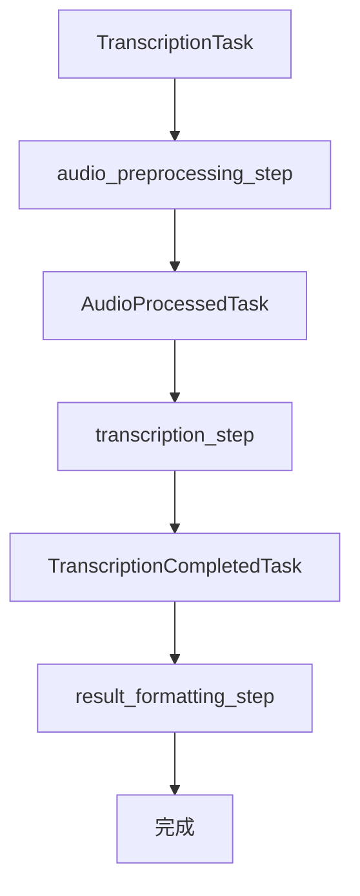
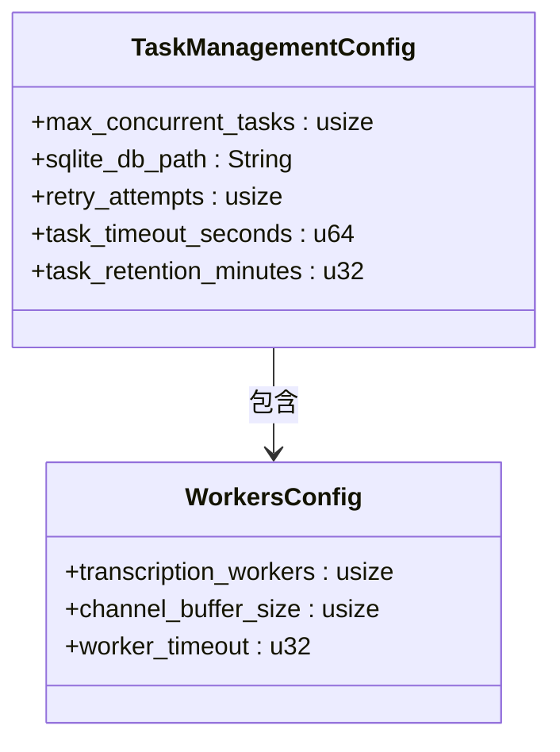
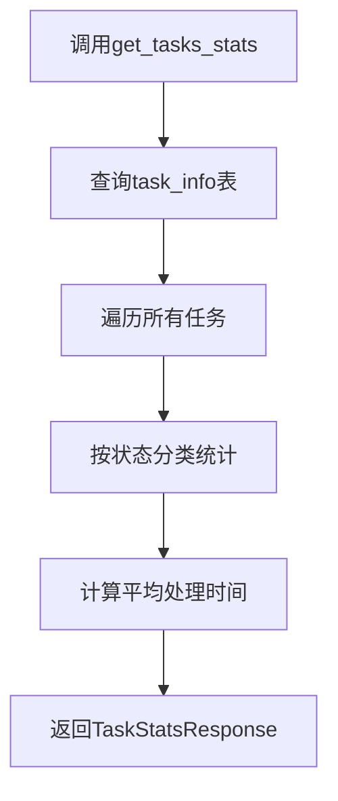
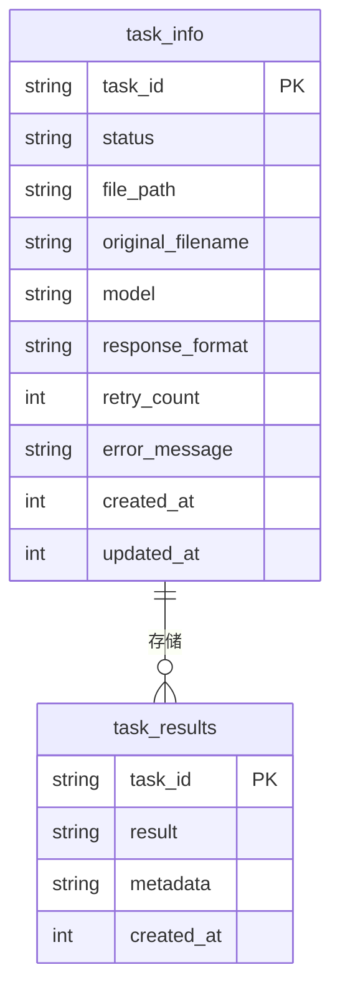
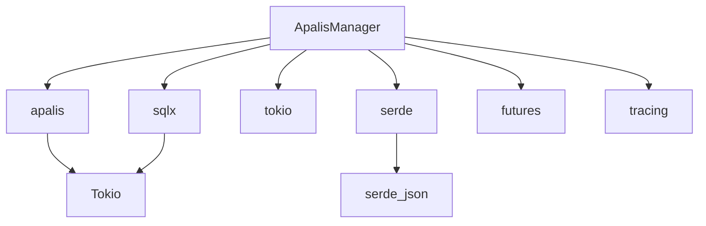

# Apalis任务队列集成

<cite>
**本文档引用的文件**   
- [apalis_manager.rs](file://voice-cli/src/services/apalis_manager.rs)
- [config.rs](file://voice-cli/src/models/config.rs)
</cite>

## 目录
1. [介绍](#介绍)
2. [项目结构](#项目结构)
3. [核心组件](#核心组件)
4. [架构概述](#架构概述)
5. [详细组件分析](#详细组件分析)
6. [依赖分析](#依赖分析)
7. [性能考虑](#性能考虑)
8. [故障排除指南](#故障排除指南)
9. [结论](#结论)
10. [附录](#附录)（如有必要）

## 介绍
本文档详细说明了ApalisManager如何初始化和配置Apalis任务调度器，支持内存存储和Redis后端两种模式。解释了调度器的启动、关闭生命周期管理，以及与Tokio运行时的集成方式。描述了任务处理器（worker）的注册机制和并发执行模型。结合实际代码展示了如何定义任务处理函数、设置最大并发数和超时时间。说明了健康检查机制如何监控队列状态，以及在部署环境中如何配置持久化存储以保证任务可靠性。

## 项目结构
项目结构中，Apalis任务队列的核心实现位于`voice-cli/src/services/apalis_manager.rs`文件中，配置管理位于`voice-cli/src/models/config.rs`。任务管理器通过SQLite存储任务状态和结果，实现了完整的任务生命周期管理。



**图示来源**
- [apalis_manager.rs](file://voice-cli/src/services/apalis_manager.rs#L0-L1782)

**本节来源**
- [apalis_manager.rs](file://voice-cli/src/services/apalis_manager.rs#L0-L1782)
- [config.rs](file://voice-cli/src/models/config.rs#L0-L720)

## 核心组件
核心组件包括`LockFreeApalisManager`用于管理任务调度，`TaskManagementConfig`用于配置任务参数，以及`TranscriptionTask`系列结构体用于表示任务的不同阶段。管理器通过`init_global_lock_free_apalis_manager`函数初始化全局实例，确保在整个应用生命周期内任务队列的统一管理。

**本节来源**
- [apalis_manager.rs](file://voice-cli/src/services/apalis_manager.rs#L0-L1782)
- [config.rs](file://voice-cli/src/models/config.rs#L0-L720)

## 架构概述
系统采用三层流水线架构处理转录任务：音频预处理、Whisper转录和结果格式化。任务通过Apalis框架在Tokio运行时中并发执行，每个任务的状态通过SQLite数据库持久化存储。整个架构支持优雅关闭和定时清理过期任务。



**图示来源**
- [apalis_manager.rs](file://voice-cli/src/services/apalis_manager.rs#L0-L1782)

## 详细组件分析

### ApalisManager初始化与配置
`LockFreeApalisManager`通过`new`异步方法初始化，接收`TaskManagementConfig`和`ModelService`作为参数。初始化过程包括创建SQLite数据库连接池、设置Apalis存储、初始化自定义数据表等步骤。配置参数从`TaskManagementConfig`结构体获取，包括最大并发任务数、SQLite数据库路径、重试次数等。

#### 初始化流程


**图示来源**
- [apalis_manager.rs](file://voice-cli/src/services/apalis_manager.rs#L0-L1782)

#### 配置参数
| 配置项 | 默认值 | 描述 |
|--------|--------|------|
| max_concurrent_tasks | 4 | 最大并发任务数 |
| sqlite_db_path | ./data/tasks.db | SQLite数据库路径 |
| retry_attempts | 2 | 任务重试次数 |
| task_timeout_seconds | 3600 | 任务超时时间（秒） |
| task_retention_minutes | 1440 | 任务保留时间（分钟） |

**本节来源**
- [apalis_manager.rs](file://voice-cli/src/services/apalis_manager.rs#L0-L1782)
- [config.rs](file://voice-cli/src/models/config.rs#L0-L720)

### 调度器生命周期管理
调度器的生命周期通过`start_worker`和`shutdown`方法管理。`start_worker`方法启动任务处理循环，`shutdown`方法实现优雅关闭。调度器与Tokio运行时集成，通过`tokio::spawn`在后台运行监控器。

#### 启动流程


**图示来源**
- [apalis_manager.rs](file://voice-cli/src/services/apalis_manager.rs#L0-L1782)

#### 关闭流程


**本节来源**
- [apalis_manager.rs](file://voice-cli/src/services/apalis_manager.rs#L0-L1782)

### 任务处理器注册与并发模型
任务处理器通过`WorkerBuilder`注册，使用`build_fn`指定任务处理函数。并发模型通过`concurrency`方法设置最大并发数，由Apalis框架自动管理任务的分发和执行。

#### 任务处理流水线


**图示来源**
- [apalis_manager.rs](file://voice-cli/src/services/apalis_manager.rs#L0-L1782)

### 任务定义与参数配置
任务处理函数定义在`transcription_pipeline_worker`中，该函数协调三个步骤的执行。最大并发数和超时时间通过配置设置。

#### 任务参数配置


**图示来源**
- [config.rs](file://voice-cli/src/models/config.rs#L0-L720)

**本节来源**
- [apalis_manager.rs](file://voice-cli/src/services/apalis_manager.rs#L0-L1782)
- [config.rs](file://voice-cli/src/models/config.rs#L0-L720)

### 健康检查与队列监控
健康检查通过`get_tasks_stats`方法实现，该方法查询数据库获取任务统计信息，包括各种状态的任务数量和平均处理时间。

#### 健康检查流程


**图示来源**
- [apalis_manager.rs](file://voice-cli/src/services/apalis_manager.rs#L0-L1782)

### 持久化存储配置
持久化存储通过SQLite实现，配置了两个自定义表：`task_info`存储任务状态，`task_results`存储任务结果。任务数据在提交时持久化，在处理过程中更新状态，在完成时存储结果。

#### 数据库表结构


**图示来源**
- [apalis_manager.rs](file://voice-cli/src/services/apalis_manager.rs#L0-L1782)

**本节来源**
- [apalis_manager.rs](file://voice-cli/src/services/apalis_manager.rs#L0-L1782)

## 依赖分析
系统依赖于多个外部库，包括`apalis`用于任务调度，`sqlx`用于数据库操作，`tokio`用于异步运行时，`serde`用于序列化等。这些依赖通过Cargo.toml管理，确保版本兼容性。



**图示来源**
- [apalis_manager.rs](file://voice-cli/src/services/apalis_manager.rs#L0-L1782)

**本节来源**
- [apalis_manager.rs](file://voice-cli/src/services/apalis_manager.rs#L0-L1782)

## 性能考虑
系统在设计时考虑了多项性能优化：使用连接池减少数据库连接开销，通过并发处理提高吞吐量，实现定时清理避免数据无限增长。最大并发数可根据系统资源调整，超时设置防止任务无限期挂起。

## 故障排除指南
常见问题包括数据库连接失败、任务处理超时、文件权限问题等。日志记录在`./logs`目录，可通过`get_task_status`和`get_tasks_stats`方法诊断任务状态。

**本节来源**
- [apalis_manager.rs](file://voice-cli/src/services/apalis_manager.rs#L0-L1782)
- [config.rs](file://voice-cli/src/models/config.rs#L0-L720)

## 结论
Apalis任务队列集成提供了一个健壮的任务调度系统，支持完整的任务生命周期管理。通过合理的架构设计和配置选项，系统能够可靠地处理转录任务，同时提供监控和维护功能。

## 附录
配置文件`config.yml`中的相关配置示例：
```yaml
task_management:
  max_concurrent_tasks: 4
  sqlite_db_path: "./data/tasks.db"
  retry_attempts: 2
  task_timeout_seconds: 3600
  task_retention_minutes: 1440
  sled_db_path: "./data/sled"
```