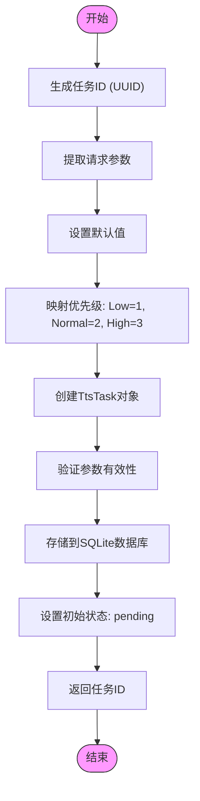
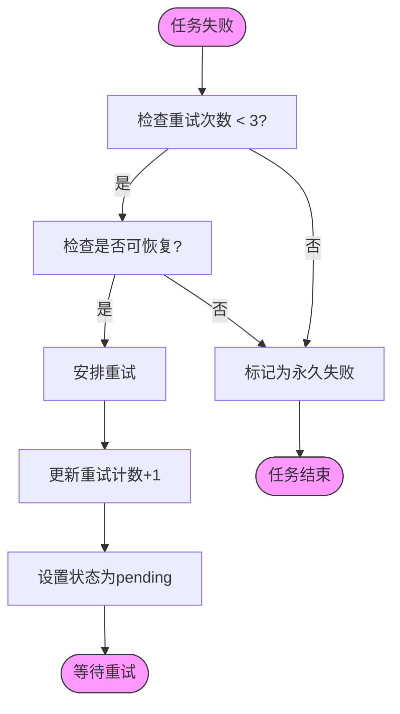
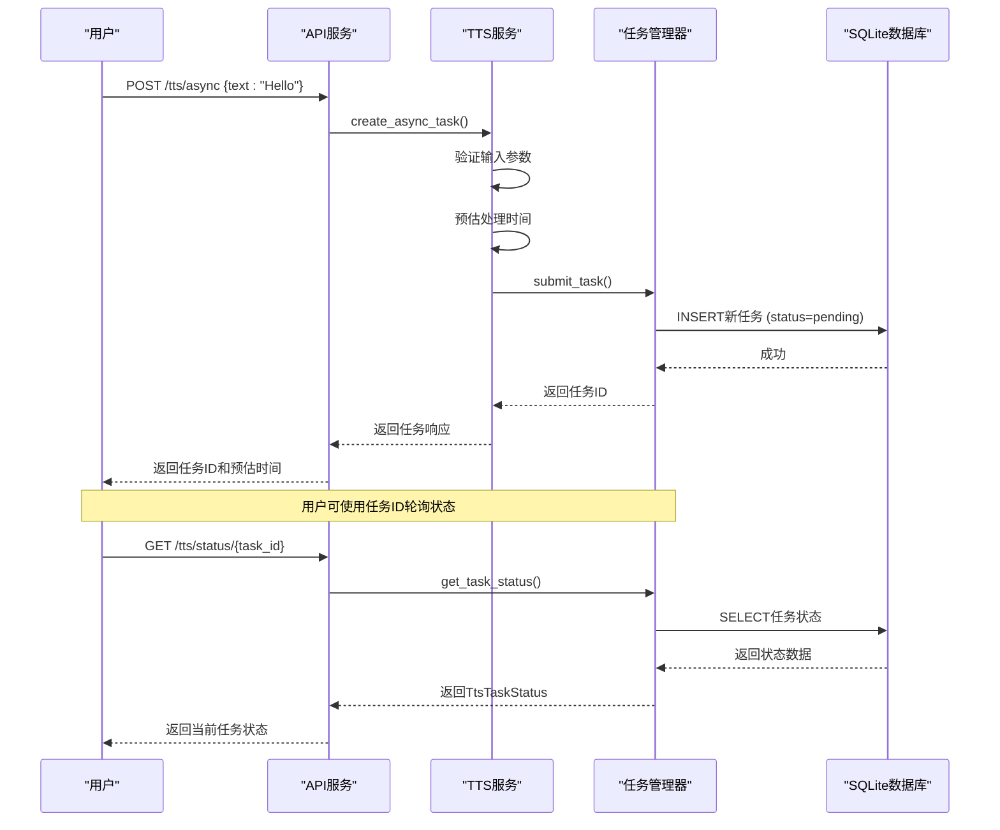

# TTS任务管理器实现

<cite>
**本文档中引用的文件**
- [tts_task_manager.rs](file://voice-cli/src/services/tts_task_manager.rs)
- [tts.rs](file://voice-cli/src/models/tts.rs)
- [tts_service.rs](file://voice-cli/src/services/tts_service.rs)
</cite>

## 目录
1. [简介](#简介)
2. [核心组件](#核心组件)
3. [任务提交与参数处理](#任务提交与参数处理)
4. [任务状态管理](#任务状态管理)
5. [重试机制与错误处理](#重试机制与错误处理)
6. [任务取消与资源清理](#任务取消与资源清理)
7. [系统集成与使用示例](#系统集成与使用示例)

## 简介
TTS任务管理器是语音合成系统的核心组件，负责管理异步语音合成任务的全生命周期。该系统基于Apalis任务队列框架构建，通过SQLite存储实现任务的持久化管理。任务管理器提供了任务提交、状态追踪、优先级调度、错误恢复等关键功能，确保语音合成服务的稳定性和可靠性。

**Section sources**
- [tts_task_manager.rs](file://voice-cli/src/services/tts_task_manager.rs#L1-L50)

## 核心组件

TTS任务管理器的核心由三个主要部分组成：任务实体定义、状态枚举和管理器实现。`TtsTask`结构体封装了任务的所有参数，包括文本内容、语音模型、语速、音调、音量、格式和优先级等。`TtsTaskStatus`枚举定义了任务的完整生命周期状态，从待处理到处理中、完成、失败和取消。`TtsTaskManager`类提供了任务管理的核心方法，包括任务提交、状态查询、更新和统计功能。

```mermaid
classDiagram
class TtsTask {
+task_id : String
+text : String
+model : Option<String>
+speed : f32
+pitch : i32
+volume : f32
+format : String
+created_at : DateTime<Utc>
+priority : u32
}
class TtsTaskStatus {
+Pending{queued_at : DateTime<Utc>}
+Processing{stage : TtsProcessingStage, started_at : DateTime<Utc>, progress_details : Option<TtsProgressDetails>}
+Completed{completed_at : DateTime<Utc>, processing_time : chrono : : Duration, audio_file_path : String, file_size : u64, duration_seconds : f32}
+Failed{error : TtsTaskError, failed_at : DateTime<Utc>, retry_count : u32, is_recoverable : bool}
+Cancelled{cancelled_at : DateTime<Utc>, reason : Option<String>}
}
class TtsTaskManager {
-storage : Arc<RwLock<SqliteStorage<TtsTask>>>
-max_concurrent_tasks : usize
+new(database_url : &str, max_concurrent_tasks : usize) Result<Self, VoiceCliError>
+submit_task(request : TtsAsyncRequest) Result<String, VoiceCliError>
+get_task_status(task_id : &str) Result<Option<TtsTaskStatus>, VoiceCliError>
+update_task_status(task_id : &str, status : TtsTaskStatus) Result<(), VoiceCliError>
+get_stats() Result<TtsTaskStats, VoiceCliError>
}
TtsTaskManager --> TtsTask : "管理"
TtsTaskManager --> TtsTaskStatus : "更新状态"
```

**Diagram sources**
- [tts_task_manager.rs](file://voice-cli/src/services/tts_task_manager.rs#L30-L45)
- [tts.rs](file://voice-cli/src/models/tts.rs#L100-L150)

**Section sources**
- [tts_task_manager.rs](file://voice-cli/src/services/tts_task_manager.rs#L30-L200)
- [tts.rs](file://voice-cli/src/models/tts.rs#L10-L187)

## 任务提交与参数处理

任务提交流程始于`submit_task`方法的调用。系统首先生成唯一的任务ID，然后从`TtsAsyncRequest`请求对象中提取参数并进行默认值填充。文本内容是必填项，其他参数如模型、语速、音调、音量和格式都有合理的默认值。特别地，任务优先级通过映射`TaskPriority`枚举来确定，低优先级对应数值1，正常优先级对应2，高优先级对应3。所有任务参数被封装为`TtsTask`对象后，持久化存储到SQLite数据库中，初始状态设置为"pending"。



**Diagram sources**
- [tts_task_manager.rs](file://voice-cli/src/services/tts_task_manager.rs#L99-L166)
- [tts.rs](file://voice-cli/src/models/tts.rs#L50-L80)

**Section sources**
- [tts_task_manager.rs](file://voice-cli/src/services/tts_task_manager.rs#L99-L166)
- [tts.rs](file://voice-cli/src/models/tts.rs#L50-L80)

## 任务状态管理

任务状态追踪机制通过`get_task_status`和`update_task_status`方法实现。系统维护五种主要状态：待处理(pending)、处理中(processing)、已完成(completed)、已失败(failed)和已取消(cancelled)。状态查询时，系统从数据库获取原始数据并转换为相应的`TtsTaskStatus`枚举实例。状态更新时，系统将枚举值反向映射为字符串状态码，并更新数据库记录。处理中状态包含详细的进度信息，包括当前处理阶段、阶段进度和预估剩余时间，为用户提供实时反馈。

```mermaid
stateDiagram-v2
[*] --> Pending
Pending --> Processing : "开始处理"
Processing --> Completed : "成功完成"
Processing --> Failed : "处理失败"
Processing --> Cancelled : "用户取消"
Failed --> Processing : "重试"
Failed --> Cancelled : "放弃重试"
Completed --> [*]
Cancelled --> [*]
state Pending {
[*] --> Queued
note right
等待处理
记录排队时间
end note
}
state Processing {
[*] --> TextPreprocessing
TextPreprocessing --> VoiceSynthesis
VoiceSynthesis --> AudioPostProcessing
AudioPostProcessing --> ResultFormatting
note right
包含详细进度信息
可追踪各阶段耗时
end note
}
state Completed {
note right
记录完成时间
存储结果文件路径
记录音频时长
end note
}
state Failed {
note right
记录失败时间
存储错误信息
跟踪重试次数
end note
}
state Cancelled {
note right
记录取消时间
可选取消原因
end note
}
```

**Diagram sources**
- [tts_task_manager.rs](file://voice-cli/src/services/tts_task_manager.rs#L168-L246)
- [tts.rs](file://voice-cli/src/models/tts.rs#L100-L150)

**Section sources**
- [tts_task_manager.rs](file://voice-cli/src/services/tts_task_manager.rs#L168-L246)
- [tts.rs](file://voice-cli/src/models/tts.rs#L70-L150)

## 重试机制与错误处理

系统实现了基于数据库字段的重试机制。每个任务记录包含`retry_count`字段，用于跟踪重试次数。当任务失败时，系统根据错误类型判断是否可恢复，并在`TtsTaskStatus::Failed`状态中反映`is_recoverable`标志。虽然当前代码显示了重试计数的存储和查询逻辑，但实际的重试调度逻辑在`start_worker`方法中被标记为待实现(TODO)。错误处理通过`TtsTaskError`枚举实现，区分了文本处理失败、合成失败、音频处理失败、存储错误、超时错误和取消请求等多种错误类型，并为每种错误提供了可恢复性判断。



**Diagram sources**
- [tts_task_manager.rs](file://voice-cli/src/services/tts_task_manager.rs#L210-L246)
- [tts.rs](file://voice-cli/src/models/tts.rs#L120-L150)

**Section sources**
- [tts_task_manager.rs](file://voice-cli/src/services/tts_task_manager.rs#L210-L246)
- [tts.rs](file://voice-cli/src/models/tts.rs#L120-L150)

## 任务取消与资源清理

任务取消机制通过将任务状态更新为"cancelled"来实现。`update_task_status`方法支持`TtsTaskStatus::Cancelled`状态的更新，记录取消时间和可选原因。虽然当前实现提供了状态更新功能，但完整的资源清理逻辑需要在任务处理器中实现。系统设计考虑了资源管理，通过`max_concurrent_tasks`参数限制并发任务数量，防止资源耗尽。当任务被取消时，相关的临时文件和内存资源应被及时释放，但具体的清理逻辑在现有代码中尚未完全实现。

**Section sources**
- [tts_task_manager.rs](file://voice-cli/src/services/tts_task_manager.rs#L248-L273)

## 系统集成与使用示例

TTS任务管理器与其他系统组件紧密集成。`TtsService`类负责接收用户请求并创建异步任务，虽然当前实现中任务提交到`TtsTaskManager`的部分被标记为TODO，但整体流程已经设计完成。用户通过API提交文本合成请求，系统返回任务ID，然后可以通过任务ID查询处理进度。这种异步模式提高了系统的响应性和可扩展性，允许长时间运行的任务在后台处理，同时保持API的快速响应。



**Diagram sources**
- [tts_service.rs](file://voice-cli/src/services/tts_service.rs#L177-L205)
- [tts_task_manager.rs](file://voice-cli/src/services/tts_task_manager.rs#L124-L166)

**Section sources**
- [tts_service.rs](file://voice-cli/src/services/tts_service.rs#L177-L205)
- [tts_task_manager.rs](file://voice-cli/src/services/tts_task_manager.rs#L124-L166)