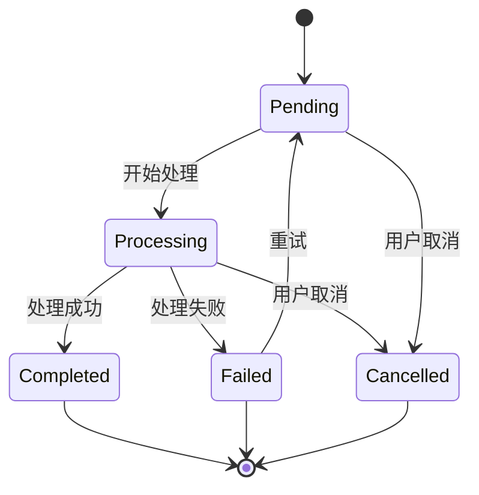
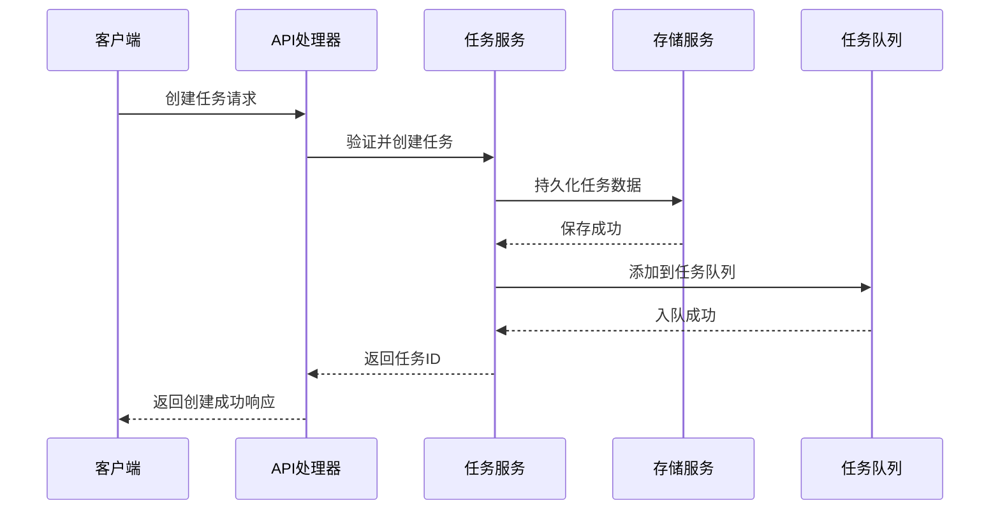
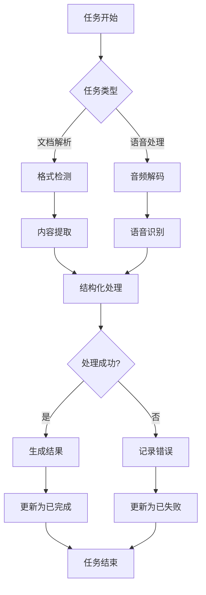
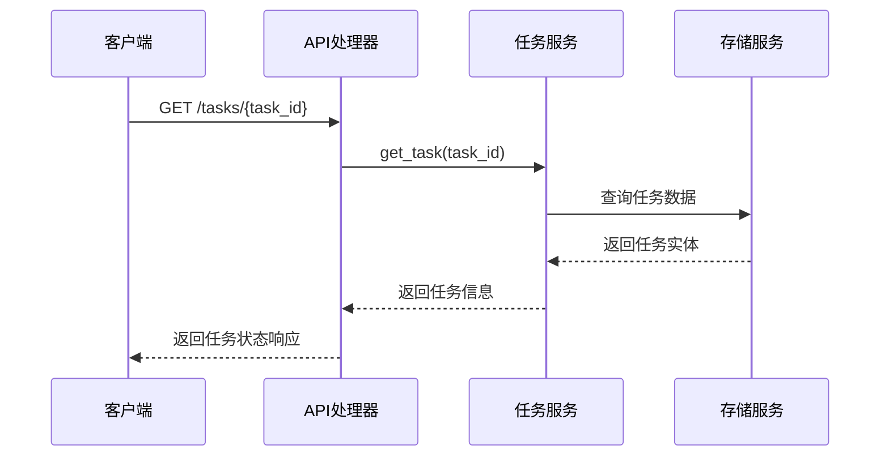
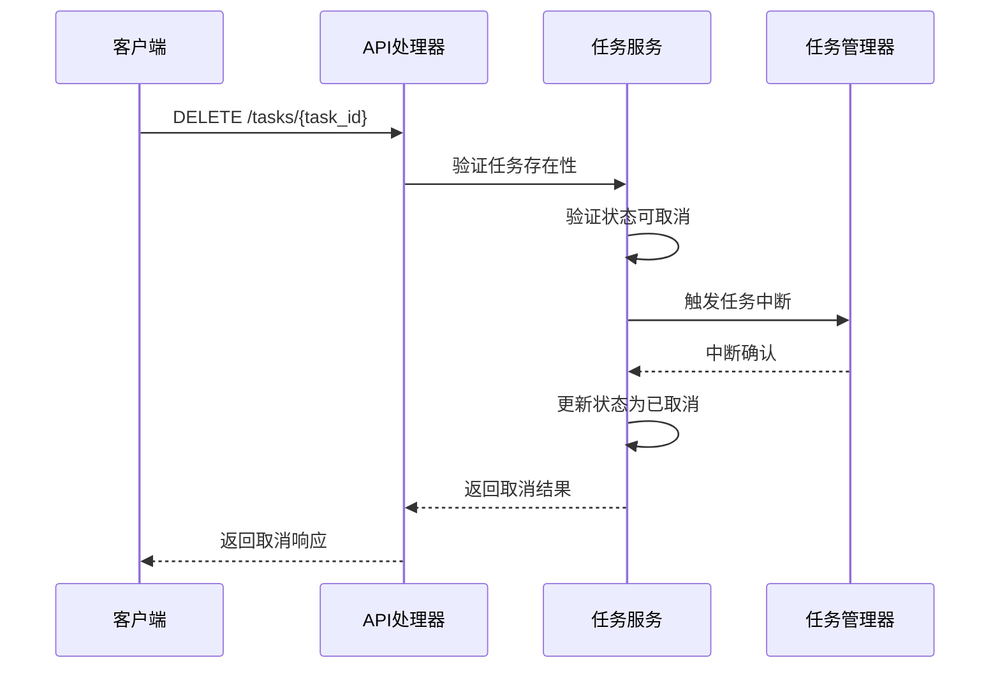
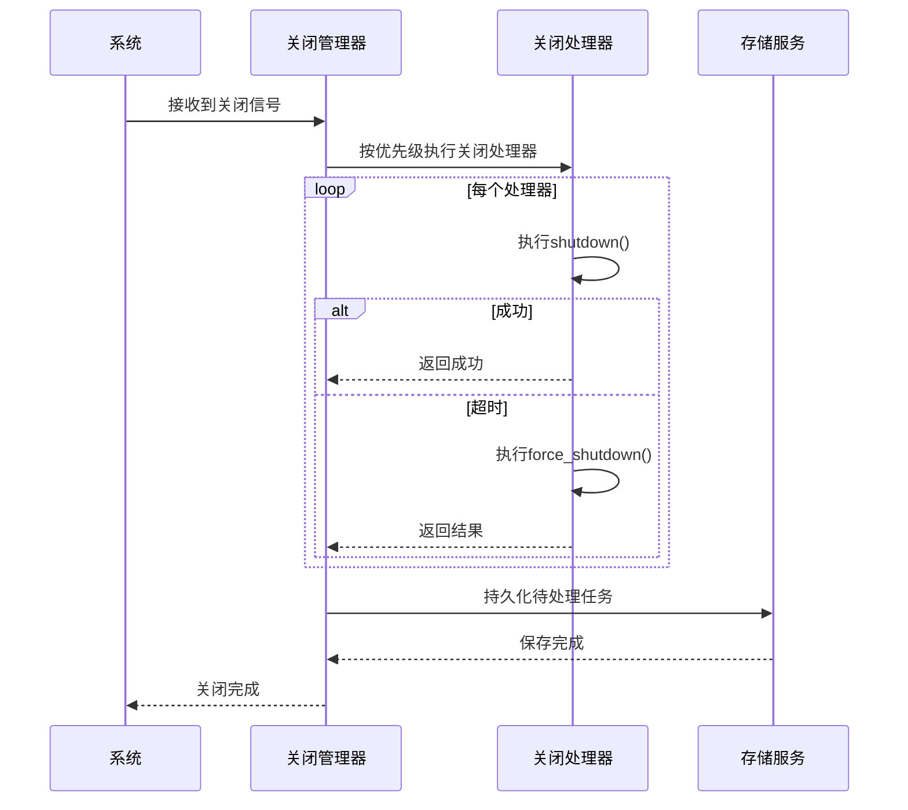
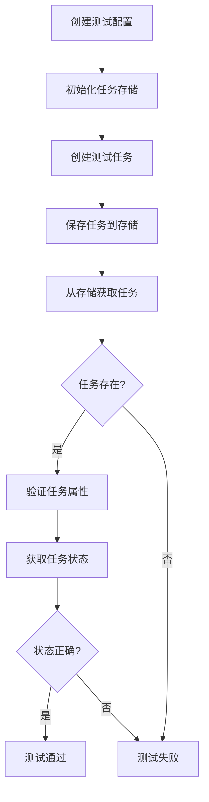

# 任务生命周期管理

<cite>
**本文档引用的文件**
- [task_management_integration_tests.rs](file://voice-cli/src/tests/task_management_integration_tests.rs)
- [task_status.rs](file://document-parser/src/models/task_status.rs)
- [graceful_shutdown.rs](file://document-parser/src/production/graceful_shutdown.rs)
- [task_service.rs](file://document-parser/src/services/task_service.rs)
- [storage_service.rs](file://document-parser/src/services/storage_service.rs)
- [task_handler.rs](file://document-parser/src/handlers/task_handler.rs)
- [apalis_manager.rs](file://voice-cli/src/services/apalis_manager.rs)
- [config.rs](file://voice-cli/src/config.rs)
</cite>

## 目录
1. [简介](#简介)
2. [任务生命周期概述](#任务生命周期概述)
3. [任务创建与调度](#任务创建与调度)
4. [任务执行与状态管理](#任务执行与状态管理)
5. [任务查询与监控](#任务查询与监控)
6. [任务取消与中断](#任务取消与中断)
7. [优雅关闭与持久化](#优雅关闭与持久化)
8. [测试用例分析](#测试用例分析)
9. [结论](#结论)

## 简介
本文档系统性地描述语音CLI系统中任务的完整生命周期，涵盖从创建、调度、执行到终止的全过程。通过分析核心组件和测试用例，详细说明任务管理的各个阶段，包括API调用方式、状态查询机制、取消处理流程以及系统重启时的任务恢复策略。

**Section sources**
- [task_management_integration_tests.rs](file://voice-cli/src/tests/task_management_integration_tests.rs)
- [task_status.rs](file://document-parser/src/models/task_status.rs)

## 任务生命周期概述
语音CLI系统中的任务生命周期包含五个主要状态：待处理（Pending）、处理中（Processing）、已完成（Completed）、已失败（Failed）和已取消（Cancelled）。任务从创建开始，经过调度进入执行阶段，最终达到某个终态。系统通过状态机严格管理状态转换，确保任务状态的一致性和合法性。

**Diagram sources**
- [task_status.rs](file://document-parser/src/models/task_status.rs#L228-L278)

**Section sources**
- [task_status.rs](file://document-parser/src/models/task_status.rs#L228-L278)

## 任务创建与调度
任务创建通过API接口触发，系统首先验证输入参数，然后创建任务实体并持久化。新创建的任务初始状态为"待处理"，并被加入任务队列等待调度。调度器根据系统配置的并发限制和优先级策略决定何时执行任务。

任务调度配置包括最大并发任务数、重试次数、任务超时时间等参数，这些参数在系统配置文件中定义，并在运行时加载。

**Diagram sources**
- [task_service.rs](file://document-parser/src/services/task_service.rs#L51-L87)
- [storage_service.rs](file://document-parser/src/services/storage_service.rs#L191-L233)

**Section sources**
- [task_service.rs](file://document-parser/src/services/task_service.rs#L51-L87)
- [storage_service.rs](file://document-parser/src/services/storage_service.rs#L191-L233)

## 任务执行与状态管理
任务执行由任务处理器负责，系统通过状态管理机制跟踪任务的执行进度。任务状态的转换必须遵循预定义的规则，确保状态转换的合法性。处理中的任务可以更新进度详情，已完成的任务可以设置结果摘要。

任务状态管理的关键方法包括：
- `new_pending()`: 创建待处理状态
- `new_processing()`: 创建处理中状态
- `new_completed()`: 创建已完成状态
- `new_failed()`: 创建已失败状态
- `new_cancelled()`: 创建已取消状态

**Diagram sources**
- [task_status.rs](file://document-parser/src/models/task_status.rs#L228-L278)
- [task_service.rs](file://document-parser/src/services/task_service.rs#L511-L524)

**Section sources**
- [task_status.rs](file://document-parser/src/models/task_status.rs#L228-L278)
- [task_service.rs](file://document-parser/src/services/task_service.rs#L511-L524)

## 任务查询与监控
系统提供多种方式查询任务状态和获取执行进度。客户端可以通过任务ID查询当前状态，获取任务的创建时间、更新时间、当前状态和进度信息。系统还提供统计接口，返回各状态任务的数量和平均处理时间等指标。

任务状态查询响应包含简化状态枚举（SimpleTaskStatus），包括Pending、Processing、Completed、Failed和Cancelled五种状态，便于客户端处理。

**Diagram sources**
- [task_handler.rs](file://document-parser/src/handlers/task_handler.rs#L262-L294)
- [task_service.rs](file://document-parser/src/services/task_service.rs#L51-L87)

**Section sources**
- [task_handler.rs](file://document-parser/src/handlers/task_handler.rs#L262-L294)
- [task_service.rs](file://document-parser/src/services/task_service.rs#L51-L87)

## 任务取消与中断
任务取消请求的处理流程包括验证任务状态、更新任务状态和中断正在执行的任务。只有非终态的任务才能被取消，已完成的任务不能取消。系统通过验证状态转换的合法性来确保取消操作的正确性。

对于正在运行的任务，系统会触发中断机制，确保资源得到及时释放。取消操作会记录取消原因，并更新任务的取消时间。

**Diagram sources**
- [task_handler.rs](file://document-parser/src/handlers/task_handler.rs#L414-L460)
- [document_task.rs](file://document-parser/src/models/document_task.rs#L294-L336)

**Section sources**
- [task_handler.rs](file://document-parser/src/handlers/task_handler.rs#L414-L460)
- [document_task.rs](file://document-parser/src/models/document_task.rs#L294-L336)

## 优雅关闭与持久化
系统在优雅关闭时会执行待处理任务的持久化方案，确保系统重启后能恢复执行。优雅关闭管理器按优先级顺序执行关闭处理器，等待当前任务完成，然后保存任务状态到持久化存储。

持久化策略包括：
- 将内存中的任务状态写入数据库
- 保存任务队列的当前状态
- 记录待处理任务的上下文信息
- 确保所有资源得到正确清理

**Diagram sources**
- [graceful_shutdown.rs](file://document-parser/src/production/graceful_shutdown.rs#L0-L36)
- [storage_service.rs](file://document-parser/src/services/storage_service.rs#L191-L233)

**Section sources**
- [graceful_shutdown.rs](file://document-parser/src/production/graceful_shutdown.rs#L0-L36)
- [storage_service.rs](file://document-parser/src/services/storage_service.rs#L191-L233)

## 测试用例分析
通过分析`task_management_integration_tests.rs`中的测试用例，可以了解任务创建API的调用方式与预期响应。测试用例验证了任务存储的CRUD操作，包括创建、读取、更新和删除任务的完整流程。

测试配置包括最大并发任务数、重试次数、任务超时时间等关键参数，这些参数在集成测试中被设置为特定值以验证系统行为。

**Diagram sources**
- [task_management_integration_tests.rs](file://voice-cli/src/tests/task_management_integration_tests.rs#L0-L56)

**Section sources**
- [task_management_integration_tests.rs](file://voice-cli/src/tests/task_management_integration_tests.rs#L0-L56)

## 结论
语音CLI系统的任务生命周期管理机制设计完善，涵盖了从创建到终止的完整流程。系统通过严格的状态管理、可靠的持久化策略和优雅的关闭机制，确保了任务处理的可靠性和一致性。通过API接口和测试用例的验证，证明了系统在各种场景下的稳定性和正确性。