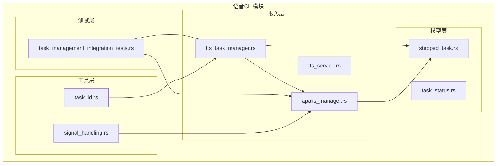
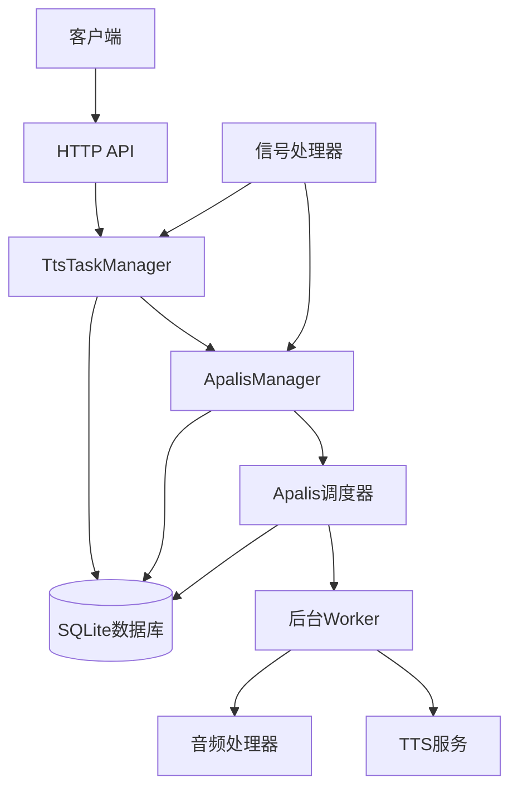
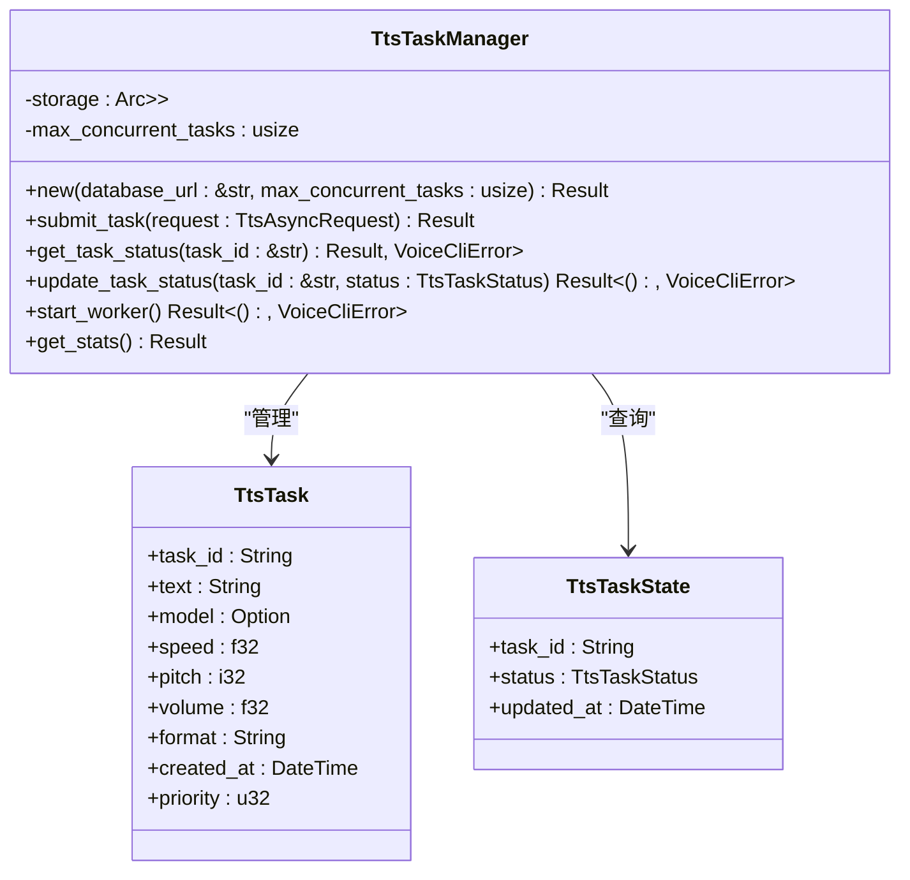
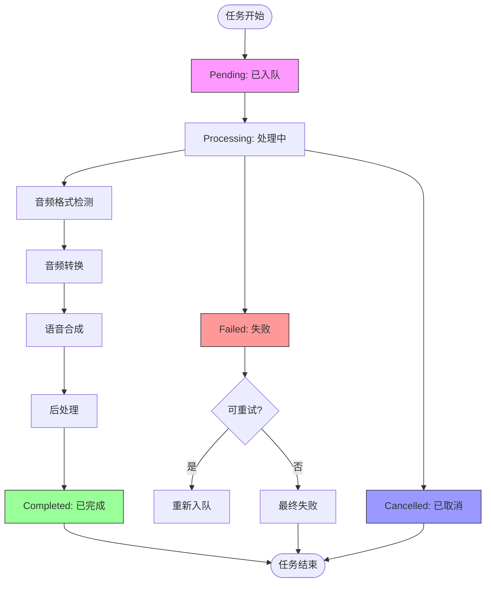
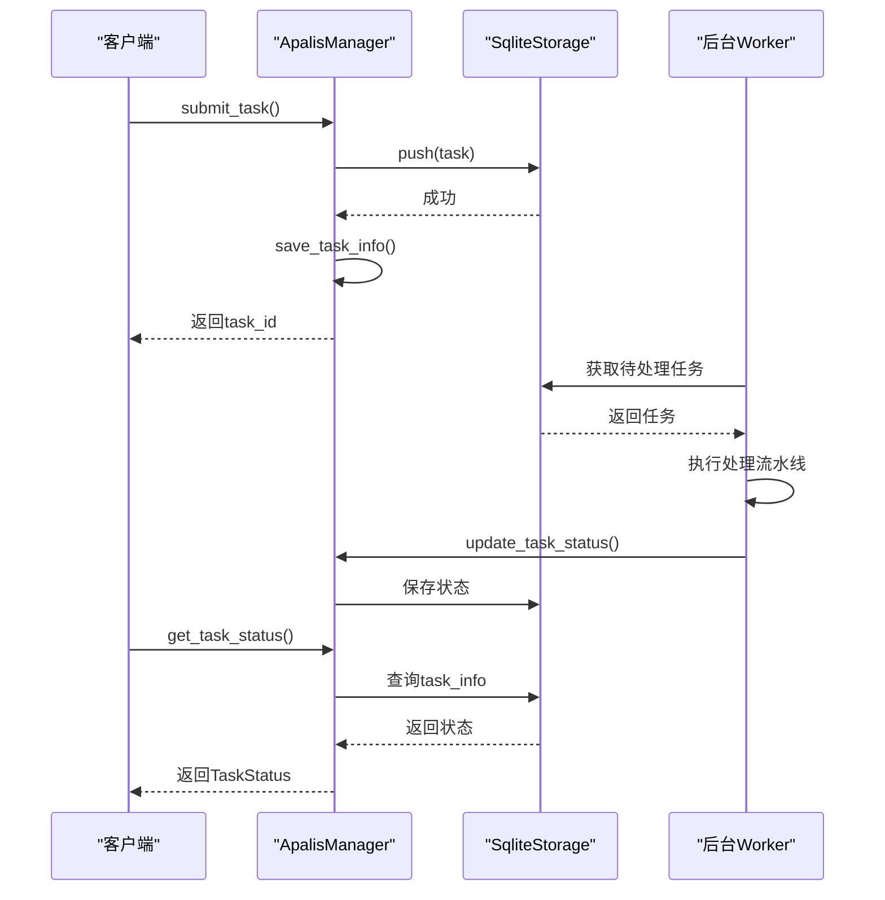
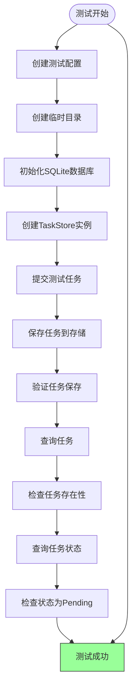
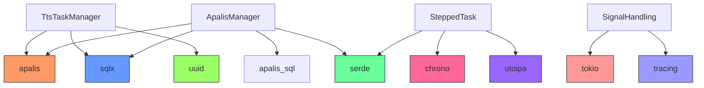

# 任务调度与管理

<cite>
**本文档中引用的文件**
- [tts_task_manager.rs](file://voice-cli/src/services/tts_task_manager.rs)
- [stepped_task.rs](file://voice-cli/src/models/stepped_task.rs)
- [apalis_manager.rs](file://voice-cli/src/services/apalis_manager.rs)
- [task_management_integration_tests.rs](file://voice-cli/src/tests/task_management_integration_tests.rs)
- [task_id.rs](file://voice-cli/src/utils/task_id.rs)
- [signal_handling.rs](file://voice-cli/src/utils/signal_handling.rs)
</cite>

## 目录
1. [简介](#简介)
2. [项目结构](#项目结构)
3. [核心组件](#核心组件)
4. [架构概述](#架构概述)
5. [详细组件分析](#详细组件分析)
6. [依赖分析](#依赖分析)
7. [性能考虑](#性能考虑)
8. [故障排除指南](#故障排除指南)
9. [结论](#结论)

## 简介
本文档详细说明了语音合成（TTS）任务管理系统如何利用Apalis任务队列实现异步处理、状态追踪与重试机制。系统通过`TtsTaskManager`封装任务提交与查询，使用`SteppedTask`模型表示多阶段处理流程，并通过`ApalisManager`初始化内存或Redis后端的任务调度器。结合集成测试用例，展示了任务创建、查询与取消的完整生命周期。同时，文档还解释了任务ID生成策略与信号处理机制在服务优雅关闭中的关键作用。

## 项目结构
语音CLI模块的结构围绕任务管理、模型服务、音频处理和异步调度构建。核心功能位于`services`和`models`目录下，测试用例验证了任务管理的集成行为。

**Diagram sources**
- [tts_task_manager.rs](file://voice-cli/src/services/tts_task_manager.rs#L1-L50)
- [apalis_manager.rs](file://voice-cli/src/services/apalis_manager.rs#L1-L50)
- [stepped_task.rs](file://voice-cli/src/models/stepped_task.rs#L1-L50)
- [task_management_integration_tests.rs](file://voice-cli/src/tests/task_management_integration_tests.rs#L1-L10)

**Section sources**
- [tts_task_manager.rs](file://voice-cli/src/services/tts_task_manager.rs#L1-L50)
- [apalis_manager.rs](file://voice-cli/src/services/apalis_manager.rs#L1-L50)
- [stepped_task.rs](file://voice-cli/src/models/stepped_task.rs#L1-L50)
- [task_management_integration_tests.rs](file://voice-cli/src/tests/task_management_integration_tests.rs#L1-L10)

## 核心组件
系统的核心组件包括`TtsTaskManager`用于管理TTS任务的生命周期，`ApalisManager`负责与Apalis调度框架的集成，以及`SteppedTask`模型用于表示多阶段任务的状态流转。这些组件共同实现了异步语音合成任务的可靠处理。

**Section sources**
- [tts_task_manager.rs](file://voice-cli/src/services/tts_task_manager.rs#L1-L50)
- [apalis_manager.rs](file://voice-cli/src/services/apalis_manager.rs#L1-L50)
- [stepped_task.rs](file://voice-cli/src/models/stepped_task.rs#L1-L50)

## 架构概述
系统采用分层架构，上层服务通过封装Apalis任务队列实现异步处理。任务状态持久化到SQLite数据库，支持故障恢复与状态查询。信号处理机制确保服务可以优雅关闭，避免任务丢失。

**Diagram sources**
- [tts_task_manager.rs](file://voice-cli/src/services/tts_task_manager.rs#L1-L50)
- [apalis_manager.rs](file://voice-cli/src/services/apalis_manager.rs#L1-L50)
- [signal_handling.rs](file://voice-cli/src/utils/signal_handling.rs#L1-L20)

## 详细组件分析

### TtsTaskManager分析
`TtsTaskManager`是TTS任务的核心管理器，负责任务的提交、状态查询与更新。它使用SQLite作为持久化存储，确保任务状态在服务重启后依然可恢复。

#### 对于对象导向组件：

**Diagram sources**
- [tts_task_manager.rs](file://voice-cli/src/services/tts_task_manager.rs#L1-L355)

**Section sources**
- [tts_task_manager.rs](file://voice-cli/src/services/tts_task_manager.rs#L1-L355)

### SteppedTask模型分析
`SteppedTask`模型定义了多阶段任务的状态机，支持从文本预处理到语音合成再到后处理的完整流程。每个阶段都有明确的状态表示和进度追踪。

#### 对于复杂逻辑组件：

**Diagram sources**
- [stepped_task.rs](file://voice-cli/src/models/stepped_task.rs#L1-L417)

**Section sources**
- [stepped_task.rs](file://voice-cli/src/models/stepped_task.rs#L1-L417)

### ApalisManager分析
`ApalisManager`负责初始化和管理Apalis任务调度器，支持内存和Redis后端。它提供了任务提交、状态查询、取消和重试的完整API。

#### 对于API/服务组件：

**Diagram sources**
- [apalis_manager.rs](file://voice-cli/src/services/apalis_manager.rs#L1-L1782)

**Section sources**
- [apalis_manager.rs](file://voice-cli/src/services/apalis_manager.rs#L1-L1782)

### 任务管理集成测试分析
集成测试验证了任务管理系统的完整工作流，包括任务创建、状态查询和取消操作。测试使用临时数据库确保隔离性。

#### 对于复杂逻辑组件：

**Diagram sources**
- [task_management_integration_tests.rs](file://voice-cli/src/tests/task_management_integration_tests.rs#L1-L57)

**Section sources**
- [task_management_integration_tests.rs](file://voice-cli/src/tests/task_management_integration_tests.rs#L1-L57)

## 依赖分析
系统依赖于Apalis框架进行任务调度，使用SQLite进行持久化存储，并通过信号处理实现优雅关闭。各组件之间通过清晰的接口进行交互，降低了耦合度。

**Diagram sources**
- [tts_task_manager.rs](file://voice-cli/src/services/tts_task_manager.rs#L1-L10)
- [apalis_manager.rs](file://voice-cli/src/services/apalis_manager.rs#L1-L10)
- [stepped_task.rs](file://voice-cli/src/models/stepped_task.rs#L1-L10)
- [signal_handling.rs](file://voice-cli/src/utils/signal_handling.rs#L1-L10)

**Section sources**
- [tts_task_manager.rs](file://voice-cli/src/services/tts_task_manager.rs#L1-L10)
- [apalis_manager.rs](file://voice-cli/src/services/apalis_manager.rs#L1-L10)
- [stepped_task.rs](file://voice-cli/src/models/stepped_task.rs#L1-L10)
- [signal_handling.rs](file://voice-cli/src/utils/signal_handling.rs#L1-L10)

## 性能考虑
系统通过并发worker处理任务，支持配置最大并发数。任务状态的读写操作经过优化，使用连接池减少数据库开销。对于长时间运行的任务，建议配置适当的超时和重试策略。

## 故障排除指南
当任务处理出现问题时，首先检查数据库连接是否正常。查看日志中的错误信息，特别是任务状态更新失败的情况。对于重试机制，确认重试次数和间隔配置合理。在服务关闭时，确保所有正在处理的任务都已妥善处理。

**Section sources**
- [tts_task_manager.rs](file://voice-cli/src/services/tts_task_manager.rs#L1-L355)
- [apalis_manager.rs](file://voice-cli/src/services/apalis_manager.rs#L1-L1782)

## 结论
本文档详细阐述了基于Apalis的任务管理系统的设计与实现。通过`TtsTaskManager`和`ApalisManager`的协同工作，系统实现了可靠的异步语音合成任务处理。`SteppedTask`模型为多阶段任务提供了清晰的状态管理，而集成测试确保了系统的稳定性。信号处理机制保证了服务的优雅关闭，整体架构具有良好的可维护性和扩展性。