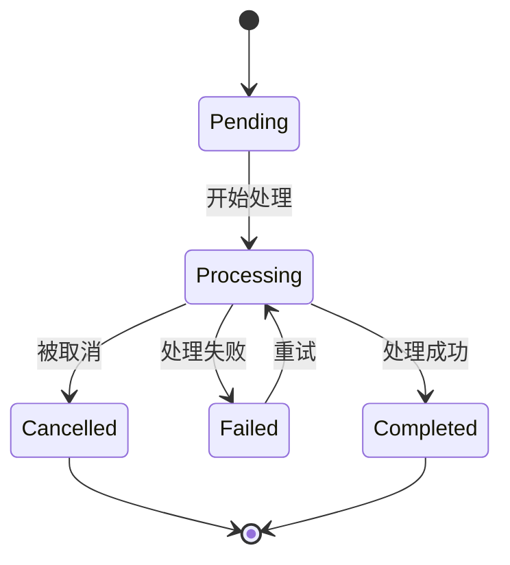
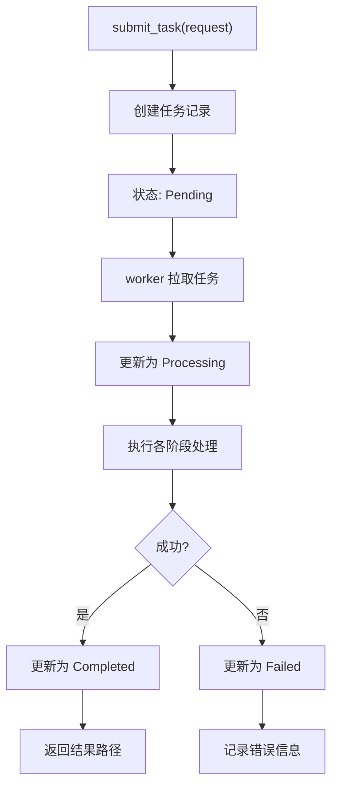
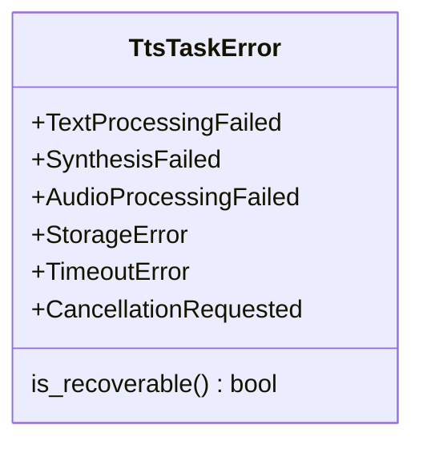

# 多阶段任务模型

<cite>
**本文档引用的文件**  
- [stepped_task.rs](file://voice-cli/src/models/stepped_task.rs)
- [tts.rs](file://voice-cli/src/models/tts.rs)
- [tts_task_manager.rs](file://voice-cli/src/services/tts_task_manager.rs)
</cite>

## 目录
1. [引言](#引言)
2. [SteppedTask数据模型设计](#steppedtask数据模型设计)
3. [任务状态与转换规则](#任务状态与转换规则)
4. [阶段上下文数据传递机制](#阶段上下文数据传递机制)
5. [任务管理接口与执行日志查询](#任务管理接口与执行日志查询)
6. [错误传播与恢复机制](#错误传播与恢复机制)
7. [总结](#总结)

## 引言
本文档全面解析 `SteppedTask` 数据模型在语音合成（TTS）系统中的设计与应用。该模型用于表示语音合成任务的多阶段执行流程，包括文本预处理、语音合成、音频后处理等关键阶段。通过详细分析任务状态、阶段转换、上下文传递和错误处理机制，展示系统如何确保任务执行的可靠性与可追溯性。

## SteppedTask数据模型设计

`SteppedTask` 模型采用分阶段的数据结构设计，支持任务在不同处理阶段之间的平滑过渡。每个阶段都有专用的数据结构，用于保存该阶段的输入、输出和元数据。

核心设计特点包括：
- **阶段专用结构**：如 `AsyncTranscriptionTask`、`AudioProcessedTask` 和 `TranscriptionCompletedTask`，分别对应任务的不同生命周期阶段。
- **不可变性与转换**：任务在阶段间通过 `from_*` 方法进行转换，确保数据一致性。
- **可扩展性**：通过枚举 `ProcessingStage` 和 `TaskStatus` 支持未来新增处理阶段。

该模型特别适用于需要多步骤处理的语音合成任务，确保每个阶段的输入输出清晰可追踪。

**Section sources**
- [stepped_task.rs](file://voice-cli/src/models/stepped_task.rs#L1-L50)

## 任务状态与转换规则

任务状态由 `TaskStatus` 枚举定义，涵盖任务的完整生命周期：

**状态说明：**
- **Pending**：任务已提交，等待处理。
- **Processing**：任务正在执行，包含当前阶段和进度详情。
- **Completed**：任务成功完成，包含结果路径和处理时间。
- **Failed**：任务执行失败，包含错误信息和重试计数。
- **Cancelled**：任务被用户或系统取消。

状态转换由任务管理器控制，确保状态变更的原子性和一致性。

**Diagram sources**
- [tts.rs](file://voice-cli/src/models/tts.rs#L80-L100)
- [stepped_task.rs](file://voice-cli/src/models/stepped_task.rs#L60-L80)

**Section sources**
- [tts.rs](file://voice-cli/src/models/tts.rs#L70-L120)
- [stepped_task.rs](file://voice-cli/src/models/stepped_task.rs#L50-L90)

## 阶段上下文数据传递机制

为确保各阶段间的数据一致性，系统采用**阶段上下文传递机制**。每个阶段的输出作为下一阶段的输入，通过专用结构体进行传递。

例如，在语音合成流程中：
1. `TtsAsyncRequest` 作为初始输入
2. 经过 `TextPreprocessing` 后生成中间表示
3. 传递给 `VoiceSynthesis` 阶段生成原始音频
4. 由 `AudioPostProcessing` 进行格式化处理
5. 最终由 `ResultFormatting` 生成最终输出

关键传递字段包括：
- `task_id`：贯穿所有阶段的唯一标识
- `created_at`：任务创建时间，用于统计分析
- `processing_stages`：记录各阶段的执行时间与耗时

这种设计确保了数据在阶段间的完整传递，避免了信息丢失。

**Section sources**
- [tts.rs](file://voice-cli/src/models/tts.rs#L1-L187)
- [stepped_task.rs](file://voice-cli/src/models/stepped_task.rs#L1-L417)

## 任务管理接口与执行日志查询

任务管理通过 `TtsTaskManager` 服务提供，支持以下核心接口：

**日志与统计查询接口：**
- `get_task_status(task_id)`：查询特定任务的当前状态和进度
- `get_stats()`：获取系统级任务统计信息
- 数据库表 `tts_tasks` 记录了每个任务的完整执行日志，包括：
  - 各状态更新时间戳
  - 处理耗时（`processing_time`）
  - 错误消息（`error_message`）
  - 重试次数（`retry_count`）

这些信息可用于性能分析、故障排查和系统优化。

**Diagram sources**
- [tts_task_manager.rs](file://voice-cli/src/services/tts_task_manager.rs#L1-L50)
- [tts.rs](file://voice-cli/src/models/tts.rs#L80-L100)

**Section sources**
- [tts_task_manager.rs](file://voice-cli/src/services/tts_task_manager.rs#L1-L355)

## 错误传播与恢复机制

系统实现了完善的错误传播与恢复机制，确保异常情况下的可靠处理。

### 错误类型

### 错误传播流程
1. 任一阶段发生错误时，生成 `TtsTaskError`
2. 错误信息随任务状态更新写入数据库
3. 系统根据 `is_recoverable` 标志决定后续操作：
   - 可恢复错误：自动重试（最多3次）
   - 不可恢复错误：标记为 `Failed` 并通知用户

### 恢复策略
- **重试机制**：对可恢复错误自动重试
- **回滚清理**：失败任务触发文件清理流程
- **优先级控制**：高优先级任务可抢占资源

此机制确保了系统的健壮性和用户体验。

**Diagram sources**
- [tts.rs](file://voice-cli/src/models/tts.rs#L130-L160)
- [tts_task_manager.rs](file://voice-cli/src/services/tts_task_manager.rs#L1-L355)

**Section sources**
- [tts.rs](file://voice-cli/src/models/tts.rs#L120-L187)
- [tts_task_manager.rs](file://voice-cli/src/services/tts_task_manager.rs#L1-L355)

## 总结
`SteppedTask` 数据模型通过清晰的阶段划分、严格的状态管理、可靠的数据传递和完善的错误处理机制，为语音合成任务提供了强大的执行框架。该设计不仅确保了任务执行的可靠性，还提供了丰富的监控和调试能力，是构建高可用语音处理系统的核心基础。