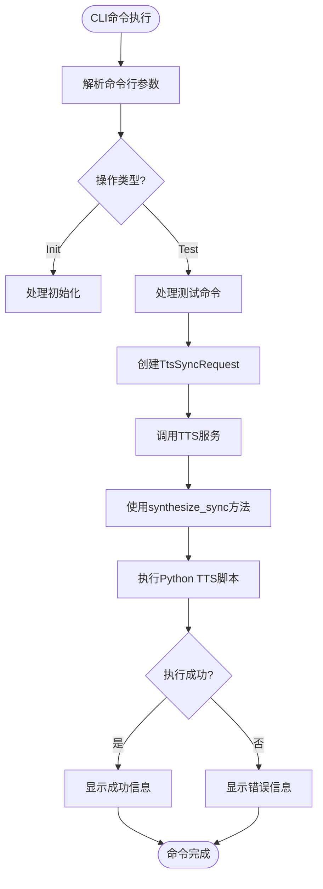
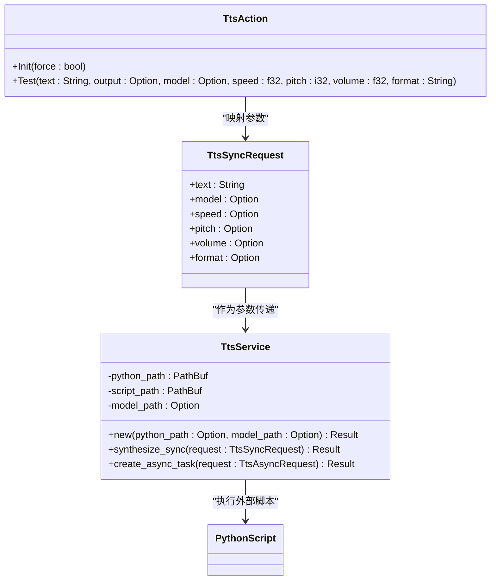

# CLI命令行调用机制

<cite>
**本文档引用的文件**
- [tts.rs](file://voice-cli/src/cli/tts.rs)
- [tts.rs](file://voice-cli/src/models/tts.rs)
- [tts_service.rs](file://voice-cli/src/services/tts_service.rs)
- [main.rs](file://voice-cli/src/main.rs)
- [mod.rs](file://voice-cli/src/cli/mod.rs)
</cite>

## 目录
1. [简介](#简介)
2. [命令行参数解析逻辑](#命令行参数解析逻辑)
3. [同步与异步模式决策机制](#同步与异步模式决策机制)
4. [参数到服务调用的映射过程](#参数到服务调用的映射过程)
5. [用户体验实现细节](#用户体验实现细节)
6. [常用命令示例与HTTP请求对照](#常用命令示例与http请求对照)
7. [CLI特有功能限制与增强特性](#cli特有功能限制与增强特性)
8. [结论](#结论)

## 简介
本项目提供了一个语音合成（TTS）命令行接口，支持初始化环境、测试语音合成功能等操作。CLI通过清晰的子命令结构组织功能，并利用Rust的`clap`库实现强大的参数解析能力。系统能够根据用户输入决定调用同步或异步合成模式，同时提供了丰富的用户体验特性，如进度显示和错误提示。

## 命令行参数解析逻辑

CLI参数解析基于`clap`库实现，定义了清晰的层级结构。`TtsAction`枚举类型定义了TTS相关的所有可用操作及其参数。

`Test`命令支持以下参数：
- **text**: 要合成的文本，默认值为"Hello, world!"
- **output**: 输出文件路径，可选
- **model**: 使用的语音模型，可选
- **speed**: 语音速度（0.5-2.0），默认值为1.0
- **pitch**: 音调调整（-20到20），默认值为0
- **volume**: 音量调整（0.5-2.0），默认值为1.0
- **format**: 输出格式，默认值为"mp3"

这些参数在`TtsSyncRequest`和`TtsAsyncRequest`数据结构中都有对应的定义，确保了CLI参数与服务请求之间的无缝映射。

**Section sources**
- [tts.rs](file://voice-cli/src/cli/tts.rs#L14-L58)
- [tts.rs](file://voice-cli/src/models/tts.rs#L5-L28)

## 同步与异步模式决策机制

CLI通过不同的子命令和参数结构来区分同步和异步模式：

- **同步模式**: 由`TtsAction::Test`命令触发，直接调用`handle_tts_test`函数，该函数内部调用`synthesize_sync`方法
- **异步模式**: 当系统需要支持长时间运行的任务时，可通过`create_async_task`方法实现

同步模式适用于快速测试和小规模任务，而异步模式更适合处理长文本或批量任务。虽然当前CLI主要暴露同步接口，但底层服务已准备好支持异步操作。



**Diagram sources**
- [tts.rs](file://voice-cli/src/cli/tts.rs#L60-L123)
- [tts_service.rs](file://voice-cli/src/services/tts_service.rs#L80-L180)

**Section sources**
- [tts.rs](file://voice-cli/src/cli/tts.rs#L60-L123)
- [tts_service.rs](file://voice-cli/src/services/tts_service.rs#L80-L287)

## 参数到服务调用的映射过程

CLI参数到服务调用的映射过程遵循严格的验证和转换流程：

1. CLI参数首先被解析为`TtsAction`枚举
2. 在`handle_tts_command`中根据动作类型分发处理
3. 对于测试命令，参数被传递给`handle_tts_test`函数
4. 创建`TtsSyncRequest`对象，将CLI参数映射为服务请求
5. 通过`TtsService`调用底层TTS服务

参数验证规则包括：
- 文本不能为空
- 语速必须在0.5-2.0之间
- 音调必须在-20到20之间
- 音量必须在0.5-2.0之间



**Diagram sources**
- [tts.rs](file://voice-cli/src/cli/tts.rs#L14-L58)
- [tts.rs](file://voice-cli/src/models/tts.rs#L5-L28)
- [tts_service.rs](file://voice-cli/src/services/tts_service.rs#L10-L30)

**Section sources**
- [tts.rs](file://voice-cli/src/cli/tts.rs#L60-L123)
- [tts_service.rs](file://voice-cli/src/services/tts_service.rs#L80-L287)

## 用户体验实现细节

CLI提供了丰富的用户体验特性，包括清晰的进度显示和详细的错误提示：

- **进度显示**: 使用表情符号和彩色输出增强可读性，如"🎤 Testing TTS functionality..."和"✅ TTS test successful!"
- **错误提示**: 详细的错误信息输出到stderr，包括错误链的完整追溯
- **文件处理**: 支持将结果复制到指定输出路径，并显示相关消息
- **配置加载**: 支持从配置文件加载设置，并允许CLI参数覆盖配置

错误处理机制确保了用户能够获得有意义的反馈：
- 输入验证失败时提供具体的错误原因
- 外部命令执行失败时显示stdout和stderr输出
- 文件操作失败时提供详细的I/O错误信息

**Section sources**
- [tts.rs](file://voice-cli/src/cli/tts.rs#L60-L123)
- [main.rs](file://voice-cli/src/main.rs#L100-L150)

## 常用命令示例与HTTP请求对照

### 常用CLI命令示例

```bash
# 初始化TTS环境
voice-cli tts init

# 使用默认参数测试TTS
voice-cli tts test

# 指定文本和输出文件进行测试
voice-cli tts test --text "你好，世界" --output ./output/hello.mp3

# 指定模型、语速和音调
voice-cli tts test --text "自定义参数" --model "custom" --speed 1.2 --pitch 5 --volume 1.1 --format wav
```

### 等效HTTP请求对照

```http
# CLI: voice-cli tts test --text "你好，世界" --output ./output/hello.mp3
POST /tts/sync
Content-Type: application/json

{
  "text": "你好，世界",
  "format": "mp3"
}

# CLI: voice-cli tts test --text "自定义参数" --model "custom" --speed 1.2 --pitch 5 --volume 1.1 --format wav
POST /tts/sync
Content-Type: application/json

{
  "text": "自定义参数",
  "model": "custom",
  "speed": 1.2,
  "pitch": 5,
  "volume": 1.1,
  "format": "wav"
}
```

**Section sources**
- [tts.rs](file://voice-cli/src/cli/tts.rs#L14-L58)
- [tts.rs](file://voice-cli/src/models/tts.rs#L5-L28)

## CLI特有功能限制与增强特性

### CLI特有增强特性

- **环境初始化**: 提供`init`命令简化环境设置
- **直接文件输出**: 支持将结果直接保存到指定文件路径
- **即时反馈**: 同步模式提供即时的合成结果反馈
- **配置覆盖**: CLI参数可以覆盖配置文件中的设置

### 功能限制

- **异步模式未完全暴露**: 当前CLI主要提供同步接口，异步功能需要通过API调用
- **批量处理支持有限**: CLI更适合单次任务，大规模批量处理建议使用API
- **缺少进度条**: 虽然有状态提示，但没有实时进度条显示
- **依赖外部Python环境**: 需要正确配置Python虚拟环境和相关依赖

### 适用场景

- **开发测试**: 快速验证TTS功能和参数效果
- **小规模任务**: 适合处理少量文本的语音合成需求
- **自动化脚本**: 可以集成到shell脚本中实现自动化语音生成
- **环境管理**: 提供便捷的环境初始化和模型管理功能

**Section sources**
- [tts.rs](file://voice-cli/src/cli/tts.rs#L1-L123)
- [tts_service.rs](file://voice-cli/src/services/tts_service.rs#L1-L287)

## 结论
voice-cli的TTS命令行接口提供了一套完整且用户友好的语音合成解决方案。通过清晰的参数设计和健壮的错误处理机制，用户可以轻松地进行语音合成测试和环境管理。尽管当前主要聚焦于同步模式，但其架构为未来的异步功能扩展奠定了良好基础。对于开发人员和系统管理员而言，这是一个实用的工具，既适合日常测试也适合集成到自动化工作流中。