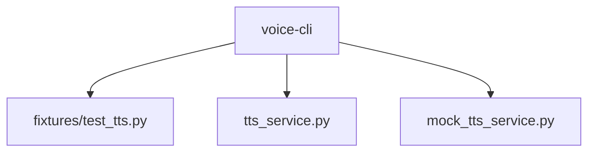
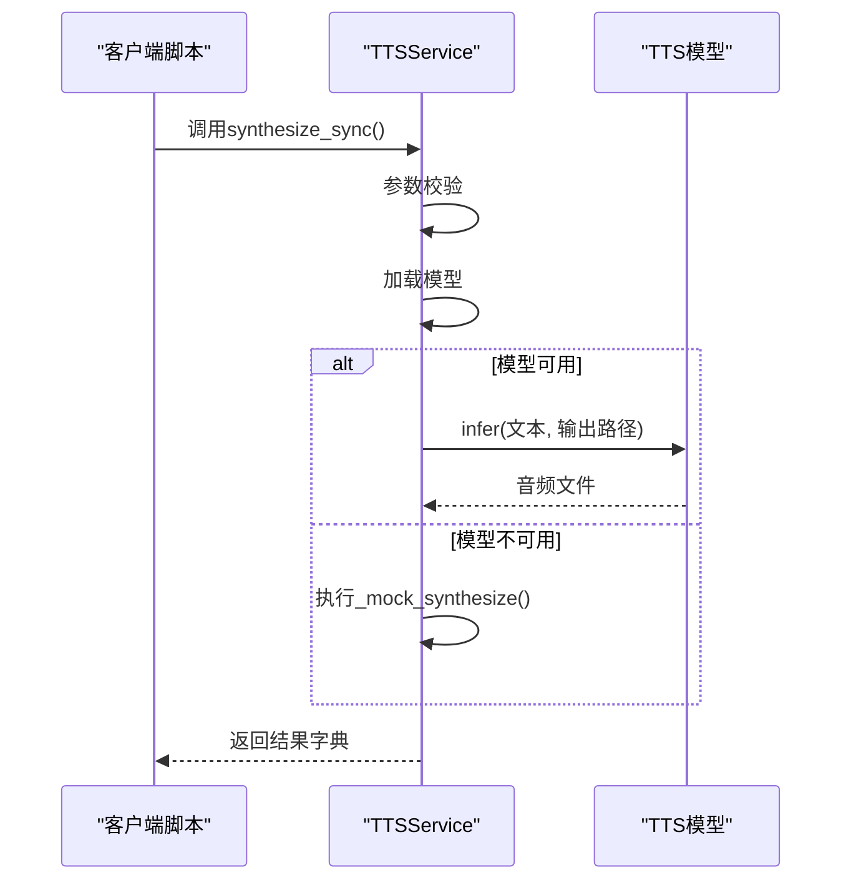
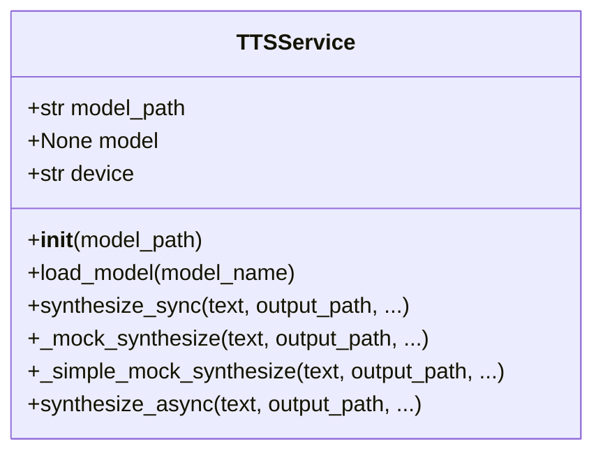
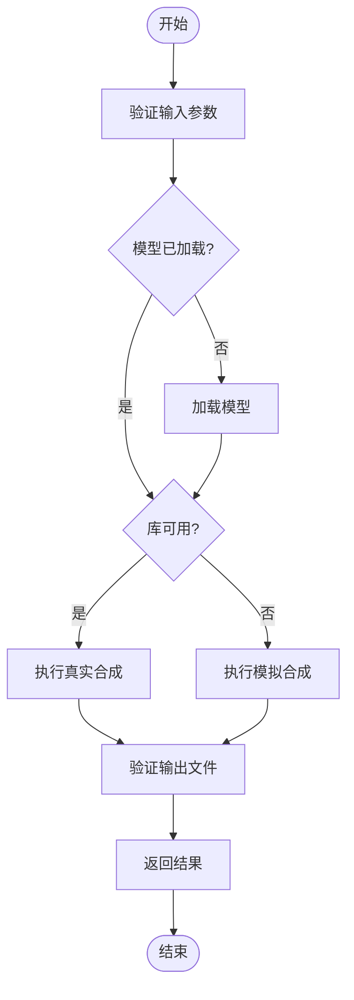
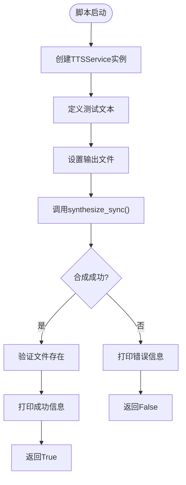
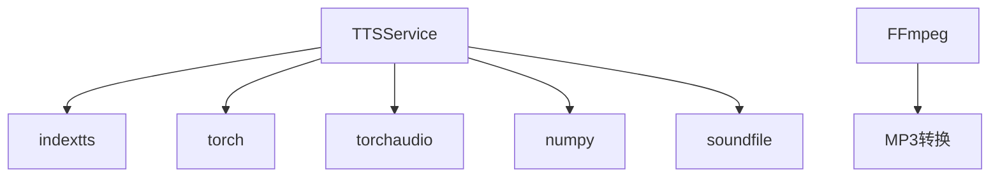

# Python客户端集成示例

<cite>
**本文档中引用的文件**   
- [test_tts.py](file://voice-cli/fixtures/test_tts.py)
- [tts_service.py](file://voice-cli/tts_service.py)
- [mock_tts_service.py](file://voice-cli/mock_tts_service.py)
</cite>

## 目录
1. [简介](#简介)
2. [项目结构](#项目结构)
3. [核心组件](#核心组件)
4. [架构概述](#架构概述)
5. [详细组件分析](#详细组件分析)
6. [依赖分析](#依赖分析)
7. [性能考虑](#性能考虑)
8. [故障排除指南](#故障排除指南)
9. [结论](#结论)

## 简介
本文档基于 `test_tts.py` 示例脚本，详细说明 Python 客户端如何通过 HTTP 接口与 TTS（文本转语音）服务进行通信。文档涵盖请求构造方法，包括文本编码、语音参数设置（语速、音调、角色选择）和格式化选项。同时展示如何处理音频响应流并保存为本地文件，演示错误处理流程，如服务不可用或参数校验失败时的异常捕获。此外，补充说明 Python 脚本在自动化测试和集成验证中的典型应用场景，并提供调试技巧。

## 项目结构
`voice-cli` 模块包含 TTS 功能的核心实现，主要文件位于 `fixtures/` 和根目录下。`test_tts.py` 是测试脚本，`tts_service.py` 是主服务模块，`mock_tts_service.py` 提供测试用的模拟实现。整个结构围绕语音合成功能组织，便于测试和集成。

**Diagram sources**
- [test_tts.py](file://voice-cli/fixtures/test_tts.py#L1-L63)
- [tts_service.py](file://voice-cli/tts_service.py#L1-L428)
- [mock_tts_service.py](file://voice-cli/mock_tts_service.py#L1-L66)

**Section sources**
- [test_tts.py](file://voice-cli/fixtures/test_tts.py#L1-L63)
- [tts_service.py](file://voice-cli/tts_service.py#L1-L428)

## 核心组件
核心组件为 `TTSService` 类，封装了与 TTS 服务通信的全部逻辑。该类支持同步和异步语音合成，具备模型加载、参数校验、音频生成和文件保存等功能。`test_tts.py` 脚本通过调用该服务验证功能完整性。

**Section sources**
- [tts_service.py](file://voice-cli/tts_service.py#L37-L377)
- [test_tts.py](file://voice-cli/fixtures/test_tts.py#L15-L60)

## 架构概述
系统采用客户端-服务端架构，Python 客户端通过调用 `TTSService` 接口与底层 TTS 引擎通信。当真实引擎不可用时，自动回退到模拟实现，确保测试流程不中断。整体流程包括参数校验、模型加载、音频合成和结果返回。

**Diagram sources**
- [tts_service.py](file://voice-cli/tts_service.py#L100-L377)
- [test_tts.py](file://voice-cli/fixtures/test_tts.py#L20-L55)

## 详细组件分析

### TTSService 类分析
`TTSService` 是核心服务类，负责管理 TTS 模型生命周期和语音合成流程。

#### 类结构与方法

**Diagram sources**
- [tts_service.py](file://voice-cli/tts_service.py#L37-L377)

#### 同步合成流程

**Diagram sources**
- [tts_service.py](file://voice-cli/tts_service.py#L150-L250)

**Section sources**
- [tts_service.py](file://voice-cli/tts_service.py#L37-L377)

### 测试脚本分析
`test_tts.py` 是一个简单的功能测试脚本，用于验证 TTS 功能是否正常工作。

**Diagram sources**
- [test_tts.py](file://voice-cli/fixtures/test_tts.py#L15-L60)

**Section sources**
- [test_tts.py](file://voice-cli/fixtures/test_tts.py#L1-L63)

## 依赖分析
系统依赖多个外部库，包括 `indextts`、`torch`、`torchaudio`、`numpy` 和 `soundfile`。当这些库不可用时，系统自动切换到模拟实现，确保基本功能可用。`ffmpeg` 用于 MP3 格式转换，若不存在则回退到 WAV 格式。

**Diagram sources**
- [tts_service.py](file://voice-cli/tts_service.py#L10-L35)

**Section sources**
- [tts_service.py](file://voice-cli/tts_service.py#L1-L428)

## 性能考虑
- **模型加载**：模型在首次合成时加载，后续调用复用实例，减少重复开销。
- **异步支持**：提供 `synthesize_async` 方法，避免阻塞主线程。
- **资源管理**：使用临时文件和自动清理机制，防止资源泄漏。
- **错误回退**：在真实引擎失败时自动回退到模拟实现，提高系统鲁棒性。

## 故障排除指南
常见问题及解决方案：

| 问题现象 | 可能原因 | 解决方案 |
|--------|--------|--------|
| 合成失败，提示库未找到 | `indextts` 或音频库未安装 | 运行 `pip install indextts torch torchaudio numpy soundfile` |
| MP3 输出失败 | `ffmpeg` 未安装 | 安装 `ffmpeg` 或使用 WAV 格式 |
| 输出文件为空 | 模拟模式下未正确生成数据 | 检查输出路径权限和磁盘空间 |
| 语速/音调参数无效 | 参数超出范围 | 确保语速在 0.5-2.0，音调在 -20 到 20 之间 |

**Section sources**
- [tts_service.py](file://voice-cli/tts_service.py#L180-L200)
- [mock_tts_service.py](file://voice-cli/mock_tts_service.py#L10-L30)

## 结论
本文档详细介绍了基于 `test_tts.py` 的 Python 客户端如何与 TTS 服务通信。通过 `TTSService` 类，客户端可以方便地进行语音合成，支持丰富的参数配置和错误处理。该实现适用于自动化测试、集成验证和实际生产环境，具备良好的可扩展性和容错能力。