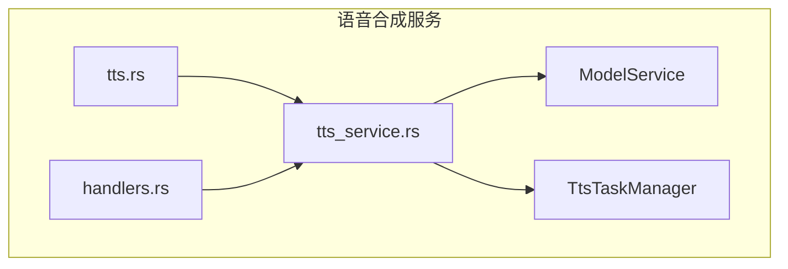
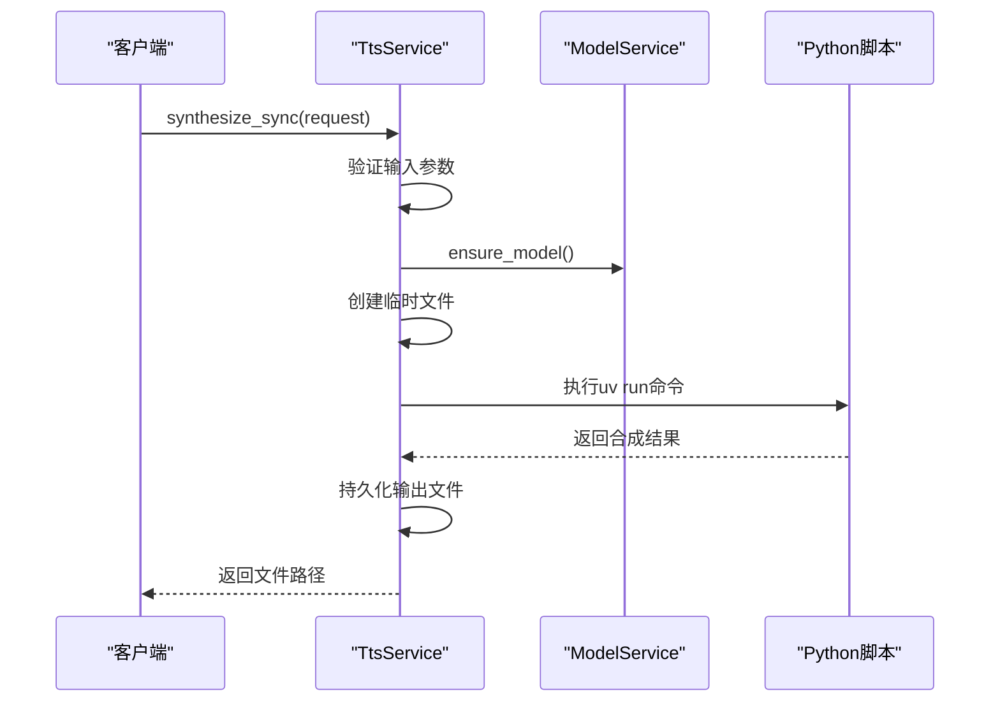
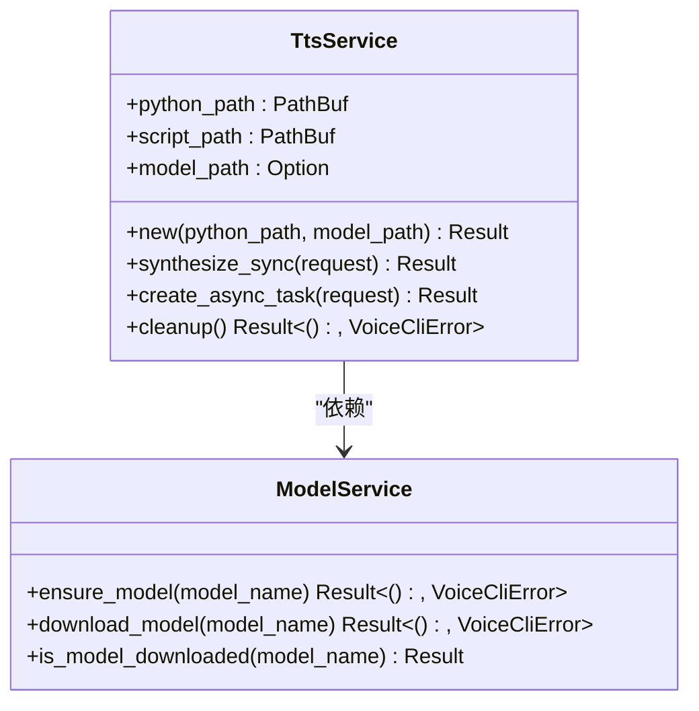
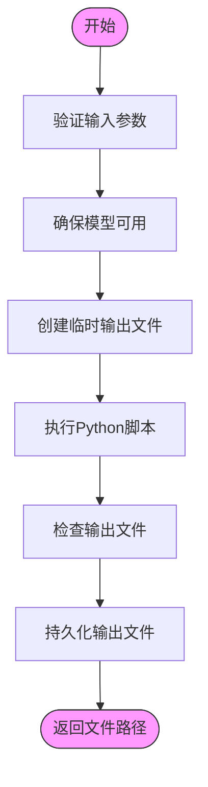
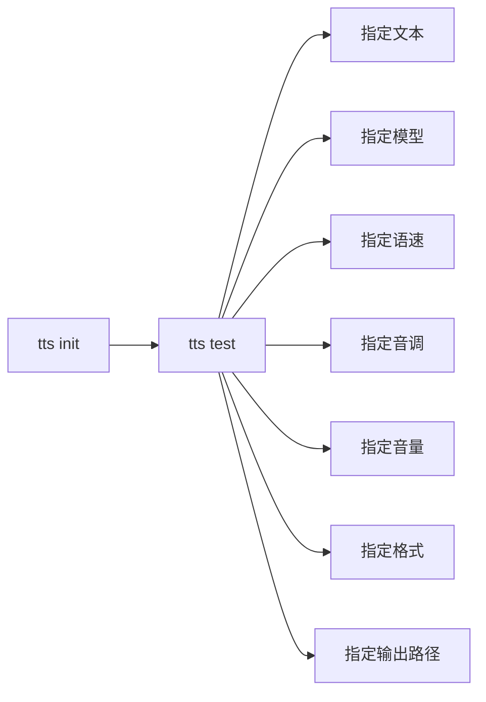
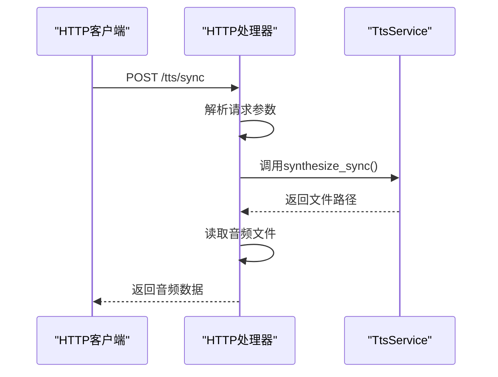
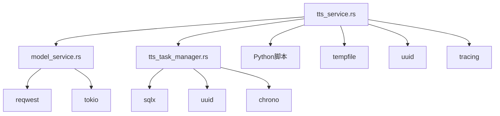

# TTS服务接口设计

<cite>
**本文档引用的文件**   
- [tts_service.rs](file://voice-cli/src/services/tts_service.rs)
- [model_service.rs](file://voice-cli/src/services/model_service.rs)
- [tts.rs](file://voice-cli/src/cli/tts.rs)
- [tts.rs](file://voice-cli/src/models/tts.rs)
- [handlers.rs](file://voice-cli/src/server/handlers.rs)
</cite>

## 目录
1. [简介](#简介)
2. [项目结构](#项目结构)
3. [核心组件](#核心组件)
4. [架构概述](#架构概述)
5. [详细组件分析](#详细组件分析)
6. [依赖分析](#依赖分析)
7. [性能考虑](#性能考虑)
8. [故障排除指南](#故障排除指南)
9. [结论](#结论)

## 简介
本文档深入解析`tts_service.rs`提供的高层语音合成接口设计，涵盖同步合成、异步任务提交和流式响应等模式。说明服务层如何封装`model_service`的底层能力并暴露统一API供CLI和HTTP服务器调用。描述错误传播机制与超时处理策略。结合实际调用链路展示请求从接口进入后经过的处理流程。提供接口使用示例，涵盖不同参数组合下的行为差异。文档化返回结果结构、状态码含义及性能特征，帮助开发者合理集成。

## 项目结构
语音合成服务位于`voice-cli`子项目中，主要包含服务实现、模型管理、CLI接口和HTTP处理器等组件。服务层通过封装底层Python脚本调用，为上层应用提供统一的语音合成接口。

**图示来源**
- [tts_service.rs](file://voice-cli/src/services/tts_service.rs)
- [model_service.rs](file://voice-cli/src/services/model_service.rs)
- [tts_task_manager.rs](file://voice-cli/src/services/tts_task_manager.rs)
- [tts.rs](file://voice-cli/src/cli/tts.rs)
- [handlers.rs](file://voice-cli/src/server/handlers.rs)

**本节来源**
- [tts_service.rs](file://voice-cli/src/services/tts_service.rs)
- [model_service.rs](file://voice-cli/src/services/model_service.rs)

## 核心组件
TTS服务的核心组件包括`TtsService`、`ModelService`和`TtsTaskManager`。`TtsService`提供高层接口，封装了对底层Python脚本的调用；`ModelService`负责模型的下载和管理；`TtsTaskManager`处理异步任务的调度和状态管理。

**本节来源**
- [tts_service.rs](file://voice-cli/src/services/tts_service.rs#L0-L14)
- [model_service.rs](file://voice-cli/src/services/model_service.rs#L0-L10)
- [tts_task_manager.rs](file://voice-cli/src/services/tts_task_manager.rs#L0-L10)

## 架构概述
TTS服务采用分层架构，上层提供同步和异步两种接口模式，底层通过调用Python脚本执行实际的语音合成任务。服务层负责参数验证、临时文件管理、错误处理和结果持久化。

**图示来源**
- [tts_service.rs](file://voice-cli/src/services/tts_service.rs#L15-L243)
- [model_service.rs](file://voice-cli/src/services/model_service.rs#L15-L100)

## 详细组件分析

### TtsService分析
`TtsService`是语音合成服务的主要实现，提供同步和异步两种接口模式。服务初始化时会自动查找Python解释器和TTS脚本路径，确保在不同环境下都能正常工作。

#### 对象关系图

**图示来源**
- [tts_service.rs](file://voice-cli/src/services/tts_service.rs#L0-L14)
- [model_service.rs](file://voice-cli/src/services/model_service.rs#L0-L10)

#### 同步合成流程

**图示来源**
- [tts_service.rs](file://voice-cli/src/services/tts_service.rs#L15-L176)

**本节来源**
- [tts_service.rs](file://voice-cli/src/services/tts_service.rs#L0-L287)
- [model_service.rs](file://voice-cli/src/services/model_service.rs#L0-L522)

### 接口使用示例
TTS服务可通过CLI和HTTP API两种方式调用，支持多种参数组合。

#### CLI调用示例

**图示来源**
- [tts.rs](file://voice-cli/src/cli/tts.rs#L0-L123)

#### HTTP API调用流程

**图示来源**
- [handlers.rs](file://voice-cli/src/server/handlers.rs#L870-L892)

**本节来源**
- [tts.rs](file://voice-cli/src/cli/tts.rs#L0-L123)
- [handlers.rs](file://voice-cli/src/server/handlers.rs#L870-L892)

## 依赖分析
TTS服务依赖多个外部组件和内部服务，形成复杂的依赖关系网络。

**图示来源**
- [tts_service.rs](file://voice-cli/src/services/tts_service.rs#L0-L14)
- [model_service.rs](file://voice-cli/src/services/model_service.rs#L0-L10)
- [tts_task_manager.rs](file://voice-cli/src/services/tts_task_manager.rs#L0-L10)

**本节来源**
- [tts_service.rs](file://voice-cli/src/services/tts_service.rs#L0-L14)
- [model_service.rs](file://voice-cli/src/services/model_service.rs#L0-L10)
- [tts_task_manager.rs](file://voice-cli/src/services/tts_task_manager.rs#L0-L10)

## 性能考虑
TTS服务在设计时考虑了多项性能优化策略，包括异步任务处理、资源复用和缓存机制。

- **同步调用**: 适用于短文本合成，直接返回结果
- **异步调用**: 适用于长文本合成，避免请求超时
- **模型缓存**: 下载的模型文件会被缓存，避免重复下载
- **连接复用**: HTTP客户端连接会被复用，提高效率

## 故障排除指南
当TTS服务出现问题时，可参考以下常见问题及解决方案：

**本节来源**
- [tts_service.rs](file://voice-cli/src/services/tts_service.rs#L0-L287)
- [model_service.rs](file://voice-cli/src/services/model_service.rs#L0-L522)

## 结论
TTS服务通过封装底层Python脚本调用，为上层应用提供了统一、易用的语音合成接口。服务支持同步和异步两种模式，能够满足不同场景下的需求。通过与ModelService和TtsTaskManager的集成，实现了模型管理和任务调度的完整功能。建议在实际使用中根据具体需求选择合适的调用模式，并合理配置超时和重试策略。